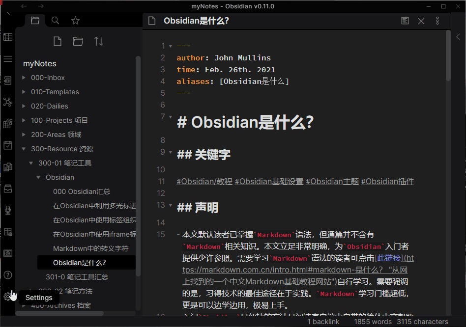
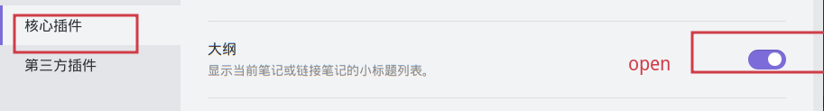
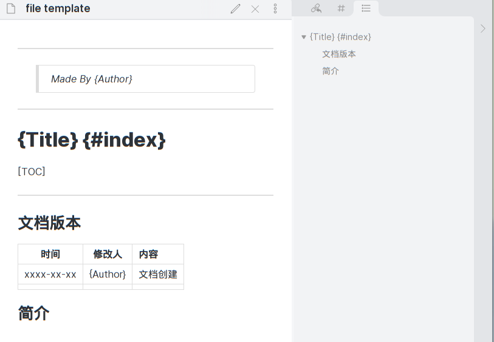
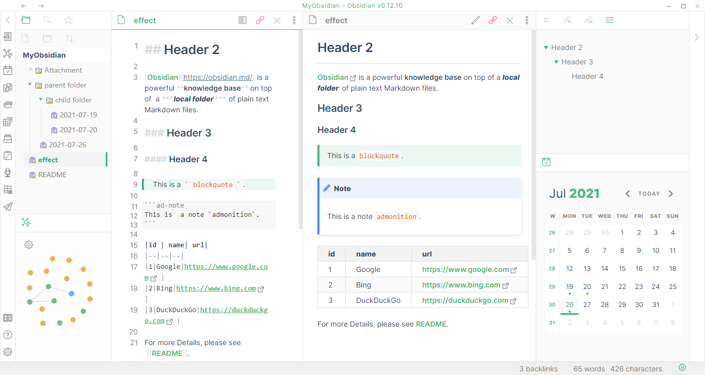
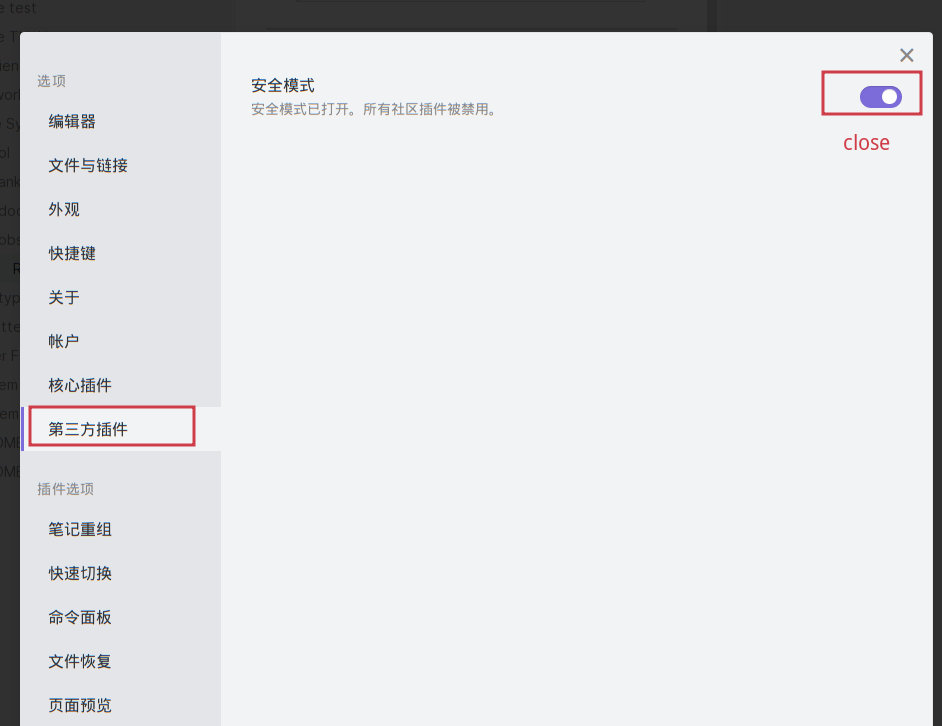
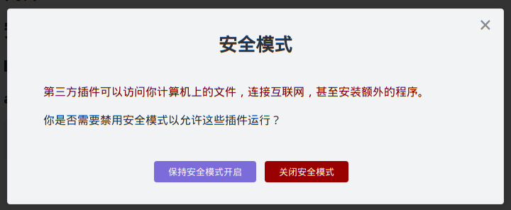
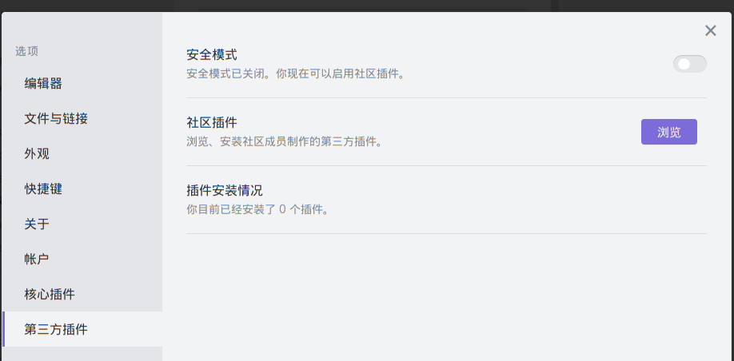

----------------------------------------------
> *Made By Herolh*
----------------------------------------------

# Obssdian 基本使用 {#index}

[TOC]


 


--------------------------------------------

## 文档版本

|    时间    | 修改人 | 内容     |
| :--------: | :----: | :------- |
| 2021-12-16 | Herolh | 文档创建 |
|            |        |          |


## 简介

&emsp;&emsp;Obsidian 是免费的 Markdown 写作工具，能够在其中编辑文案内容，也可预览排版效果。但如果只以写作软件而言，事实上，Obsidian 远不如 Typora优雅简洁, 但 Obsidian 能够有效解决了三个问题：

- **有效组织文档**（核心需求）：码字撰文绝非一篇一目，严谨之人自然会广建门类，文章篇目倚照此类别分而藏之。但时间久远，文章之间即使联系紧密也会慢慢淡忘，劳形于案牍整理之中难免索然乏味。如能善用`PARA`和`MOC`文档分类技术[[3\]](#fn3)，`关系图谱`就能将各篇目文章之间得`反向链接`和`标签`网罗其中，联系和关节也就一目了然。

- **补强能力**：尽管`Obsidian`作者十分勤奋，倾听社区呼声产品也是快速发展。但`Obsidian`作为两人公司来说不可能思虑如尘，因而公开了一组API供社区爱好者开发插件补强欠缺。

- **经济性**（重要因素）：无可否认，`反向链接`和`卡片式写作`的指标性产品是`Roam Research`，但其300美元的年费也确实吓退了如我一般的“低收入”群体。对比而言，`Obsidian`对所有人免费且公开，且能够实现`Roam Research`中的绝大多数功能。


## 安装

### Linux 下

#### arch

```shell
sudo pacman -S obsidian
```


## 设置

### 调整为中文

如“声明”中所述，`Obsidian`默认是以英文界面示人的。设置界面语言为“简体中文”，需要依照以下过程进行操作：
 `Settings` → `About` → `Language` → `简体中文` → `Relaunch` → 重启后生效




### 打开大纲






## 推荐主题

### Typora-Vue 主题

[github 官网库](https://github.com/ZekunC/Obsidian-Typora-Vue-Theme)



手动下载 `obsidian.css` 到您的本地 `\.obsidian\themes\` 主题，并将其重命名为 `Obsidian-Typora-Vue.css`。


## 推荐插件

### 第三方插件






