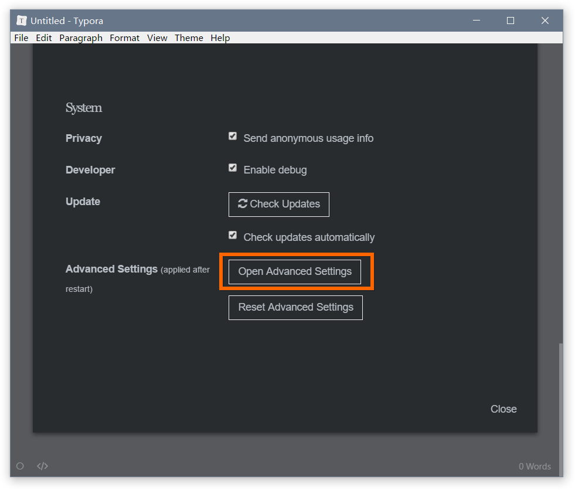
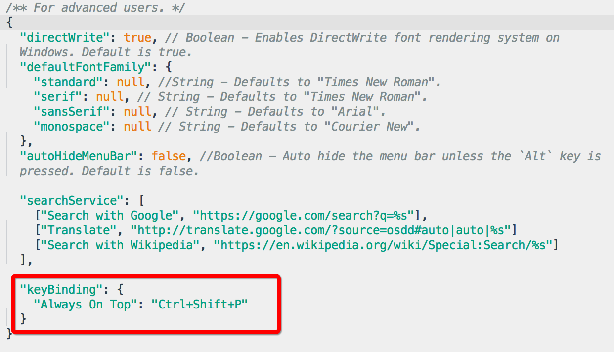
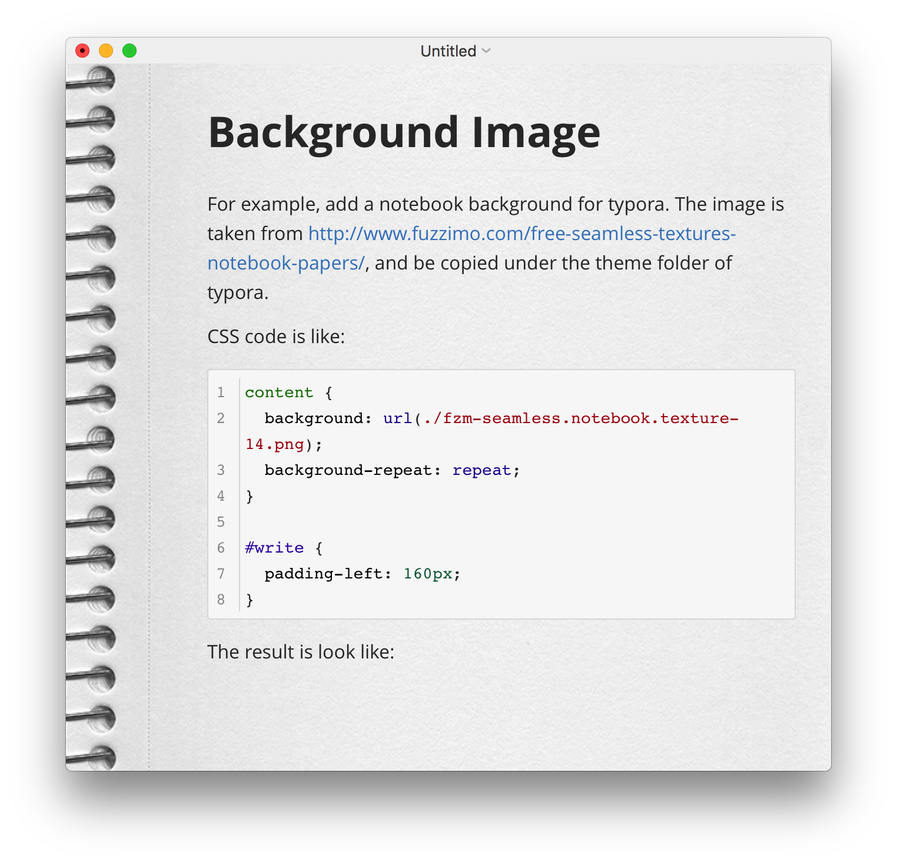
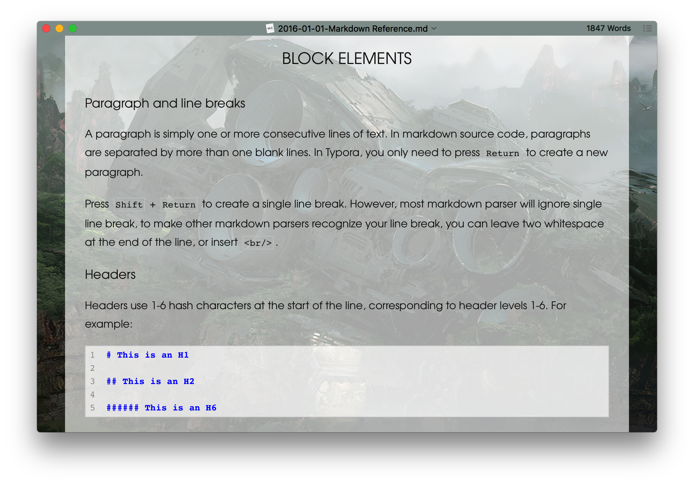

----------------------------------------------
> *Made By Herolh*
----------------------------------------------

# typora 基本使用 {#index}

[TOC]


--------------------------------------------

## 文档版本

|   时间   | 修改人 | 内容     |
| :------: | :----: | :------- |
| 20210507 | Herolh | 文档创建 |
|          |        |          |


## 简介

pass


## 快捷键

[官网支持](https://support.typora.io/Shortcut-Keys/)

### 常用快捷键

#### 自动完成

在macOS上，您可以`Esc`按键打开用于嵌入式数学的嵌入式预览，用于表情符号的自动完成等。


#### 文件

| 功能                 | 热键（Windows / Linux） | 热键（macOS）       |
| :------------------- | :---------------------- | ------------------- |
| 新的                 | Ctrl + N                | Command + N         |
| 新窗户               | Ctrl + Shift + N        | Command + Shift + N |
| 新标签               | 不支持                  | Command + T         |
| 打开                 | Ctrl + O                | Command + O         |
| 快速打开             | Ctrl + P                | Command + Shift + O |
| 重新打开已关闭的文件 | Ctrl + Shift + T        | Command + Shift + T |
| 保存                 | Ctrl + S                | Command + S         |
| 另存为/重复          | Ctrl + Shift + S        | Command + Shift + S |
| 偏爱                 | Ctrl +，                | Command +，         |
| 关闭                 | Ctrl + W                | Command + W         |


#### 编辑

| 功能                              | 热键（Windows / Linux）    | 热键（macOS）                       |
| :-------------------------------- | :------------------------- | ----------------------------------- |
| 新段落                            | Enter                      | Enter                               |
| 新起一行                          | Shift + Enter              | Shift + Enter                       |
| 剪切                              | Ctrl + X                   | Command + X                         |
| 复制                              | Ctrl + C                   | Command + C                         |
| 复制为 markdown                   | Ctrl + Shift + C           | Command + Shift + C                 |
| 粘贴                              | Ctrl + V                   | Command + V                         |
| 粘贴为纯文本                      | Ctrl + Shift + V           | Command + Shift + V                 |
| 全选                              | Ctrl + A                   | Command + A                         |
| 选择行/句子 选择行（在表中）      | Ctrl + L                   | Command + L                         |
| 删除行（在表中）                  | Ctrl + Shift +退格键       | Command + Shift +退格键             |
| 选择样式范围 选择单元格（在表中） | Ctrl + E                   | Command + E                         |
| 选择单词                          | Ctrl + D                   | Command + D                         |
| 删除单词                          | Ctrl + Shift + D           | Command + Shift + D                 |
| 跳到顶部                          | Ctrl + Home                | Command +↑                          |
| 跳转到选择                        | Ctrl + J                   | Command + J                         |
| 跳到Buttom                        | Ctrl + End                 | Command + ↓                         |
| 找                                | Ctrl + F                   | Command + F                         |
| 找下一个                          | F3 / Enter                 | Command + G / Enter                 |
| 查找上一个                        | Shift + F3 / Shift + Enter | Command + Shift + G / Shift + Enter |
| 代替                              | Ctrl + H                   | Command + H                         |


#### 段落

| 功能         | 热键（Windows / Linux） | 热键（macOS）            |
| :----------- | :---------------------- | ------------------------ |
| 标题1至6     | Ctrl + 1/2/3/4/5/6      | Command + 1/2/3/4/5/6    |
| 段落         | Ctrl + 0                | Command + 0              |
| 增加标题级别 | Ctrl + =                | Command + =              |
| 降低标题级别 | Ctrl + -                | Command + -              |
| 桌子         | Ctrl + T                | Command + Option + T     |
| 代码围栏     | Ctrl + Shift + K        | Command + Option + C     |
| 数学块       | Ctrl + Shift + M        | Command + Option + B     |
| 引用         | Ctrl + Shift + Q        | Command + Option + Q     |
| 订购清单     | Ctrl + Shift + [        | Command + Option + O     |
| 无序列表     | Ctrl + Shift +]         | Command + Option + U     |
| 缩进         | Ctrl + [ / Tab          | Command + [ / Tab        |
| 突出         | Ctrl +] / Shift + Tab   | Command +] / Shift + Tab |


#### 格式

| 功能     | 热键（Windows / Linux） | 热键（macOS）         |
| :------- | :---------------------- | --------------------- |
| 强的     | Ctrl + B                | Command + B           |
| 重点     | Ctrl + I                | Command + I           |
| 强调     | Ctrl + U                | Command + U           |
| 代码     | Ctrl + Shift +`         | Command + Shift +`    |
| 罢工     | Alt + Shift + 5         | Ctrl + Shift +`       |
| 超连结   | Ctrl + K                | Command + K           |
| 图像     | Ctrl + Shift + I        | Command + Control + I |
| 清除格式 | Ctrl + \                | 指令+                 |


#### 看法

| 功能                 | 热键（Windows / Linux） | 热键（macOS）         |
| :------------------- | :---------------------- | --------------------- |
| 切换边栏             | Ctrl + Shift + L        | Command + Shift + L   |
| 大纲                 | Ctrl + Shift + 1        | 指令+控制+ 1          |
| 文章                 | Ctrl + Shift + 2        | Command + Control + 2 |
| 文件树               | Ctrl + Shift + 3        | Command + Control + 3 |
| 源代码模式           | Ctrl + /                | 指令+ /               |
| 对焦模式             | F8                      | F8                    |
| 打字机模式           | F9                      | F9                    |
| 切换全屏             | F11                     | Command + Option + F  |
| 真实大小             | Ctrl + Shift + 0        | *（不支持）*          |
| 放大                 | Ctrl + Shift + =        | *（不支持）*          |
| 缩小                 | Ctrl + Shift +-         | *（不支持）*          |
| 在打开的文档之间切换 | Ctrl + Tab              | Command +`            |
| 切换DevTools         | Ctrl + Shift + I        | --                    |


### 自定义快捷键

用户可以在Typora的菜单栏中设置或重新分配命令的快捷键。


#### Windows / Linux

> 提示：这需要 Typora ≥ `v0.9.16` 的版本。


- 在Typora中打开`Menu`→ `Preference`，然后单击“打开高级设置”。

    

- `conf.user.json`从打开的“文件浏览”中打开和编辑。如果没有这样的文件，请创建一个。

- 设置或添加表示键绑定的JSON对象，例如：

    

- 重新启动Typora，将应用新的键绑定。


## 换背景

[官网支持](https://support.typora.io/Backgound/)

> 注意：以下某些CSS样式仅适用于Typora的最新版本（在macOS上>> 0.9.9.6，在Windows上>> 0.9.13）。

为Typora添加笔记本背景。（此免费图像取自[Fuzzimo](http://www.fuzzimo.com/free-seamless-textures-notebook-papers/)，并复制到[Typora](http://www.fuzzimo.com/free-seamless-textures-notebook-papers/)的主题文件夹下。）使用CSS代码，例如：

```css
content {
  background: url(./fzm-seamless.notebook.texture-14.png);
  background-repeat: repeat;
    /*设置半透明*/
    background: linear-gradient(rgba(255,255,255,0.9), rgba(255,255,255, 0.9)), url(./background.jpg) no-repeat fixed center;
}

#write {
  padding-left: 120px; /*adjust writing area position*/
}

body {
  background: #F3F3F3; 
  /*Please set this background color as close to the background image as possible.
  titlebar for seamless window on macOS will use this background color. 
  typora for Win/Linux will use this to judge whether typora is in dark mode or light mode*/
}

/**Other css may needed to adjust UI components**/
```


结果是：

另一个例子：

```css
content {
  background-image: url(http://localhost:4000/media/background/crashed_ship_by_hiddenvortexdesigns-da57nk8.jpg);
  background-repeat: repeat;
  background-position: -52px;
}

#write {
  margin-top: 24px;
  background-color: rgba(255, 255, 255, 0.68);
  margin-bottom: 24px;
  min-height: calc(100% - 48px);
}

body {
  background-color: #8F9D9A;
}

/**Other CSS to adjuest UI components*/
```

产生：




