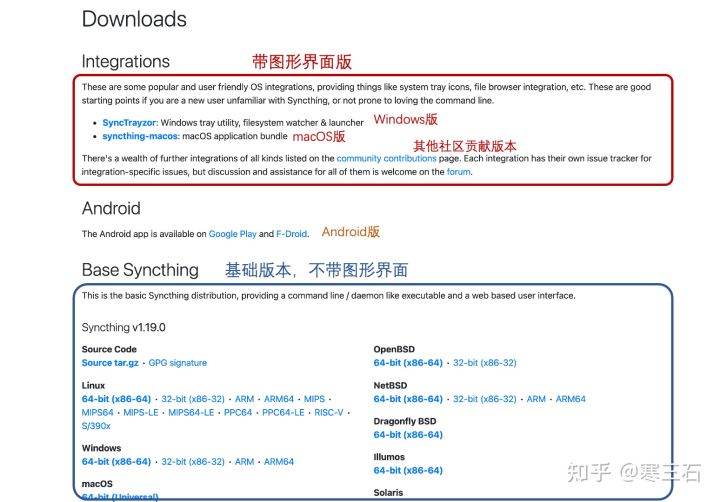

----------------------------------------------
> *Made By Herolh*
----------------------------------------------

# {Title} {#index}

[TOC]

 

--------------------------------------------

## 文档版本

|    时间    | 修改人 | 内容     |
| :--------: | :----: | :------- |
| 2022-03-21 | Herolh | 文档创建 |
|            |        |          |

## 简介

&emsp;&emsp;[Syncthing](https%3A//syncthing.net/)是一款开源免费跨平台的文件同步工具，是基于**P2P技术**实现设备间的文件同步，所以它的同步是**去中心化**的，即你并不需要一个服务器，故不需要担心这个中心的服务器给你带来的种种限制，而且类似于 torrent 协议，参与同步的设备越多，同步的速度越快。针对隐私问题，Syncthing软件只会将数据存储于个人信任的设备上，不会存储到服务器上。设备之间的通信均通过TLS进行，Syncthing还使用了完全正向保密技术来进一步保障你的数据安全。对于处于**不同局域网之中**的设备之间的文件同步，Syncthing也提供了支持。

&emsp;&emsp;Syncthing支持非常多的平台，包括**Windows、macOS、Android、Linux、FreeBSD、Solaris、群晖和威联通NAS**等，但遗憾的是，在iOS上只有一个第三方客户端fsync。

## 安装

&emsp;&emsp;首先在需要同步的设备上安装Syncthing，进入[官网](https%3A//syncthing.net/)下载对应系统的安装包，它的安装方式同正常的软件一样。

