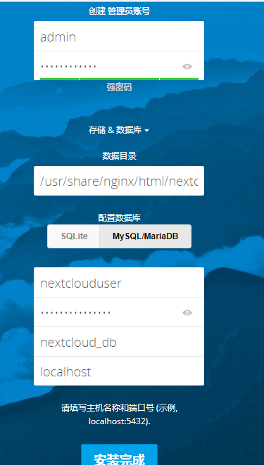

----------------------------------------------
> *Made By Herolh*
----------------------------------------------

# 目录 {#index}
[TOC]


--------------------------------------------

# 使用 Nextcloud 搭建个人网盘

&emsp;&emsp;搭建个人云存储一般会想到ownCloud，堪称是自建云存储服务的经典。而 Nextcloud 是 ownCloud 原开发团队打造的号称是“下一代”存储。可以说 Nextcloud 是一款自由 (开源) 的类 Dropbox 软件，由 ownCloud 分支演化形成。它使用 PHP 和 JavaScript 编写，支持多种数据库系统，比如 MySQL/MariaDB、PostgreSQL、Oracle 数据库和 SQLite。与ownCloud相比，Nextcloud的功能丝毫没有减弱，甚至由于可以安装云存储服务应用，自制性更强，也更符合用户的需求。Nextcloud官网的帮助文档写得相当地详细，几乎任何关于Nextcloud的问题都可以找到答案，这说明Nextcloud开发团队确实比ownCloud更加优秀。

Nextcloud 是 php 项目，这里我使用 nginx，官方文档是用 apache 的，有一点点具别。但不大。以下内容将介绍如何在 CentOS 7 服务器中安装和配置最新版本的 Nextcloud 12，并且会通过 Nginx 和 PHP7-FPM 来运行 Nextcloud。Nextcloud云盘环境部署后，可以实现web网页端、手机移动端和桌面客户端三者数据同步，其中桌面客户端可以在本地设置一个文件夹，用于同步数据，这样也就相当于在本地备份了数据。同时客户端只要设置开机启动，即只要是启动状态中，它和网页端的数据就是自动同步的。

## 一 前期环境介绍

&emsp;&emsp;首先检查你的服务器安全组设置，确保其开放SSH使用的 22 和HTTP访问使用80端口。然后我们通过SSH软件登录服务器，如果你本地电脑是Windows情况下可以使用putty等软件，Linux及MacOS请使用终端进行连接。

**部署机器的系统是Centos7.4版本:**

```shell
# 查看服务器版本
cat /etc/redhat-release

# CentOS Linux release 7.4.1708 (Core)
```


**删除系统可能自带的 PHP 和 nginx 的**

```shell
rpm -qa|grep php
rpm -qa|grep php-common
rpm -qa|grep nginx
```

（rpm -e ... --nodeps）


## 二 安装 LNMP 集成环境

> LNMP 是 Linux+Nginx+MySql+PHP 的简称

&emsp;&emsp;CentOS 默认的 yum 源中并不包含 Nginx 和 php-fpm，首先要为 CentOS 添加 epel 源：

```shell
yum -y install epel-release
```


### **安装Nginx环境**

```shell
yum -y install nginx
```

&emsp;&emsp;检查是否安装成功:

```
nginx -v
```

&emsp;&emsp;启动并设为开机启动nginx:

```shell
systemctl start nginx
systemctl enable nginx
```


#### 为Nextcloud生成自签名SSL证书

&emsp;&emsp;在本教程中，我将使用客户端的 https 连接运行 nextcloud。您可以使用免费的 SSL 证书，例如让加密或创建自签名的 SSL 证书。我将使用 OpenSSL 命令创键自签名 SSL 证书文件。为SSL证书创建一个新的文件夹：

```
mkdir -p /etc/nginx/cert/
cd /etc/nginx/cert/
```

```shell
openssl req -new -x509 -days 365 -nodes -out /etc/nginx/cert/nextcloud.crt -keyout /etc/nginx/cert/nextcloud.key


# 会出现下面的选项需要填写，可以随便填。
Country Name (2 letter code) [XX]:cn                //国家
State or Province Name (full name) []:guangdong     //省份
Locality Name (eg, city) [Default City]:guangzhou   //地区名字
Organization Name (eg, company) [Default Company Ltd]:Amos//公司名
Organizational Unit Name (eg, section) []:Technology      //部门
Common Name (eg, your name or your server's hostname) []:Amos //CA主机名
Email Address []:Amos@Amos.com                   //Email地址

```

```shell
# 修改证书和文件夹权限
chmod 600 /etc/nginx/cert/*
chmod 700 /etc/nginx/cert
```


### **安装 PHP 环境**

&emsp;&emsp;需要再添加一个 yum 源来安装 php-fpm，可以使用webtatic（这个 yum 源对国内网络来说恐怕有些慢，当然你也可以选择其它的 yum 源）

```shell
rpm -Uvh https://mirror.webtatic.com/yum/el7/webtatic-release.rpm
```

&emsp;&emsp;安装 php7-fpm 和一些其它的必要的组件

```shell
yum -y install php70w-fpm php70w-cli php70w-gd php70w-mcrypt php70w-mysql php70w-pear php70w-xml php70w-mbstring php70w-pdo php70w-json php70w-pecl-apcu php70w-pecl-apcu-devel
```

&emsp;&emsp;完成后，检查一下 php-fpm 是否已正常安装:

```shell
php -v
```

&emsp;&emsp;启动并设为开机启动 php-fpm:

```
systemctl start php-fpm
systemctl enable php-fpm
```


#### 配置php-fpm

&emsp;&emsp;php 与 Nginx 并不像与 Apache 那样易于相处，需要让Nginx 分离静态和动态请求，并将动态请求交给 php-fpm 来处理，接下来是一些必要的配置。编辑 php-fpm 的配置文件：`vi /etc/php-fpm.d/www.conf`

```php
.....					// 在配置文件的第8~10行，找到以下两项配置：
user = nginx                               //将用户和组都改为nginx
group = nginx
.....					// 在第22行可以看到php-fpm所监听的端口为9000
listen = 127.0.0.1:9000                   //php-fpm所监听的端口为9000
......					// 在第366~370行找到有关环境变量的设置：
env[HOSTNAME] = $HOSTNAME        //去掉下面几行注释,删掉每行前面的';'
env[PATH] = /usr/local/bin:/usr/bin:/bin
env[TMP] = /tmp
env[TMPDIR] = /tmp
env[TEMP] = /tmp
```

> 在vim的普通模式下输入直接键入 `:set number` 即可显示行号。


&emsp;&emsp;接下来在 `/var/lib` 目录下为 session 路径创建一个新的文件夹，并将用户名和组设为 nginx

```shell
mkdir -p /var/lib/php/session
chown nginx:nginx -R /var/lib/php/session/
ll -d /var/lib/php/session/
```


### **安装MySQL数据库服务**

#### 两种安装解决方法：

##### MariaDB的的服务器端

```shell
 yum -y install mariadb mariadb-server
```

相关命令:

```shell
systemctl start mariadb				＃启动MariaDB
systemctl enable mariadb			＃设置开机启动

systemctl stop mariadb				＃停止MariaDB
systemctl restart mariadb			＃重启MariaDB
```


##### 从网络上安装的MySQL的服务器端

```shell
wget http://dev.mysql.com/get/mysql-community-release-el7-5.noarch.rpm
rpm -ivh mysql-community-release-el7-5.noarch.rpm
yum install mysql-community-server
```

```shell
service mysqld restart

#如果上面的mysql启动不了，就用下面的命令
systemctl restart mysqld.service 
systemctl start mysqld.service 
systemctl stop mysqld.service
```


#### 设置数据库密码:

```mysql
mysql -u root 
```
```mysql
set password for 'root'@'localhost' =password('password');
```


#### 配置数据库

- 赋予配置文件最大权限

    ```shell
    chown -R 777 /etc/my.cnf 
    ```

- 编码

    &emsp;&emsp;MySQL的的配置文件为 `/etc/my.cnf` 中,在文件最后加上编码配置,这里的字符编码必须和 `/usr/share/mysql/charsets/Index.xml` 中一致

    ```
    [mysql]
    default-character-set =utf8
    ```

    

#### **新建数据库**

```mysql
mysql -u root -p

> create database nextcloud_db;
create user 'nextclouduser'@'%' identified by 'nextcloudpasswd';
grant all privileges on nextcloud_db.* to nextclouduser@'%'identified by 'nextcloudpasswd';
flush privileges;
```

| 数据库 |  nextcloud_db   |
| :----: | :-------------: |
|  用户  |  nextclouduser  |
|  密码  | nextcloudpasswd |


## 三 下载并安装 Nextcloud

### Nextcloud 下载

[nextcloud](<https://nextcloud.com/install/>)

```shell
cd /usr/local/src/
wget https://download.nextcloud.com/server/releases/nextcloud-17.0.0.zip							  ＃下载
unzip nextcloud-17.0.0.zip				＃解压
mv nextcloud /usr/share/nginx/html/     ＃移动到指定文件夹内
cd /usr/share/nginx/html/nextcloud      ＃进行 nextcloud 目录中
mkdir data        						＃创建数据文件夹
chown nginx:nginx -R nextcloud/        ＃将nextcloud文件授权给nginx
```


### 设置Nginx虚拟主机

&emsp;&emsp;Nextcloud 并不能在 Nginx 完美地运行，我们需要为它量身定做一个虚拟主机配置。进入 Nginx 的虚拟主机配置文件所在目录并创建一个新的虚拟主机配置：

```shell
cd /etc/nginx/conf.d/
vi nextcloud.conf
```

```nginx
upstream php-handler {
    server 127.0.0.1:9000;
    #server unix:/var/run/php5-fpm.sock;
}
     
server {
    listen 80;
    server_name nextcloud.kevin-inc.com;	# 改为自己的主机ip或域名
    # enforce https
    return 301 https://$server_name$request_uri;
}
     
server {
    listen 443 ssl;
    server_name nextcloud.kevin-inc.com;
     
    ssl_certificate /etc/nginx/cert/nextcloud.crt;
    ssl_certificate_key /etc/nginx/cert/nextcloud.key;
     
    # Add headers to serve security related headers
    # Before enabling Strict-Transport-Security headers please read into this
    # topic first.
    add_header Strict-Transport-Security "max-age=15768000;
    includeSubDomains; preload;";
    add_header X-Content-Type-Options nosniff;
    add_header X-Frame-Options "SAMEORIGIN";
    add_header X-XSS-Protection "1; mode=block";
    add_header X-Robots-Tag none;
    add_header X-Download-Options noopen;
    add_header X-Permitted-Cross-Domain-Policies none;
     
    # Path to the root of your installation
    root /usr/share/nginx/html/nextcloud/;
     
    location = /robots.txt {
        allow all;
        log_not_found off;
        access_log off;
    }
     
    # The following 2 rules are only needed for the user_webfinger app.
    # Uncomment it if you're planning to use this app.
    #rewrite ^/.well-known/host-meta /public.php?service=host-meta last;
    #rewrite ^/.well-known/host-meta.json /public.php?service=host-meta-json
    # last;
     
    location = /.well-known/carddav {
      return 301 $scheme://$host/remote.php/dav;
    }
    location = /.well-known/caldav {
      return 301 $scheme://$host/remote.php/dav;
    }
     
    # set max upload size
    client_max_body_size 512M;
    fastcgi_buffers 64 4K;
     
    # Disable gzip to avoid the removal of the ETag header
    gzip off;
     
    # Uncomment if your server is build with the ngx_pagespeed module
    # This module is currently not supported.
    #pagespeed off;
     
    error_page 403 /core/templates/403.php;
    error_page 404 /core/templates/404.php;
     
    location / {
        rewrite ^ /index.php$uri;
    }
     
    location ~ ^/(?:build|tests|config|lib|3rdparty|templates|data)/ {
        deny all;
    }
    location ~ ^/(?:\.|autotest|occ|issue|indie|db_|console) {
        deny all;
    }
     
    location ~ ^/(?:index|remote|public|cron|core/ajax/update|status|ocs/v[12]|updater/.+|ocs-provider/.+|core/templates/40[34])\.php(?:$|/) {
        include fastcgi_params;
        fastcgi_split_path_info ^(.+\.php)(/.*)$;
        fastcgi_param SCRIPT_FILENAME $document_root$fastcgi_script_name;
        fastcgi_param PATH_INFO $fastcgi_path_info;
        fastcgi_param HTTPS on;
        #Avoid sending the security headers twice
        fastcgi_param modHeadersAvailable true;
        fastcgi_param front_controller_active true;
        fastcgi_pass php-handler;
        fastcgi_intercept_errors on;
        fastcgi_request_buffering off;
    }
     
    location ~ ^/(?:updater|ocs-provider)(?:$|/) {
        try_files $uri/ =404;
        index index.php;
    }
     
    # Adding the cache control header for js and css files
    # Make sure it is BELOW the PHP block
    location ~* \.(?:css|js)$ {
        try_files $uri /index.php$uri$is_args$args;
        add_header Cache-Control "public, max-age=7200";
        # Add headers to serve security related headers (It is intended to
        # have those duplicated to the ones above)
        # Before enabling Strict-Transport-Security headers please read into
        # this topic first.
        add_header Strict-Transport-Security "max-age=15768000;includeSubDomains; preload;";
        add_header X-Content-Type-Options nosniff;
        add_header X-Frame-Options "SAMEORIGIN";
        add_header X-XSS-Protection "1; mode=block";
        add_header X-Robots-Tag none;
        add_header X-Download-Options noopen;
        add_header X-Permitted-Cross-Domain-Policies none;
        # Optional: Don't log access to assets
        access_log off;
    }
     
    location ~* \.(?:svg|gif|png|html|ttf|woff|ico|jpg|jpeg)$ {
        try_files $uri /index.php$uri$is_args$args;
        # Optional: Don't log access to other assets
        access_log off;
    }
}
```

&emsp;&emsp;接下来测试以下配置文件是否有错误，确保没有问题后重启Nginx服务。

```shell
nginx -t

提示以下内容说明配置可行
# nginx: the configuration file /etc/nginx/nginx.conf syntax is ok
# nginx: configuration file /etc/nginx/nginx.conf test is successful
```


### 设置防火墙

&emsp;&emsp;如果打开了防火墙，则需要设置 Firewalld 和 SELinux, 首先需要安装 SElinux 管理工具 policycoreutils-python

```shell
 yum -y install policycoreutils-python
```

```shell
semanage fcontext -a -t httpd_sys_rw_content_t '/usr/share/nginx/html/nextcloud/data(/.*)?'
semanage fcontext -a -t httpd_sys_rw_content_t '/usr/share/nginx/html/nextcloud/config(/.*)?'
semanage fcontext -a -t httpd_sys_rw_content_t '/usr/share/nginx/html/nextcloud/apps(/.*)?'
semanage fcontext -a -t httpd_sys_rw_content_t '/usr/share/nginx/html/nextcloud/assets(/.*)?'
semanage fcontext -a -t httpd_sys_rw_content_t '/usr/share/nginx/html/nextcloud/.htaccess'
semanage fcontext -a -t httpd_sys_rw_content_t '/usr/share/nginx/html/nextcloud/.user.ini'
restorecon -Rv '/usr/share/nginx/html/nextcloud/'
```


&emsp;&emsp;接下来设置Firewlld防火墙，为 Nextcloud 开放 http 和 https 两个端口:

```shell
systemctl start firewalld
ystemctl enable firewalld
firewall-cmd --permanent --add-service=http
firewall-cmd --permanent --add-service=https
firewall-cmd --reload
```


### Nextcloud 的安装

&emsp;&emsp;解析上面 nginx 中配置的域名 nextcloud.kevin-inc.com，访问访问 http://nextcloud.kevin-inc.com 进行 Nextcloud 界面安装（访问 http 域名会自动跳转到 https，安装提示安装即可！）




------

## 本文参考文章  

- [nextcloud 文件服务器搭建（Nginx+PHP+Mysql+memcache（Redis）+NextCloud）](<https://blog.csdn.net/z_ssyy/article/details/84728153>)
- [在CentOS7上使用Nginx和PHP7-FPM安装Nextcloud](https://www.orgleaf.com/2504.html)  
- [Nextcloud私有云盘在Centos7下的部署笔记](https://www.cnblogs.com/kevingrace/p/8343060.html)


```

```

```

```