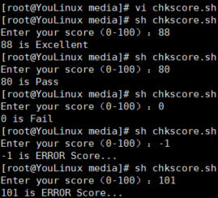

----------------------------------------------
> *Made By Herolh*
----------------------------------------------

# 目录 {#index}
[TOC]


--------------------------------------------

# 《LINUX 就该这么学》刘遄 

## 什么是开源

&emsp;&emsp;简单来说，开源软件的特点就是把软件程序与源代码文件一起打包提供给用户，让用户在不受限制地使用某个软件功能的基础上还可以按需进行修改，或编制成衍生产品再发布出去。用户具有使用自由、修改自由、重新发布自由以及创建衍生品的自由。这也正好符合了黑客和极客对自由的追求，因此国内外开源社区的根基都很庞大，人气也相当高。
&emsp;&emsp;坦白来讲，每位投身于 Linux 行业的技术人或者程序员只要听到开源项目就会由衷地感到自豪，这是一种从骨子里带有的独特情怀。开源的企业不单纯是为了利益，而是互相扶持，努力服务好更多的用户。开源软件最重要的特性有下面这些

- **低风险:** 使用闭源软件无疑把命运交付给他人，一旦封闭的源代码没有人来维护，你将进退维谷；而且相较于商业软件公司，开源社区很少存在倒闭的问题。
- **高品质:** 相较于闭源软件产品，开源项目通常是由开源社区来研发及维护的，参与编写、维护、测试的用户量众多，一般的 bug 还没有等爆发就已经被修补。
-  **低成本:** 开源工作者都是在幕后默默且无偿地付出劳动成果，为美好的世界贡献一份力量，因此使用开源社区推动的软件项目可以节省大量的人力、物力和财力。
-  **更透明:** 没有哪个笨蛋会把木马、后门等放到开放的源代码中，这样无疑是把自己的罪行暴露在阳光之下

&emsp;&emsp;但是，如果开源软件为了单纯追求“自由”而牺牲程序员的利益，这将会影响程序员的创造激情，因此世界上现在有 60 多种被开源促进组织（Open Source Initiative）认可的开源许可协议来保证开源工作者的权益。对于那些只知道一味抄袭、篡改、破解或者盗版他人作品的不法之徒，终归会在某一天收到法院的传票。对于准备编写一款开源软件的开发人员，也非常建议先了解一下当前最热门的开源许可协议，选择一个合适的开源许可协议来最大限度保护自己的软件权益。


### GNU GPL


&emsp;&emsp;**GNU General Public License，GNU通用公共许可证**, 只要软件中包含了遵循 GPL 协议的产品或代码，该软件就必须也遵循 GPL 许可协议且开源、免费，因此这个协议并不适合商用软件。遵循该协议的开源软件数量极其庞大，包括 Linux 系统在内的大多数的开源软件都是基于这个协议的。GPL 开源许可协议最大的 4 个特点如下所示。
- **复制自由:**　允许把软件复制到任何人的电脑中，并且不限制复制的数量。　　
- **传播自由:**　允许软件以各种形式进行传播。
- **收费传播：**允许在各种媒介上出售该软件，但必须提前让买家知道这个软件是可以免费获得的；因此，一般来讲，开源软件都是通过为用户提供有偿服务的形式来盈利的。
- **修改自由：**允许开发人员增加或删除软件的功能，但软件修改后必须依然基于GPL 许可协议授权。


### BSD 许可协议


&emsp;&emsp;**Berkeley Software Distribution,** 伯利克软件发布版。用户可以使用、修改和重新发布遵循该许可的软件，并且可以将软件作为商业软件发布和销售，前提是需要满足下面 3 个条件。
- 如果再发布的软件中包含源代码，则源代码必须继续遵循 BSD 许可协议。
- 如果再发布的软件中只有二进制程序，则需要在相关文档或版权文件中声明原始代码遵循了 BSD 协议。
- 不允许用原始软件的名字、作者名字或机构名称进行市场推广。


### Apache 许可证版本许可协议


&emsp;&emsp;**Apache License Version，**在为开发人员提供版权及专利许可的同时，允许用户拥有修改代码及再发布的自由。该许可协议适用于商业软件，现在热门的 Hadoop、Apache HTTP Server、MongoDB 等项目都是基于该许可协议研发的，程序开发人员在开发遵循该协议的软件时，要严格遵守下面的 4 个条件。
- 该软件及其衍生品必须继续使用 Apache 许可协议。
- 如果修改了程序源代码，需要在文档中进行声明。
- 若软件是基于他人的源代码编写而成的，则需要保留原始代码的协议、商标、专利声明及其他原作者声明的内容信息。
- 如果再发布的软件中有声明文件，则需在此文件中标注 Apache 许可协议及其他许可协议。


### MPL 许可协议

&emsp;&emsp;**Mozilla Public License**，相较于 GPL 许可协议，MPL 更加注重对开发者的源代码需求和收益之间的平衡。


### MIT 许可协议

&emsp;&emsp;**Massachusetts Institute of Technology**，目前限制最少的开源许可协议之一，只要程序的开发者在修改后的源代码中保留原作者的许可信息即可，因此普遍被商业软件所使用。


## 0 常见的 Linux 系统版本

&emsp;&emsp;在介绍常见的 Linux 系统版本之前，首先需要区分 Linux 系统内核与 Linux 发行套件系统的不同。
- Linux 系统内核指的是一个由 Linus Torvalds 负责维护，提供硬件抽象层、硬盘及文件系统控制及多任务功能的系统核心程序。
- Linux 发行套件系统是我们常说的 Linux 操作系统，也即是由 Linux 内核与各种常用
软件的集合产品。

&emsp;&emsp;全球大约有数百款的 Linux 系统版本，每个系统版本都有自己的特性和目标人群，下面将可以从用户的角度选出最热门的几款进行介绍。

### 红帽企业版 RedHat


&emsp;&emsp;**Linux RedHat Enterprise Linux RHEL** ：红帽公司是全球最大的开源技术厂商，RHEL 是全世界内使用最广泛的 Linux 系统。RHEL 系统具有极强的性能与稳定性，并且在全球范围内拥有完善的技术支持。RHEL 系统也是本书、红帽认证以及众多生产环境中使用的系统。

### 社区企业操作系统 CentOS 


&emsp;&emsp;**Community Enterprise Operating System**，CentOS 通过把 RHEL 系统重新编译并发布给用户免费使用的 Linux 系统，具有广泛的使用人群。CentOS 当前已被红帽公司“收编”。


### Fedora


&emsp;&emsp;Fedora 由红帽公司发布的桌面版系统套件（目前已经不限于桌面版）。用户可免费体验到最新的技术或工具，这些技术或工具在成熟后会被加入到 RHEL 系统中，因此 Fedora 也称为 RHEL系统的“试验田”。运维人员如果想时刻保持自己的技术领先，就应该多关注此类 Linux 系统的发展变化及新特性，不断改变自己的学习方向。


### openSUSE


&emsp;&emsp;openSUSE 源自德国的一款著名的 Linux 系统，在全球范围内有着不错的声誉及市场占有率。


### Gentoo


&emsp;&emsp;Gentoo 具有极高的自定制性，操作复杂，因此适合有经验的人员使用。读者可以在学习完本书后尝试一下该系统。


### Debian


&emsp;&emsp;Debian 稳定性、安全性强，提供了免费的基础支持，可以良好地支持各种硬件架构，以及提供近十万种不同的开源软件，在国外拥有很高的认可度和使用率。


### Ubuntu


&emsp;&emsp;Ubuntu 是一款派生自 Debian 的操作系统，对新款硬件具有极强的兼容能力。Ubuntu 与 Fedora 都是极其出色的 Linux 桌面系统，而且 Ubuntu 也可用于服务器领域。

&emsp;&emsp;现在国内大多数 Linux 相关的图书都是围绕 CentOS 系统编写的，作者大多也会给出围绕 CentOS 进行写作的一系列理由，但是很多理由都站不住脚，根本没有剖析到 CentOS 系统与 RHEL 系统的本质关系。**CentOS 系统是通过把 RHEL 系统释放出的程序源代码经过二次编译之后生成的一种 Linux 系统，其命令操作和服务配置方法与 RHEL 完全相同，但是去掉了很多收费的服务套件功能，而且还不提供任何形式的技术支持，出现问题后只能由运维人员自己解决。**经过这般分析基本上可以判断出，选择 CentOS 的理由只剩下—免费！
&emsp;&emsp;当人们大举免费、开源、正义的旗帜来宣扬 CentOS 系统的时候，殊不知 CentOS 系统其实早在 2014 年年初就已经被红帽公司“收编”，当前只是战略性的免费而已。再者说，根据 GNU GPL 许可协议，我们同样也可以免费使用 RHEL 系统，甚至是修改其代码创建衍生产品。开源系统在自由程度上没有任何差异，更无关道德问题。


## 1 部署虚拟环境安装 Linux 系统
- **桥接模式：**相当于在物理主机与虚拟机网卡之间架设了一座桥梁，从而可以通过物理主机的网卡访问外网。
- **NAT 模式：**让 VM 虚拟机的网络服务发挥路由器的作用，使得通过虚拟机软件模拟的主机可以通过物理主机访问外网，在真机中 NAT 虚拟机网卡对应的物理网卡是
VMnet8。
- **仅主机模式：**仅让虚拟机内的主机与物理主机通信，不能访问外网，在真机中仅主机模式模拟网卡对应的物理网卡是 VMnet1。


### 重置 root 管理员密码
&emsp;&emsp;平日里让运维人员头疼的事情已经很多了，因此偶尔把 Linux 系统的密码忘记了并不用慌，只需简单几步就可以完成密码的重置工作。但是，如果您是第一次阅读本书，或者之前没有 Linux 系统的使用经验，请一定先跳过本节，等学习完 Linux 系统的命令后再来学习本节内容。如果您刚刚接手了一台 Linux 系统，要先确定是否为 RHEL 7 系统。如果是，然后再进行下面的操作。

```shell
$ cat /etc/redhat-release
```

&emsp;&emsp;重启 Linux 系统主机并出现引导界面时，按下键盘上的 `e` 键进入内核编辑界面，如下图所示。


&emsp;&emsp;在 `linux16` 参数这行的最后面追加`  rd.break`参数，然后按下 `Ctrl` +`X` 组合键来运行修改过的内核程序，如下图所示。


&emsp;&emsp;大约 30 秒过后，进入到系统的紧急求援模式，如下图所示。


&emsp;&emsp;依次输入以下命令，等待系统重启操作完毕，然后就可以使用新密码来登录Linux 系统了。

```shell
mount -o remount,rw /sysroot		# 重新挂载根目录为读写模式
chroot /sysroot						# 切换到系统真正的根目录下
passwd								# 修改密码 
touch /.autorelabel					# 创建文件标签.autorelabel
exit								# 退出编辑模式
reboot								# 重启
```


### RPM（红帽软件包管理器）
&emsp;&emsp;在 RPM（红帽软件包管理器）公布之前，要想在 Linux 系统中安装软件只能采取源码包的方式安装。早期在 Linux 系统中安装程序是一件非常困难、耗费耐心的事情，而且大多数的服务程序仅仅提供源代码，需要运维人员自行编译代码并解决许多的软件依赖关系，因此要安装好一个服务程序，运维人员需要具备丰富知识、高超的技能，甚至良好的耐心。而且在安装、升级、卸载服务程序时还要考虑到其他程序、库的依赖关系，所以在进行校验、安装、卸载、查询、升级等管理软件操作时难度都非常大。
&emsp;&emsp;RPM 机制则为解决这些问题而设计的。RPM 有点像 Windows 系统中的控制面板，会建立统一的数据库文件，详细记录软件信息并能够自动分析依赖关系。目前 RPM 的优势已经被公众所认可，RPM 已经被 CentOS、Fedora、openSUSE 等众多 Linux 系统采用，它真的很好用！使用范围也已不局限在红帽系统中了。下表是一些常用的 RPM 软件包命令，当前不需要记住它们，大致混个“脸熟”就足够了。

|         说明          |              命令               |
| :-------------------: | :-----------------------------: |
| rpm -ivh filename.rpm |       安装软件的命令格式        |
| rpm -Uvh filename.rpm |       升级软件的命令格式        |
|  rpm -e filename.rpm  |       卸载软件的命令格式        |
| rpm -qpi filename.rpm |   查询软件描述信息的命令格式    |
| rpm -qpl filename.rpm |   列出软件文件信息的命令格式    |
|   rpm -qf filename    | 查询文件属于哪个 RPM 的命令格式 |


### Yum 软件仓库
&emsp;&emsp;尽管 RPM 能够帮助用户查询软件相关的依赖关系，但问题还是要运维人员自己来解决，而有些大型软件可能与数十个程序都有依赖关系，在这种情况下安装软件会是非常痛苦的。Yum 软件仓库便是为了进一步降低软件安装难度和复杂度而设计的技术。Yum 软件仓库可以根据用户的要求分析出所需软件包及其相关的依赖关系，然后自动从服务器下载软件包并安装到系统。
&emsp;&emsp;Yum 软件仓库中的 RPM 软件包可以是由红帽官方发布的，也可以是第三方发布的，当然也可以是自己编写的。下表所示为一些常见的 Yum 命令，当前只需对它们有一个简单印象即可。

|          命令          |             作用             |
| :--------------------: | :--------------------------: |
|  yum install 软件包名  |          安装软件包          |
| yum reinstall 软件包名 |        重新安装软件包        |
|  yum update 软件包名   |          升级软件包          |
|    yum check-update    |      检查可更新的软件包      |
|  yum remove 软件包名   |          移除软件包          |
|     yum clean all      |       清除所有仓库缓存       |
|   yum info 软件包名    |        查看软件包信息        |
|     yum grouplist      | 查看系统中已经安装的软件包组 |
|    yum repolist all    |         列出所有仓库         |
|      yum list all      |     列出仓库中所有软件包     |
|    yum groupinstall    |      安装指定的软件包组      |
|    yum groupremove     |      移除指定的软件包组      |
|     yum groupinfo      |    查询指定的软件包组信息    |


#### 注意:

**简述 RPM 与 Yum 软件仓库的作用。**

> RPM 是为了简化安装的复杂度，而 Yum软件仓库是为了解决软件包之间的依赖关系。


### systemd 初始化进程
&emsp;&emsp;**Linux 操作系统的开机过程是这样的，即从 BIOS 开始，然后进入 Boot Loader，再加载系统内核，然后内核进行初始化，最后启动初始化进程**。初始化进程作为 Linux 系统的第一个进程，它需要完成 Linux 系统中相关的初始化工作，为用户提供合适的工作环境。红帽 RHEL 7 系统已经替换掉了熟悉的初始化进程服务 `System V init`，正式采用全新的systemd 初始化进程服务。如果您之前学习的是 RHEL 5 或 RHEL 6 系统，可能会不习惯。**systemd 初始化进程服务采用了并发启动机制，开机速度得到了不小的提升。**虽然 systemd 初始化进程服务具有很多新特性和优势，但目前还是有下面 4 个槽点。
- 槽点 1：systemd 初始化进程服务的开发人员 Lennart Poettering 就职于红帽公司，这让其他系统的粉丝很不爽。
- 槽点 2：systemd 初始化进程服务仅仅可在 Linux 系统下运行，“抛弃”了 UNIX 系统用户。
- 槽点 3：systemd 接管了诸如 syslogd、udev、cgroup 等服务的工作，不再甘心只做初始化进程服务。
- 槽点 4：使用 systemd 初始化进程服务后，RHEL 7 系统变化太大，而相关的参考文档不多，令用户着实为难

&emsp;&emsp;无论怎样，RHEL 7 系统选择 systemd 初始化进程服务已经是一个既定事实，因此也没有了“运行级别”这个概念，Linux 系统在启动时要进行大量的初始化工作，比如挂载文件系统
和交换分区、启动各类进程服务等，这些都可以看作是一个一个的单元（Unit），systemd 用目标（target）代替了 System V init 中运行级别的概念，这两者的区别如下表所示。


&emsp;&emsp;如果想要将系统默认的运行目标修改为“多用户，无图形”模式，可直接用 `ln` 命令把多用户模式目标文件连接到 `/etc/systemd/system/` 目录：

```shell
ln -sf /lib/systemd/system/multi-user.target /etc/systemd/system/default.target 
```

&emsp;&emsp;如果有读者之前学习过 RHEL 6 系统，或者已经习惯使用 service、chkconfig 等命令来管理系统服务，那么现在就比较郁闷了，因为在 RHEL 7 系统中是使用 systemctl 命令来管理服务的。下表所示 RHEL 6 系统中 System V init 命令与 RHEL 7 系统中 systemctl 命令的对比，您可以先大致了解一下，后续章节中会经常用到它们。

| System V init 命令  |        systemctl 命令         |            作用            |
| :-----------------: | :---------------------------: | :------------------------: |
|  service foo start  |  systemctl start foo.service  |          启动服务          |
| service foo restart | systemctl restart foo.service |          重启服务          |
|  service foo stop   |  systemctl stop foo.service   |          停止服务          |
| service foo reload  | systemctl reload foo.service  | 不终止服务重新加载配置文件 |
| service foo status  | systemctl status foo.service  |        查看服务状态        |

| System V init 命令 |              systemctl 命令              |                作用                |
| :----------------: | :--------------------------------------: | :--------------------------------: |
|  chkconfig foo on  |       systemctl enable foo.service       |            开机自动启动            |
| chkconfig foo off  |      systemctl disable foo.service       |           开机不自动启动           |
|   chkconfig foo    |     systemctl is-enabled foo.service     |   查看特定服务是否为开机自动启动   |
|  chkconfig --list  | systemctl list-unit-files --type=service | 查看各个级别下服务的启动与禁用情况 |

**注意:**

```markdown
# 其中服务名后的.service 可以省略。
```


## 2 新手必须掌握的 Linux 命令
### 2.1 强大好用的 Shell
&emsp;&emsp;通常来讲，计算机硬件是由运算器、控制器、存储器、输入/输出设备等共同组成的，而让各种硬件设备各司其职且又能协同运行的东西就是系统内核。Linux 系统的内核负责完成对硬件资源的分配、调度等管理任务。由此可见，系统内核对计算机的正常运行来讲是太重要了，因此一般不建议直接去编辑内核中的参数，而是让用户通过基于系统调用接口开发出的程序或服务来管理计算机，以满足日常工作的需要，如下图所示。


&emsp;&emsp;必须肯定的是，Linux 系统中有些图形化工具（比如逻辑卷管理器 [Logical Volume Manager，LVM]）确实非常好用，极大地降低了运维人员操作出错的概率，值得称赞。但是，很多图形化工具其实是调用了脚本来完成相应的工作，往往只是为了完成某种工作而设计的，缺乏 Linux 命令原有的灵活性及可控性。再者，图形化工具相较于 Linux 命令行界面会更加消耗系统资源，因此经验丰富的运维人员甚至都不会给 Linux 系统安装图形界面，需要开始运维工作时直接通过命令行模式远程连接过去，不得不说这样做确实挺高效的。
&emsp;&emsp;Shell 就是这样的一个命令行工具。Shell（也称为终端或壳）充当的是人与内核（硬件）之间的翻译官，用户把一些命令“告诉”终端，它就会调用相应的程序服务去完成某些工作。现在**包括红帽系统在内的许多主流 Linux 系统默认使用的终端是 Bash（Bourne-Again SHell）解释器。**主流 Linux 系统选择 Bash 解释器作为命令行终端主要有以下 4 项优势:

- 通过上下方向键来调取过往执行过的 Linux 命令；
- 命令或参数仅需输入前几位就可以用 Tab 键补全；
- 具有强大的批处理脚本；
- 具有实用的环境变量功能。


### 2.2 执行查看帮助命令
&emsp;&emsp;既然 Linux 系统中已经有了 Bash 这么好用的“翻译官”，那么接下来就有必要好好学习下怎么跟它沟通了。要想准确、高效地完成各种任务，仅依赖于命令本身是不够的，还应该根据实际情况来灵活调整各种命令的参数。比如，我们切寿司时尽管可以用菜刀，但米粒一定会撒得满地都是，因此寿司刀上设计的用于透气的圆孔就是为了更好地适应场景而额外增加的参数。当您学完本书并具备一定的工作经验之后，一定能够领悟 Linux 命令的奥秘。常见执行 Linux 命令的格式是这样的注意，命令名称、命令参数、命令对象之间请用空格键分隔。：
```shell
命令名称 [命令参数] [命令对象]
```
&emsp;&emsp;Linux 新手不会执行命令大多是因为参数比较复杂，参数值需要随不同的命令和需求情况而发生改变。因此，要想灵活搭配各种参数，执行自己想要的功能，则需要长时间的经验积累了。
- 命令对象一般是指要处理的文件、目录、用户等资源，
- 命令参数可以用长格式（完整的选项名称），也可以用短格式（单个字母的缩写），两者分别用`--`与`-`作为前缀。

    |   长格式   | 短格式 |
    | :--------: | :----: |
    | man --help | man -h |

    长格式和长格式之间不能合并，长格式和短格式之间也不能合并，但**短格式和短格式之间是可以合并的，合并后仅保留一个-(减号)即可。**


#### man 帮助文件

&emsp;&emsp;man命令：可以通过一些参数，快速查询linux帮助手册，并且格式化显示。

在命令行终端中输入 `man man` 命令来查看 man 命令自身的帮助信息

|   按键    |                用途                |
| :-------: | :--------------------------------: |
|  空格键   |             向下翻一页             |
| PaGe down |             向下翻一页             |
|  PaGe up  |             向上翻一页             |
|   home    |            直接前往首页            |
|    end    |            直接前往尾页            |
|     /     | 从上至下搜索某个关键词，如“/linux” |
|     ?     | 从下至上搜索某个关键词，如“?linux” |
|     n     |     定位到下一个搜索到的关键词     |
|     N     |     定位到上一个搜索到的关键词     |
|     q     |            退出帮助文档            |

&emsp;&emsp;一般来讲，使用 man 命令查看到的帮助内容信息都会很长很多，如果读者不了解帮助文档信息的目录结构和操作方法，乍一看到这么多信息可能会感到相当困惑。man 命令的帮助信息的结构如表 2-3 所示。


### 2.3 常用系统工作命令
#### echo 命令
&emsp;&emsp;echo 命令用于**在终端输出字符串或变量提取后的值**，格式为`echo [字符串 | $变量]`。例如，把指定字符串“Linuxprobe.com”输出到终端屏幕的命令为：
```shell
echo Linuxprobe.Com

# 该命令会在终端屏幕上显示如下信息：
# Linuxprobe.Com
```

下面，我们使用`$`变量的方式提取变量 SHELL 的值，并将其输出到屏幕上：

```shell
echo $SHELL
```

在linux中给一个文本文件写内容的方法:

```shell
echo 'Hello World!' > a.txt
```


#### date 命令
&emsp;&emsp;date 命令用于显示及设置系统的时间或日期，格式为

```markdown
date [选项] [+指定的格式]
```

&emsp;&emsp;只需在强大的 date 命令中输入以“+”号开头的参数，即可按照指定格式来输出系统的时间或日期，这样在日常工作时便可以把备份数据的命令与指定格式输出的时间信息结合到一起。例如，把打包后的文件自动按照“年-月-日”的格式打包成`backup-2017-9-1.tar.gz`，用户只需要看一眼文件名称就能大概了解到每个文件的备份时间了。date 命令中常见的参数格式及作用如下表所示。

| 参数 |      作用      |
| :--: | :------------: |
|  %t  |  跳格[Tab 键]  |
|  %Y  |    年(XXXX)    |
|  %y  |     年(XX)     |
|  %m  |       月       |
|  %H  | 小时（00～23） |
|  %I  | 小时（00～12） |
|  %M  | 分钟（00～59） |
|  %S  |  秒（00～59）  |
|  %j  | 今年中的第几天 |

```shell
# 设置系统的当前时间
date -s "20170901 8:30:00"

# date 命令中的参数%j 可用来查看今天是当年中的第几天。这个参数能够很好地区分备份时间的新旧，即数字越大，越靠近当前时间。
```

.png)


#### reboot 命令
&emsp;&emsp;reboot 命令用于重启系统，其格式为 reboot。由于重启计算机这种操作会涉及硬件资源的管理权限，因此默认只能使用 root 管理员来重启，其命令如下：

```shell
reboot
```


#### poweroff 命令
&emsp;&emsp;poweroff 命令用于关闭系统，其格式为 poweroff。该命令与 reboot 命令相同，都会涉及硬件资源的管理权限，因此默认只有 root 管理员才可以关闭电脑，其命令如下：

```shell
poweroff
```


#### wget 命令
&emsp;&emsp;wget 命令用于在终端中下载网络文件，格式为
```markdown
wget [参数] 下载地址
```
&emsp;&emsp;如果您没有 Linux 系统的管理经验，当前只需了解一下 wget 命令的参数以及作用，然后看一下下面的演示实验即可，切记不要急于求成。后面章节将逐步讲解 Linux 系统的配置管理方法，可以等您掌握了网卡的配置方法后再来进行这个实验操作。下表所示为 wget 命令的参数以及参数的作用。

| 参数 |                 作用                 |
| :--: | :----------------------------------: |
|  -b  |             后台下载模式             |
|  -P  |            下载到指定目录            |
|  -p  | 下载页面内所有资源，包括图片、视频等 |
|  -t  |             最大尝试次数             |
|  -c  |               断点续传               |
|  -r  |               递归下载               |

```shell
# 用 wget 命令从本书的配套站点中下载本书的最新 pdf 格式电子文档
wget http://www.linuxprobe.com/docs/LinuxProbe.pdf

# 递归下载 www.linuxprobe.com 网站内的所有页面数据以及文件，下载完后会自动保存到当前路径下一个名为 www.linuxprobe.com 的目录中。
wget -r -p http://www.linuxprobe.com
```


#### ps 命令
&emsp;&emsp;ps 命令用于查看系统中的进程状态，用来抓取与某个指定服务进程相对应的 PID 号码格式为:

```markdown
ps [参数]
```

| 参数 |                作用                |
| :--: | :--------------------------------: |
|  -a  | 显示所有进程（包括其他用户的进程） |
|  -u  |        用户以及其他详细信息        |
|  -x  |       显示没有控制终端的进程       |

&emsp;&emsp;ps 命令的常见参数以及作用如上表所示。Linux 系统中时刻运行着许多进程，如果能够合理地管理它们，则可以优化系统的性能。**在Linux 系统中，有 5 种常见的进程状态，分别为运行、中断、不可中断、僵死与停止**，其各自含义如下所示:

- **R(运行):** 进程正在运行或在运行队列中等待。
- **S(中断):** 进程处于休眠中，当某个条件形成后或者接收到信号时，则脱离该状态。
- **D(不可中断):** 进程不响应系统异步信号，即便用 kill 命令也不能将其中断。
- **Z(僵死):** 进程已经终止，但进程描述符依然存在, 直到父进程调用 wait4()系统函数后将进程释放。

- **T(停止):**  进程收到停止信号后停止运行。

当执行 ps aux 命令后通常会看到如表 2-7 所示的进程状态，表 2-7 中只是列举了部分输
出值，而且正常的输出值中不包括中文注释。


**注意:**
>如前面所提到的，在Linux系统中的命令参数有长短格式之分，长格式和长格式之间不能合并，长格式和短格式之间也不能合并，但短格式和短格式之间是可以合并的，合并后仅保留一个一(减号)即可。另外ps命令可允许参数不加减号(一)，因此可直接写成ps aux的样子。


#### top 命令
&emsp;&emsp;**top 命令用于动态地监视进程活动与系统负载等信息**。top 命令相当强大，能够动态地查看系统运维状态，完全将它看作 Linux 中的“强化版的Windows 任务管理器”。top 命令的运行界面如下图所示。


&emsp;&emsp;top 命令执行结果的前 5 行为系统整体的统计信息，其所代表的含义如下。
- **第 1 行：**系统时间、运行时间、登录终端数、系统负载（三个数值分别为 1 分钟、5分钟、15 分钟内的平均值，数值越小意味着负载越低）。
- **第 2 行**：进程总数、运行中的进程数、睡眠中的进程数、停止的进程数、僵死的进程数。
- **第 3 行**：用户占用资源百分比、系统内核占用资源百分比、改变过优先级的进程资源百分比、空闲的资源百分比等。

    >第3行中的数据均为CPU数据并以百分比格式显示，例如“97.1 id"意味着有 97.1% 的CPU 处理器资源处于空闲。
- **第 4 行**：物理内存总量、内存使用量、内存空闲量、作为内核缓存的内存量。
- **第 5 行**：虚拟内存总量、虚拟内存使用量、虚拟内存空闲量、已被提前加载的内存量。


#### pidof 命令
&emsp;&emsp;pidof 命令用于查询某个指定服务进程的 PID 值，格式为:

```markdown
pidof [参数] [服务名称]
```

&emsp;&emsp;每个进程的进程号码值（PID）是唯一的，因此可以通过 PID 来区分不同的进程。例如，可以使用如下命令来查询本机上 sshd 服务程序的 PID：

```shell
pidof sshd
# 3528 1791
```


#### kill 命令
&emsp;&emsp;kill 命令用于终止某个指定 PID 的服务进程，格式为:

```shell
kill [参数] [进程 PID]
```
&emsp;&emsp;接下来，我们使用 kill 命令把上面用 pidof 命令查询到的 PID 所代表的进程终止掉，其命令如下所示。这种操作的效果等同于强制停止 sshd 服务。
```shell
kill 3528
```


#### killall 命令

&emsp;&emsp;killall 命令用于终止某个指定名称的服务所对应的全部进程，格式为：
```shell
killall [参数] [服务名称]
```
&emsp;&emsp;通常来讲，复杂软件的服务程序会有多个进程协同为用户提供服务，如果逐个去结束这些进程会比较麻烦，此时可以使用 killall 命令来批量结束某个服务程序带有的全部进程。下面以 httpd 服务程序为例，来结束其全部进程。由于 RHEL7 系统默认没有安装 httpd 服务程序，因此大家此时只需看操作过程和输出结果即可，等学习了相关内容之后再来实践。

```shell
[root@linuxprobe ~]# pidof httpd
13581 13580 13579 13578 13577 13576
[root@linuxprobe ~]# killall httpd
[root@linuxprobe ~]# pidof httpd
```

##### 注意

>如果我们在系统终端中执行一个命令后想立即停止它，可以同时按下 `Ctrl + C` 组合键(生产环境中比较常用的一个快捷键)，这样将立即终止该命令的进程。或者，如果有些命令在执行时不断地在屏幕上输出信息，影响到后续命令的输入，则可以**在执行命令时在末尾添加上一个 `&` 符号，这样命令将进入系统后台来执行。**


### 2.4 系统状态检测命令
&emsp;&emsp;作为一名合格的运维人员，想要更快、更好地了解 Linux 服务器，必须具备快速查看 Linux 系统运行状态的能力，因此接下来会逐个讲解与网卡网络、系统内核、系统负载、内存使用情况、当前启用终端数量、历史登录记录、命令执行记录以及救援诊断等相关命令的使用方法。这些命令都超级实用，还请读者用心学习，加以掌握。


#### ifconfig 命令

&emsp;&emsp;ifconfig 命令用于获取网卡配置与网络状态等信息，格式为:
```shell
ifconfig [网络设备] [参数]
```
&emsp;&emsp;使用 ifconfig 命令来查看本机当前的网卡配置与网络状态等信息时，其实主要查看的就是网卡名称、inet 参数后面的 IP 地址、ether 参数后面的网卡物理地址（又称为 MAC 地址），以及 RX、TX 的接收数据包与发送数据包的个数及累计流量（即下面加粗的信息内容）：


#### uname 命令

&emsp;&emsp;uname 命令用于查看系统内核与系统版本等信息，格式为:

```shell
uname [-a]
```

&emsp;&emsp;在使用 uname 命令时，一般会固定搭配上-a 参数来完整地查看当前系统的内核名称、主机名、内核发行版本、节点名、系统时间、硬件名称、硬件平台、处理器类型以及操作系统名称等信息。
```shell
uname -a
# Linux linuxprobe.com 3.10.0-123.el7.x86_64 #1 SMP Mon May 5 11:16:57 EDT 2017x86_64 x86_64 x86_64 GNU/Linux
```
顺带一提，如果要查看当前系统版本的详细信息，则需要查看 redhat-release 文件，其命
令以及相应的结果如下：

```shell
cat /etc/redhat-release 
# CentOS Linux release 7.3.1611 (Core) 
```


#### uptime 命令
&emsp;&emsp;uptime 用于查看系统的负载信息。uptime 命令可以显示当前系统时间、系统已运行时间、启用终端数量以及平均负载值等信息。平均负载值指的是系统在最近 1 分钟、5 分钟、15 分钟内的压力情况（下面加粗的信息部分）；负载值越低越好，尽量不要长期超过 1，在生产环境中不要超过 5。


#### free 命令

&emsp;&emsp;free 用于显示当前系统中内存的使用量信息，格式为:

```shell
free [-h]
```

&emsp;&emsp;为了保证 Linux 系统不会因资源耗尽而突然宕机，运维人员需要时刻关注内存的使用量。在使用 free 命令时，可以结合使用 `-h` 参数以更人性化的方式输出当前内存的实时使用量信息。


#### who 命令

&emsp;&emsp;who 用于查看当前登入主机的用户终端信息。这三个简单的字母可以快速显示出所有正在登录本机的用户的名称以及他们正在开启的终端信息。


#### last 命令

&emsp;&emsp;**last 命令用于查看所有系统的登录记录**，使用 last 命令可以查看本机的登录记录。但是，由于这些信息都是以日志文件的形式保存在系统中，因此黑客可以很容易地对内容进行篡改。千万不要单纯以该命令的输出信息而判断系统有无被恶意入侵！


#### history 命令
&emsp;&emsp;history 命令用于显示历史执行过的命令，格式为`history [-c]`。执行 history 命令能显示出当前用户在本地计算机中执行过的最近 1000 条命令记录。如果觉得 1000 不够用，还可以自定义 `/etc/profile` 文件中的 `HISTSIZE` 变量值。在使用 history 命令时，如果使用 `-c` 参数则会清空所有的命令历史记录。还可以使用 `!编码数字` 的方式来重复执行某一次的命令。


&emsp;&emsp;历史命令会被保存到用户家目录中的.bash_history 文件中。Linux 系统中以点（.）开头的文件均代表隐藏文件，这些文件大多数为系统服务文件，可以用 cat 命令查看其文件内容。
```shell
cat ~/.bash_history
```
&emsp;&emsp;要清空当前用户在本机上执行的 Linux 命令历史记录信息，可执行如下命令：

```shell
history -c
```


### 2.5 工作目录切换命令
#### pwd 命令
&emsp;&emsp;pwd 命令用于显示用户当前所处的工作目录，格式为`pwd [选项]`。

```shell
pwd
# /root
```


#### cd 命令

cd 命令用于切换工作路径，格式为`cd [目录名称]`。这个命令应该是最常用的一个 Linux 命令了。可以通过 `cd` 命令迅速、灵活地切换到不同的工作目录。除了常见的切换目录方式，还可以使用 `cd -` 命令返回到上一次所处的目录，使用 `cd..` 命令进入上级目录，以及使用 `cd ~` 命令切换到当前用户的家目录，亦或使用`cd ~username` 切换到其他用户的家目录。


#### ls 命令

&emsp;&emsp;ls 命令用于显示目录中的文件信息，格式为 `ls [选项] [文件]`。所处的工作目录不同，当前工作目录下的文件肯定也不同。使用 ls 命令的`-a`参数看到全部文件（包括隐藏文件），使用 `-l` 参数可以查看文件的属性、大小等详细信息。将这两个参数整合之后，再执行 ls 命令即可查看当前目录中的所有文件并输出这些文件的属性:


&emsp;&emsp;如果想要查看目录属性信息，则需要额外添加一个-d 参数。例如，可使用如下命令查看
/etc 目录的权限与属性信息：


### 2.6 文本文件编辑命令

&emsp;&emsp;Linux 系统中“一切都是文件”，而对服务程序进行配置自然也就是编辑程序的配置文件。如果不能熟练地查阅系统或服务的配置文件，那以后工作时可就真的要尴尬了。


#### cat 命令

&emsp;&emsp;cat 命令用于查看纯文本文件（内容较少的），格式为`cat [选项] [文件]`。Linux 系统中有多个用于查看文本内容的命令，每个命令都有自己的特点，比如这个 **cat命令就是用于查看内容较少的纯文本文件的,会自动帮你翻页**。如果在查看文本内容时还想顺便显示行号的话，不妨在 cat 命令后面追加一个-n 参数：


#### more 命令
&emsp;&emsp;more 命令用于查看纯文本文件（内容较多的），格式为`more [选项]文件`。如果需要阅读长篇小说或者非常长的配置文件，那么 `cat` 可就真的不适合了。因为一旦使用 cat 命令阅读长篇的文本内容，信息就会在屏幕上快速翻滚，导致自己还没有来得及看到，内容就已经翻篇了。因此对于长篇的文本内容，推荐使用 more 命令来查看。more 命令会在最下面使用百分比的形式来提示您已经阅读了多少内容。您还可以使用空格键或回车键向下翻页


#### head 命令
&emsp;&emsp;head 命令用于查看纯文本文档的前 N 行，格式为`head [选项] [文件]`。在阅读文本内容时，谁也难以保证会按照从头到尾的顺序往下看完整个文件。如果只想查看文本中前 20 行的内容，该怎么办呢？head 命令可以派上用场了：

WA3`0M}Q@CVW.png)


#### tail 命令

&emsp;&emsp;tail 命令用于查看纯文本文档的后 N 行或持续刷新内容，格式为 `tail [选项] [文件]` 我们可能还会遇到另外一种情况，比如需要查看文本内容的最后 20 行，这时就需要用到 tail 命令了。tail 命令的操作方法与 head 命令非常相似，只需要执行 `tail -n 20 文件名` 命令就可以达到这样的效果。**tail 命令最强悍的功能是可以持续刷新一个文件的内容，当想要实时查看最新日志文件时，这特别有用，此时的命令格式为 `tail -f 文件名`：**


#### tr 命令

&emsp;&emsp;tr 命令用于替换文本文件中的字符，格式为 `tr [原始字符] [目标字符]`。在很多时候，我们想要快速地替换文本中的一些词汇，又或者把整个文本内容都进行替换，如果进行手工替换，难免工作量太大，尤其是需要处理大批量的内容时，进行手工替换更是不现实。这时，就可以先使用 cat 命令读取待处理的文本，然后通过管道符把这些文本内容传递给 tr 命令进行替换操作即可。例如，把某个文本内容中的英文全部替换为大写输出( 源文件不会发生改变 )：


#### wc 命令
&emsp;&emsp;wc 命令用于统计指定文本的行数、字数、字节数，格式为“wc [参数] 文本”。

| 参数 | 作用 |
| :---: | :--: |
| -l | 只显示行数 |
| -w | 只显示单词数 |
| -c | 只显示字节数 |
| -L | 显示最长行的长度 |

&emsp;&emsp;在 Linux 系统中，passwd 是用于保存系统账户信息的文件，要统计当前系统中有多少个用户，可以使用下面的命令来进行查询：


#### stat 命令
&emsp;&emsp;stat 命令用于查看文件的具体存储信息和时间等信息，格式为“stat 文件名称”。会显示出文件的三种时间状态（已加粗）：Access(最近访问)、Modify(最近更改)、Change(最近改动)。这三种时间的区别将在下面的 touch命令中详细详解：


#### cut 命令
&emsp;&emsp;cut 命令用于按“列”提取文本字符，格式为`cut [参数] 文本`。
在 Linux 系统中，如何准确地提取出最想要的数据，这也是我们应该重点学习的内容。一般而言，按基于“行”的方式来提取数据是比较简单的，只需要设置好要搜索的关键词即可。但是如果按列搜索，不仅要使用 `-f`参数来设置需要看的列数，还需要使用-d 参数来设置间隔符号。passwd 在保存用户数据信息时，用户信息的每一项值之间是采用冒号来间隔的，接下来我们使用下述命令尝试提取出 passwd 文件中的用户名信息，即提取以冒号 `:` 为间隔符号的第一列内容：


- **-f1**	只看第一列
- **-d:**	设置间隔符


#### diff 命令

&emsp;&emsp;diff 命令用于比较多个文本文件的差异，格式为 `diff [参数] 文件`。在使用 diff 命令时，不仅可以使用 `--brief` 参数来确认两个文件是否不同，还可以使用 `-c` 参数来详细比较出多个文件的差异之处，这绝对是判断文件是否被篡改的有力神器。例如，先 cat 命令分别查看 diff_A.txt 和 diff_B.txt 文件的内容，然后进行比较：


### 2.7 文件目录管理命令

#### touch 命令

&emsp;&emsp;touch 命令用于创建空白文件或设置文件的时间，格式为“touch [选项] [文件]”。在创建空白的文本文件方面，这个 touch 命令相当简捷，简捷到没有必要铺开去讲。比如，`touch linuxprobe` 命令可以创建出一个名为 linuxprobe 的空白文本文件。对 touch 命令来讲，有难度的操作主要是体现在设置文件内容的修改时间（mtime）、文件权限或属性的更改时间（ctime）与文件的读取时间（atime）上面 touch 命令的参数及其作用如下表所示。

| 参数 |           作用            |
| :--: | :-----------------------: |
|  -a  | 仅修改“读取时间”（atime)  |
|  -m  | 仅修改“修改时间”（mtime） |
|  -d  |  同时修改 atime 与 mtime  |


#### mkdir 命令
&emsp;&emsp;mkdir 命令用于创建空白的目录，格式为“mkdir [选项] 目录”。
&emsp;&emsp;在 Linux 系统中，文件夹是最常见的文件类型之一。除了能创建单个空白目录外，mkdir 命令还可以结合 `-p` 参数来递归创建出具有嵌套叠层关系的文件目录。


#### cp 命令
&emsp;&emsp;cp 命令用于复制文件或目录，格式为 `cp [选项] 源文件 目标文件`。大家对文件复制操作应该不陌生，在 Linux 系统中，复制操作具体分为 3 种情况：
-  如果目标文件是目录，则会把源文件复制到该目录中；
- 如果目标文件也是普通文件，则会询问是否要覆盖它；
- 如果目标文件不存在，则执行正常的复制操作。

| 参数 |                  作用                   |
| :--: | :-------------------------------------: |
|  -p  |            保留原始文件属性             |
|  -d  | 若对象为'链接文件',则保留链接文件的属性 |
|  -r  |        递归持续复制( 用于目录 )         |
|  -i  |      若目标文件存在则询问是否覆盖       |
|  -a  |     相当于 -pdr( p,d,r为上述参数 )      |


#### mv 命令
&emsp;&emsp;mv 命令用于剪切文件或将文件重命名，格式为`mv [选项] 源文件 [目标路径|目标文件名]`。剪切操作不同于复制操作，因为它会默认把源文件删除掉，只保留剪切后的文件。如果在同一个目录中对一个文件进行剪切操作，其实也就是对其进行重命名：


#### rm 文件
&emsp;&emsp;rm 命令用于删除文件或目录，格式为 `rm [选项] 文件`。
&emsp;&emsp;在 Linux 系统中删除文件时，系统会默认向您询问是否要执行删除操作，如果不想总是看到这种反复的确认信息，可在 rm 命令后跟上 `-f` 参数来强制删除。另外，想要删除一个目录，需要在 rm 命令后面一个-r 参数才可以，否则删除不掉。

|        参数         |               说明               |
| :-----------------: | :------------------------------: |
| -r, -R, --recursive |      递归地删除目录及其内容      |
|         -i          |         在每次移除前提示         |
|     -f, --force     | 忽略不存在的文件和参数，从不提示 |
|    -v, --verbose    |          解释正在做什么          |


#### dd 命令
&emsp;&emsp;dd 命令用于按照指定大小和个数的数据块来复制文件或转换文件，格式为“dd [参数]”。
&emsp;&emsp;dd 命令是一个比较重要而且比较有特色的一个命令，它能够让用户按照指定大小和个数的数据块来复制文件的内容。当然如果愿意的话，还可以在复制过程中转换其中的数据。**Linux系统中有一个名为/dev/zero 的设备文件，每次在课堂上解释它时都充满哲学理论的色彩。因为这个文件不会占用系统存储空间，但却可以提供无穷无尽的数据**，因此可以使用它作为 dd命令的输入文件，来生成一个指定大小的文件。

| 参数  |          作用          |
| :---: | :--------------------: |
|  if   |     输入的文件名称     |
|  of   |     输出的文件名称     |
|  bs   |  设置每个'块' 的大小   |
| count | 设置要复制 '快' 的个数 |

&emsp;&emsp;我们可以用 dd 命令从 `/dev/zero`设备文件中取出一个大小为 560MB 的数据块，然后保存成名为 560_file 的文件。在理解了这个命令后，以后就能随意创建任意大小的文件了：


&emsp;&emsp;dd 命令的功能也绝不仅限于复制文件这么简单。如果您想把光驱设备中的光盘制作成 iso 格式的镜像文件，在 Windows 系统中需要借助于第三方软件才能做到，但在 Linux 系统中可以直接使用 dd 命令来压制出光盘镜像文件，将它变成一个可立即使用的 iso 镜像：


#### file 命令

&emsp;&emsp;file 命令用于查看文件的类型，格式为 `file 文件名`。
&emsp;&emsp;在 Linux 系统中，由于文本、目录、设备等所有这些一切都统称为文件，而我们又不能单凭后缀就知道具体的文件类型，这时就需要使用 file 命令来查看文件类型了。


#### scp 命令

当两台 LINUX 主机之间要互传文件时可使用SCP命令来实现，scp 传输速度较慢,但使用 ssh 通道保证了传输的安全性。

##### 复制文件

- 将本地文件拷贝到远程

    ```shell
    scp 文件名 用户名@计算机IP或者计算机名称:远程路径
    ```

    示例：

    ```shell
    scp local_file remote_username@remote_ip:remote_folder 
    # 或者 
    scp local_file remote_username@remote_ip:remote_file 
    # 或者 
    scp local_file remote_ip:remote_folder 
    # 或者 
    scp local_file remote_ip:remote_file 
    
    ```

    第1,2个指定了用户名，命令执行后需要再输入密码，第1个仅指定了远程的目录，文件名字不变，第2个指定了文件名； 
    第3,4个没有指定用户名，命令执行后需要输入用户名和密码，第3个仅指定了远程的目录，文件名字不变，第4个指定了文件名；

- 从远程将文件拷回本地

    ```shell
    scp 用户名@计算机IP或者计算机名称:文件名 本地路径
    ```


##### 复制目录

> -r

- 将本地目录拷贝到远程

    ```shell
    scp -r 目录名 用户名@计算机IP或者计算机名称:远程路径
    ```

    示例

    ```shell
    scp -r local_folder remote_username@remote_ip:remote_folder 
    # 或者 
    scp -r local_folder remote_ip:remote_folder 
    ```

    

- 从远程将目录拷回本地

    ```shell
    scp -r 用户名@计算机IP或者计算机名称:目录名 本地路径
    ```

    

##### 参数详解

| 参数 | 描述                                                         |
| :--: | ------------------------------------------------------------ |
|  -a  | 尽可能将档案状态、权限等资料都照原状予以复制                 |
|  -r  | 若 source 中含有目录名，则将目录下之档案亦皆依序拷贝至目的地 |
|  -f  | 若目的地已经有相同档名的档案存在，则在复制前先予以删除再行复制 |
|  -v  | 和大多数 linux 命令中的 -v 意思一样 , 用来显示进度 . 可以用来查看连接 , 认证 , 或是配置错误 |
|  -C  | 使能压缩选项                                                 |
|  -P  | 选择端口 . 注意 -p 已经被 rcp 使用                           |
|  -4  | 强行使用 IPV4 地址                                           |
|  -6  | 强行使用 IPV6 地址                                           |


### 2.8 打包压缩与搜索命令

&emsp;&emsp;在网络上，人们越来越倾向于传输压缩格式的文件，原因是压缩文件体积小，在网速相同的情况下，传输时间短。下面将学习如何在 Linux 系统中对文件进行打包压缩与解压，以及让用户基于关键词在文本文件中搜索相匹配的信息、在整个文件系统中基于指定的名称或属性搜索特定文件。


#### tar 命令
&emsp;&emsp;tar 命令用于对文件进行打包压缩或解压，格式为 `tar [选项] [文件]` 。
&emsp;&emsp;在 Linux 系统中，常见的文件格式比较多，其中主要使用的是 `.tar` 或 `.tar.gz` 或 `.tar.bz2` 格式，我们不用担心格式太多而记不住，其实这些格式大部分都是由 tar 命令来生成的。刘遄老师将讲解最重要的几个参数，以方便大家理解。tar 命令的参数及其作用如表 2-14 所示。

| 参数 |                             作用                             |
| :--: | :----------------------------------------------------------: |
|  -c  |                         创建压缩文件                         |
|  -x  |                         解开压缩文件                         |
|  -t  |                    查看压缩包内有哪些文件                    |
|  -z  |                      用 Gzip 压缩或解压                      |
|  -j  |                     用 bzip2 压缩或解压                      |
|  -v  |                     显示压缩或解压的过程                     |
|  -f  | 目标文件名, 必须放到参数的最后一位，代表要压缩或解压的软件包名称。 |
|  -p  |                     保留原始的权限与属性                     |
|  -P  |                      使用绝对路径来压缩                      |
|  -C  |                       指定解压到的目录                       |

> 一般使用 `tar -czvf 压缩包名称.tar.gz 要打包的目录` 命令把指定的文件进行打包压缩；
> 相应的解压命令为 `tar -xzvf 压缩包名称.tar.gz` 


#### grep 命令
&emsp;&emsp;grep 命令用于在文本中执行关键词搜索，并显示匹配的结果，格式为 `grep [选项] [文件]`。

| 参数 |                     作用                     |
| :--: | :------------------------------------------: |
|  -b  | 将可执行文件(binary)当作文本文件(text)来搜索 |
|  -c  |               仅显示找到的行数               |
|  -i  |                  忽略大小写                  |
|  -n  |                   显示行号                   |
|  -v  |       方向选择—仅列出没有'关键词'的行        |

&emsp;&emsp;grep 命令是用途最广泛的文本搜索匹配工具，虽然有很多参数，但是大多数基本上都用不到。在这里只讲两个最最常用的参数：`-n` 参数用来显示搜索到信息的行号；`-v` 参数用于反选信息（即没有包含关键词的所有信息行）。这两个参数几乎能完成您日后 80%的工作需要，至于其他上百个参数，即使以后在工作期间遇到了，再使用 `man grep` 命令查询也来得及。
&emsp;&emsp;在 Linux 系统中，`/etc/passwd` 文件是保存着所有的用户信息，而一旦用户的登录终端被设置成 `/sbin/nologin`，则不再允许登录系统，因此可以使用 grep 命令来查找出当前系统中不允许登录系统的所有用户信息：


#### find 命令

&emsp;&emsp;find 命令用于按照指定条件来查找文件，格式为 `find [查找路径] 寻找条件 操作`。在 Linux 系统中，搜索工作一般都是通过 find 命令来完成的，它可以使用不同的文件特性作为寻找条件（如文件名、大小、修改时间、权限等信息），一旦匹配成功则默认将信息显示到屏幕上。

|        参数         |                             作用                             |
| :-----------------: | :----------------------------------------------------------: |
|        -name        |                           匹配名称                           |
|        -perm        |                           匹配权限                           |
|        -user        |                          匹配所有者                          |
|       -group        |                          匹配所有组                          |
|        -size        | 匹配文件的大小(+50KB 为查找超过 50KB 的文件，而-50KB 为查找小于 50KB 的文件) |
|    -mtime -n +n     |     匹配修改内容的时间（-n 指 n 天以内，+n 指 n 天以前）     |
|    -atime -n +n     |     匹配访问文件的时间（-n 指 n 天以内，+n 指 n 天以前）     |
|    -ctime -n +n     |   匹配修改文件权限的时间（-n 指 n 天以内，+n 指 n 天以前）   |
|    -newer f1 !f2    |               匹配比文件 f1 新但比 f2 旧的文件               |
|       -nouser       |                      匹配无所有者的文件                      |
|      -nogroup       |                      匹配无所有组的文件                      |
| --type  b/d/c/p/l/f | 匹配文件类型（后面的字母参数依次表示块设备、目录、字符设备、管道、链接文件、文本文件） |
|       -prune        |                         忽略某个目录                         |
|    -exec …… {}\;    |             后面可跟用于进一步处理搜索结果的命令             |

&emsp;&emsp;这里需要重点讲解一下`-exec` 参数重要的作用。这个参数用于把 find 命令搜索到的结果交由紧随其后的命令作进一步处理，它十分类似后面将要讲解的管道符技术，并且由于 find 命令对参数的特殊要求，因此虽然 exec 是长格式形式，但依然只需要一个减号（-）。
&emsp;&emsp;根据文件系统层次标准( Filesystem Hierarchy Standard )协议，Linux 系统中的配置文件会保存到 `/etc` 目录中。如果要想获取到该目录中所有以 host 开头的文件列表，可以执行如下命令：

```shell
find /etc -name "host*"
```

&emsp;&emsp;如果要在整个系统中搜索权限中包括 SUID 权限的所有文件，只需使用 `-4000` 即可：

```shell
find / -perm -4000
```


## 3 管道符、重定向与环境变量
&emsp;&emsp;目前为止，我们已经学习了数十个常用的 Linux 系统命令，如果不能把这些命令进行组合使用，则无法提升工作效率。首先我们讲解**与文件读写操作有关的重定向技术的 5 种模式 : 标准覆盖输出重定向、标准追加输出重定向、错误覆盖输出重定向、错误追加输出重定向以及输入重定向**，让读者通过实验切实理解每个重定向模式的作用，解决输出信息的保存问题。然后深入讲解管道命令符，帮助读者掌握命令之间的搭配使用方法，进一步提高命令输出值的处理效率。随后通过讲解 Linux 系统命令行中的通配符和常见转义符，让您输入的 Linux 命令具有更准确的意义，为下一章学习编写 Shell 脚本打好功底。最后，本章深度剖析了 Bash 解释器执行 Linux 命令的内部原理，为读者掌握 PATH 变量及 Linux 系统中的重要环境变量打下了基础。


### 3.1 输入输出重定向
&emsp;&emsp;在上一章学完了几乎所有基础且常用的 Linux 命令，那么接下来的任务就是把多个 Linux 命令适当地组合到一起，使其协同工作，以便我们更加高效地处理数据。要做到这一点，就必须搞明白命令的输入重定向和输出重定向的原理。

&emsp;&emsp;简而言之，**输入重定向是指把文件导入到命令中，而输出重定向则是指把原本要输出到屏幕的数据信息写入到指定文件中。**在日常的学习和工作中，相较于输入重定向，我们使用输出重定向的频率更高，所以又将输出重定向分为了标准输出重定向和错误输出重定向两种不同的技术，以及清空写入与追加写入两种模式。

- **标准输入重定向**（STDIN，文件描述符为 0）：默认从键盘输入，也可从其他文件或命令中输入。
- **标准输出重定向**（STDOUT，文件描述符为 1）：默认输出到屏幕。
- **错误输出重定向**（STDERR，文件描述符为 2）：默认输出到屏幕。

```shell
[root@localhost ~]# touch test1
[root@localhost ~]# ls -l test1 
-rw-r--r-- 1 root root 0 10月 22 21:54 test1
[root@localhost ~]# ls -l xxxxx
ls: 无法访问xxxxx: 没有那个文件或目录
```

&emsp;&emsp;在上述命令中，名为 test1 的文件是存在的，输出信息是该文件的一些相关权限、所有者、所属组、文件大小及修改时间等信息，这也是该命令的标准输出信息。而名为 xxxxx 的第二个文件是不存在的，因此在执行完 ls 命令之后显示的报错提示信息也是该命令的错误输出信息。那么，要想把原本输出到屏幕上的数据转而写入到文件当中，就要区别对待这两种输出信息。


##### 输入重定向中用到的符号及其作用

|          符号          |                      作用                       |
| :--------------------: | :---------------------------------------------: |
|      命令 < 文件       |            将文件作为命令的标准输入             |
|     命令 << 分界符     |     从标准输入中读入，直到遇见分界符才停止      |
| 命令 < 文件 1 > 文件 2 | 将文件 1 作为命令的标准输入并将标准输出到文件 2 |


##### 输出重定向中用到的符号及其作用

|                 符号                  |                             作用                             |
| :-----------------------------------: | :----------------------------------------------------------: |
|              命令 > 文件              |      将标准输出重定向到一个文件中（清空原有文件的数据）      |
|             命令 2> 文件              |      将错误输出重定向到一个文件中（清空原有文件的数据）      |
|             命令 >> 文件              |     将标准输出重定向到一个文件中（追加到原有内容的后面）     |
|             命令 2>> 文件             |     将错误输出重定向到一个文件中（追加到原有内容的后面）     |
| 命令 >> 文件 2>&1<br/>或
命令 &>> 文件 | 将标准输出与错误输出共同写入到文件中（追加到原有内容的后面） |
```markdown
# 对于重定向中的标准输出模式，可以省略文件描述符 1 不写，而错误输出模式的文件描述符 2 是必须要写的。
```

&emsp;&emsp;输入重定向相对来说有些冷门，在工作中遇到的概率会小一点。输入重定向的作用是把文件直接导入到命令中。接下来使用输入重定向把 readme.txt 文件导入给 `wc -l` 命令，统计一下文件中的内容行数。

```shell
wc -l < test1
```


### 3.2 管道命令符

&emsp;&emsp;同时按下键盘上的 `Shift+\` 键即可输入管道符，其执行格式为 `命令 A | 命令 B` 。管道命令符的作
用也可以用一句话来概括:**把前一个命令原本要输出到屏幕的标准正常数据当作是后一个命令的标准输入**。在 2.8 节讲解 grep 文本搜索命令时，我们通过匹配关键词 `/sbin/nologin` 找出了所有被限制登录系统的用户。在学完本节内容后，完全可以把下面这两条命令合并为一条：

- 找出被限制登录用户的命令是 `grep "/sbin/nologin" /etc/passwd`；
- 统计文本行数的命令则是 `wc -l`。

&emsp;&emsp;现在要做的就是把搜索命令的输出值传递给统计命令，即把原本要输出到屏幕的用户信息列表再交给 wc 命令作进一步的加工，因此只需要把管道符放到两条命令之间即可，具体如下:

```shell
grep '/sbin/nologin' /etc/passwd | wc  -l
```


&emsp;&emsp;这个管道符就像一个法宝，我们可以将它套用到其他不同的命令上，比如用翻页的形式查看 `/etc` 目录中的文件列表及属性信息（这些内容默认会一股脑儿地显示到屏幕上，根本看不清楚）：

```shell
ls -l /etc/ | more
```

&emsp;&emsp;在修改用户密码时，通常都需要输入两次密码以进行确认，这在编写自动化脚本时将成为一个非常致命的缺陷。通过把管道符和 passwd 命令的--stdin 参数相结合，我们可以用一条命令来完成密码重置操作：

```shell
# echo "YouPassword" | passwd --stdin root
```

&emsp;&emsp;当然，大家千万不要误以为管道命令符只能在一个命令组合中使用一次，我们完全可以这样使用：`命令 A | 命令 B | 命令 C`。


### 3.3 命令行的通配符

&emsp;&emsp;大家可能都遇到过提笔忘字的尴尬，作为 Linux 运维人员，我们有时候也会遇到明明一个文件的名称就在嘴边但就是想不起来的情况。如果就记得一个文件的开头几个字母，想遍历查找出所有以这个关键词开头的文件，该怎么操作呢？

|        通配符        |                             说明                             |
| :------------------: | :----------------------------------------------------------: |
|          ?           |     代表单个字符，如果匹配多个字符，就需要多个`?`连用。      |
|          *           |              匹配任意长度的字符。可以匹配空字符              |
|        [...]         | 匹配方括号之中的任意一个字符，`[start-end]`表示一个连续的范围。 |
| `[^...]` 和 `[!...]` | 匹配不在方括号里面的字符, 不包括空字符。这两种写法是等价的。 |
|        {...}         | 表示匹配大括号里面的所有模式，模式之间使用逗号分隔。<br/>`{start..end}`会匹配连续范围的字符。 |
|                      |                                                              |


#### 知识点
- **通配符是先解释，再执行**

    Bash 接收到命令以后，发现里面有通配符，会进行通配符扩展，然后再执行命令。下面命令的执行过程是，Bash 先将 `a*.txt` 扩展成 `ab.txt`，然后再执行`ls ab.txt`。

    ```shell
    ls a*.txt
    ab.txt
    ```

- **通配符不匹配，会原样输出。**

    Bash 扩展通配符的时候，发现不存在匹配的文件，会将通配符原样输出。下面代码中，由于不存在`r`开头的文件名，`r*`会原样输出。

    ```shell
    echo r*
    r*
    ```

    这条规则对`{...}`不适用

- **只适用于单层路径。**

    所有通配符只匹配单层路径，不能跨目录匹配，即无法匹配子目录里面的文件。或者说，`?`或`*`这样的通配符，不能匹配路径分隔符`/`。如果要匹配子目录里面的文件，可以写成下面这样。

    ```shell
    ls */*.txt
    ```

- **通配符可用于起文件名**

    Bash 允许文件名使用通配符。这时，引用文件名的时候，需要把文件名放在单引号里面。

    ```shell
    touch 'fo*'
    ls
    fo*
    ```


&emsp;&emsp;硬盘设备文件都是以 `sda` 开头并且存放到了 `/dev` 目录中，这样一来，即使我们不知道硬盘的分区编号和具体分区的个数，也可以使用通配符来搞定。顾名思义，通配符就是通用的匹配信息的符号，比如星号 `*` 代表匹配零个或多个字符，问号`?` 代表匹配单个字符，中括号内加上数字`[0-9]`代表匹配 0～9 之间的单个数字的字符，而中括号内加上字母 `[abc]` 则是代表匹配 a、b、c 三个字符中的任意一个字符。俗话讲“百闻不如一见，看书不如实验”，下面我们就来匹配所有在 `/dev` 目录中且以 `sda` 开头的文件：

```shell
ls -l /dev/sda*
```


&emsp;&emsp;只查看文件名为 `sda` 开头，但是后面还紧跟其他某一个字符的文件的相关信息，这时就需要用到问号来进行通配了:

```shell
# ls -l /dev/sda?
```


&emsp;&emsp;除了使用[0-9]来匹配 0~9 之间的单个数字，也可以用[135]这样的方式仅匹配这三个指定数字中的一个，若没有匹配到，则不会显示出来：

```shell
ls -l /dev/sda[0-9]
ls -l /dev/sda[135]
```


#### 注意:
`{...}`与`[...]`有一个很重要的区别。如果匹配的文件不存在，`[...]`会失去模式的功能，变成一个单纯的字符串，而`{...}`依然可以展开。


### 3.4 常用的转义字符
&emsp;&emsp;为了能够更好地理解用户的表达，Shell 解释器还提供了特别丰富的转义字符来处理输入的特殊数据。

4 个最常用的转义字符如下所示。
- 反斜杠`\`：使反斜杠后面的一个变量变为单纯的字符串。
- 单引号`''`：转义其中所有的变量为单纯的字符串。
- 双引号`""`：保留其中的变量属性，不进行转义处理。
- 反引号（\``）：把其中的命令执行后返回结果。

```shell
PRICE=5
echo "Price is $PRICE"
```


&emsp;&emsp;接下来，我们希望能够输出 `Price is $5`，即价格是 5 美元的字符串内容，但碰巧美元符号与变量提取符号合并后的 `$$` 作用是显示当前程序的进程 ID 号码，于是命令执行后输出的内容并不是我们所预期的：


&emsp;&emsp;要想让第一个“$”乖乖地作为美元符号，那么就需要使用反斜杠 `\` 来进行转义，将这个命令提取符转义成单纯的文本，去除其特殊功能。

```shell
echo "Price is \$$PRICE"
```


&emsp;&emsp;而如果只需要某个命令的输出值时，可以像`命令`这样，将命令用反引号括起来，达到预期的效果。例如，将反引号与 `uname -a` 命令结合，然后使用 echo 命令来查看本机的 Linux 版本和内核信息：

```shell
echo `uname -a`
```


### 3.5 重要的环境变量

&emsp;&emsp;变量是计算机系统用于保存可变值的数据类型。在 Linux 系统中，变量名称一般都是大写的，这是一种约定俗成的规范。我们可以直接通过变量名称来提取到对应的变量值。Linux 系统中的环境变量是用来定义系统运行环境的一些参数，比如每个用户不同的家目录、邮件存放位置等。
&emsp;&emsp;在 Linux 系统中一切都是文件，Linux 命令也不例外。那么，在用户执行了一条命令之后，Linux 系统中到底发生了什么事情呢？简单来说，命令在 Linux 中的执行分为 4 个步骤。

- **第一步:** 判断用户是否以绝对路径或相对路径的方式输入命令（如/bin/ls），如果是的话则直接执行。

- **第二步:** Linux 系统检查用户输入的命令是否为“别名命令”，即用一个自定义的命令名称来替换原本的命令名称。可以用 `alias` 命令来创建一个属于自己的命令别名，格式为 `alias 别名=命令` 。若要取消一个命令别名，则是用 `unalias` 命令，格式为 `unalias 别名`。
    我们之前在使用 rm 命令删除文件时，Linux 系统都会要求我们再确认是否执行删除操作，其实这就是 Linux 系统为了防止用户误删除文件而特意设置的 rm 别名命令，接下来我们把它取消掉：

    

- **第三步:** Bash 解释器判断用户输入的是内部命令还是外部命令。内部命令是解释器内部的指令，会被直接执行；而用户在绝大部分时间输入的是外部命令，这些命令交由步骤 4 继续处理。可以使用 `type 命令名称` 来判断用户输入的命令是内部命令还是外部命令。

- **第四步:** 系统在多个路径中查找用户输入的命令文件，而定义这些路径的变量叫作 PATH，可以简单地把它理解成是“解释器的小助手”，作用是告诉 Bash 解释器待执行的命令可能存放的位置，然后 Bash 解释器就会乖乖地在这些位置中逐个查找。PATH 是由多个路径值组成的变量，每个路径值之间用冒号`:`间隔，对这些路径的增加和删除操作将影响到 Bash 解释器对 Linux 命令的查找。

  

&emsp;&emsp;这里有比较经典的问题：“为什么不能将当前目录（.）添加到 PATH 中呢? ” 
&emsp;&emsp;原因是，尽管可以将当前目录 `.` 添加到 PATH 变量中，从而在某些情况下可以让用户免去输入命令所在路径的麻烦。但是，如果黑客在比较常用的公共目录/tmp 中存放了一个与 `ls` 或 `cd` 命令同名的木马文件，而用户又恰巧在公共目录中执行了这些命令，那么就极有可能中招了。
&emsp;&emsp;所以，作为一名态度谨慎、有经验的运维人员，在接手了一台 Linux 系统后一定会在执行命令前先检查 PATH 变量中是否有可疑的目录，另外读者从前面的 PATH 变量示例中是否也感觉到环境变量特别有用呢。我们可以使用 env 命令来查看到 Linux 系统中所有的环境变量。


&emsp;&emsp;Linux 作为一个多用户多任务的操作系统，能够为每个用户提供独立的、合适的工作运行环境，因此，一个相同的变量会因为用户身份的不同而具有不同的值。例如，我们使用下述命令来查看 `HOME` 变量在不同用户身份下都有哪些值（su 是用于切换用户身份的命令）：


&emsp;&emsp;其实变量是由固定的变量名与用户或系统设置的变量值两部分组成的，我们完全可以自行创建变量，来满足工作需求。例如设置一个名称为 WORKDIR 的变量，方便用户更轻松地进入一个层次较深的目录：


&emsp;&emsp;但是，这样的变量不具有全局性，作用范围也有限，默认情况下不能被其他用户使用。如果工作需要，可以使用 `export` 命令将其提升为全局变量，这样其他用户也就可以使用它了：


## 4 Vim 编辑器与 Shell 命令脚本

### 4.1 Vim 文本编辑器

```shell
# 未安装的可通过以下命令安装
yum -y install vim*
```

&emsp;&emsp;Vim 之所以能得到广大厂商与用户的认可，原因在于 Vim 编辑器中设置了三种模式—**命令模式、末行模式和编辑模式**，每种模式分别又支持多种不同的命令快捷键，这大大提高了工作效率，而且用户在习惯之后也会觉得相当顺手。要想高效率地操作文本，就必须先搞清这三种模式的操作区别以及模式之间的切换方法。

- **命令模式：**控制光标移动，可对文本进行复制、粘贴、删除和查找等工作。默认进入
- **输入模式：**正常的文本录入。
- **末行模式：**保存或退出文档，以及设置编辑环境。


&emsp;&emsp;在每次运行 Vim 编辑器时，默认进入命令模式，此时需要先切换到输入模式后再进行文档编写工作，而每次在编写完文档后需要先返回命令模式，然后再进入末行模式，执行文档的保存或退出操作。在 Vim 中，无法直接从输入模式切换到末行模式。下表是在命令模式中最常用的一些命令：

| 命令 |                        作用                        |
| :--: | :------------------------------------------------: |
|  dd  |              删除（剪切）光标所在整行              |
| 5dd  |          删除（剪切）从光标处开始的 5 行           |
|  yy  |                  复制光标所在整行                  |
| 5yy  |              复制从光标处开始的 5 行               |
|  n   |          显示搜索命令定位到的下一个字符串          |
|  N   |          显示搜索命令定位到的上一个字符串          |
|  u   |                  撤销上一步的操作                  |
|  p   | 将之前删除（dd）或复制（yy）过的数据粘贴到光标后面 |

&emsp;&emsp;末行模式主要用于保存或退出文件，以及设置 Vim 编辑器的工作环境，还可以让用户执行外部的 Linux 命令或跳转到所编写文档的特定行数。要想切换到末行模式，在命令模式中输入一个冒号就可以了。末行模式中常用的命令如下表所示。

|     命令      |                  作用                   |
| :-----------: | :-------------------------------------: |
|      :w       |                  保存                   |
|      :q       |                  退出                   |
|      :q!      |    强制退出（放弃对文档的修改内容）     |
|     :wq!      |              强制保存退出               |
|    :set nu    |                显示行号                 |
|   :set nonu   |               不显示行号                |
|     :命令     |               执行该命令                |
|     :整数     |               跳转到该行                |
|  :s/one/two   | 将当前光标所在行的第一个 one 替换成 two |
| :s/one/two/g  |  将当前光标所在行的所有 one 替换成 two  |
| :%s/one/two/g |      将全文中的所有 one 替换成 two      |
|    ?字符串    |      在文本中从下至上搜索该字符串       |
|    /字符串    |      在文本中从上至下搜索该字符串       |


#### 4.1.1 编写简单文档
&emsp;&emsp;打开文档后，默认进入的是 Vim 编辑器的命令模式。此时只能执行该模式下的命令，而不能随意输入文本内容，我们需要切换到输入模式才可以编写文档。
&emsp;&emsp;可以分别使用 a、i、o 三个键从命令模式切换到输入模式。其中，a 键与 i 键分别是在光标后面一位和光标当前位置切换到输入模式，而 o 键则是在光标的下面再创建一个空行，此时可敲击 a 键进入到编辑器的输入模式：

- a 键：在光标后面一位切换到输入模式
-  i 键：光标当前位置切换到输入模式
- o 键：则是在光标的下面再创建一个空行，切换到输入模式

&emsp;&emsp;在编写完之后，想要保存并退出，必须先敲击键盘 `Esc` 键从输入模式返回命令模式，然后再输入 `: wq!` 切换到末行模式才能完成保存退出操作，当在末行模式中输入 `:wq!` 命令时，就意味着强制保存并退出文档。然后便可以用 cat 命令查看保存后的文档内容了


#### 4.1.2 配置主机名称
&emsp;&emsp;为了便于在局域网中查找某台特定的主机，或者对主机进行区分，除了要有 IP 地址外，还要为主机配置一个主机名，主机之间可以通过这个类似于域名的名称来相互访问。在 Linux系统中，主机名大多保存在 `/etc/hostname` 文件中，接下来将 `/etc/hostname` 文件的内容修改为“YouLinux.com”。hostname 命令用于查看当前的主机名称，但有时主机名称的改变不会立即同步到系统中，所以如果发现修改完成后还显示原来的主机名称，可重启虚拟机后再行查看：


#### 4.1.3 配置网卡信息
&emsp;&emsp;网卡 IP 地址配置的是否正确是两台服务器是否可以相互通信的前提。在 Linux 系统中，一切都是文件，因此配置网络服务的工作其实就是在编辑网卡配置文件。
&emsp;&emsp;如果您具备一定的运维经验或者熟悉早期的 Linux 系统，则在学习本书时会遇到一些不容易接受的差异变化。在 RHEL 5、RHEL 6 中，网卡配置文件的前缀为 `eth`，第 1 块网卡为eth0，第 2 块网卡为 eth1；以此类推。而在 RHEL 7 中，网卡配置文件的前缀则以 `ifcfg `开始，加上网卡名称共同组成了网卡配置文件的名字，例如 `ifcfg-eno16777736`；好在除了文件名变化外也没有其他大的区别。
&emsp;&emsp;现在有一个名称为 `ifcfg-ens33` 的网卡设备，我们将其配置为开机自启动，并且 IP地址、子网、网关等信息由人工指定，其步骤应该如下所示。

- **第一步:** 首先切换到 `/etc/sysconfig/network-scripts` 目录中（存放着网卡的配置文件）。

- **第二步:** 使用 Vim 编辑器修改网卡文件 `ifcfg-ens33`，逐项写入下面的配置参数并保存退出。由于每台设备的硬件及架构是不一样的，因此请读者使用 `ifconfig` 命令自行确认各自网卡的默认名称。

    

    ```shell
    TYPE=Ethernet			# 设备类型
    BOOTPROTO=static		# 地址分配模式
    NAME=eno16777736		# 网卡名称
    ONBOOT=yes				# 是否启动
    IPADDR=192.168.10.10	# IP 地址
    NETMASK=255.255.255.0	# 子网掩码
    GATEWAY=192.168.10.1	# 网关地址
    DNS1=192.168.10.1		# DNS 地址
    ```

- **第三步：**重启网络服务并测试网络是否联通

    ```shell
    systemctl restart network
    ```

    


#### 4.1.4 配置 Yum 软件仓库
&emsp;&emsp;Yum 软件仓库的作用是为了进一步简化 RPM 管理软件的难度以及自动分析所需软件包及其依赖关系的技术。可以把 Yum 想象成是一个硕大的软件仓库，里面保存有几乎所有常用的工具，而且只需要说出所需的软件包名称，系统就会自动为您搞定一切。
&emsp;&emsp;既然要使用 Yum 软件仓库，就要先把它搭建起来，然后将其配置规则确定好才行。鉴于还未讲解 Linux 的存储结构和设备挂载操作，所以我们当前还是将重心放到 Vim 编辑
器的学习上。如果遇到看不懂的参数也不要紧，后面章节会单独讲解。搭建并配置 Yum 软件仓库的大致步骤如下所示:

- **第一步:** 进入到 `/etc/yum.repos.d/` 目录中（因为该目录存放着 Yum 软件仓库的配置文件）。

- **第二步:** 使用 Vim 编辑器创建一个名为 `rhel7.repo` 的新配置文件( 文件名称可随意，但后缀必须为 `.repo )，逐项写入下面的配置参数并保存退出（不要写后面的中文注释）。

    ```shell
    [rhel-media]：				# Yum 软件仓库唯一标识符，避免与其他仓库冲突。
    name=linuxYum			 	# Yum 软件仓库的名称描述，易于识别仓库用处。
    baseurl=file:///media/cdrom # 提供的方式包括 FTP（ftp://..）、HTTP（http://..）、本地（file:///..）
    enable=1					# 设置此源是否可用；1 为可用，0 为禁用。
    gpgcheck=1					# 设置此源是否校验文件；1 为校验，0 为不校验。
    #若上面参数开启校验，那么请指定公钥文件地址。
    gpgkey= file:///media/cdrom/RPM-GPG-KEY-redhat-release
    ```

- **第三步:** 按配置参数的路径挂载光盘，并把光盘挂载信息写入到 `/etc/fstab` 文件中。

- **第四步:** 使用 `yum install httpd -y` 命令检查 Yum 软件仓库是否已经可用。


### 4.2 编写 Shell 脚本

&emsp;&emsp;可以将 Shell 终端解释器当作人与计算机硬件之间的“翻译官”，它作为用户与 Linux 系统内部的通信媒介，除了能够支持各种变量与参数外，还提供了诸如循环、分支等高级编程语言才有的控制结构特性。要想正确使用 Shell 中的这些功能特性，准确下达命令尤为重要。**Shell 脚本命令的工作方式有两种：交互式和批处理。**

- **交互式(Interactive)**：用户每输入一条命令就立即执行。
- **批处理(Batch)**：由用户事先编写好一个完整的 Shell 脚本，Shell 会一次性执行脚本
    中诸多的命令。

&emsp;&emsp;在 Shell 脚本中不仅会用到前面学习过的很多 Linux 命令以及正则表达式、管道符、数据流重定向等语法规则，还需要把内部功能模块化后通过逻辑语句进行处理，最终形成日常所见的 Shell 脚本。
&emsp;&emsp;查看 SHELL 变量可以发现当前系统已经默认使用 Bash 作为命令行终端解释器了：


#### 4.2.1 编写简单的脚本
&emsp;&emsp;上文指的是一个高级 Shell 脚本的编写原则，其实使用 Vim 编辑器把 Linux 命令按照顺序依次写入到一个文件中，这就是一个简单的脚本了。例如，如果想查看当前所在工作路径并列出当前目录下所有的文件及属性信息，实现这个功能的脚本应该类似于下面这样：

```shell
#! /bin/bash
# For Example By Linus
pwd
ls -al
```


&emsp;&emsp;**Shell 脚本文件的名称可以任意，但为了避免被误以为是普通文件，建议将.sh 后缀加上，以表示是一个脚本文件。**在上面的这个 example.sh 脚本中实际上出现了三种不同的元素：

- 第一行的脚本声明`#!`: 用来告诉系统使用哪种 Shell 解释器来执行该脚本；
- 第二行的注释信息`#`: 是对脚本功能和某些命令的介绍信息，使得自己或他人在日后看到这个脚本内容时，可以快速知道该脚本的作用或一些警告信息；
- 第三、四行的可执行语句也就是我们平时执行的 Linux 命令了。


#### 4.2.2 接收用户的参数
&emsp;&emsp;但是，像上面这样的脚本程序只能执行一些预先定义好的功能，未免太过死板了。为了让 Shell 脚本程序更好地满足用户的一些实时需求，以便灵活完成工作，必须要让脚本程序能够像之前执行命令时那样，接收用户输入的参数。
&emsp;&emsp;其实，Linux 系统中的 Shell 脚本语言早就考虑到了这些，已经内设了用于接收参数的变量，变量之间可以使用空格间隔。例如 `$0` 对应的是当前 Shell 脚本程序的名称，`$#` 对应的是总共有几个参数，`$*` 对应的是所有位置的参数值，`$?`对应的是显示上一次命令的执行返回值，而 `$1、$2、$3……` 则分别对应着第 N 个位置的参数值，如下图所示。


|      参数      |             说明              |
| :------------: | :---------------------------: |
|       $0       |   当前 Shell 脚本程序的名称   |
|       $#       |    对应的是总共有几个参数     |
|       $*       |   对应的是所有位置的参数值    |
|       $?       |  显示上一次命令的执行返回值   |
| `$1、$2、$3……` | 分别对应着第 N 个位置的参数值 |

```shell
#! /bin/bash
# For Example By Linus
echo "当前的脚本名称为 $0"
echo "当前共有 $# 个参数, 分别是$*。"
echo "第一个参数是 $1, 第五个参数是 $5 "
```


#### 4.2.3 判断用户的参数
&emsp;&emsp;Shell 脚本中的条件测试语法可以判断表达式是否成立，若条件成立则返回数字 0，否则便返回其他随机数值。条件测试语法的执行格式如下图所示。**切记，条件表达式两边均应有一个空格。**若语句成功执行，则 `echo $?` 变量会显示数字 0，反之则显示一个非零的数字(可能为 1，也可能为 2，取决于系统版本)


按照测试对象来划分，条件测试语句可以分为 4 种：

- 文件测试语句；
- 逻辑测试语句；
- 整数值比较语句；
- 字符串比较语句。


##### 文件测试语句

&emsp;&emsp;文件测试即使用指定条件来判断文件是否存在或权限是否满足等情况的运算符，常用的参数如下所示。

| 运算符 |            作用            |
| :----: | :------------------------: |
|   -d   |   测试文件是否为目录类型   |
|   -e   |      测试文件是否存在      |
|   -f   |     判断是否为一般文件     |
|   -r   | 测试当前用户是否有权限读取 |
|   -w   | 测试当前用户是否有权限写入 |
|   -x   | 测试当前用户是否有权限执行 |

&emsp;&emsp;下面使用文件测试语句来判断 `/etc/fstab` 是否为一个目录类型的文件，然后通过 Shell 解释器的内设 `$?` 变量显示上一条命令执行后的返回值。如果返回值为 0，则目录存在；如果返回值为非零的值，则意味着目录不存在：

```shell
[ -d /etc/fstab ]
echo $?
```

&emsp;&emsp;再使用文件测试语句来判断 `/etc/fstab` 是否为一般文件，如果返回值为 0，则代表文件存在，且为一般文件：

```shell
[ -f /etc/fstab ]
```


##### 逻辑测试语句
&emsp;&emsp;逻辑语句用于对测试结果进行逻辑分析，根据测试结果可实现不同的效果。例如在 Shell 终端中逻辑“与”的运算符号是 `&&` ，它表示当前面的命令执行成功后才会执行它后面的命令，因此可以用来判断 `/dev/cdrom` 文件是否存在，若存在则输出 Exist 字样。

```shell
[ -e /dev/cdrom ] && echo "Exist"
```

&emsp;&emsp;除了逻辑“与”外，还有逻辑“或”，它在 Linux 系统中的运算符号为 `||`，表示当前面的命令执行失败后才会执行它后面的命令，因此可以用来结合系统环境变量 `&USER` 来判断当前登录的用户是否为非管理员身份：

```shell
[ $USER = root ] || echo "user"
```

&emsp;&emsp;第三种逻辑语句是“非”，在 Linux 系统中的运算符号是一个叹号`!`，它表示把条件测试中的判断结果取相反值。也就是说，如果原本测试的结果是正确的，则将其变成错误的；原本测试错误的结果则将其变成正确的。
&emsp;&emsp;我们现在切换回到 root 管理员身份，再判断当前用户是否为一个非管理员的用户。由于判断结果因为两次否定而变成正确，因此会正常地输出预设信息：

```shell
[ ! $USER = root ] || echo "root"
```


&emsp;&emsp;当前我们正在登录的即为管理员用户—root。下面这个示例的执行顺序是，先判断当前登录用户的 USER 变量名称是否等于 root，然后用逻辑运算符“非”进行取反操作，效果就变成了判断当前登录的用户是否为非管理员用户了。最后若条件成立则会根据逻辑“与”运算符输出 user 字样；或条件不满足则会通过逻辑“或”运算符输出 root 字样，而如果前面的 `&&` 不成立才会执行后面的 `||` 符号。

```shell
[ ! $USER = root ] && echo "user" || echo "root"
```


##### 整数值比较语句

&emsp;&emsp;整数比较运算符仅是对数字的操作，不能将数字与字符串、文件等内容一起操作，而且不能想当然地使用日常生活中的等号、大于号、小于号等来判断。因为等号与赋值命令符冲突，大于号和小于号分别与输出重定向命令符和输入重定向命令符冲突。因此一定要使用规范的整数比较运算符来进行操作。常用的整数比较运算符如下表所示。

| 运算符 |      作用      |
| :----: | :------------: |
|  -eq   |    是否等于    |
|  -ne   |   是否不等于   |
|  -gt   |    是否大于    |
|  -lt   |    是否小于    |
|  -le   | 是否等于或小于 |
|  -ge   | 是否大于或等于 |

###### 注意事项:
- 不能将数字与字符串、文件等内容一起操作
- 不能使用日常生活中的等号、大于号、小于号等来判断
    > 等号与赋值命令符冲突
    > 大于号和小于号分别与输出重定向命令符和输入重定向命令符冲突
- 0 为正确，1 为错误

```shell
[ 10 -gt 10 ]
[ 10 -eq 10 ]
```


###### let 命令
> 用来执行算数运算和数值表达式测试。

&emsp;&emsp;let 命令的替代表示形式是: `((算术表达式))` ，这样做的好处是如果表达式中含有特殊的字符，可以告示shell 进行特殊处理：例如,let ″val=a|b″。如果不括起来，Shell会把命令行let val=a|b中的“|”看成管道符，将其左右两边看成不同的命令，因而无法正确执行。

```shell
#!/bin/bash
 
i=1
echo "i="$i
let i=i+2
echo "i="$i
let "i=i+4"
echo "i="$i
((i+=3))
echo "i="$i
```


&emsp;&emsp;在 2.4 节曾经讲过 free 命令，它可以用来获取当前系统正在使用及可用的内存量信息。接下来先使用 `free -m` 命令查看内存使用量情况（单位为 MB），然后通过 `grep Mem:` 命令过滤出剩余内存量的行，再用 `awk '{print $4}'` 命令只保留第四列，最后用 
```shell
FreeMem=`语句`
```
的方式把语句内执行的结果赋值给变量。这个演示确实有些难度，但看懂后会觉得很有意思，没准在运维工作中也会用得上。

```shell
FreeMem=`free -m | grep Mem: | awk '{print $4}'`
echo $FreeMem
```


&emsp;&emsp;上面用于获取内存可用量的命令以及步骤可能有些“超纲”了，如果不能理解领会也不用担心，接下来才是重点。我们使用整数运算符来判断内存可用量的值是否小于 1024，若小于则会提示“Insufficient Memory”（内存不足）的字样：

```shell
[ $FreeMem -lt 1024 ] && echo "Insufficient Memory"
```


##### 字符串比较语句
&emsp;&emsp;字符串比较语句用于判断测试字符串是否为空值，或两个字符串是否相同。它经常用来判断某个变量是否未被定义（即内容为空值），理解起来也比较简单。字符串比较中常见的运算符如下表所示。

| 参数 |          说明          |
| :--: | :--------------------: |
|  =   | 比较字符串内容是否相同 |
|  !=  | 比较字符串内容是否不同 |
|  -z  | 判断字符串内容是否为空 |

&emsp;&emsp;当用于保存当前语系的环境变量值 LANG 不是英语（en.US）时，则会满足逻辑测试条件并输出“Not en.US”（非英语）的字样：

```shell
[ $LANG == "zh_CN.UTF-8" ] && echo "Chinese" || echo "当前语 系为:$LANG"
```


### 4.3 流程控制语句
&emsp;&emsp;尽管此时可以通过使用 Linux 命令、管道符、重定向以及条件测试语句来编写最基本的Shell 脚本，但是这种脚本并不适用于生产环境。原因是它不能根据真实的工作需求来调整具体的执行命令，也不能根据某些条件实现自动循环执行。接下来我们通过 if、for、while、case 这 4 种流程控制语句来学习编写难度更大、功能更强的 Shell 脚本。


#### 4.3.1 if 条件测试语句
&emsp;&emsp;if 条件测试语句可以让脚本根据实际情况自动执行相应的命令。从技术角度来讲，if 语句分为单分支结构、双分支结构、多分支结构；其复杂度随着灵活度一起逐级上升。


##### 单分支结构

&emsp;&emsp;if 条件语句的单分支结构由 if、then、fi 关键词组成，而且只在条件成立后才执行预设的命令，相当于口语的“如果……那么……”。单分支的 if 语句属于最简单的一种条件判断结构，语法格式如下图所示。


&emsp;&emsp;下面使用单分支的 if 条件语句来判断 `/media/cdrom` 文件是否存在，若存在就结束条件判断和整个 Shell 脚本，反之则去创建这个目录，在正常情况下，顺利执行完脚本文件后没有任何输出信息，但是可以使用 ls 命令验证 `/media/cdrom` 目录是否已经成功创建：

 ```shell
#! /bin/bash
# For Example By Linus
DIR="/media/cdrom"
if [ ! -e $DIR ] ; then
	mkdir -p $DIR
fi
 ```


##### 双分支结构

&emsp;&emsp;if 条件语句的双分支结构由 if、then、else、fi 关键词组成，它进行一次条件匹配判断，如果与条件匹配，则去执行相应的预设命令；反之则去执行不匹配时的预设命令，相当于口语的“如果……那么……或者……那么……”。if 条件语句的双分支结构也是一种很简单的判断结构，语法格式如下图所示


&emsp;&emsp;下面使用双分支的 if 条件语句来验证某台主机是否在线，然后根据返回值的结果，要么显示主机在线信息，要么显示主机不在线信息。这里的脚本主要使用 ping 命令来测试与对方主机的网络联通性，而 Linux 系统中的 ping 命令不像 Windows 一样尝试 4 次就结束，因此为了避免用户等待时间过长，需要通过 `-c` 参数来规定尝试的次数，并使用 `-i` 参数定义每个数据包的发送间隔，以及使用 `-W` 参数定义等待超时时间。

```shell
#!/bin/bash
ping -c 3 -i 0.2 -W 3 $1 &> /dev/null
if [ $? -eq 0 ]
then
	echo "Host $1 is On-line."
else
	echo "Host $1 is Off-line."
fi
```

```shell
sh chkhost.sh 192.168.193.140
```


##### 多分支结构

&emsp;&emsp;if 条件语句的多分支结构由 if、then、else、elif、fi 关键词组成，它进行多次条件匹配判断，这多次判断中的任何一项在匹配成功后都会执行相应的预设命令，相当于口语的“如果……那么……如果……那么……”。if 条件语句的多分支结构是工作中最常使用的一种条件判断结构，尽管相对复杂但是更加灵活，语法格式如下图所示


&emsp;&emsp;下面使用多分支的 if 条件语句来判断用户输入的分数在哪个成绩区间内，然后输出如 Excellent、Pass、Fail 等提示信息。在 Linux 系统中，**read 是用来读取用户输入信息的命令，能够把接收到的用户输入信息赋值给后面的指定变量，`-p` 参数用于向用户显示一定的提示信息。**在下面的脚本示例中，只有当用户输入的分数大于等于 85 分且小于等于 100 分，才输出Excellent 字样；若分数不满足该条件（即匹配不成功），则继续判断分数是否大于等于 70 分且小于等于 84 分，如果是，则输出 Pass 字样；若两次都落空（即两次的匹配操作都失败了），则输出 Fail 字样：

```shell
#!/bin/bash
read -p "Enter your score（0-100）：" GRADE
if [ $GRADE -ge 85 ] && [ $GRADE -le 100 ] ; then
echo "$GRADE is Excellent"
elif [ $GRADE -ge 70 ] && [ $GRADE -le 84 ] ; then
echo "$GRADE is Pass"
elif [ $GRADE -gt 100 ] || [ $GRADE -lt 0 ] ; then
echo "$GRADE is ERROR Score..."
else
echo "$GRADE is Fail"
fi
```




#### 4.3.2 for 条件循环语句

&emsp;&emsp;for 循环语句允许脚本一次性读取多个信息，然后逐一对信息进行操作处理，当要处理的数据有范围时，使用 for 循环语句再适合不过了。for 循环语句的语法格式如下所示。


&emsp;&emsp;下面使用 for 循环语句从列表文件中读取多个用户名，然后为其逐一创建用户账户并设置密码。接下来编写 Shell 脚本 Example.sh。在脚本中使用 read 命令读取用户输入的密码值，然后赋值给 PASSWD 变量，并通过`-p` 参数向用户显示一段提示信息，告诉用户正在输入的内容即将作为账户密码。在执行该脚本后，会自动使用从列表文件 users.txt 中获取到所有的用户名称，然后逐一**使用 `id 用户名` 命令查看用户的信息**，并使用 `$?` 判断这条命令是否执行成功，也就是判断该用户是否已经存在。需要多说一句， **`/dev/null `是一个被称作 Linux 黑洞的文件，把输出信息重定向到这个文件等同于删除数据(类似于没有回收功能的垃圾箱)**，可以让用户的屏幕窗口保持简洁。

```markdown
# users.txt
user1
user2
user3
user4
user5
```

```shell
#!/bin/bash
read -p "Enter The Users Password : " PASSWD
for UNAME in `cat users.txt`
do
id $UNAME &> /dev/null
if [ $? -eq 0 ]
then
echo "Already exists"
else
useradd $UNAME &> /dev/null
echo "$PASSWD" | passwd --stdin $UNAME &> /dev/null
if [ $? -eq 0 ]
then
echo "$UNAME , Create success"
else
echo "$UNAME , Create failure"
fi
fi
done
```

&emsp;&emsp;执行批量创建用户的 Shell 脚本 Example.sh，在输入为账户设定的密码后将由脚本自动检查并创建这些账户。由于已经将多余的信息通过输出重定向符转移到了 `/dev/null` 黑洞文件中，因此在正常情况下屏幕窗口除了“用户账户创建成功”（Create success）的提示后不会有其他内容。在 Linux 系统中，`/etc/passwd` 是用来保存用户账户信息的文件。如果想确认这个脚本是否成功创建了用户账户，可以打开这个文件，看其中是否有这些新创建的用户信息。

```shell
tail -6 /etc/passwd
```


#### 4.3.3 while 条件循环语句

&emsp;&emsp;while 条件循环语句是一种让脚本根据某些条件来重复执行命令的语句，它的循环结构往往在执行前并不确定最终执行的次数，完全不同于 for 循环语句中有目标、有范围的使用场景。while 循环语句通过判断条件测试的真假来决定是否继续执行命令，若条件为真就继续执行，为假就结束循环。while 语句的语法格式如下所示。


&emsp;&emsp;接下来结合使用多分支的 if 条件测试语句与 while 条件循环语句，编写一个用来猜测数值大小的脚本 Guess.sh。该脚本使用 `$RANDOM` 变量来调取出一个随机的数值（范围为 0～32767），将这个随机数对 1000 进行取余操作，并使用 ` expr `命令取得其结果，再用这个数值与用户通过 `read` 命令输入的数值进行比较判断。这个判断语句分为三种情况，分别是判断用户输入的数值是等于、大于还是小于使用 `expr` 命令取得的数值。当前，现在这些内容不是重点，我们当前要关注的是 while 条件循环语句中的条件测试始终为 true，因此判断语句会无限执行下去，直到用户输入的数值等于 `expr` 命令取得的数值后，这两者相等之后才运行 `exit 0` 命令，终止脚本的执行。

```shell
#! /bin/bash
# For Example By Herolh

PRICE=$( expr $RANDOM % 1000 )
TIMES=0         										# 猜测的次数
echo "商品实际价格为 0-999 之间, 猜猜看是多少?"
while true
do
        read -p "请输入你猜测的价格数目: " INT				# 读取屏幕输入赋值给 INT
        let TIMES++
        if [ $INT -eq $PRICE ] ; then
                echo "恭喜您答对了，实际价格是 $PRICE"
                echo "您总共猜了 $TIMES 次"
                exit 0
        elif [ $INT -gt $PRICE ] ; then
                echo "太高了！"
        else
                echo "太低了！"
        fi
done
```


#### 4.3.4 case 条件测试语句

&emsp;&emsp;如果您之前学习过 C 语言，看到这一小节的标题肯定会会心一笑“这不就是 switch 语句嘛！”是的，case 条件测试语句和 switch 语句的功能非常相似！case 语句是在多个范围内匹配数据，若匹配成功则执行相关命令并结束整个条件测试；而如果数据不在所列出的范围内，则会去执行星号 `*` 中所定义的默认命令。case 语句的语法结构如下所示。


&emsp;&emsp;通过在脚本中组合使用 case 条件测试语句和通配符，我们编写脚本 Checkkeys.sh，提示用户输入一个字符并将其赋值给变量 KEY，然后根据变量 KEY 的值向用户显示其值是字母、数字还是其他字符:

```shell
#! /bin/bash
# For Example By Herolh

read -p "请输入一个字符, 并按 Enter 键确认: " KEY
case "$KEY" in
[a-zA-Z])
echo "你输入的是 字母"
;;
[0-9])
echo "你输入的是 数值"
;;
*)
echo "你输入的是 空格、功能键或其他控制字符"
esac
```


### 4.4 计划任务服务程序
&emsp;&emsp;经验丰富的系统运维工程师可以使得 Linux 在无需人为介入的情况下，在指定的时间段自动启用或停止某些服务或命令，从而实现运维的自动化。尽管我们现在已经有了功能彪悍的脚本程序来执行一些批处理工作，但是，如果仍然需要在每天凌晨两点敲击键盘回车键来执行这个脚本程序，这简直太痛苦了（当然，也可以训练您的小猫在半夜按下回车键）。接下来，将向大家讲解如何设置服务器的计划任务服务，把周期性、规律性的工作交给系统自动完成。
&emsp;&emsp;计划任务分为一次性计划任务与长期性计划任务，大家可以按照如下方式理解。

- **一次性计划任务**：今晚 11 点 30 分开启网站服务。
- **长期性计划任务**:  每周一的凌晨 3 点 25 分把 `/home/wwwroot` 目录打包备份为 `backup.tar.gz`。


#### 一次性任务计划

&emsp;&emsp;顾名思义，一次性计划任务只执行一次，一般用于满足临时的工作需求。我们可以用 at 命令实现这种功能，只需要写成 `at 时间` 的形式就可以。如果想要查看已设置好但还未执行的一次性计划任务，可以使用 `at -l` 命令；要想将其删除，可以用 `atrm 任务序号`。在使用 at 命令来设置一次性计划任务时，默认采用的是交互式方法。

|     命令      |                  说明                  |
| :-----------: | :------------------------------------: |
|    at 时间    |             创建一次性任务             |
|     at -l     | 查看已设置好但还未执行的一次性计划任务 |
| atrm 任务序号 |           删除一次性计划任务           |

例如，使用下述命令将系统设置为在今晚 23:30 分自动重启网站服务。

```shell
at 23:30
at > systemctl restart httpd
at > 此处请同时按下 Ctrl + D 组合键来结束编写计划任务
# job 3 at Mon Apr 27 23:30:00 2017
```

```shell
at -l
# 3 Mon Apr 27 23:30:00 2017 a root
```

&emsp;&emsp;如果想挑战一下难度更大但简捷性更高的方式，可以把前面学习的管道符（任意门）放到两条命令之间，让 at 命令接收前面 echo 命令的输出信息，以达到通过非交互式的方式创建计划一次性任务的目的。

```shell
echo "systemctl restart httpd" | at 23:30
# job 4 at Mon Apr 27 23:30:00 2017
```

&emsp;&emsp;如果我们不小心设置了两个一次性计划任务，可以使用下面的命令轻松删除其中一个:

```shell
atrm 3
```


#### 长期性计划任务

&emsp;&emsp;如果我们希望 Linux 系统能够周期性地、有规律地执行某些具体的任务，那么 Linux 系统中默认启用的 `crond` 服务简直再适合不过了。创建、编辑计划任务的命令为 `crontab -e`，查看当前计划任务的命令为 `crontab -l` ，删除某条计划任务的命令为 `crontab -r` 。另外，如果您是以管理员的身份登录的系统，还可以在 crontab 命令中加上-u 参数来编辑他人的计划任务。
`分、时、日、月、星期 命令`这是使用 crond 服务设置任务的参数格式。需要注意的是，如果有些字段没有设置，则需要使用星号 `*` 占位，如下图所示。


|    命令    |        说明        |
| :--------: | :----------------: |
| crontab -e |    编辑计划任务    |
| crontab -l |  查看当前计划任务  |
| crontab -r |  删除某条计划任务  |
| crontab -u | 编辑他人的计划任务 |

&emsp;&emsp;假设在每周一、三、五的凌晨 3 点 25 分，都需要使用 tar 命令把某个网站的数据目录进行打包处理，使其作为一个备份文件。我们可以使用 `crontab -e` 命令来创建计划任务。为自己创建计划任务无需使用 -u 参数，具体的实现效果的参数如 `crontab -l` 命令结果所示：

```shell
crontab -e
# no crontab for root - using an empty one
# crontab: installing new crontab
```

```shell
25 3 * * 1,3,5 /usr/bin/tar -czvf backup.tar.gz /home/wwwroot
```

##### 参数说明:

- 逗号 `,` 来分别表示多个时间段，例如 `8,9,12` 表示 8 月、9 月和 12 月。
- 减号 `-` 来表示一段连续的时间周期 (例如字段“日”的取值为 `12-15` ，则表示每月的 12～15 日)。
- 除号 `/` 表示执行任务的间隔时间 (例如 `*/2` 表示每隔2 分钟执行一次任务)


&emsp;&emsp;如果在 crond 服务中需要同时包含多条计划任务的命令语句，应每行仅写一条。例如我们再添加一条计划任务，它的功能是每周一至周五的凌晨 1 点钟自动清空 `/tmp` 目录内的所有文件。尤其需要注意的**是，在 crond 服务的计划任务参数中，所有命令一定要用绝对路径的方式来写**，如果不知道绝对路径，请用 `whereis` 命令进行查询。

```shell
whereis rm
# rm: /usr/bin/rm /usr/share/man/man1/rm.1.gz /usr/share/man/man1p/rm.1p.gz

crontab -e
```

```shell
0 1 * * 1-5 /usr/bin/rm -rf /tmp/*
```


##### 注意事项:

- 在 crond 服务的计划任务参数中，所有命令一定要用绝对路径的方式来写

    ```shell
    /usr/bin/rm -rf /tmp/*
    /usr/bin/tar -czvf backup.tar.gz
    ```

- 在 crond 服务的配置参数中，可以像 Shell 脚本那样以#号开头写上注释信息，这样在日后回顾这段命令代码时可以快速了解其功能、需求以及编写人员等重要信息。

- 计划任务中的 "分" 字段必须有数值，绝对不能为空或是 `*` 号，而 "日" 和 "星期" 字段不能同时使用，否则就会发生冲突。


## 5 用户身份与文件权限
&emsp;&emsp;Linux 是一个多用户、多任务的操作系统，具有很好的稳定性与安全性，在幕后保障 Linux系统安全的则是一系列复杂的配置工作。本章将详细讲解文件的所有者、所属组以及其他人可对文件进行的读(r)、写(w)、执行(x)等操作，以及如何在 Linux 系统中添加、删除、修改用户账户信息。我们还可以使用 `SUID、SGID 与 SBIT` 特殊权限更加灵活地设置系统权限功能，来弥补对文件设置一般操作权限时所带来的不足。隐藏权限能够给系统增加一层隐形的防护层，让黑客最多只能查看关键日志信息，而不能进行修改或删除。而文件的访问控制列表(Access Control List，ACL) 可以进一步让单一用户、用户组对单一文件或目录进行特殊的权限设置，让文件具有能满足工作需求的最小权限。本章最后还将讲解如何使用 su 命令与 sudo 服务让普通用户具备管理员的权限，不仅可以满足日常的工作需求，还可以确保系统的安全性。


### 5.1 用户身份与能力

&emsp;&emsp;设计 Linux 系统的初衷之一就是为了满足多个用户同时工作的需求，因此 Linux 系统必须具备很好的安全性。第 1 章在安装 RHEL 7 操作系统时，特别要求设置 root 管理员密码，这个 root 管理员就是存在于所有类 UNIX 系统中的超级用户。它拥有最高的系统所有权，能够管理系统的各项功能，如添加/删除用户、启动/关闭服务进程、开启/禁用硬件设备等。虽然以 root 管理员的身份工作时不会受到系统的限制，但俗语讲“能力越大，责任就越大”，因此一旦使用这个高能的 root 管理员权限执行了错误的命令可能会直接毁掉整个系统。使用与否，确实需要好好权衡一下。
&emsp;&emsp;很多图书或培训机构的老师会讲到，Linux 系统中的管理员就是 root。这其实是错误的，**Linux 系统的管理员之所以是 root，并不是因为它的名字叫 root，而是因为该用户的身份号码即 UID（User IDentification）的数值为 0**。在 Linux 系统中，UID 就相当于我们的身份证号码一样具有唯一性，因此可通过用户的 UID 值来判断用户身份。在 RHEL 7 系统中，用户身份有下面这些:

- 管理员 UID 为 0：系统的管理员用户。
- 系统用户 UID 为 1～999： Linux 系统为了避免因某个服务程序出现漏洞而被黑客提权至整台服务器，默认服务程序会有独立的系统用户负责运行，进而有效控制被破坏范围。
- 普通用户 UID 从 1000 开始：是由管理员创建的用于日常工作的用户。

&emsp;&emsp;需要注意的是，UID 是不能冲突的，而且管理员创建的普通用户的 UID 默认是从 1000 开始的（即使前面有闲置的号码）。

&emsp;&emsp;为了方便管理属于同一组的用户，Linux 系统中还引入了用户组的概念。通过使用用户组号码（GID，Group IDentification），我们可以把多个用户加入到同一个组中，从而方便为组中的用户统一规划权限或指定任务。假设有一个公司中有多个部门，每个部门中又有很多员工。如果只想让员工访问本部门内的资源，则可以针对部门而非具体的员工来设置权限。例如，可以通过对技术部门设置权限，使得只有技术部门的员工可以访问公司的数据库信息等。


#### 5.1.1 useradd 命令
&emsp;&emsp;useradd 命令用于创建新的用户，格式为`useradd [选项] 用户名`。
&emsp;&emsp;可以使用 useradd 命令创建用户账户。使用该命令创建用户账户时，默认的用户家目录会被存放在 `/home` 目录中，默认的 Shell 解释器为 `/bin/bash`，而且默认会创建一个与该用户同名的基本用户组。这些默认设置可以根据下表中的 useradd 命令参数自行修改。

| 参数 |                   作用                   |
| :--: | :--------------------------------------: |
|  -d  | 指定用户的家目录（默认为/home/username） |
|  -e  |    账户的到期时间，格式为 YYYY-MM-DD     |
|  -u  |           指定该用户的默认 UID           |
|  -g  |  指定一个初始的用户基本组（必须已存在）  |
|  -G  |         指定一个或多个扩展用户组         |
|  -N  |       不创建与用户同名的基本用户组       |
|  -s  |      指定该用户的默认 Shell 解释器       |

&emsp;&emsp;下面我们创建一个普通用户并指定家目录的路径、用户的 UID 以及 Shell 解释器。在下面的命令中，请注意 `/sbin/nologin`，它是终端解释器中的一员，与 Bash 解释器有着天壤之别。一旦用户的解释器被设置为 nologin，则代表该用户不能登录到系统中：

```shell
usearadd -d /home/userTest -u 8888 -s /sbin/nologin usert1
```


#### 5.1.2 groupadd 命令

&emsp;&emsp;groupadd 命令用于创建用户组，格式为`groupadd [选项] 群组名`。
为了能够更加高效地指派系统中各个用户的权限，在工作中常常会把几个用户加入到同一个组里面，这样便可以针对一类用户统一安排权限。创建用户组的步骤非常简单，例如使用如下命令创建一个用户组 ronny：

```shell
groupadd ronny
```


#### 5.1.3 usermod 命令

usermod 命令用于修改用户的属性，格式为“usermod [选项] 用户名”。
前文曾反复强调，Linux 系统中的一切都是文件，因此在系统中创建用户也就是修改配置文件的过程。用户的信息保存在 `/etc/passwd` 文件中，可以直接用文本编辑器来修改其中的用户参数项目，也可以用 usermod 命令修改已经创建的用户信息，诸如用户的 UID、基本/扩展用户组、默认终端等。usermod 命令的参数以及作用如下表所示。

| 参数  |                             作用                             |
| :---: | :----------------------------------------------------------: |
|  -c   |                    填写用户账户的备注信息                    |
| -d -m | 参数-m 与参数-d 连用，可重新指定用户的家目录并自动把旧的数据转移过去 |
|  -e   |              账户的到期时间，格式为 YYYY-MM-DD               |
|  -g   |                        变更所属用户组                        |
|  -G   |                        变更扩展用户组                        |
|  -L   |                    锁定用户禁止其登录系统                    |
|  -U   |                   解锁用户，允许其登录系统                   |
|  -s   |                         变更默认终端                         |
|  -u   |                        修改用户的 UID                        |

&emsp;&emsp;我们先来看一下账户 Usert1 的默认信息，试用 `-u` 参数修改 usert1 用户的 UID 号码值。除此之外，我们还可以用 `-g` 参数修改用户的基本组 ID，用 `-G` 参数修改用户扩展组 ID

```shell
id linuxprobe
usermod -G usertest usert1
usermod -u 8888 usert1
```


#### 5.1.4 passwd 命令

&emsp;&emsp;passwd 命令用于修改用户密码、过期时间、认证信息等，格式为`passwd [选项] [用户名]`。
&emsp;&emsp;普通用户只能使用 passwd 命令修改自身的系统密码，而 root 管理员则有权限修改其他所有人的密码。更酷的是，**root 管理员在 Linux 系统中修改自己或他人的密码时不需要验证旧密码**，这一点特别方便。既然 root 管理员可以修改其他用户的密码，就表示完全拥有该用户的管理权限。passwd 命令中可用的参数以及作用如下表所示。

|  参数   |                             作用                             |
| :-----: | :----------------------------------------------------------: |
|   -l    |                     锁定用户，禁止其登录                     |
|   -u    |                    解除锁定，允许用户登录                    |
| --stdin | 允许通过标准输入修改用户密码，如 `echo "NewPassWord" | passwd --stdin Username` |
|   -d    |                  使该用户可用空密码登录系统                  |
|   -e    |                 强制用户在下次登录时修改密码                 |
|   -S    |    显示用户的密码是否被锁定，以及密码所采用的加密算法名称    |

&emsp;&emsp;接下来将演示如何修改用户自己的密码，以及如何修改其他人的密码（修改他人密码时，需要具有 root 管理员权限）：


假设您有位同事正在度假，而且假期很长，那么可以使用 passwd 命令禁止该用户登录系统，等假期结束回归工作岗位时，再使用该命令允许用户登录系统，而不是将其删除。这样既保证了这段时间内系统的安全，也避免了频繁添加、删除用户带来的麻烦：


#### 5.1.5 userdel 命令

&emsp;&emsp;userdel 命令用于删除用户，格式为`userdel [选项] 用户名`。
&emsp;&emsp;如果我们确认某位用户后续不再会登录到系统中，则可以通过 userdel 命令删除该用户的所有信息。在执行删除操作时，该用户的家目录默认会保留下来，此时可以使用-r 参数将其删除。userdel 命令的参数以及作用如下表所示。

| 参数 |           作用           |
| :--: | :----------------------: |
|  -r  | 同时删除用户及用户家目录 |
|  -f  |       强制删除用户       |


### 5.2 文件权限与归属
&emsp;&emsp;尽管在 Linux 系统中一切都是文件，但是每个文件的类型不尽相同，因此 Linux 系统使用了不同的字符来加以区分，常见的字符如下所示。

| 字符 |     说明     |
| :--: | :----------: |
|  -   |   普通文件   |
|  d   |   目录文件   |
|  l   |   链接文件   |
|  b   |  块设备文件  |
|  c   | 字符设备文件 |
|  p   |   管道文件   |

&emsp;&emsp;在 Linux 系统中，每个文件都有所属的所有者和所有组，并且规定了文件的所有者、所有组以及其他人对文件所拥有的可读 `r`、可写 `w`、可执行 `x` 等权限。对于一般文件来说，权限比较容易理解：
- **可读**: 表示能够读取文件的实际内容；
- **可写**: 表示能够编辑、新增、修改、删除文件的实际内容；
- **可执行**: 则表示能够运行一个脚本程序。

&emsp;&emsp;对目录文件来说，“可读”表示能够读取目录内的文件列表；“可写”表示能够在目录内新增、删除、重命名文件；而“可执行”则表示能够进入该目录。

&emsp;&emsp;文件的读、写、执行权限可以简写为 `rwx`，亦可分别用数字 `4、2、1 `来表示，文件所有者，所属组及其他用户权限之间无关联，如下表所示。

| 权限分配 | 文件所有者 | 文件所属者 |  其他用户  |
| :------: | :--------: | :--------: | :--------: |
|  权限项  | 读/写/操作 | 读/写/操作 | 读/写/操作 |
| 字符表示 |    rwx     |    rwx     |    rwx     |
| 数字表示 |   4+2+1    |   4+2+1    |   4+2+1    |

> 文件权限的数字法表示基于字符表示 `rwx` 的权限计算而来，其目的是简化权限的表示。

例如，若某个文件的权限为 7 则代表可读、可写、可执行`4+2+1`；若权限为 6 则代表可读、可写 `4+2` 。现在有这样一个文件，其所有者拥有可读、可写、可执行的权限，其文件所属组拥有可读、可写的权限；而且其他人只有可读的权限。那么，这个文件的权限就是 `rwxrw-r--`，数字法表示即为 `764`。不过大家千万别再将这三个数字相加，计算出 7+6+4=17 的结果，这是小学的数学加减法，不是 Linux 系统的权限数字表示法，三者之间没有互通关系。


&emsp;&emsp;在上图中，包含了**文件的类型、访问权限、所有者（属主）、所属组（属组）、占用的磁盘大小、修改时间和文件名称**等信息。通过分析可知，该文件的类型为普通文件，所有者权限为可读、可写 `rw-` ，所属组权限为可读 `r--` ，除此以外的其他人也只有可读权限 `r--`，文件的磁盘占用大小是 `34298` 字节，最近一次的修改时间为 4 月 2 日的凌晨 23 分，文件的名称为 `install.log`。


### 5.3 文件的特殊权限

&emsp;&emsp;在复杂多变的生产环境中，单纯设置文件的 rwx 权限无法满足我们对安全和灵活性的需求，因此便有了 SUID、SGID 与 SBIT 的特殊权限位。这是一种对文件权限进行设置的特殊功能，可以与一般权限同时使用，以弥补一般权限不能实现的功能。下面具体解释这 3 个特殊权限位的功能以及用法。


## Linux 面试题:
### 简述 RPM 与 Yum 软件仓库的作用:
> RPM 是为了简化安装的复杂度，而 Yum软件仓库是为了解决软件包之间的依赖关系。


### 简述 Linux 系统中 5 种进程的名称及含义。

**在Linux 系统中，有 5 种常见的进程状态，分别为运行、中断、不可中断、僵死与停止**，其各自含义如下所示:

- **R(运行):** 进程正在运行或在运行队列中等待。
- **S(中断):** 进程处于休眠中，当某个条件形成后或者接收到信号时，则脱离该状态。
- **D(不可中断):** 进程不响应系统异步信号，即便用 kill 命令也不能将其中断。
- **Z(僵死):** 进程已经终止，但进程描述符依然存在, 直到父进程调用 wait4()系统函数后将进程释放。
- **T(停止):**  进程收到停止信号后停止运行。


### PATH 变量的作用是什么？

> 设定解释器搜索所执行的命令的路径。


### 一个完整的 Shell 脚本应该哪些内容？

> 应该包括脚本声明、注释信息和可执行语句（即命令）。


### 对 `/sbin/nologin` 的理解

> 系统账号的shell使用 `/sbin/nologin` ,此时无法登陆系统，即使给了密码也不行。

&emsp;&emsp;所谓“无法登陆”指的仅是这个用户无法使用 bash 或其他 shell 来登陆系统而已，**并不是说这个账号就无法使用系统资源**。举例来说，各个系统账号中，打印作业有 lp 这个账号管理，www服务器有 apache 这个账号管理，他们都可以进行系统程序的工作，但就是无法登陆主机而已。

&emsp;&emsp;有时候有些服务，比如邮件服务，大部分都是用来接收主机的邮件而已，并不需要登陆。假如有账号试图连接我的主机取得shell，我们就可以拒绝。

  另外，如果我想要让某个具有 `/sbin/nologin` 的用户知道，他们不能登陆主机时，可以新建 `/etc/nologin.txt` 这个文件，在文件内面写上不能登陆的原因，当用户登录时，屏幕上就会出现这个文件里面的内容。


