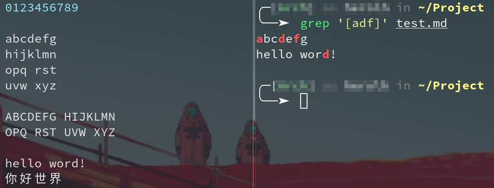
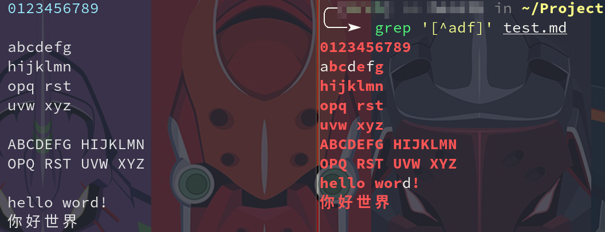
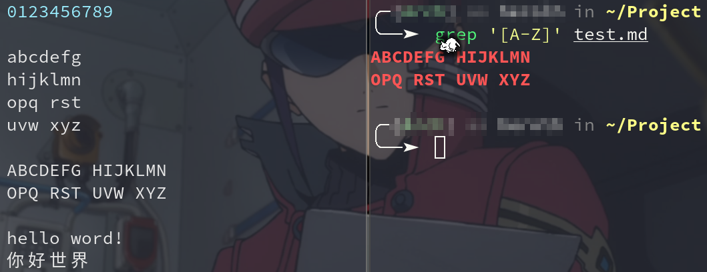

----------------------------------------------
> *Made By Herolh*
----------------------------------------------

# Linux 三剑客 grep、sed、awk {#index}

[TOC]


 


--------------------------------------------

## 文档版本

|    时间    | 修改人 | 内容     |
| :--------: | :----: | :------- |
| 2022-02-22 | Herolh | 文档创建 |
|            |        |          |


## 简介

| 命令 | 特点                     | 场景                                                         |
| ---- | ------------------------ | ------------------------------------------------------------ |
| grep | 过滤                     | grep 命令过滤速度是最快得                                    |
| sed  | 替换, 修改文件内容, 取行 | 修改/替换文件内容<br >取出某个范围的内容(从早上 10:00 到 11:00) |
| awk  | 取列, 统计计算           | 取列<br />对比, 比较 >= <= != <br >统计计算(awk 数组)        |


## 正则表达式

正则表达式(regular expression)描述了一种字符串匹配的模式（pattern），可以用来检查一个串是否含有某种子串、将匹配的子串替换或者从某个串中取出符合某个条件的子串等。

构造正则表达式的方法和**创建数学表达式**的方法一样。也就是用多种元字符与运算符可以将小的表达式结合在一起来创建更大的表达式。正则表达式的组件可以是单个的字符、字符集合、字符范围、字符间的选择或者所有这些组件的任意组合。


### 普通字符

普通字符包括没有显式指定为元字符的所有可打印和不可打印字符。这包括所有大写和小写字母、所有数字、所有标点符号和一些其他符号。

| 字符       | 描述                                                         |
| :--------- | :----------------------------------------------------------- |
| **[ABC]**  | 匹配 **[...]** 中的所有字符                                  |
| **[^ABC]** | 匹配除了 **[...]** 中字符的所有字符                          |
| **[A-Z]**  | [A-Z] 表示一个区间，匹配所有大写字母，[a-z] 表示所有小写字母。 |
| **.**      | 匹配除换行符（\n、\r）之外的任何单个字符，相等于 [^\n\r]。   |
| **[\s\S]** | 匹配所有。\s 是匹配所有空白符，包括换行，\S 非空白符，不包括换行。 |
| **\w**     | 匹配字母、数字、下划线。等价于 [A-Za-z0-9_]                  |

示例

```shell
grep '[adf]' test.md
```



```shell
grep '[^adf]' test.md
```



```shell
grep '[A-Z]' test.md
```




### 特殊字符

所谓特殊字符，就是一些有特殊含义的字符，许多元字符要求在试图匹配它们时特别对待。若要匹配这些特殊字符，必须首先使字符"转义"，即，将反斜杠字符**\** 放在它们前面。下表列出了正则表达式中的特殊字符：

| 特别字符 | 描述                                                         |
| :------- | :----------------------------------------------------------- |
| $        | 匹配输入字符串的结尾位置。如果设置了 RegExp 对象的 Multiline 属性，则 $ 也匹配 '\n' 或 '\r'。要匹配 $ 字符本身，请使用 \$。 |
| ( )      | 标记一个子表达式的开始和结束位置。子表达式可以获取供以后使用。要匹配这些字符，请使用 \( 和 \)。 |
| *        | 匹配前面的子表达式零次或多次。要匹配 * 字符，请使用 \*。     |
| +        | 匹配前面的子表达式一次或多次。要匹配 + 字符，请使用 \+。     |
| .        | 匹配除换行符 \n 之外的任何单字符。要匹配 . ，请使用 \. 。    |
| [        | 标记一个中括号表达式的开始。要匹配 [，请使用 \[。            |
| ?        | 匹配前面的子表达式零次或一次，或指明一个非贪婪限定符。要匹配 ? 字符，请使用 \?。 |
| \        | 将下一个字符标记为或特殊字符、或原义字符、或向后引用、或八进制转义符。例如， 'n' 匹配字符 'n'。'\n' 匹配换行符。序列 '\\' 匹配 "\"，而 '\(' 则匹配 "("。 |
| ^        | 匹配输入字符串的开始位置，除非在方括号表达式中使用，当该符号在方括号表达式中使用时，表示不接受该方括号表达式中的字符集合。要匹配 ^ 字符本身，请使用 \^。 |
| {        | 标记限定符表达式的开始。要匹配 {，请使用 \{。                |
| \|       | 指明两项之间的一个选择。要匹配 \|，请使用 \|。               |


### 限定符

限定符用来指定正则表达式的一个给定组件必须要出现多少次才能满足匹配。有 ***** 或 **+** 或 **?** 或 **{n}** 或 **{n,}** 或 **{n,m}** 共6种。

正则表达式的限定符有：

| 字符  | 描述                                                         |
| :---- | :----------------------------------------------------------- |
| *     | 匹配前面的子表达式零次或多次。例如，zo* 能匹配 "z" 以及 "zoo"。* 等价于{0,}。 |
| +     | 匹配前面的子表达式一次或多次。例如，'zo+' 能匹配 "zo" 以及 "zoo"，但不能匹配 "z"。+ 等价于 {1,}。 |
| ?     | 匹配前面的子表达式零次或一次。例如，"do(es)?" 可以匹配 "do" 、 "does" 中的 "does" 、 "doxy" 中的 "do" 。? 等价于 {0,1}。 |
| {n}   | n 是一个非负整数。匹配确定的 n 次。例如，'o{2}' 不能匹配 "Bob" 中的 'o'，但是能匹配 "food" 中的两个 o。 |
| {n,}  | n 是一个非负整数。至少匹配n 次。例如，'o{2,}' 不能匹配 "Bob" 中的 'o'，但能匹配 "foooood" 中的所有 o。'o{1,}' 等价于 'o+'。'o{0,}' 则等价于 'o*'。 |
| {n,m} | m 和 n 均为非负整数，其中n <= m。最少匹配 n 次且最多匹配 m 次。例如，"o{1,3}" 将匹配 "fooooood" 中的前三个 o。'o{0,1}' 等价于 'o?'。请注意在逗号和两个数之间不能有空格。 |


### 定位符

定位符使您能够将正则表达式固定到行首或行尾。它们还使您能够创建这样的正则表达式，这些正则表达式出现在一个单词内、在一个单词的开头或者一个单词的结尾。

定位符用来描述字符串或单词的边界，**^** 和 **$** 分别指字符串的开始与结束，**\b** 描述单词的前或后边界，**\B** 表示非单词边界。

正则表达式的定位符有：

| 字符 | 描述                                                         |
| :--- | :----------------------------------------------------------- |
| ^    | 匹配输入字符串开始的位置。如果设置了 RegExp 对象的 Multiline 属性，^ 还会与 \n 或 \r 之后的位置匹配。 |
| $    | 匹配输入字符串结尾的位置。如果设置了 RegExp 对象的 Multiline 属性，$ 还会与 \n 或 \r 之前的位置匹配。 |
| \b   | 匹配一个单词边界，即字与空格间的位置。                       |
| \B   | 非单词边界匹配。                                             |

**注意**：不能将限定符与定位符一起使用。由于在紧靠换行或者单词边界的前面或后面不能有一个以上位置，因此不允许诸如 **^\*** 之类的表达式。

若要匹配一行文本开始处的文本，请在正则表达式的开始使用 **^** 字符。不要将 **^** 的这种用法与中括号表达式内的用法混淆。

若要匹配一行文本的结束处的文本，请在正则表达式的结束处使用 **$** 字符。

若要在搜索章节标题时使用定位点，下面的正则表达式匹配一个章节标题，该标题只包含两个尾随数字，并且出现在行首：


## grep

| 参数选项 | 说明                                            |
| -------- | ----------------------------------------------- |
| `-E`     | 支持扩展正则                                    |
| `-A`     | After, `-A5` 匹配你要的内容显示接下来的 5 行    |
| `-B`     | Before, `-B5` 匹配你要的内容显示上面的 5 行     |
| `-C`     | Context, `-C5`  匹配你要的内容显示上下的各 5 行 |
| `-c`     | 统计出现林多少行 类似 `wc -l`                   |
| `-i`     | 忽略大小写                                      |
| `-w`     | 精确匹配                                        |
| `-n`     | 显示行号                                        |
| `-v`     | 反转匹配, 选择不匹配的行。                      |


## sed

> stream editor 流编辑器


### 语法

```shell
sed [-hnV][-e<script>][-f<script文件>][文本文件]
```

**参数说明**：

- -e<script> 或--expression=<script> 以选项中指定的script来处理输入的文本文件。
- -f<script文件>或--file=<script文件> 以选项中指定的script文件来处理输入的文本文件。
- -h 或--help 显示帮助。
- -n或--quiet 或--silent 仅显示script处理后的结果。
- -V 或--version 显示版本信息。


**动作说明**：

- a ：新增， a 的后面可以接字串，而这些字串会在新的一行出现(目前的下一行)～
- c ：取代， c 的后面可以接字串，这些字串可以取代 n1,n2 之间的行！
- d ：删除，因为是删除啊，所以 d 后面通常不接任何东东；
- i ：插入， i 的后面可以接字串，而这些字串会在新的一行出现(目前的上一行)；
- p ：打印，亦即将某个选择的数据印出。通常 p 会与参数 sed -n 一起运行～
- s ：取代，可以直接进行取代的工作哩！通常这个 s 的动作可以搭配正规表示法！例如 1,20s/old/new/g 就是啦！