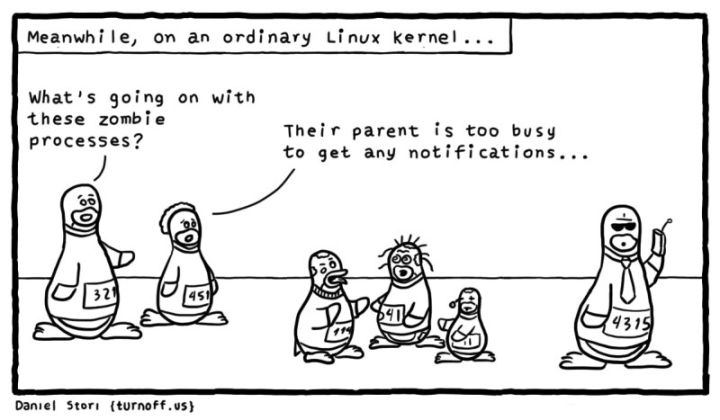
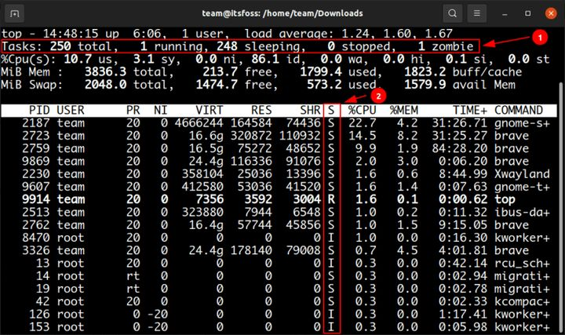

----------------------------------------------
> *Made By Herolh*
----------------------------------------------

# 如何找到并杀掉 Linux 系统中的僵尸进程 {#index}

[TOC]


 


--------------------------------------------

## 文档版本

|    时间    | 修改人 | 内容     |
| :--------: | :----: | :------- |
| 2021-10-25 | Herolh | 文档创建 |
|            |        |          |


## 简介

[知乎 - Linux 中国 - 如何找到并杀掉 Linux 系统中的僵尸进程](https://zhuanlan.zhihu.com/p/425381927)

> 这是一个关于如何寻找 Linux 系统僵尸进程并杀死它们的小知识。你也可以从中了解到关于进程和僵尸进程的一些知识。


## 背景知识
&emsp;&emsp;在了解僵尸进程之前，让我们来复习一下什么是 Linux 进程。
&emsp;&emsp;简而言之，[进程](https://link.zhihu.com/?target=https%3A//tldp.org/LDP/tlk/kernel/processes.html) 是一个程序的运行实例。它可能运行在前端( 比如有交互的进程 )，也可能运行在后端( 比如无交互或自动运行的进程 )。它可能是一个父进程( 运行期间创建了其他进程 )，也可能是一个子进程( 由其他进程所创建 )。
&emsp;&emsp;==在 Linux 系统中，除 PID 为 0 的第一个 `init` 进程( 或 `systemd` )外，其余进程都有父进程==。进程也可以拥有自己的子进程。不相信？可以试试在终端中使用 `pstree` 命令查看进程的树型结构，你能看到系统各个进程的“家族树”。

```shell
pstree
```


## 僵尸进程

### Linux系统里的僵尸进程是什么？

&emsp;&emsp;子进程死亡后，它的父进程会接收到通知去执行一些清理操作，如释放内存之类。然而，若父进程并未察觉到子进程死亡，子进程就会进入到“ *僵尸(zombie)*”状态。从父进程角度看，子进程仍然存在，即使子进程实际上已经死亡。这就是“ *僵尸进程(zombie process)*”( 也被称为“ *已消失进程(defunct process)*” )是如何产生并存在于系统中的。这里有一个来自 [Turnoff.us](https://link.zhihu.com/?target=https%3A//turnoff.us/geek/zombie-processes/) 的关于僵尸进程的非常有趣的看法：




### 你真的需要关心僵尸进程吗？
&emsp;&emsp;重点要说的是，僵尸进程并没有像它的名称那样看起来可怕。
&emsp;&emsp;但如果系统的内存已经所剩不多或者有太多的僵尸进程在吃掉内存，问题会变得糟糕。同样，==大部分 Linux 系统进程最大 PID 设置为 32768，如果过多僵尸进程导致其他重要任务没有 PID 可用，你的系统会发生崩溃。==
这是真实可能发生的，它有一定的概率，特别当存在一个编码糟糕的程序开始大量产生僵尸进程的时候。
在这种情况下，找到并杀死僵尸进程是一个明智的做法。


### 如何找到僵尸进程

Linux 系统中的进程可能处于如下状态中的一种：

| 状态 | 说明           |
| :--: | -------------- |
|  D   | 不可中断的休眠 |
|  I   | 空闲           |
|  R   | 运行中         |
|  S   | 休眠           |
|  T   | 被调度信号终止 |
|  t   | 被调试器终止   |
|  Z   | 僵尸状态       |

那如何查看进程和它的当前状态呢？一个简单的方法是在终端中使用 [top 命令](https://link.zhihu.com/?target=https%3A//linuxhandbook.com/top-command/)。



&emsp;&emsp;正如你在上面截图中看到的，截图中共有 250 个任务( 进程 )，其中 1 个处在 “ *运行中(running)*” 状态，248 个进程处于 “ *休眠(sleep)*” 状态，还有一个处于 “ *僵尸(zombie)*” 状态。现在问题进入下一步，如何杀死 “僵尸” 进程？


### 如何找到并杀死一个僵尸进程？
&emsp;&emsp;僵尸进程已经死了，要如何才能杀死一个已经死亡的进程呢？
&emsp;&emsp;在僵尸电影中，你可以射击僵尸的头部或烧掉它们，但在这里是行不通的。你可以一把火烧了系统来杀死僵尸进程，但这并不是一个可行的方案。一些人建议发送 `SIGCHLD` 给父进程，但这个信号很可能会被忽略。还有一个方法是杀死父进程来杀死僵尸进程，这听起来很野蛮，但它却是唯一能确保杀死僵尸进程的方法。

- 通过在终端中 [使用 ps 命令](https://link.zhihu.com/?target=https%3A//linuxhandbook.com/ps-command/) 我们列举僵尸进程，得到它们的进程 ID：

    ```shell
    ps ux | awk '{if($8=="Z+") print}'
    ```

    `ps ux` 命令输出的第 8 列显示了进程状态。上述命令只会打印所有处在 Z+ 状态( 表示僵尸状态 )的进程。

- 确认了进程 ID 后，我们可以得到它的父进程 ID：

    ```shell
    ps -o ppid= -p <child_id>
    ```

    你也可以将上述两个命令结合在一起，直接得到僵尸进程的 PID 及其父进程的 PID：

    ```shell
    ps -A -ostat,pid,ppid | grep -e '[zZ]'
    ```

- 现在你得到了父进程 ID，使用命令行和得到的 ID 号 [终于可以杀死进程了](https://link.zhihu.com/?target=https%3A//itsfoss.com/how-to-find-the-process-id-of-a-program-and-kill-it-quick-tip/)：

    ```shell
    kill -9 <parent_process_ID>
    ```

    

- 再次运行 `ps` 命令或 `top` 命令，你可以验证僵尸进程是否已经被杀死。


