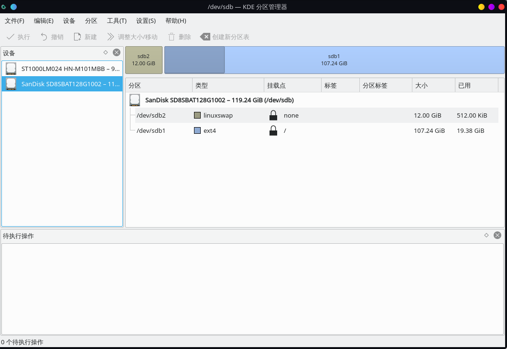
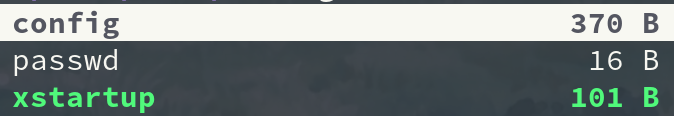
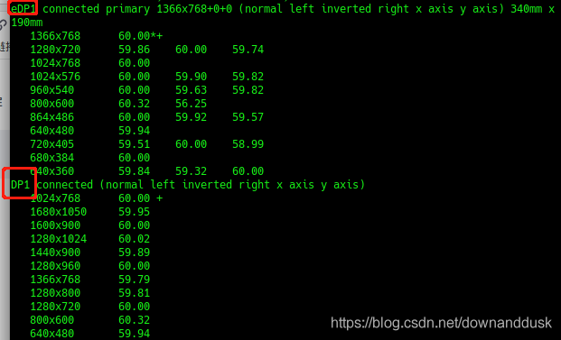

----------------------------------------------
> *Made By Herolh*
----------------------------------------------

# 目录 {#index}

[TOC]


--------------------------------------------

# 前期准备

```shell
wait...
```


# 正式安装

## 调整并选择字体

```shell
setfont /usr/share/kbd/consolefonts/LatGrkCyr-12x22.psfu.gz
```


## 更改键盘锁定:

```shell
vim keymap.conf
# 写入以下内容
keycode 1 = Caps_Lock
keycode 58 = Escape

 # 1 代表键盘上的 Escape
 # 58 代表键盘上的 Caps_Lock
```

```shell
loadkeys keymap.conf
```


## *联网

> 直连网线的可以跳过

```shell
 # 查看网络设备
ip link

 # 启用 wifi 设备
ip link set wlan0 up

 # 扫描 wifi 名称
 # iwlist wlan0 scan
iwlist wlan0 scan | grep ESSID

 # wifi-menu 不支持很多企业级的协议，后面的 arch 版本取消了
wpa_passphrase 网络名ESSID 密码 > internet.conf
vim internet.conf

 ###### 内容
network={
	ssid="网络名ESSID"
	pwk="密码"
}
 ###### 内容

wpa_supplicant -c internet.conf -i wlan0 &

 # 动态分配ip地址
dhcpcd &
```


## 同步时间

```shell
timedatectl set-ntp true
```


## *硬盘分区

### 查看硬盘设备

```shell
 # 查看硬盘设备
fdisk -l

 # 进入硬盘
fdisk /dev/sda
```


### 硬盘分区

```shell
 # 查看硬盘设备
fdisk -l

 # 进入硬盘
fdisk /dev/sda

 # m for help
 # p to print info
g
```


#### 创建系统分区

> 如果如果已经有一个系统(双系统)，该步骤可省略

```shell
 # (这一步要根据官方文档来， UEFI 和 EMAR 是不一样的)
 # 创建系统分区
n
1

+512M
Y
```


#### 创建缓存分区

```shell
 # 创建缓存分区
n
3

+8G
Y
```


#### 创建主分区

```shell
 # 创建主分区
n
2


Y
```


#### 修改分区格式

```shell
 # 修改分区格式
t
1
l						# 找到EFI System 的序号，此处为1
1

t
3
l						# 找到linux swap 的序号， 此处为19
19

 # 写入
w
```


### 格式化分区

```shell
 # 修改系统分区格式(必须是fat格式)
mkfs.fat -F 32 /dev/sda1

 # 修改主分区格式
mkfs.ext4 /dev/sda2

 # 制作缓存分区并打开
mkswap /dev/sda3
swapon /dev/sda3
```


## *配置 pacman 配置文件

```shell
vim /etc/pacman.conf

Color
ILoveCandy				# 下载变成吃豆人
```

```shell
vim /etc/pacman.d/mirrorlist

 # 将所有的中国源移到顶部
```


## *挂载硬盘

```shell
 # 挂载主分区到 /mnt 目录下
mount /dev/sda2 /mnt

 # 挂载系统分区
mkdir /mnt/boot
mount /dev/sda1 /mnt/boot
```


## *正式安装系统

```shell
pacstrap /mnt base linux linux-firmware base-devel NetworkManager vim git intel-ucode
 # base : linux 基础软件
 # linux : linux 内核
 # linux-firmware： linux 框架
 # base-devel:
 
 # 写入应用程序
genfstab -U /mnt >> /mnt/etc/fstab
```


## *设置安装好的系统

进入安装好的程序

```shell
arch-chroot /mnt
```

设置时区

```shell
ln -sf /usr/share/zoneinfo/Asia/Shanghai /etc/localtime
 # 同步系统时间
hwclock --systohc

exit
```

设置系统语言

```shell
vim /mnt/etc/locale.gen

 # 找到 en_US.UTF-8 和 zh_CN.UTF-8 取消注释
arch-chroot /mnt
locale-gen

# 设置语言 
vim /etc/locale.conf
#### 内容
LANG=en_US.UTF-8

```

设置系统键盘映射

```shell
vim /etc/vconsole.conf
#### 内容
keycode 1 = Caps_Lock
keycode 58 = Escape
```

设置主机名映射

```shell
vim /etc/hostname
#### 内容
主机名
```

设置主机本地IP名称

```shell
vim /etc/hosts

127.0.0.1	localhost
::1			localhost
127.0.1.1 	主机名.localdomain		主机名
```

修改root密码

```shell
passwd
```


## *引导管理

```shell
bootctl install

cd /boot/loader
vim loader.conf
 # 修改内容如下
timeout 5


cd entries
vim Arch.conf
 # 写入
title	Arch linux
linux	/vmlinuz-linux
initrd	/intel-ucode.img
initrd	/initramfs-linux.img
options	root="PARTUUID=xxxxxxx"	rw

 # PARTUUID 获得方法：
 # :r! blkid

```


## *解除挂载

```shell
umount -R mnt

reboot
```


# 系统设置

## 设置默认应用

设置默认编辑器为 vim

```shell
ln -s /usr/bin/vim /usr/bin/vi
```


## 新增用户

```shell
Useradd -m -G wheel admin
passwd admin
visudo
# 将以下注释去掉
```


## 安装图形化界面

### deepin 桌面

```shell
# 安装deepin 前必须要先有一个除root外的用户
# deepin
pacman -S xorg sddm
pacman -S deepin deepin-extra
pacman -Qs lightdm
vim /etc/lightdm/lightdm.conf
# 追加以下内容
greeter-session=lightdm-deepin-greeter
# 追加以上内容

sudo systemctl enable lightdm
sudo systemctl start lightdm
```

> 安装完浏览器，出现未知错误时直接浏览器弹出官网广告，不能忍！


### DWM 桌面

#### 安装

- 安装图形化桌面资源

    ```shell
    sudo pacman -S xorg xorg-server xorg-apps xorg-xinit
    ```

- 下载源码

    ```shell
    git clone git://git.suckless.org/dwm --depth=1
    git clone git://git.suckless.org/dmenu --depth=1
    git clone git://git.suckless.org/st --depth=1
    ```

- 安装

    ```shell
    cd dwm
    make
    sudo make clean install
    
    cd ..
    cd dmenu
    make
    sudo make clean install
    
    cd ..
    cd st
    make
    sudo make clean install
    ```

- 修改启动桌面为 dwm

    ```shell
    vim ~/.xinitrc
    
    exec dwm
    ```

- 启动 dwm

    ```shell
    startx
    ```


#### 配置

> 单独文章讲


### 安装 KDE 桌面

> [Arch Linux 2020-07 安装kde桌面环境](https://www.jianshu.com/p/5e7726d1cb16)
>
> [Arch Linux 2020-11 优化](https://www.jianshu.com/p/ba44a22f2e38)

```shell
# 全套
sudo pacman -S plasma kde-applications

# 最小
sudo pacman -S plasma plasma-desktop
```


#### 下拉終端 yakuake

```shell
sudo pacman -S yakuake
```


#### KDE CONNECT

```shell
sudo pacman -S kdeconnect
```


#### latte dock

```shell
sudo pacman -S latte-dock
```


## 安装网络链接系统托盘

> [官方 wiki](https://wiki.archlinux.org/index.php/NetworkManager_(%E7%AE%80%E4%BD%93%E4%B8%AD%E6%96%87))

```shell
sudo pacman -S network-manager-applet
```

添加到开机脚本

```shell
# 网络链接系统托盘
LANG=zh_CN.utf-8 nohup nm-applet </dev/null &>/dev/null &
```

vpn 支持

```shell
sudo pacman -S networkmanager-openvpn
```


## 安装图形化分区管理器

```shell
sudo pacman -S partitionmanager
```




## 安装蓝牙驱动

```shell
sudo pacman -S bluez bluez-utils
sudo systemctl enable bluetooth
sudo systemctl start bluetooth

 # 开启蓝牙扫描连接
 bluetoothctl
 power on
 agent on
 default-agent
 scan on
 pair 蓝牙MAC地址
 trust 蓝牙 MAC 地址
 connect 蓝牙 MAC 地址
 
 scan off
```

### 开机后自动启动

&emsp;&emsp;蓝牙在重启后默认不会自动启动。命令 `hciconfig hci0 up` 已经被弃用，参阅 [release note](http://www.bluez.org/release-of-bluez-5-35/)。你只需要将 `AutoEnable=true` 添加在 `/etc/bluetooth/main.conf` 底部的 `[Policy]` 下面：

```
/etc/bluetooth/main.conf
[Policy]
AutoEnable=true
```


## 安装声音驱动

```shell
pacman -Sy alsa-lib alsa-utils

pacman -S alsa-utils 
 # 安装 alsa-tray 从托盘控制音量大小
yay -S alsa-tray
" 加入开机脚本脚本
LANG=zh_CN.utf-8 alsa-tray &

# 接触静音
amixer sset Master unmute 
amixer
# 也可以使用 pulseaudio 控制音量
pacman -S pulseaudio pavucontrol 
systemctl --user start pulseaudio
systemctl --user enable pulseaudio
```

[ArchLinux下Alsa的简单配置](https://blog.csdn.net/xiaoyi239/article/details/83123904)


## 安装显卡驱动

> [[Arch双显卡方案](https://mrhuanhao.cn/2020/04/05/arch-newsil/)](https://mrhuanhao.cn/2020/04/05/arch-newsil/)

&emsp;&emsp;&emsp;&emsp;如果只安装闭源驱动，当然可以，但是要知道，耗电速度可能远远超过你的持久现在我给你介绍[NVIDIA Optimus](https://wiki.archlinux.org/index.php/NVIDIA_Optimus)这一个在arch下最好的最简单的双显卡方案。它和ubuntu下的PRIME类似，通过在显卡管理器中更改配置文件来使用核显或独显。我们只需要安装两个包:

```shell
pacman -S nvidia bbswitch    

yay -S optimus-manager-qt
# 托盘程序
#如果配置有archlinuxcn源，也可以使用pacman来安装
#如果使用KDE桌面，需安装optimus-manager-qt-kde
```

&emsp;&emsp;注意: 安装英伟达闭源驱动时，如果使用自定义内核，或者不想驱动崩掉，那就安装`nvidia-dkms`，`bbswitch`也是同理，安装`bbswitch-dkms`:

```shell
pacman -S nvidia-dkms bbswitch-dkms
```

安装`optimus-manager-qt`时，kde桌面需要在后面加上`-kde`

```shell
yay -S optimus-manager-qt
```

重启。此时你可以在托盘看见英伟达的图片，`右键-设置`在项`optimus`中，把`switching method`改为`Bbswitch`然后确定即可。使用：

```shell
 # 直接右键，有三个选项

switch to intel
switch to Nvidia
switch to Hybrid（无需理会）
```


## TLP 为电池节能

&emsp;&emsp;**TLP** 提供优秀的 Linux 高级电源管理功能,不需要您了解所有技术细节。默认配置已经对电池使用时间进行了优化，只要安装即可享受更长的使用时间。除此之外，TLP 也是高度可配置的，可以满足您的各种特定需求

```shell
sudo pacman -S tlp
sudo systemctl enable tlp.service tlp-sleep.service
sudo tlp start
```

[archwiki]([https://wiki.archlinux.org/index.php?title=TLP_(%E7%AE%80%E4%BD%93%E4%B8%AD%E6%96%87)&printable=yes](https://wiki.archlinux.org/index.php?title=TLP_(简体中文)&printable=yes))


## SSH 远程链接

```shell
sudo pacman -S opensshd
```

```shell
 # Archlinux开启ssh服务命令：
systemctl enable sshd.service  开机启动
systemctl start sshd.service     立即启动
systemctl restart sshd.service   立即重启
```


## VNC 远程桌面

- **安装**

    ```shell
    sudo pacman -S tigervnc
    ```

- **配置**

    ```shell
     # vncserver命令用于第一次设置密码。问答式的，然后到.vnc下面。介绍几个配置文件。–和配置服务器一样的。
    vncserver
    
    cd ~/.vnc
    ```

    

    ```shell
     # config
    ## Supported server options to pass to vncserver upon invocation can be listed
    ## in this file. See the following manpages for more: vncserver(1) Xvnc(1).
    ## Several common ones are shown below. Uncomment and modify to your liking.
    ##
    #securitytypes=vncauth,tlsvnc
    securitytypes=tlsvnc
    desktop=sandbox
    geometry=1920x1080
    #geometry=1440x900
    dpi=96
    localhost
    alwaysshared
    ```

    config就是调分辨率，连接方式，连接参数的，照着我的填就ok了。然后 `cp xstartup xstartup.bak` 备份一下。直接放我的xstartup文件内容:

    ```shell
    #!/bin/sh
    unset SESSION_MANAGER
    unset DBUS_SESSION_BUS_ADDRESS
    export XKL_XMODMAP_DISABLE=1
    exec dwm
    ```

    解释一下，我用的是窗口管理器 dwm。因此我最后一行填 `exec dwm`。那么你用的其他桌面环境就填对应的就ok了。然后 `export XKL_XMODMAP_DISABLE=1` 是为了解决一些VNC传递过程中可能出现的按键错乱的问题。然后编写启动arch上vnc服务的脚本。

- **编写启动arch上vnc服务的脚本**

    ```shell
    vim vnc.sh
     # 内容
    x0vncserver  -display :0 -passwordfile ~/.vnc/passwd &
     # 内容
    
    chmod u+x vnc.sh
    ./vnc.sh
    ```

    然后就可以在windows上的客户端访问了。输入arch的`ip:5900`就可以访问了。全屏，就和用arch一样了。

- **不使用 VNC**

    注意，不用的时候可以运行这个脚本:

    ```shell
    #!/usr/bin/env bash
    killall x0vncserver
    ```


## 双屏显示

> [Archlinux配置双屏显示](https://blog.csdn.net/ggshiney/article/details/8188755)

### 安装驱动

```shell
wait
```

### 配置双屏

如果需要扩展显示桌面，还需要进行一番配置。`randr`(X Resize, Rotate and Reflect Extension)可以控制桌面的显示输出效果，如镜像、旋转等。`xrandr`是`randr`的命令行接口。首先查看当前显示状态，列出X显示设备：

```shell
xrandr -q
```

记住你屏幕上红框圈住地方对应位置的英文即可，这时每个显示屏的代号，这里eDP1是我的电脑主屏幕，DP1是副屏幕。

```shell
xrandr --output DP1 --auto --output eDP1 --auto --right-of DP1
```



设置电脑屏幕为主屏幕（**注意大小写**）

```shell
xrandr --output eDP1 --auto --primary
```

设置副屏幕显示，此时两个屏幕是同步的

```shell
xrandr --output DP1 --auto
```

把副屏幕设置到主屏幕左边，如果想改成右边，则将left改为right

```shell
xrandr --output DP1 --left-of eDP1
```

此时副屏幕设置成功。如果需要关闭屏幕则：

```shell
关闭副屏幕
```


## 亮度调节

我们知道调整屏幕亮度在硬件层面就是调整 LED 灯的功率大小，在 linux 里面通过 acpi（高级配置与电源接口）来控制，具体是通过设置 `/sys/class/backlight/%k/brightness` 来实现的，当然手动调节这个文件的数值是可行的，但是并不是很方便。所以安装 ACPI 的亮度控制取代 xbacklight 的功能：

```shell
sudo pacman -S acpilight

# 将当前用户加入 video 组，实现免 root 控制亮度：
sudo gpasswd video -a 用户名
```

acpilight 兼容 xbacklight 重启之后就可以通过下面命令控制亮度了：

```shell
# 获得当前亮度
xbacklight -get
# 设置亮度
xbacklight -set 70
# 增加亮度
xbacklight -inc 10
# 降低亮度
xbacklight -dec 10
```


### 遇到问题

[设置屏幕亮度：xbacklight 在 HDMI 上不起作用，xrandr - 亮度不固定](https://qastack.cn/unix/297935/set-the-screen-brightness-xbacklight-does-not-work-on-hdmi-xrandr-brightness)

```shell
xrandr --output DP-0 --brightness 0.5
xrandr --output HMDI-0 --brightness 0.5
```


## 解决 arch 下挂载 ntfs 格式硬盘
> [manjaro挂载NTFS系统的方法](https://www.cnblogs.com/suge-0620/p/13587224.html)
> [解决arch下挂载ntfs格式硬盘](https://my.oschina.net/chliny/blog/70478)

为了实现读写ntfs文件系统的功能，我们采用ntfs-3g方案。

```shell
sudo pacman -S ntfs-3g
```

重启后就可以在 windows 盘中新建文件了，虽然我也不知道为什么。也就是说你已经可以写盘了。但是要做到开机即能检测到盘，我们还是将它挂载。我们查看下哪个分区是NTFS分区。

```shell
sudo fdisk -l
```

知道哪个是 NTFS分区 后,我们来编辑 `/etc/fstab`, 实现自动挂载.加入类似如下的内容:(只是一个例子)

```shell
/dev/sda1  /mnt/windows  ntfs-3g  users,noauto,uid=1000,gid=100,fmask=0113,dmask=0002,locale=zh_CN.utf8  0 0

 
/dev/sda6  /mnt/backup   ntfs-3g  users,uid=1000,gid=100,fmask=0113,dmask=0002,locale=zh_CN.utf8         0 0

 #/mnt是根目录下路径，是你的NTFS文件系统的挂载点。windows或者backup都是名字，可以随便取。
```

写入代码的特点为:

1. 可以让任何用户挂载和卸载你的NTFS分区。
2. `user(uid=1000)` 和 `group(gid=100)` 拥有分区的所有文件，并且对文件有 `-rw-rw-r-- (0664)` 权限，对目录有 `drwxrwxr-x (1775)` 权限。
3. 使用 `zh_CN.utf8` 作为 `locale`
4. `/dev/sda6` 在启动时自动挂载，`/dev/sda1` 则不会


## 添加中文社区仓库

> [Arch Linux 中文社区仓库](https://www.ituring.com.cn/article/215935)

使用方法：在 `/etc/pacman.conf`文件末尾添加以下内容：

```shell
[archlinuxcn]
Server = https://mirrors.zju.edu.cn/archlinuxcn/$arch
 # Server = https://cdn.repo.archlinuxcn.org/$arch
```

然后：

```shell
$ sudo pacman -Syy
$ sudo pacman -Syu
$ sudo pacman -S archlinuxcn-keyring
$ sudo pacman -S archlinuxcn-mirrorlist-git
```


# 系统清理

```shell
sudo pacman -R $(pacman -Qdtq)          #清理系统中无用的依赖包
sudo pacman -Scc            			#清理缓存，看路径像是之前下载的安装包

" 日志清洗
sudo journalctl --disk-usage                #查看日志大小
sudo journalctl --vacuum-time=5d                  #超过5天的自动删除
sudo journalctl --vacuum-size=500M                #超过500M的自动删除
sudo rm /var/lib/systemd/coredump/*             #崩溃日志，文件不多，也不大，删不删随你
```

清理/ home目录中的缓存。在这一步中，我将向您展示如何通过删除/ home / user文件夹中的缓存文件来清理Arch Linux。在使用我们的系统时，缓存将填满并占用大量空间。 因此，您可能要做的第一件事是清除用户目录中的缓存。 如果要检查缓存文件夹的大小，可以使用以下命令。

```shell
du -sh ~/.cache


```


# 遇到问题

## Linux+Windows双系统Windows时间不对

> https://jingyan.baidu.com/article/1974b289307564f4b1f774f7.html

### 问题情况

&emsp;&emsp;很多人装了Linux+Windows双系统后发现Windows时间不对，这是因为，两个操作系统对电脑硬件时间的定义不一样，Windows 认为电脑硬件时间是“本地时间”，因此它启动后直接用该时间作为“系统时间”并显示在桌面右下角的系统托盘里；而 Ubuntu 等 Linux 发行版则认为电脑硬件时间是“全球统一时间”（即 UTC，可百度了解），它在启动后在该时间的基础上，再加上电脑设置的时区数（比如我们在中国，它就加上“8”）。两种模式各有利弊，但是后一种模式在遇到时区转换、夏令时等情况时，通用性更强，基于上述原因，协调 Win/Lin 双系统时间一致的方法，就是让 Windows 也和 Linux 一样，将电脑硬件时间看作“全球统一时间”。


### 解决方法

- 进入Windows，按Win键+R，启动运行，输入“regedit”启动注册表

1. 依次进入以下路径：计算机\HKEY_LOCAL_MACHINE\SYSTEM\CurrentControlSet\Control\TimeZoneInformation 可以直接粘贴进上方路径
2. 新建一个QWORD值，如果电脑是32位系统，则新建DWORD值，重命名为“RealTimeIsUniversal”
3. 双击编辑，将数值数据改为1，基数是16进制
4. 重启电脑，时间正常了ra
5. ra
6. 