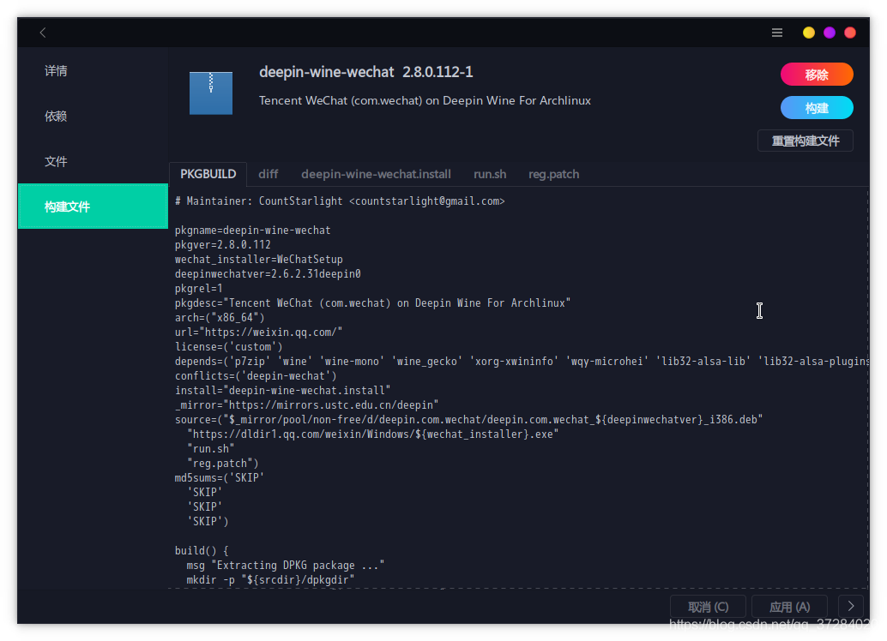

----------------------------------------------
> *Made By Herolh*
----------------------------------------------

# 遇见问题 {#index}

[TOC]


 


--------------------------------------------

## 文档版本

|    时间    | /修改人 | 内容     |
| :--------: | :-----: | :------- |
| 2021-06-15 | Herolh  | 文档创建 |
|            |         |          |


## 一个或多个文件没有通过有效性检查! 

> [aur报错（错误：一个或多个文件没有通过有效性检查）](https://blog.csdn.net/qq_37284020/article/details/103991649)

当我们从aur里安装软件时，有时会出现这种报错（如安装deepin-wine-wechat）

```shell
==> 错误： 一个或多个文件没有通过有效性检查！
Error downloading sources: deepin-wine-wechat
```

&emsp;&emsp;我们从 yay 或者 pacman 等 aur 助手里安装某个软件常常会因为签名检查验证无法通过而安装失败，这种情况也常常出现，尤其是 deepin-wine-wechat 以及 deepin-wine-tim，很有可能因为官方的客户端升级了，不是之前的那个版本，验证就无法通过。出现了这种情况，要么我们跳过验证进行安装，要么就不用他。


### 解决方法

#### 编辑 PKGBUILD 文件

- 法一：可以用 pamac 里搜索对应的 aur 软件进入软件详情界面，点击构建文件，直接修改， 点击构建就能够成功了。

- 法一：进入安装软件包的 yay 缓存目录, 手动修改

    ```shell
    cd ~/.cache/yay/deepin-wine-tim/
    vim PKGBUILD
    ```


#### 修改验证码为跳过

- 找到对应的验证部分，把里面的验证的码修改为 SKIP，SKIP一定要是大写（md5sums sha1sums sha256sums sha224sums, sha384sums, sha512sums b2sums）

```shell
md5sums=(
	'68b329da9893e34099c7d8ad5cb9c940',
	'68b329da9893e34099c7d8ad5cb9c940'
)

# 修改为=> 
md5sums=(
	'SKIP',
	'SKIP'
)
```




#### 构建软件包并安装

保存 PKGBUILD 后，运行 `makepkg`，生成安装包：

```shell
makepkg
```

生成好的安装包位于当前目录。可以直接安装：

```shell
sudo pacman -U xxxxx.pkg.tar.zst
```

