----------------------------------------------
> *Made By Herolh*
----------------------------------------------

# 推荐安装应用 {#index}

[TOC]


--------------------------------------------

## 必备工具

### Pacman 包管理

```shell
# 安装软件包
sudo pacman -S package_name     
# 升级系统 yy标记强制刷新 u标记升级动作
sudo pacman -Syyu              
sudo pacman -R package_name     # 删除软件包
sudo pacman -Rs package_name    # 删除软件包，及其所有没有被其他已安装软件包使用的依赖包
# 找出孤立包 Q为查询本地软件包数据库 d标记依赖包 t标记不需要的包 dt合并标记孤立包
sudo pacman -Qdt                
sudo pacman -Rs $(pacman -Qtdq) # 删除孤立软件包
sudo pacman -Fy                 # 更新命令查询文件列表数据库
sudo pacman -F xxx              # 当不知道某个命令属于哪个包时，用来查询某个xxx命令属于哪个包
```

一个好用的图形化包管理软件

```shell
#包管理器前端界面
yay -S octopi
```


### yay

```shell
pacman -S --needed git
git clone https://aur.archlinux.org/yay.git
cd yay
makepkg -si
```


### man

```shell
sudo pacman -S man
```

```shell
" 使用
LANG=zh_CN.UTF8 man mplayer
```


### neofetch

```shell
sudo pacman -S neofetch
```

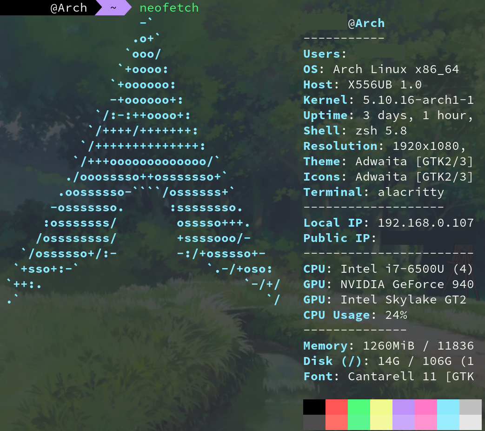

#### 配置

> neofetch的配置文件，路径在~/.config/neofetch/

```shell
# See this wiki page for more info:
# https://github.com/dylanaraps/neofetch/wiki/Customizing-Info
print_info() {
    # info title 			# 包含主机名和登录名，只有我自己用，也不需要，注释掉
    info underline

    info "OS" distro
    info "Host" model
    info "Kernel" kernel
    info "Uptime" uptime
    # info "Packages" packages # 查找所有包的数量，耗时间也没啥用，注释掉
    info "Shell" shell
    info "Resolution" resolution
    info "DE" de
    info "WM" wm
    info "WM Theme" wm_theme
    info "Theme" theme
    info "Icons" icons
    info "Terminal" term
    info "Terminal Font" term_font
    info "CPU" cpu
    info "GPU" gpu
    info "Memory" memory

    # info "GPU Driver" gpu_driver  # Linux/macOS only
    info "CPU Usage" cpu_usage 		# CPU使用情况
    info "Disk" disk  				# 磁盘使用情况
    # info "Battery" battery
    # info "Font" font
    # info "Song" song
    # [[ "$player" ]] && prin "Music Player" "$player"
    # info "Local IP" local_ip
    # info "Public IP" public_ip
    # info "Users" users
    # info "Locale" locale  # This only works on glibc systems.
    # info cols
}

# 在第644行左右，配置image_source为自定义的ascii图形文件的位置
image_source="/root/.config/neofetch/ascii-name"
```

生成ascii文字，可用网站:http://www.network-science.de/ascii/，有很多的字体可以选择。


### alacritty 终端模拟器

```shell
sudo pacman -S alacritty

 # 生成配置文件
cd ~/.config
mkdir alacritty
cp /usr/share/doc/alacritty/example/alacritty.yml ~/.config/alacritty
cd ~/.config/alacritty
chmod -R 664 alacritty.yml
```


### noto 字体

```shell
sudo pacman -S noto-fonts-cjk
 # 查看字体
fc-match -a | grep "SC"
```


### google 浏览器

```shell
yay -S google-chrome
```


### 壁纸管理

#### nitrogen

> 没仔细研究，不知道可不可以随机壁纸

```shell
sudo pacman -S nitrogen

vi ~/.xinitrc
nirtogen --restore
```


#### feh

> bash 脚本定时随机抽取当脚本

```shell
sudo pacman -S feh
```

```shell
feh --recursive --randomize --bg-fill ~/github/theniceboy/wallpapers/ghibili
```


### picom 终端美化

```shell
sudo pacman -S picom
vi ~/.xinitrc
picom -b
```


### net-tools

> 包含 nestat

```shell
sudo pacman -S net-tools
```


### 资源进程管理器

top 命令的升级版

```shell
sudo pacman -Sy htop
```

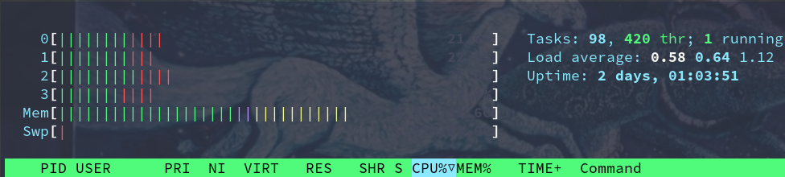


### 文件管理器

#### ranger 终端文件管理

> 专门文章介绍

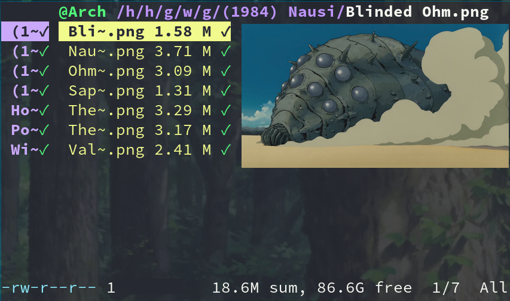


#### pcmanfm

```shell
sudo pacman -S pcmanfm
```

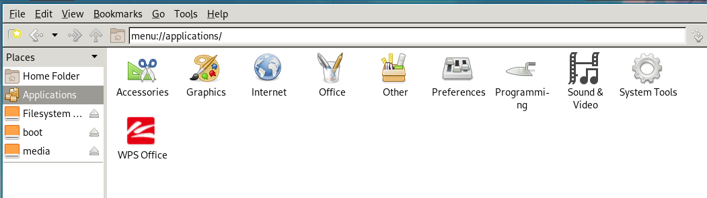


#### dolphin

```shell
sudo pacman -S dolphin
```

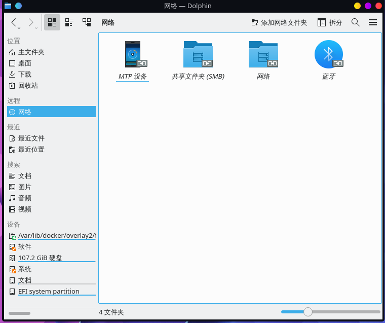

如果不是 KDE 桌面，在Dolphin上未显示图标，并且控制台上出现类似于“ Pixmap is null Pixmap”的错误，请尝试将此行放入您的 `/etc/profile`:

```shell
export QT_QPA_PLATFORMTHEME="qt5ct"
```

如果图标仍然无法显示，并且出现相同的错误“ Pixmap是空Pixmap”，请运行 `qt5ct`，查看“图标主题”选项卡。选择一个图标主题并应用。

```shell
sudo pacman -S qt5ct
```


## 输入法工具

###  安装字体和Emoji

#### Emoji

```shell
yay -S ttf-linux-libertine ttf-inconsolata ttf-joypixels ttf-twemoji-color noto-fonts-emoji ttf-liberation ttf-droid
```


#### 中文

```shell
yay -S wqy-bitmapfont wqy-microhei wqy-microhei-lite wqy-zenhei adobe-source-han-mono-cn-fonts adobe-source-han-sans-cn-fonts adobe-source-han-serif-cn-fonts
```


### googlepinyin 输入法

```shell
sudo pacman -S fcitx fcitx-im fcitx-googlepinyin fcitx-configtool

 # 配置环境变量
vi ~/.xinitrc
export GTK_IM_MODULE=fcitx
export QT_IM_MODULE=fcitx
export XMODIFIERS=@im=fcitx

fcitx &


fcitx-configtool
```

如果通过sddm 等启动的要去 `etc/environment` 下添加内容：

```shell
GTK_IM_MODULE=fcitx
QT_IM_MODULE=fcitx
XMODIFIERS=@im=fcitx
```


### RIME：中州韵输入法

> https://blog.csdn.net/qq_42204675/article/details/86422450
> 传说中的神级输入法（正在试用中）

```shell
sudo pacman -S fcitx-rime
```

rime 默认是繁体。随意输入一段文字，按住 *Ctrl + `*, 选择第 4 个 简化字。

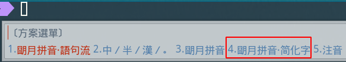


#### 添加词库

https://github.com/Chernfalin/better-rime-dict

下载后直接复制到 `.config/fcitx/rime/`下面即可。然后 fcitx 重新部署 rime.安装这个后会修改原来的配置文件所以还需要重新修改 `Shift_L: commit_code`


#### 输入法的配置

主要是 `Shift_L: commit_code` 这一行。建议先安装词库，安装词库会导致配置更新，原来的配置失效。如果在中文输入法下，lshift 如果设置成 `commit_code`，则直接输出拼音部分.

```shell
# build/default.yaml

good_old_caps_lock: true
switch_key:
Caps_Lock: clear
Control_L: noop
Control_R: noop
Eisu_toggle: clear
Shift_L: commit_code
Shift_R: inline_ascii
```

- 自定义配置文件

    ```shell
    # ~/.config/fcitx/rime/default.custom.yaml
    patch:
      schema_list:
        - schema: luna_pinyin          # 朙月拼音
        - schema: double_pinyin        # 自然碼雙拼
      "menu/page_size": 9
      "key_binder/bindings":
        - { when: always, accept: Release+Escape, toggle: ascii_mode}
    ```


#### 模糊音

在 `luna_pinyin_simp.custom.yaml` 文件中添加下面代码, 你可以通过删除`#`来激活本条设置，在`行头`加`#`来关闭本条设置

```shell
patch:
  #########################################################
  # 【朙月拼音】模糊音定製模板
  #   佛振配製 :-)
  #
  # 位置：
  # ~/.config/ibus/rime  (Linux)
  # ~/Library/Rime  (Mac OS)
  # %APPDATA%\Rime  (Windows)
  #
  # 於重新部署後生效

  #patch:
  'speller/algebra':
    - erase/^xx$/                      # 第一行保留

    # 模糊音定義
    # 需要哪組就刪去行首的 # 號，單雙向任選
    - derive/^([zcs])h/$1/             # zh, ch, sh => z, c, s
    - derive/^([zcs])([^h])/$1h$2/     # z, c, s => zh, ch, sh

    #- derive/^n/l/                     # n => l
    #- derive/^l/n/                     # l => n

    # 這兩組一般是單向的
    #- derive/^r/l/                     # r => l

    #- derive/^ren/yin/                 # ren => yin, reng => ying
    #- derive/^r/y/                     # r => y

    # 下面 hu <=> f 這組寫法複雜一些，分情況討論
    #- derive/^hu$/fu/                  # hu => fu
    #- derive/^hong$/feng/              # hong => feng
    #- derive/^hu([in])$/fe$1/          # hui => fei, hun => fen
    #- derive/^hu([ao])/f$1/            # hua => fa, ...

    #- derive/^fu$/hu/                  # fu => hu
    #- derive/^feng$/hong/              # feng => hong
    #- derive/^fe([in])$/hu$1/          # fei => hui, fen => hun
    #- derive/^f([ao])/hu$1/            # fa => hua, ...

    # 韻母部份
    #- derive/^([bpmf])eng$/$1ong/      # meng = mong, ...
    - derive/([ei])n$/$1ng/            # en => eng, in => ing
    - derive/([ei])ng$/$1n/            # eng => en, ing => in
    - derive/^un/iong/                 # un => iong
    - derive/^iong/un/                 # iong => un

    # 樣例足夠了，其他請自己總結……

    # 反模糊音？
    # 誰說方言沒有普通話精確、有模糊音，就能有反模糊音。
    # 示例爲分尖團的中原官話：
    #- derive/^ji$/zii/   # 在設計者安排下鳩佔鵲巢，尖音i只好雙寫了
    #- derive/^qi$/cii/
    #- derive/^xi$/sii/
    #- derive/^ji/zi/
    #- derive/^qi/ci/
    #- derive/^xi/si/
    #- derive/^ju/zv/
    #- derive/^qu/cv/
    #- derive/^xu/sv/
    # 韻母部份，只能從大面上覆蓋
    #- derive/^([bpm])o$/$1eh/          # bo => beh, ...
    #- derive/(^|[dtnlgkhzcs]h?)e$/$1eh/  # ge => geh, se => sheh, ...
    #- derive/^([gkh])uo$/$1ue/         # guo => gue, ...
    #- derive/^([gkh])e$/$1uo/          # he => huo, ...
    #- derive/([uv])e$/$1o/             # jue => juo, lve => lvo, ...
    #- derive/^fei$/fi/                 # fei => fi
    #- derive/^wei$/vi/                 # wei => vi
    #- derive/^([nl])ei$/$1ui/          # nei => nui, lei => lui
    #- derive/^([nlzcs])un$/$1vn/       # lun => lvn, zun => zvn, ...
    #- derive/^([nlzcs])ong$/$1iong/    # long => liong, song => siong, ...
    # 這個辦法雖從拼寫上做出了區分，然而受詞典制約，候選字仍是混的。
    # 只有真正的方音輸入方案纔能做到！但「反模糊音」這個玩法快速而有效！

    # 模糊音定義先於簡拼定義，方可令簡拼支持以上模糊音
    - abbrev/^([a-z]).+$/$1/           # 簡拼（首字母）
    - abbrev/^([zcs]h).+$/$1/          # 簡拼（zh, ch, sh）

    # 以下是一組容錯拼寫，《漢語拼音》方案以前者爲正
    - derive/^([nl])ve$/$1ue/          # nve = nue, lve = lue
    - derive/^([jqxy])u/$1v/           # ju = jv,
    - derive/un$/uen/                  # gun = guen,
    - derive/ui$/uei/                  # gui = guei,
    - derive/iu$/iou/                  # jiu = jiou,

    # 自動糾正一些常見的按鍵錯誤
    - derive/([aeiou])ng$/$1gn/        # dagn => dang
    - derive/([dtngkhrzcs])o(u|ng)$/$1o/  # zho => zhong|zhou
    - derive/ong$/on/                  # zhonguo => zhong guo
    - derive/ao$/oa/                   # hoa => hao
    - derive/([iu])a(o|ng?)$/a$1$2/    # tain => tian

  # 分尖團後 v => ü 的改寫條件也要相應地擴充：
  #'translator/preedit_format':
  #  - "xform/([nljqxyzcs])v/$1ü/"
```


## 办公工具

### wps-office

```shell
yay -S wps-office-cn ttf-wps-fonts wps-office-mui-zh-cn
```

打开WPS软件，随便新建一个文件（word,excel,ppt都可以),不新建文件是看不到A标志的，看到后点它。

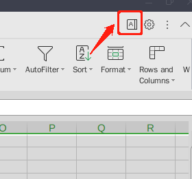

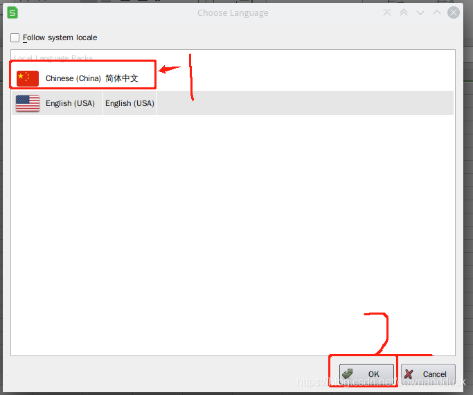


### 钉钉

#### wine 版

```shell
yay -S deepin.com.dingtalk.com

# 运行
./opt/deepinwine/apps/Deepin-DingTalk/run.sh

# 软链接
sudo ln -s /opt/deepinwine/apps/Deepin-DingTalk/run.sh /usr/bin/dingtalk

# 字体发虚
# dpi 调整为 120-144
env WINEPREFIX="$HOME/.deepinwine/Deepin-DingTalk" winecfg
```


#### dingtalk-linux

```shell
yay -S dingtalk-linux
```


## 影音工具

### 终端下工具

> ranger 下可用

#### mplayer

```shell
sudo pacman -S mplayer
```

> `man mplayer` 查看使用说明

```shell
" 播放目录下所有
mplayer ./*

" 深度遍历所有 mp3 文件并生成 播放列表
find ./ -type f -name '*.mp3' >> playlist.lst

# 指定播放列表，-shuffle 指定随机播放
mplayer -playlist playlist.lst -shuffle

# 循环播放 5 遍， 如果为 0 则表示不停播放
mplayer -loop 5 file
```


### vlc

```shell
sudo pacman -S vlc
```


### deadbeef 

> 本地无损音乐播放器

```shell
sudo pacman -S deadbeef
```


### 网易云音乐

```shell
sudo pacman -S netease-cloud-music
```


### 屏幕取色工具

```shell
sudo pacman -Sy gpick
```


### 截屏软件

```shell
sudo pacman -S flameshot
```


### 录屏软件

#### OBS

```shell
sudo pacman -S obs-studio
```


#### simplescreenrecorder

```shell
pacman  -S  simplescreenrecorder
```


### 剪辑视频

```shell
pacman -S kdenlive
```


### 视频转化工具

#### avidemux

```shell
sudo pacman -S avidemux-qt

# 运行
avidemux3_qt5
```

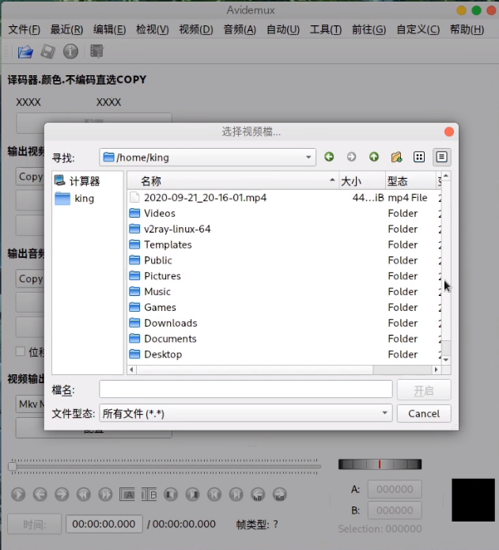


### 修图

#### gimp

> 较为专业的工具

```shell
pacman -S gimp
```


#### pinta

> 类似 windows 的画图工具

```shell
yay -S pinta
```


## 通讯工具

### 微信(可多开)

#### win-wechat

> [ArchLinux微信多开wine-wechat多开](https://www.jianshu.com/p/581abc92bf29)
>
> [Deepin Wine 版 qq 和微信可以视频通话吗？](https://bbs.archlinuxcn.org/viewtopic.php?id=11171)

先修改成国内社区源，再执行以下内容：

```shell
yay -S wine-for-wechat wine-wechat
```

如果产生库依赖的错误，则进行如下操作：

```shell
sudo vim /etc/pacman.conf

//取消下面两句的注释*
#[multilib]*
#Include = /etc/pacman.d/mirrorlist*

sudo pacman -Syy
```


#### spark-wechat

```shell
yay -S com.qq.weixin.spark

# 运行
./opt/apps/com.qq.weixin.spark/files/run.sh

# 软链接
sudo ln -s /opt/apps/com.qq.weixin.spark/files/run.sh /usr/bin/dingtalk

# 字体发虚
# dpi 调整为 120-144
env WINEPREFIX="$HOME/.deepinwine/Spark-WeChat" winecfg
```


### Tim

```shell
yay -S wine-tim
```


### Thunderbird

```shell
sudo pacman -S thunderbird-extension-enigmail
```

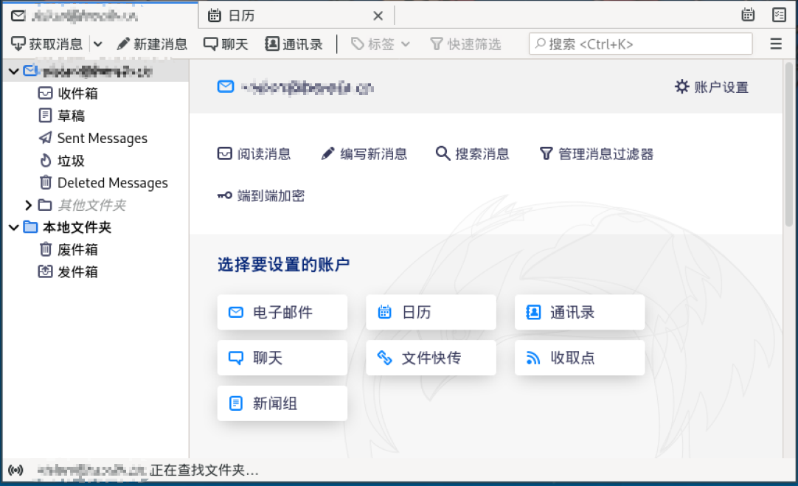


## 翻墙工具

### v2ray

> [Manjaro安装V2ray客户端](https://bbs.xiao2.me/thread-1539.htm)

#### 安装配置

```shell
sudo pacman -S v2ray
```

配置文件存放目录：`/etc/v2ray/config.json`，配置文件参考[官方文档](https://github.com/v2ray/manual/blob/master/zh_cn/chapter_00/start.md)

```shell
 #备份
sudo cp /etc/v2ray/config.json config.json.bak
 #修改
sudo vim /etc/v2ray/config.json
```


#### 浏览器安装插件

[SwitchyOmega插件下载](https://www.crx4chrome.com/crx/998/)

步骤：

- 选择情景模式：proxy

- 代理服务器信息填写：

    ```shell
    代理协议：SOCKS5
    代理服务器：127.0.0.1 	// 为配置文件中inbounds中的监听IP
    代理端口：10808 			// 为配置文件中inbounds中的监听端口
    ```

- 选择扩展中对应的代理模式：proxy

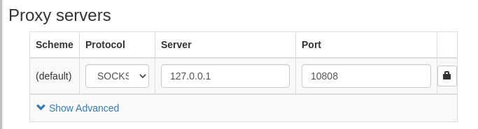


#### 运行V2ray

```shell
sudo v2ray -config /etc/v2ray/config.json
```

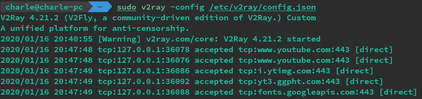

```shell
 #启动
sudo systemctl start v2ray.service 
 #关闭
sudo systemctl stop v2ray.service 
 #开机启动
sudo systemctl enable v2ray.service

```


### proxychains

虽然设置全局代理很简单，只需要下面的一行代码：

```shell
export all_proxy="socks://127.0.0.1:1088"
```

但是有些软件就是不走这个全局代理，比如 git。在简单搜索后，我发现了 `proxychains` 这个软件，先安装上：

```shell
yay -S proxychains-ng
```

配置代理信息：

```shell
sudo nano /etc/proxychains.conf

# 把最后一行改成自己的代理信息，比如：
socks5 127.0.0.1 1088
```

然后及可以无脑使用了，在想使用代理但是软件就是不走代理的命令前，加上 `proxychains`，就能自动走代理，比如：

```shell
proxychains git clone xxxxxxxxx
```


## 开发工具

### python 3

```shell
sudo pacman -S python
sudo pacman -S python-pip
```


### pycharm

```shell
yay -S pycharm-professional
```

如果是 dwm 的话还需要安装 wmname，这可以解决出现在[Awesome](https://wiki.archlinux.org/index.php/Awesome)或[Dwm](https://wiki.archlinux.org/index.php/Dwm)或[Ratpoison之](https://wiki.archlinux.org/index.php/Ratpoison)类的窗口管理器中的Java GUI渲染问题。尝试设置“ compiz”或“ LG3D”，否则会有一个灰色的界面，无法进入项目界面：

```shell
sudo pacman  -S wmname
```

```shell
wmname LG3D
 # 或者  wmname compiz
 # 可以将该命令加到 dwm 的开机脚本里
```

发出wmname命令后，必须重新启动有问题的应用程序。之所以可行，是因为JVM包含已知的非重新父窗口管理器的硬编码列表。为了最大程度地讽刺，某些用户更喜欢[使用Java](https://en.wikipedia.org/wiki/Project_Looking_Glass)来模拟[Sun编写](https://en.wikipedia.org/wiki/Project_Looking_Glass)`LG3D`的非重新父窗口管理器。


解决方法路径：

[arch forums](https://bbs.archlinux.org/viewtopic.php?id=256945) -> [arch wiki](https://wiki.archlinux.org/index.php/Java#Impersonate_another_window_manager) -> [wmname](https://tools.suckless.org/x/wmname/)

wmname是一个很好的实用程序，用于修复JDK版本和其他损坏的程序的问题，例如，假设存在重新创建窗口的窗口管理器。


### goland

要先安装 snap

```shell
sudo snap install goland --classic
```


### vscode

微软的代码编辑器

```shell
sudo pacman -S code
```


### postman

```shell
sudo pacman -S postman-bin
```


### mysql

arch 默认已经不再支持 MySQL，但是可以安装 MariaDB，其比 MySQL 的性能更好且操作基本相同。 输入下面命令安装：

```shell
sudo pacman -S mariadb libmariadbclient mariadb-clients    # 安装mariadb
```

运行初始化脚本 `mysql_install_db`

```shell
sudo mysql_install_db --user=mysql --basedir=/usr --datadir=/var/lib/mysql
```

启动 mysql

```shell
sudo systemctl start mysql
```

设置 root 用户密码

```shell
sudo mysql
set password for root@localhost = password('新密码');
exit;
# mysql -uroot -p新密码　　#使用密码登入root用户方法
```

 ps: 可以通过修改 `/etc/my.cnf.d/server.cnf` 配置文件 `bind-address=127.0.0.1` 设置 mysql 只用于本机访问。


#### mycli 

```shell
sudo pacman -S mycli
```

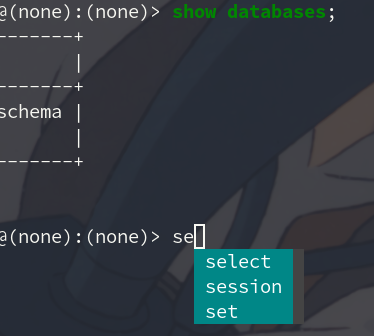

```shell
mycli -u root -p 
```


#### Navicat

##### navicat12

```shell
yay -S navicat121_premium_cs_x64
```

```shell
F" 修改中文乱码
sudo find / -name navicat
cd /opt/navicat
vim start_navicat
" 修改
export LANG="zh_CN.UTF-8"


" 重新试用
rm -rf ～/.navicat64
```

添加软链接

```shell
sudo ln -s /opt/navicat15-premium-cs/AppRun /usr/bin/navicat
```


##### navicat15

```shell
" 延期试用
rm -rf ~/.config/dconf ~/.config/navicat
" 删除上述文件之前先备份连接，否则会丢失
```


#### workbench

```shell
sudo pacman -S mysql-workbench
```


### postgres

#### pgcli

```shell
sudo pacman -S pgcli
```

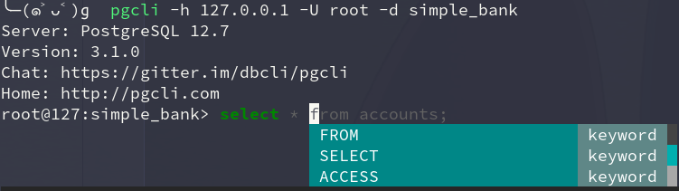

```shell
pgcli -h 127.0.0.1 -U root -d simple_bank
```


### redis

```shell
sudo pacman -S redis
sudo systemctl start redis
" sudo systemctl enable redis
```


#### redis-manager

```shell
yay -S redis-desktop-manager
```


### lazygit

> 一款终端下的 git GUI 界面

```shell
yay -S lazygit
```


### nodejs

```shell
yay -S npm nodejs
```

```shell
" 安装cnpm
sudo npm install -g cnpm --registry=https://registry.npm.taobao.org 
" 在当前用户目录下创建 ~/.npm-global 目录用于存放下载的包，避免使用默认的包路径时提示没有权限
mkdir ~/.npm-global
" 更改链接
npm config set prefix '~/.npm-global'
" 在用户的profile下增加path，为的是系统能够找到可执行文件的目录
export PATH=~/.npm-global/bin:$PATH
" update profile。使其生效
source ~/.profile
```


#### nvm

```shell
sudo pacman -S nvm
```

```shell
# 环境变量
echo 'source /usr/share/nvm/init-nvm.sh' >> ~/.bashrc
echo 'source /usr/share/nvm/init-nvm.sh' >> ~/.zshrc
```

##### 基本使用

`nvm list` 或者 `nvm ls` 查看 node 的安装版本

`nvm install 6.9.0` 安装一个 6.9.0 版本的 node

`nvm use 6.9.0` 使用这个 6.9.0 版本的 node

`nvm uninstall 6.9.0` 删除 6.9.0 版本的 node

`nvm ls-remote` 罗列远程的 node 版本

`nvm current` 查看当前正在使用的 node 版本

`nvm alias default v4.3.0` 切换 v.4.3.0 为默认版本，每次新建的命令行中就是默认的版本了

`npm list --depth=0 -g` 查看全局都安装了那些 npm 的包


### scrcpy 

> https://zhuanlan.zhihu.com/p/87009933


## 虚拟化工具

### virtualbox

- 安装基本包

    ```shell
    sudo pacman -S virtualbox 
     # 选择virtualbox-host-modules-arch模块
    
    sudo pacman -S virtualbox-guest-iso
    ```

- 加载 VirtualBox 内核模块

    ```shell
    sudo modprobe vboxdrv vboxnetadp vboxnetflt
    ```

    > `vboxdrv`驱动模块
    > `vboxnetadp` 桥接网络
    > `vboxnetflt`host-only 网络
    > `vboxpci`：若要让虚拟机使用主体机的 PCI 设备，那么就需要这个模块。

- 安装扩展包

    ```shell
    yay -S virtualbox-ext-oracle
    ```

- 把当前用户组添加到vboxusers里面

    ```shell
    sudo usermod -G vboxusers -a 用户名
    ```


## 投屏远程工具

### 向日葵

#### 向日葵客户端

```shell
yay -S sunloginclient

# 执行
systemctl start runsunloginclient.service
```


#### 蒲公英异地组网

- 官网下载 deb 包
- 使用 debtap 转换成 zst 包
- 使用 pacman -U 安装

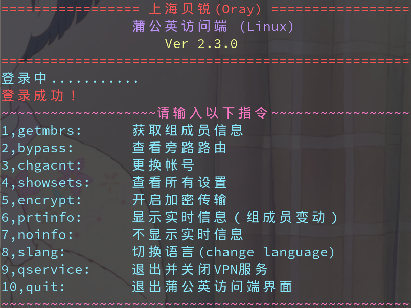


### remmina 远程桌面客户端

```shell
pacman -S remmina freerdp libvncserver telepathy-glib gnome-keyring nxproxy spice-gtk3 xorg-server-xephyr
```


### UxPlay

> iPad 和 iPhone 投屏到 Linux

```shell
yay -S uxplay-git
```

启动服务

```shell
systemctl start avahi-daemon.service
uxplay
```

设备连接同一个 wifi 即可投屏


## 桌面工具

### oneko

> https://linux.cn/article-6777-1.html

```shell
yay -S oneko
```

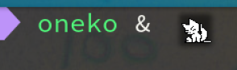


### 日历

#### ccal

> 命令行下的中国农历, 还可以输出为一些格式, 比如PDF, PNG, JPEG.

```shell
sudo pacman -S ccal
```

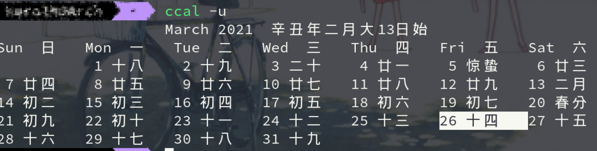

##### 使用

```shell
Usage: ccal [-t|-p|-x] [-g|-b] [-u] [[<month>] <year>].
        -t:     Generates HTML table output.
        -p:     Generates encapsulated PostScript output.
        -x:     Generates XML output.
        -g:     Generates simplified Chinese output.
        -b:     Generates traditional Chinese output.
        -u:     Uses UTF-8 rather than GB or Big5 for Chinese output.
```


## 下载工具

### 百度网盘

#### BaiduPCS-Go

> 百度网盘命令行版本， [BaiduPCS-Go的使用](https://www.jianshu.com/p/57167f6d89f2)

##### 安装

```shell
sudo pacman -S baidupcs-go
```


##### 使用

```shell
 # 打开
baidupcs
```

第一次使用需要有登陆的操作，输入 `login` 即可登陆，尊许提示依次输入账户和密码即可，如果需要验证码，则会输出一个链接，打开就可以看到验证码了。


#### baidunetdisk-bin

```cpp
yay -S baidunetdisk-bin  //并尽可能安装可选依赖
```


### snap

Snap是 Ubuntu 母公司 Canonical 于 2016 年 4 月发布 Ubuntu16.04 时候引入的一种安全的、易于管理的、沙盒化的软件包格式，与传统的dpkg/apt有着很大的区别。

> [Ubuntu 使用 snap 常用操作](https://blog.csdn.net/gulang03/article/details/85251620)

```shell
git clone https://aur.archlinux.org/snapd.git
cd snapd
makepkg -si

sudo systemctl enable --now snapd.socket

 # snap支持，请在/var/lib/snapd/snap和/snap之间创建符号链接：
sudo ln -s /var/lib/snapd/snap /snap
```

使用：

```shell
 #搜索要安装的Snap软件包
sudo snap find xxxx

 #查看Snap软件的更多信息
sudo snap info xxxx

 # 安装软件
sudo snap install pycharm-professional --classic

 # 列出已安装的snaps
snap list


 #更新Snap软件包
sudo snap refresh xxxx

 #还原到之前版本
sudo snap revert xxxx

 # 删除snap
sudo snap remove hello-world
```


### amule

```shell
sudo pacman -S amule
```

在上面菜单栏的 Downloads 处点击，在下方输入链接，点击 commit 即可下载.

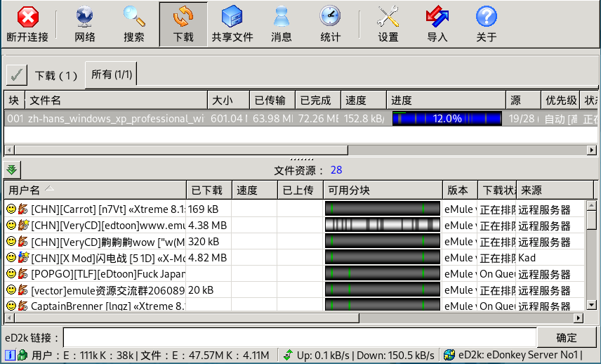


### uget

> 支持 aria2

```shell
sudo pacman -S uget

# 运行
uget-gtk
```

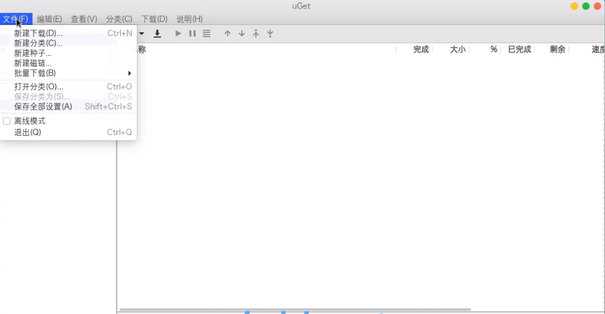


## 图书工具

### typora 文本编辑器

```shell
yay -S typora
```


### 思维导图

#### mindmaster

```shell
yay -S mindmaster_cn
```

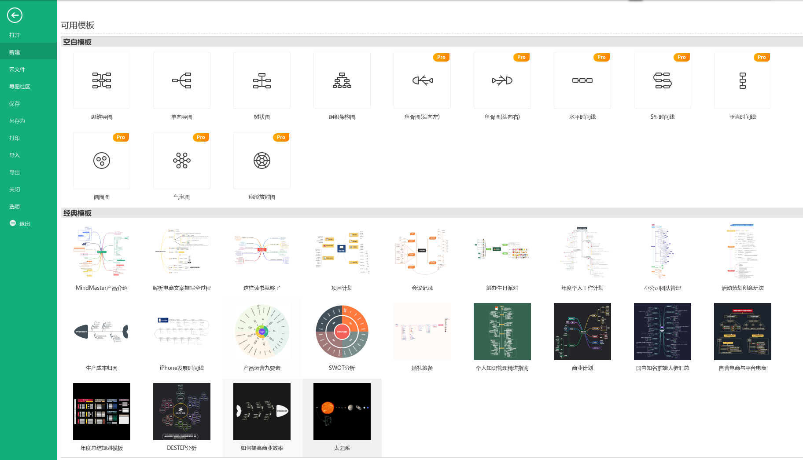


#### xmind

```shell
yay -S xmind
# 我选的 xmind-2020
```

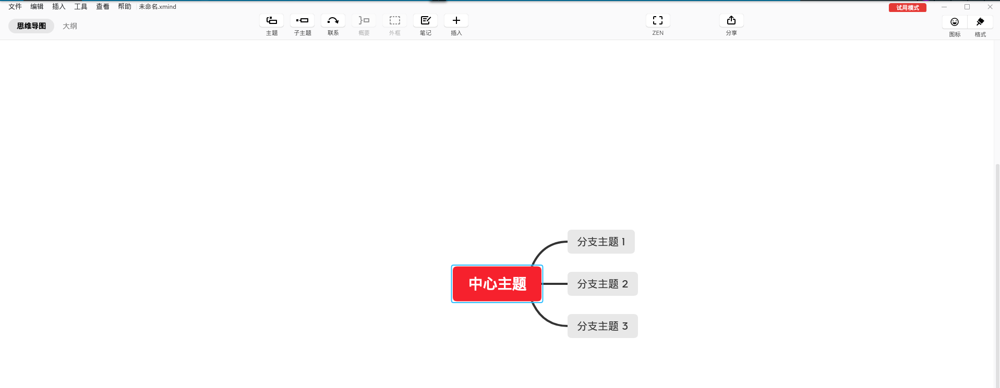


### Zathura

> [wiki](https://wiki.archlinux.org/index.php/Zathura)
>
> [Linux 下的 PDF 阅读软件 Zathura](http://rachpt.cn/2018/01/22/linux-pdfreader-zathura/)

```shell
sudo pacman -S zathura zathura-pdf-mupdf
 # zathura-pdf-mupdf-基于MuPDF的EPUB，PDF和XPS支持
 # zathura-pdf-mupdf-基于MuPDF的EPUB，PDF和XPS支持
```

> 如何使用单独单独讲，有学习门槛


### evince

> PDF 阅读器

```shell
sudo pacman -S evince 
```


### 无道词典

> 无道词典，简洁优雅的有道词典命令行版本。支持离线和在线英汉互查的功能。Python 编写。

```shell
yay -S wudao-dict-git
```

查词时可以直接使用 wd 词语查汉英词典，或 wd word 查英汉词典 (可以自动检测)。

```shell
使用方法: wd [OPTION]... [WORD]
-k                            杀死词典服务器进程
-s                            只打印简短的单词介绍
-h                            查看帮助
-o                            在线查询
```

1. `./wd_monofile` 是本词典的在线查询的单文件版本，可以复制到 `/usr/bin` 下直接使用.(需要安装 bs4)
2. 如果您不想看到例句，请在 `/usr/bin/wd` 中的`./wdd` 后面加上 - s 参数.
3. 有的用户反馈字体颜色看不清的问题，你可以找到 `./wudao-dict/wudao-dict/src/CommandDraw.py`, 可以看到释义，读音等采用的颜色，直接修改即可.
4. 查询词组直接键入类似 `wd take off` 即可。如果没有结果，请使用 `-o` 查询.


## 兼容工具

### 罗技

#### 鼠标按键

> [logitech options ubuntu/linux](https://blog.csdn.net/folkboat/article/details/109011807)

罗技的某些鼠标提供了一些辅助键，可以通过官方的 Logitech Options 这个软件来为这些辅助键绑定操作。但是 Logitech Options 只在 Windows 和 macOS 上支持.…..因此我找到了下面这个第三方的鼠标配置APP：它是 librabag 项目的一个UI前端，这是它所[支持的设备列表](https://github.com/libratbag/libratbag/tree/master/data/devices)

```shell
sudo pacman -S piper
```

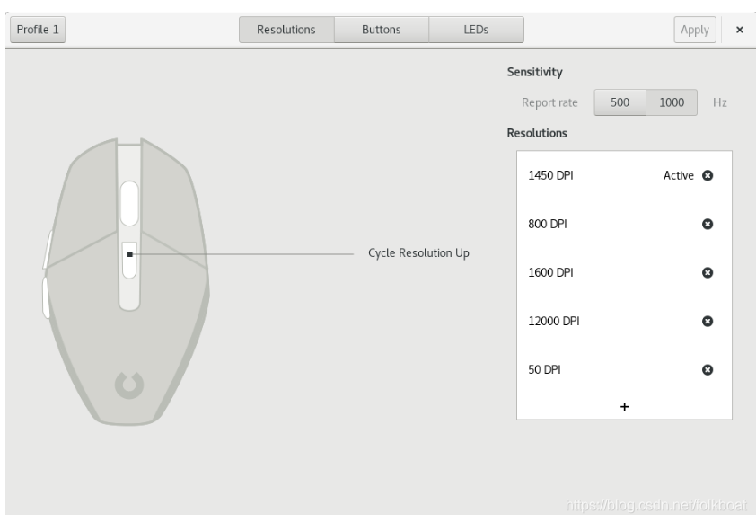

但是如果不被支持的话，就只能勉强用一用了，如下图，它只会显示你鼠标提供的所有按键，但是并没有和物理按键对应起来，所以你可能需要一个个试，自己找到对应关系，比如我的界面中倒数二三个按钮分别是滚轮左滚和滚轮右滚，我把它设置为了backward和forward。需要注意，设置了之后一定要点击右上角的Apply，这样才能生效。

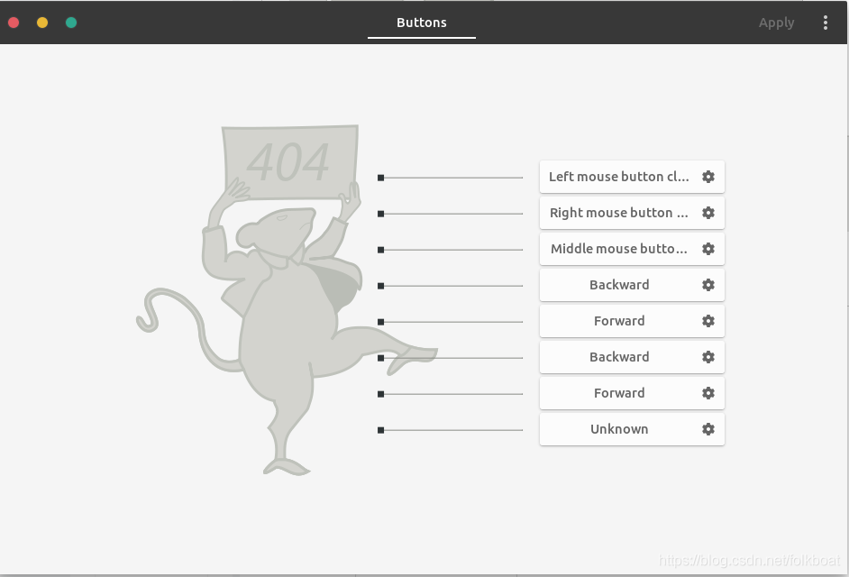


#### 键盘

##### k380

> 将 Logitech K380 蓝牙键盘上的功能键设为默认

```shell
 yay -S k380-function-keys-conf
 
 # 运行 
 k380_conf
```


## 游戏

### steam

> [Archlinux 下安装 steam 及更新失败解决的问题](https://www.cnblogs.com/oucbl/p/13892868.html)

```shell
sudo pacman -S steam
```

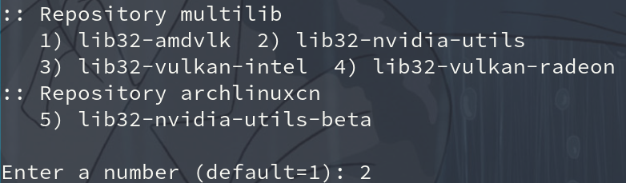


#### 更新失败

（首次）打开时初始化更新，竟然直接报错，说是 **严重错误，steam 需要联网更新。请确认网络。。。**

> Fatal Error: Steam needs to be online to update. Please confirm your network connection and try again.


#### 解决方法

删除 **steam.pid** 这个文件：

```shell
cd .steam
rm -f steam.pipe 
```


### 模拟器

#### Dolphin

&emsp;&emsp;Dolphin 是一款对应任天堂游戏主机 **GameCube** 和 **Wii** 的模拟器。它可以让电脑玩家以高清 (1080p) 画质体验这两款主机的游戏，还具有兼容电脑手柄、加速、多人联网等增强功能。

> [在Linux上，如何安装和使用Dolphin模拟器](https://ubuntuqa.com/article/10466.html)

```shell
sudo pacman -S dolphin-emu
```

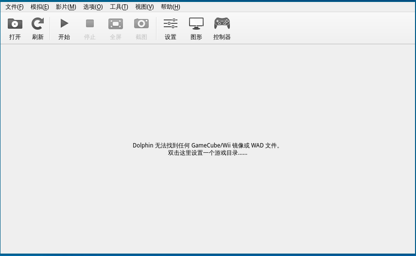

##### 镜像下载地址

- [电玩巴士](http://games.tgbus.com/wii/)
- [老男人游戏网](https://www.oldmanemu.net/%E5%AE%B6%E6%9C%BA%E6%B8%B8%E6%88%8F/wiiu/wiiu%E4%B8%AD%E6%96%87%E6%B8%B8%E6%88%8F%E5%85%A8%E9%9B%86)


#### Citra

```shell
yay -S citra-qt-git
```

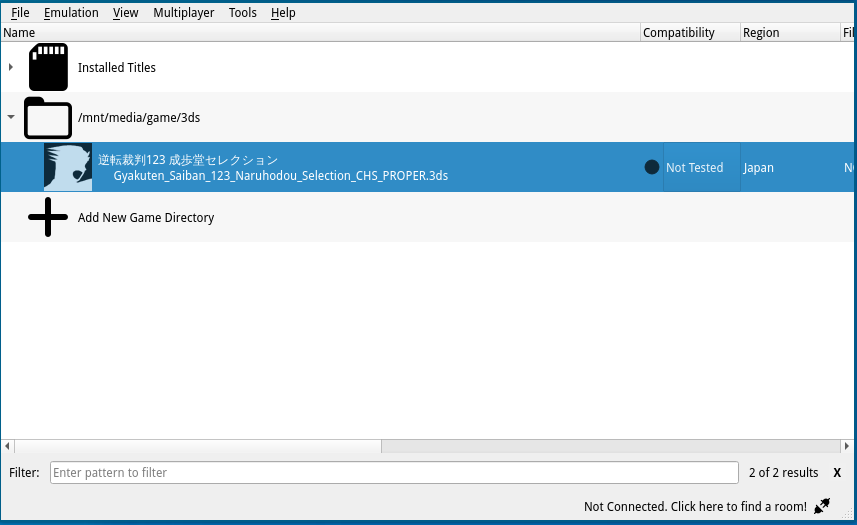

##### 游戏下载

- [爱CIA](https://lovecia.com/)

- [k73资源网](http://www.k73.com/down/3ds/list-81-1.html)


### minecraft

> Hello Minecraft! Launcher
>
> hmcl 是非官启动器，提供更快的下载速度以及 forge 等的安装，但是游戏本体已被修改过，别的启动器无法启动，也不能链接正版服务器，官启恰好相反，有钱可以支持正版

```shell
yay -S hmcl
```

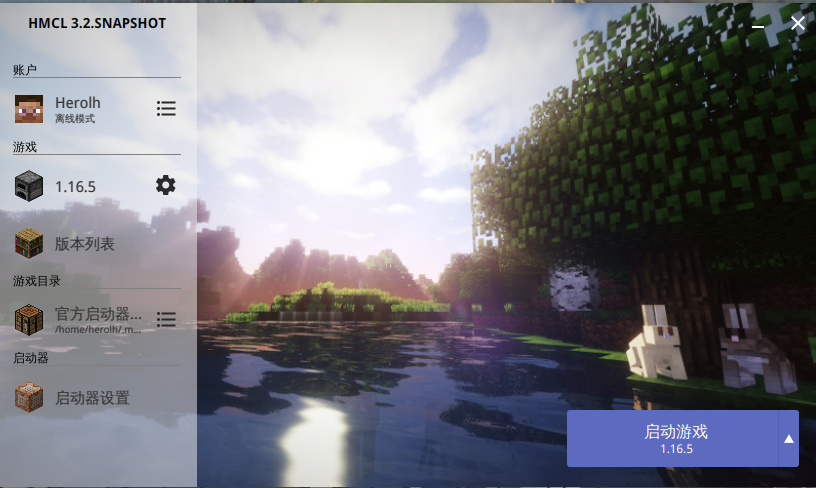


## chfs 局域网文件共享

[一个小型局域网web](https://link.zhihu.com/?target=http%3A//iscute.cn/chfs)，方便手机与电脑传文件，当然用wine.qq也很方便，不过wine.qq没法在局域网共享资源吧。 `init.sh`默认安装并设置了开机自动启动它，使用`ip a`查看主机的ip地址，然后用浏览器访问就ok。

```shell
yay -S chfs
```


启动脚本

```shell
https://gitee.com/jq-code/chfs-network-disk
```


## 捕捉键盘软件

[github](https://gitlab.com/screenkey/screenkey)

```shell
sudo pacman  -S  screenkey
```

要在录制时（例如，在密码提示时）禁用屏幕按键，请同时按两个控制键或两个 Shift 键或两个 alt 键。再次按相同的组合以恢复它。

如果您需要查看者将注意力集中在刚键入的句子上，则可以按无声修饰符（例如 Shift 或 Control），使输出窗口可见的时间更长一点，而无需延长默认超时时间。


## 密码管理器

### keepass

```shell
sudo pacman -S keepass
```


### keeppassxc

```shell
sudo pacman -S keepassxc
```

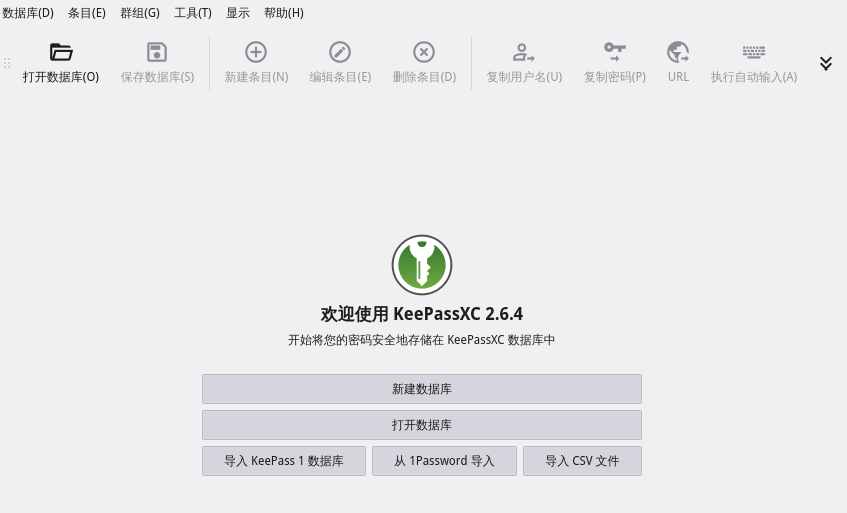


## electerm

> 类似 xshell，

```shell
sudo pacman -Rs electerm
```


