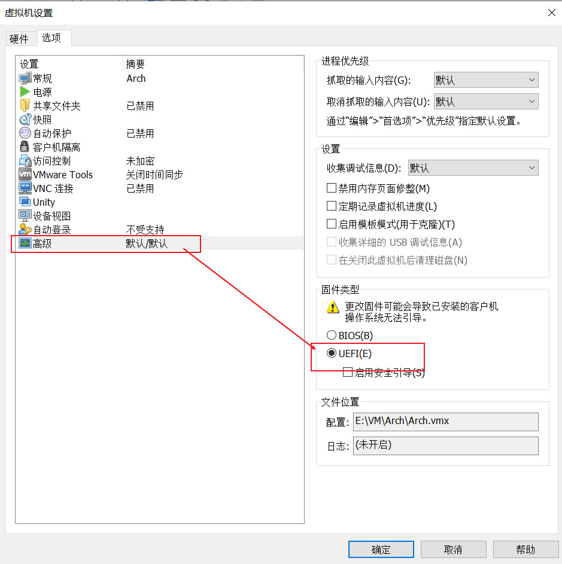
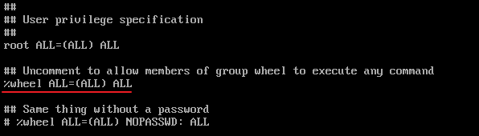

 VM 虚拟机下设置




virtualBox 下设置


调整并选择字体：

```shell
setfont /usr/share/kbd/consolefonts/LatGrkCyr-12x22.psfu.gz
```


更改键盘锁定:

```shell
vim keymap.conf
# 写入以下内容
keycode 1 = Caps_Lock
keycode 58 = Escape

# 1 代表键盘上的 Escape
# 58 代表键盘上的 Caps_Lock
```

```shell
loadkeys keymap.conf
```


联网：

```shell
# 查看网络设备
ip link

# 启用 wifi 设备
ip link set wlan0 up

# 扫描 wifi 名称
# iwlist wlan0 scan
iwlist wlan0 scan | grep ESSID

# wifi-menu 不支持很多企业级的协议，后面的 arch 版本取消了

wpa_passphrase 网络名ESSID 密码 > internet.conf
vim internet.conf

###### 内容
network={
	ssid="网络名ESSID"
	pwk="密码"
}
###### 内容

wpa_supplicant -c internet.conf -i wlan0 &

# 动态分配ip地址
dhcpcd &
```

同步时间

```shell
timedatectl set-ntp true
```

硬盘分区

```shell
# 查看硬盘设备
fdisk -l

# 进入硬盘
fdisk /dev/sda

# m for help
# p to print info
g


# (这一步要根据官方文档来， UEFI 和 EMAR 是不一样的)
# 创建系统分区
n
1

+512M
Y

# 创建缓存分区
n
3

+1G
Y

# 创建主分区
n
2


Y

# 修改分区格式
t
1
l						# 找到EFI System 的序号，此处为1
1

t
3
l						# 找到linux swap 的序号， 此处为19
19

# 写入
w

# 修改系统分区格式(必须是fat格式)
mkfs.fat -F 32 /dev/sda1

# 修改主分区格式
mkfs.ext4 /dev/sda2

# 制作缓存分区并打开
mkswap /dev/sda3
swapon /dev/sda3
```

配置pacman配置文件

```shell
vim /etc/pacman.conf

Color
ILoveCandy
```

```shell
vim /etc/pacman.d/mirrorlist

# 将所有的中国源移到顶部
```


挂载硬盘

```shell
# 挂载主分区到 /mnt 目录下
mount /dev/sda2 /mnt

# 挂载系统分区
mkdir /mnt/boot
mount /dev/sda1 /mnt/boot
```

正式安装系统

```shell
pacstrap /mnt base linux linux-firmware base-devel
# base : linux 基础软件
# linux : linux 内核
# linux-firmware： linux 框架

genfstab -U /mnt >> /mnt/etc/fstab
```

进入安装好的系统

```shell
arch-chroot /mnt
```

设置时区

```shell
ln -sf /usr/share/zoneinfo/Asia/Shanghai /etc/localtime
# 同步系统时间
hwclock --systohc

exit
```

设置系统语言

```shell
vim /mnt/etc/locale.gen

# 找到 en_US.UTF-8 取消注释
arch-chroot /mnt
locale-gen

exit

# 设置语言 
vim /mnt/etc/locale.conf
#### 内容
LANG=en_US.UTF-8

```

设置系统键盘映射

```shell
vim /mnt/etc/vconsole.conf
#### 内容
keycode 1 = Caps_Lock
keycode 58 = Escape
```

设置主机名映射

```shell
vim /mnt/etc/hostname
#### 内容
主机名
```

设置主机本地IP名称

```shell
vim /mnt/etc/hosts

127.0.0.1	localhost
::1			localhost
127.0.1.1 	主机名.localdomain		主机名
```

修改root密码

```shell
arch-chroot /mnt
passwd

```

引导管理

```shell
pacman -S grub efibootmgr os-prober inter-ucode
mkdir /boot/grub

grub-mkconfig > /boot/grub/grub.cfg
uname -m

grub-install --target=x86_64-efi --efi-directory=/boot
```

安装软件

```shell
pacman -S wpa_supplicant dhcpcd vim vi neovim zsh
```

解除挂载

```shell
umount -R mnt
```

关机

```shell
shutdown now
```


进入界面后配置网络

```shell
ip link set ens33 up
dhcpcd
ping www.baidu.com

设置网络工具开机自启
systemctl enable dhcpcd
```


设置默认编辑器为 vim

```shell
ln -s /usr/bin/vim /usr/bin/vi
```


新增用户

```shell
Useradd -m -G wheel admin
passwd admin
visudo
# 将以下注释去掉
```




安装yay

```shell
pacman -S --needed git
git clone https://aur.archlinux.org/yay.git
cd yay
makepkg -si
```


安装图形化界面

```shell
# 安装deepin 前必须要先有一个除root外的用户
# deepin
pacman -S xorg sddm
pacman -S deepin deepin-extra
pacman -Qs lightdm
vim /etc/lightdm/lightdm.conf
# 追加以下内容
greeter-session=lightdm-deepin-greeter
# 追加以上内容

sudo systemctl enable lightdm
sudo systemctl start lightdm
```


安装google浏览器

```shell
yay -S google-chrome
```


Vm下安装 open-vm-tools

```shell
# 安装 open-vm-tools 和 gtkmm3：
yay -S open-vm-tools gtkmm3
# 如果该功能无法正常工作，请尝试手动安装 gtkmm3 。如要启用客户机的拖拽与复制粘贴功能，则需要安装 gtkmm3 。

# 设置 open-vm-tools 开机自启：
sudo systemctl enable vmtoolsd.service
sudo systemctl enable vmware-vmblock-fuse.service
```


中文乱码

```shell
# (flash乱码)   ---乱码的原因就是缺少中文字体的支持，下载文泉驿xx， OK了
pacman -S wqy-zenhei ttf-fireflysung

# 执行下面命令看看是否配置好了中文编码：
locale-gen 
locale
locale -a

# 在google浏览器中设置中文字体。
```


