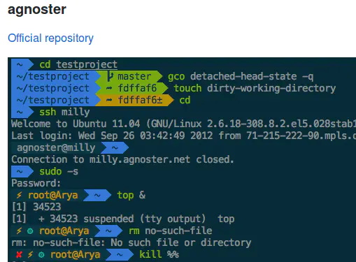
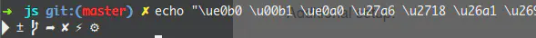
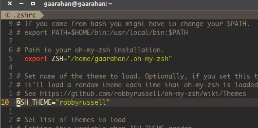

----------------------------------------------
> *Made By Herolh*
----------------------------------------------

# 目录 {#index}

[TOC]


--------------------------------------------

## 安装zsh

以Centos7为例：

### 查看系统当前使用的shell

```
$ echo $SHELL 
/bin/bash
```

### 查看系统是否安装了zsh

```
$ cat /etc/shells 
/bin/sh
/bin/bash
/sbin/nologin
/usr/bin/sh
/usr/bin/bash
/usr/sbin/nologin
/bin/tcsh
/bin/csh
```

Centos7默认情况下没安装zsh

### 用yum安装zsh

```
$ yum -y install zsh
```


apt 下安装

```shell
sudo apt install zsh
```


### 查看shell列表

```
$ cat /etc/shells 
/bin/sh
/bin/bash
/sbin/nologin
/usr/bin/sh
/usr/bin/bash
/usr/sbin/nologin
/bin/tcsh
/bin/csh
/bin/zsh
```

### 切换shell为zsh

```
$ chsh -s /bin/zsh
Changing shell for root.
Shell changed.
```

### 重启服务器

切换成root账号登录

```
su -
```

切换账号后，相当于注销重新登录，再查看当前shell，

```
$ 
/bin/zsh
```

如果查看不到，就重启一下，再查看当前 shell。

```
reboot
```

## 安装 oh my zsh

`oh-my-zsh` 源码是放在github上，先确保你的机器上已安装了git

### 安装

```
wget https://github.com/robbyrussell/oh-my-zsh/raw/master/tools/install.sh -O - | sh
```

成功界面：

```
  ____  / /_     ____ ___  __  __   ____  _____/ /_  
 / __ \/ __ \   / __ `__ \/ / / /  /_  / / ___/ __ \ 
/ /_/ / / / /  / / / / / / /_/ /    / /_(__  ) / / / 
\____/_/ /_/  /_/ /_/ /_/\__, /    /___/____/_/ /_/  
                        /____/                       ....is now installed!
Please look over the ~/.zshrc file to select plugins, themes, and options.

p.s. Follow us at https://twitter.com/ohmyzsh.

p.p.s. Get stickers and t-shirts at http://shop.planetargon.com.
```

接下来只需简单的配置，就可以享受`oh-my-zsh`的强大

重新登录，使zsh生效。切换成root账号登录

```
su -
```

### 主题选择

[这儿](https://links.jianshu.com/go?to=https%3A%2F%2Fgithub.com%2Frobbyrussell%2Foh-my-zsh%2Fwiki%2FThemes)列出了`zsh`的主题列表,选一个自己喜欢的吧，个人比较喜欢 `agnoster` 这个主题



- 在安装之前先保证自己电脑上有 `powerline font` ,因为该主题会使用到这些特殊的字符,使用下面语句检测是否存在该主题需要的特殊字符

    ```shell
    echo "\ue0b0 \u00b1 \ue0a0 \u27a6 \u2718 \u26a1 \u2699"
    ```

    正确的输出应该是这样:

    

- 如果没有,就安装该[字体库](https://links.jianshu.com/go?to=https%3A%2F%2Fgithub.com%2Fpowerline%2Ffonts):

    ```shell
    sudo apt-get install fonts-powerline
    ```

- 主题在安装 `oh-my-zsh` 时已经下载,直接在 `oh-my-zsh` 的配置文件中配置使用的主题即可，配置文件是：

    ```shell
    vim ~/.zshrc
    ```

    

    将这一行后面改成自己想要的主题名,保存退出即可

    ```shell
    source ~/.zshrc
    ```

    

## 将zsh设置为系统默认终端

执行这条语句，然重新登录系统即可：

```shell
chsh -s `which zsh`
```


