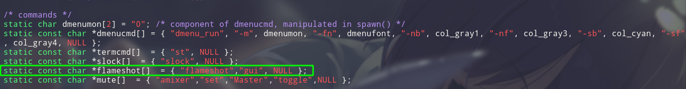
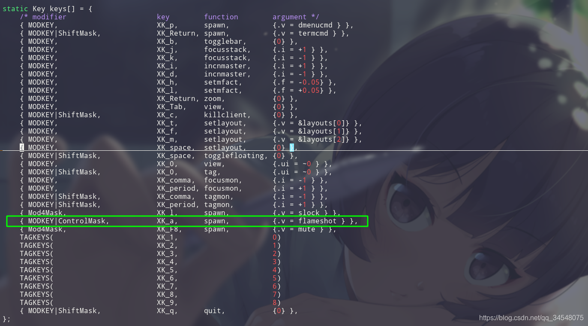

> CC官网：http://suckless.org/


## 安装：

```shell
git clone git://git.suckless.org/dwm
cd dwm
make
sudo make clean install
```


## 快捷键

> [dwm 问题汇总（含快捷键）](https://blog.csdn.net/qq_34548075/article/details/106941934)
>
> [DWM 快捷键配置](https://blog.csdn.net/qq_36390239/article/details/112990746)


### 基础快捷键

- 打开新终端

    ```shell
    Alt + shift + Enter
    ```

- 关闭一个窗口

    ```shell
    Alt + shift + C
    ```

- 窗口横向排列

    ```shell
    Alt + D
    ```

- 窗口竖向排列

    ```shell
    Alt + I
    ```

- 窗口位置互换

    ```shell
    Alt + Enter
    ```

- 在窗口间切换

    ```shell
    Alt + J
    Alt + K
    ```

- 改变窗口的长度 / 比例

    ```shell
    Alt + H
    Alt + L
    ```

- 切换标签页

    ```shell
    Alt + num
    ```

- 移动窗口至某标签页

    ```shell
    Alt + shift + num
    ```


### 缩放窗口

```shell
A + 鼠标右键
```


### 窗口模式切换快捷键

窗口模式切换

```shell
Alt + 空格
Alt + shift + 空格
```


#### 平铺模式（tiling)

```shell
Alt + T
```


#### 单窗口模式(single)

```shell
Alt + M
```


#### 浮动模式（float)

```shell
Alt + F
```


### 多屏幕问题

#### 在主副屏之间移动焦点

- 移动焦点至左边屏幕

    ```shell
    Mod + < 
    ```

- 移动焦点至右边屏幕

    ```shell
    Mod + >
    ```


#### 在主副屏之间移动窗口

- 移动窗口至左边屏幕

    ```shell
    Mod + shift + <
    ```

- 移动窗口至右边屏幕

    ```shell
    Mod + shift + >
    ```


### 自定义快捷键

我们以 flamshot 为例，为 flameshot 设置截图快捷键:

- 首先在 /* commands*/ 下添加你要设置快捷键的命令:

    ```shell
    # flameshot的截图命令是：flameshot gui，后面没有参数所以设为NULL，这条命令的名字我们设为flameshot
    static const char *flameshot[]  = { "flameshot","gui", NULL };
    ```

    

- 进行快捷键和命令的绑定

    ```shell
    # 我们设定截图的快捷键是：Alt + Ctrl + A(MODKEY对应Alt，ControlMask对应Ctrl，XK_a对应A)。然后将该快捷键绑定到名字为flameshot的命令。spawn自己百度
    { MODKEY|ControlMask,           XK_a,      spawn,          {.v = flameshot } },
    ```

    


## 配置：

### 配置边框

```shell
static const unsigned int borderpx  = 1; 
```


### 设置字体

```shell
static const char *fonts[]          = { "Noto Sans CJK SC:size=14" };
static const char dmenufont[]       = "Noto Sans CJK SC:size=14";
```


### 修改 tag 

```shell
static const char *tags[] = { "1", "2", "3", "4", "5" };
```


## 补丁

### alpha

http://dwm.suckless.org/patches/alpha/

> 状态栏透明


### autostart

http://dwm.suckless.org/patches/autostart/

> 自启动脚本功能


### awesomebar

http://dwm.suckless.org/patches/awesomebar/

> 状态栏显示多个窗口名称


### fullscreen

http://dwm.suckless.org/patches/fullscreen/

> 让窗口有全屏的能力， 不显示状态栏的全屏: `ALT + SHIFT + F`


### hide vacant tags

http://dwm.suckless.org/patches/hide_vacant_tags/

> 只显示含有窗口的tag


### hide and restore

> 隐藏和复原窗口


### noborder

http://dwm.suckless.org/patches/noborder/

> 当只有一个窗口可见时，删除边框。


### pertag

http://dwm.suckless.org/patches/pertag/

> 该补丁可保留每个标签的布局


### viewontags

http://dwm.suckless.org/patches/viewontag/

> 跟随窗口移动到要移动的标签


### rotatestack

http://dwm.suckless.org/patches/rotatestack/

> 堆栈旋转.将客户端从堆栈的底部移到顶部（或反过来）。这样可以有效地将客户端顺时针旋转一个位置（或分别逆时针旋转）。


### scratchpads

http://dwm.suckless.org/patches/scratchpads/

> 临时打开一个窗口，可当成记事本


### vanitygaps

http://dwm.suckless.org/patches/vanitygaps/

> 在客户端窗口之间增加了（内部）间隙，在窗口与屏幕边缘之间增加了（外部）间隙。

- `Alt+Super+0`―*开启和关闭间隙*
- `Alt+Super+Shift+0`―*将差距重置为默认值*
- `Alt+Super+h`―*加大差距*
- `Alt+Super+l`―*减少所有差距*
- `Alt+Super+Shift+h`―*增加外部差距*
- `Alt+Super+Shift+l`―*减少外部间隙*
- `Alt+Super+Ctrl+h`―*增加内部差距*
- `Alt+Super+Ctrl+l`―*减少内部间隙*
- `Alt+y`―*增加内部水平间隙*
- `Alt+o`―*减少内部水平间隙*
- `Alt+Ctrl+y`―*增加内部垂直间隙*
- `Alt+Ctrl+o`―*减少外部垂直间隙*
- `Alt+Super+y`―*增加外部水平间隙*
- `Alt+Super+o`―*减少外部水平间隙*
- `Alt+Shift+y`―*增加外部垂直间隙*
- `Alt+Shift+o`―*减少外部垂直间隙*


## 添加桌面管理器

除了手动启动 X 的方法外，显示管理器也可以让图形界面自动启动 显示管理器有很多，我们这里选择使用 SDDM。安装SDDM：

```shell
pacman –S sddm
systemctl enable sddm.service 			# 设置sddm开机启动
systemctl start sddm.service
```

自己 `make install` 的不能被 sddm 自动识别，需要自己建一个.desktop文件，放到 `/usr/share/xsession` 下：

```shell
[Desktop Entry]
Encoding=UTF-8
Name=Dwm
Comment=Dynamic window manager
Exec=dwm
Icon=dwm
Type=XSession
```

或者去 AUR 上下下来，copy 一份过去：

```shell
git clone https://aur.archlinux.org/dwm.git
cd dwm
sudo cp dwm.desktop /usr/share/xsessions
```


## 安装其他桌面环境

&emsp; Xorg 只提供图形环境的基本框架，完整的用户体验还需要其他组件。 桌面环境(DE): 在X之上并与其共同运作，提供完整的功能和动态图形界面。桌面环境通常提供图标、小程序（applets）、窗口、工具栏、文件夹、壁纸、应用程序和拖放等功能。使用GNOME、KDE、LXDE、Xfce这类桌面环境，是最简单的配置方法。当然你可以选择其他更有个性的桌面环境。这里我选择了Xfce4，直接安装：

```shell
pacman –S xfce4 xfce4-goodies
```

xfce4-goodies 包组提供了一些额外的插件和一些有用的工具，如 mousepad 编辑器。 Xfce 默认使用 Xfwm 作为窗口管理器。