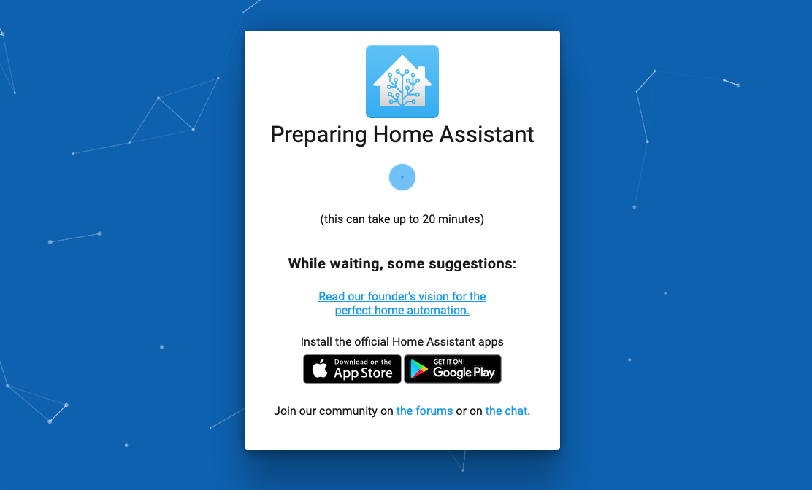

----------------------------------------------
> *Made By Herolh*
----------------------------------------------

# Home Assistant 的安装 {#index}

[TOC]


 


--------------------------------------------

## 文档版本

|    时间    | 修改人 | 内容     |
| :--------: | :----: | :------- |
| 2021-09-18 | Herolh | 文档创建 |
|            |        |          |


## 简介

&emsp;&emsp;Home Assistant 是一款基于 Python 的智能家居开源系统，支持众多品牌的智能家居设备。想要入门的话主要是要看两个网站：
[Home Assistant官网](https://www.home-assistant.io/)
[Home Assistant中文文档](https://home-assistant.cc/)


## 安装

### Docker 

```shell
docker pull homeassistant/home-assistant
```

运行容器

```shell
docker run -d --name="hass" -v ${HOME}/hass/mac_config -p 8123:8123 homeassistant/home-assistant
```


### Raspberry Pi 下

#### 刷入系统

- 下载镜像
    [树莓派4  64 位](https://github.com/home-assistant/operating-system/releases/download/6.4/haos_rpi4-64-6.4.img.xz)
    [树莓派3 64 位](https://github.com/home-assistant/operating-system/releases/download/6.4/haos_rpi3-64-6.4.img.xz)

- 下载[Balena Etcher](https://www.balena.io/etcher) 并且刷入系统

    

- 系统启动

    插入您刚刚创建的引导媒体（SD卡）

    为网络连接以太网电缆。

    连接电缆供电

    几分钟内，您将能够在 [homeassistant.local:8123](http://homeassistant.local:8123/) 上联系到家庭助理。如果您正在运行旧版本的 Windows 或具有更严格的网络配置，您可能需要访问家庭助理[athomeassistant:8123](http://homeassistant:8123/)或`http://X.X.X.X:8123`（将X.X.X.X.X替换为您的树莓派的IP地址）。

    

> 当然，最崩溃的也是出现在这里，因为进入到这个界面之后它就会下载一些文件并更新然后安装。它说这可能需要20分钟（实际远远不止！）。由于服务器在国外，如果不是科学上网的环境的话需要比较久。它在下载系统之前会更新系统时间，如果没有按方法一或者方法二去更改系统时间的获取源的话，会一直卡住。点击小蓝点会出现代码执行详情（如果看到Warning或者Error别害怕，一般都是网络连接不上，会不断重连，只要不是卡在Error不运行就没什么大问题，就时间长短罢了）。

