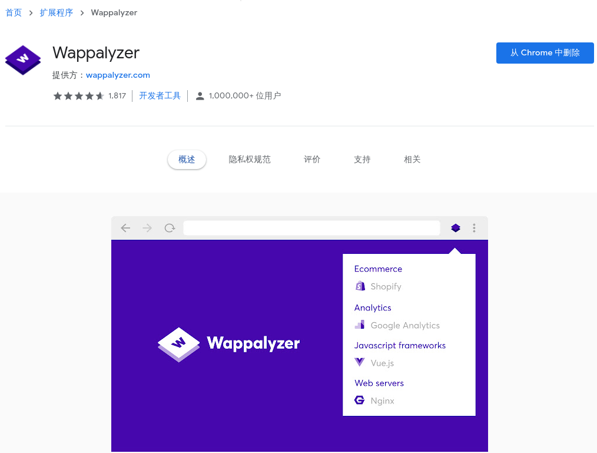

----------------------------------------------
> *Made By Herolh*
----------------------------------------------

# google 插件 {#index}

[TOC]

--------------------------------------------

## 基本使用

略

### 前端插件

#### Wappalyzer 网站技术分析插件

&emsp;&emsp;Wappalyzer 是一款功能强大的、且非常实用的 Chrome 网站技术分析插件。它能够分析网站所采用的平台构架、网站环境、服务器配置环境、JavaScript 框架、编程语言等参数。安装完毕后，在你感兴趣的网页点击 Wappalyzer 的插件图标，就能在下拉窗口里面看到这个网站用到的框架和技术了。

### Screenity

>  屏幕录像和标注工具， Chrome 最强大的屏幕录像机。 捕获，注释，编辑等。借助 Screenity，您可以前所未有地录制和标注屏幕, 更好地录制工作、教育等内容，为学生提供情景反馈、详细的解释，或者只是向潜在客户展示您的产品。

特点
- 🎥 无限制的录制您的标签页、桌面、任何应用程序和摄像头
- ✏️ 在屏幕任意位置绘画、添加文本和箭头进行标注
- 👀 高亮您的点击，聚焦您的鼠标，或者在录制时隐藏
- 🎙️ 单独的麦克风和电脑音频控制，一键通（PTT）等
- ⚙️ 可定义倒计时，悬停时显示控制栏，以及更多自定义选项
- 💾 导出为 mp4,、gif 和 webm，也可以保存视频到谷歌云盘
- ✂️ 对您的录制做修剪或者移除片段

