----------------------------------------------
> *Made By Herolh*
----------------------------------------------

# Pycharm 基本使用 {#index}

[TOC]

--------------------------------------------

## 激活

### ~~法一：(已失效)~~

http://idea.lanyus.com/

### 法二： 无限重置试用插件

> [石墨文档 - Goland 激活教程](https://shimo.im/docs/dKYCkd8PrX3ckX99/read)

&emsp;&emsp;原先的 `jetbrains-agent.jar` 方式原作者已经停止，目前提供了一种无限重置试用插件的激活方式，无限期延迟试用时间，同样也是简单方便一劳永逸，一起来白嫖吧～

- **点击试用**

    > 如果你是新下载的软件 或者 之前的激活失效了，直接点击 **试用** 即可！

    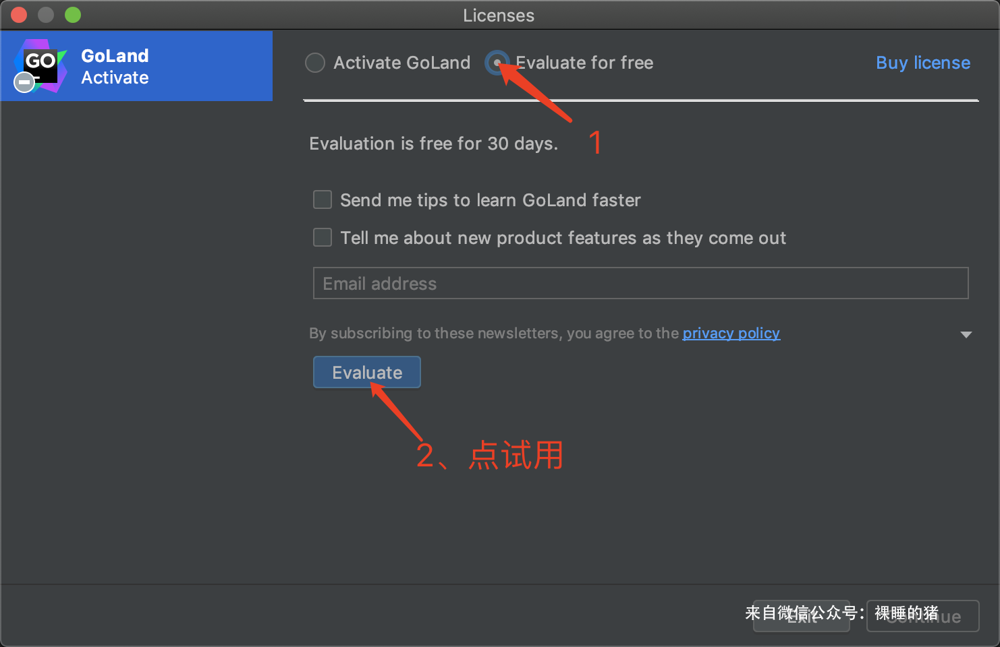

- **安装重置插件**

    Winidows系统点击：`File-Settings`，Mac系统点击：`PyCharm-Preferences`。 添加第三方插件仓库地址：https://plugins.zhile.io ，电脑不能上网就需要👉 [手动加载插件](https://shimo.im/docs/YKkHVtt8wtjvYpW8)

    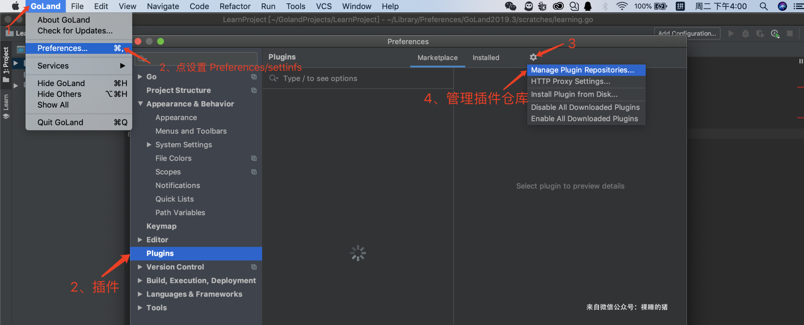

    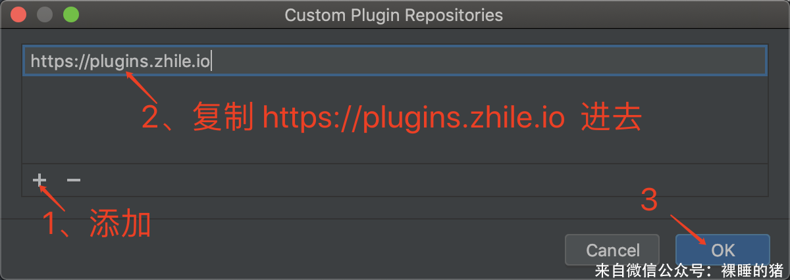

    搜索重置插件：**IDE Eval Reset ，**有时可能要等一两分钟，找到后点击 Install 安装。如果重试几次仍然搜索不到插件，可以👉 [手动安装插件](https://shimo.im/docs/YKkHVtt8wtjvYpW8)

    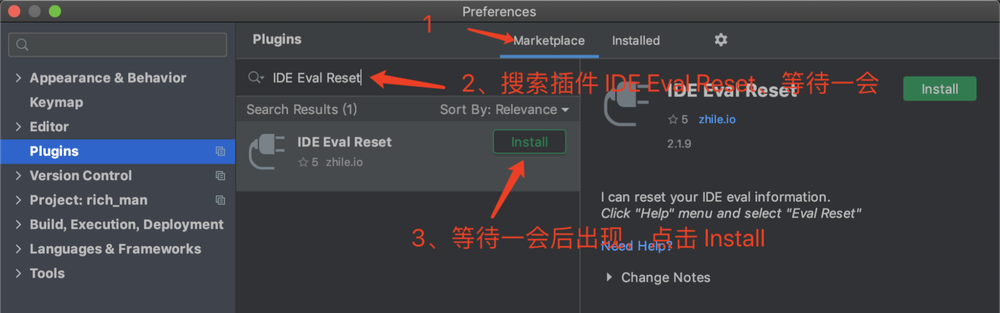

    插件安装完毕后我们需要重启软件使其生效，点击插件上的 **Restart IDE**，如果没有Restart IDE按钮的 记得手动重启。

    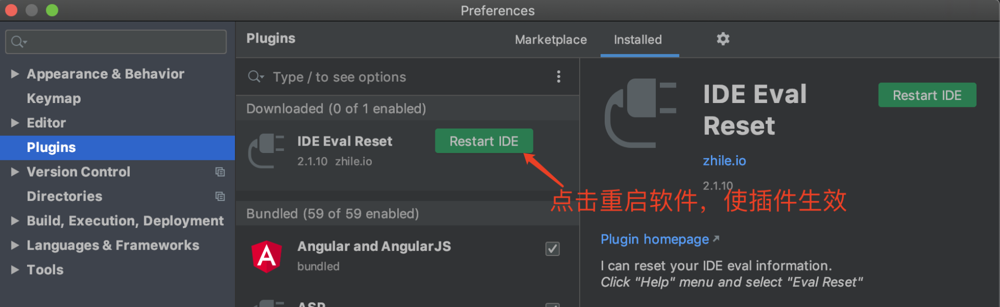

- **使用插件**

    下载完毕后，第一次需要我们手动重置并设置 **自动重置** ，后面我们就不再需要管了！勾选 **Auto reset before per restart** 自动重置，以后就不需要手动重置！

    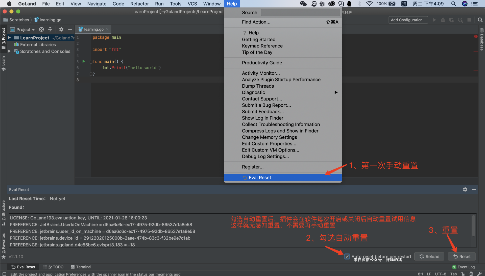

    点Yes重置会重启软件，这就激活完成了！以后插件会无感知重置试用期，无限期延迟试用时间，不需要用户操作！

    

- **验证激活**

    本激活教程原理就是无限延期你的试用期，所以你第二天打开软件查看试用期是否仍然为30天即可证明是否激活！

    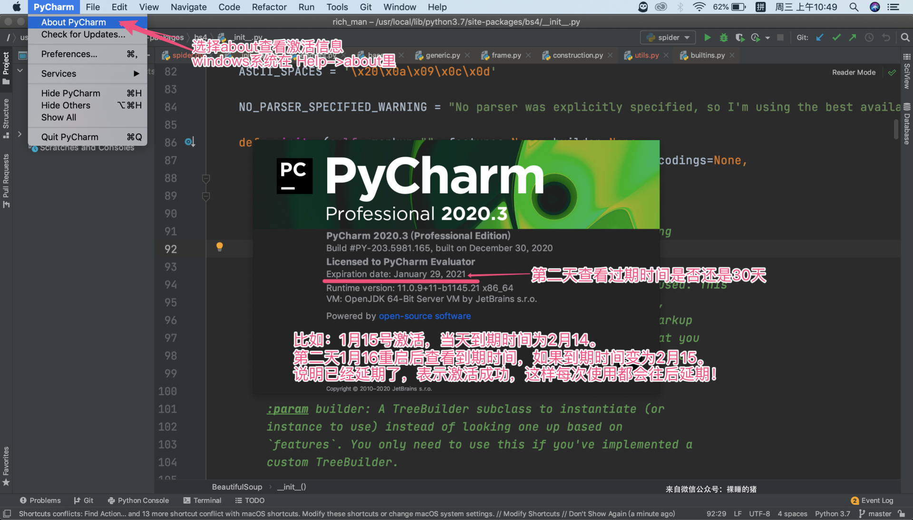

## Pycharm 快捷键

|      快捷键      |            说明            |
| :--------------: | :------------------------: |
|     Ctrl + [     |      快速跳到代码开头      |
|     Ctrl + ]     |      快速跳到代码末尾      |
|   Ctrl + Enter   |  在下方新建行但不移动光标  |
|  Shift + Enter   | 在下方新建行并移到新行行首 |
|     Ctrl + D     |       复制选定的区域       |
|     Ctrl + Y     |         删除当前行         |
|       End        |       光标移动至行末       |
|     Ctrl + F     |         文件内查找         |
| Ctrl + Shift + F |          全局查找          |
|     Ctrl + R     |         文件内替换         |
| Ctrl + Shift + R |          全局替换          |

## Pycharm 插件：

#### Chiness(Simplified)Language Pack

> 中文语言包

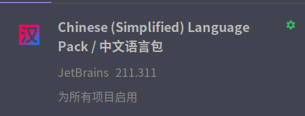

### IdeaVim

https://my.oschina.net/funcy/blog/1832719

### 美化

#### Dracula Theme

#### Background Image Plus +

#### Nyan Progress Bar

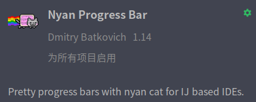

### GitToolBox

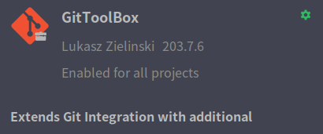

## 自定义代码块

- 打开File->Settings->Editor->Live Templates
    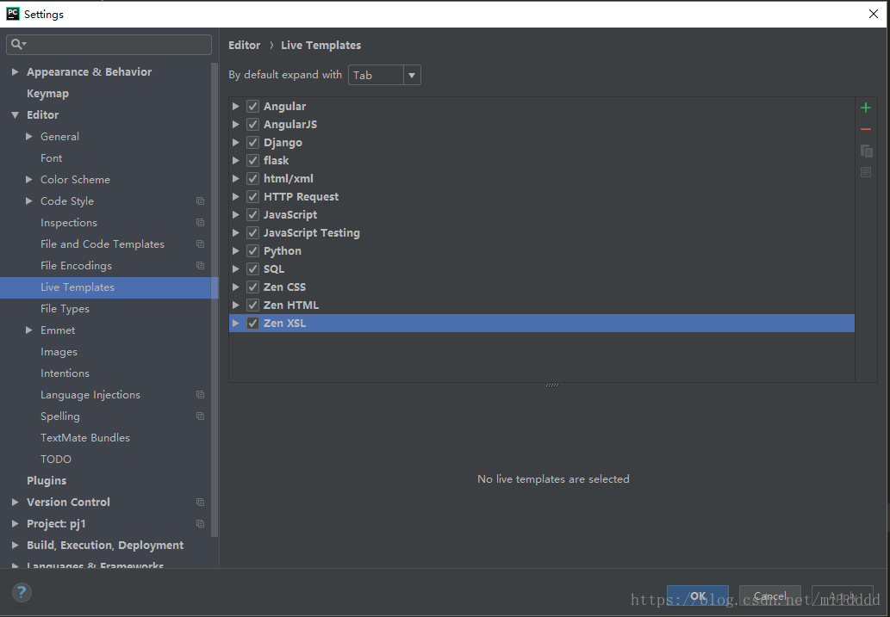

- 打开需要创建的程序下拉菜单，然后点击右侧“+”号并选择Live Template
    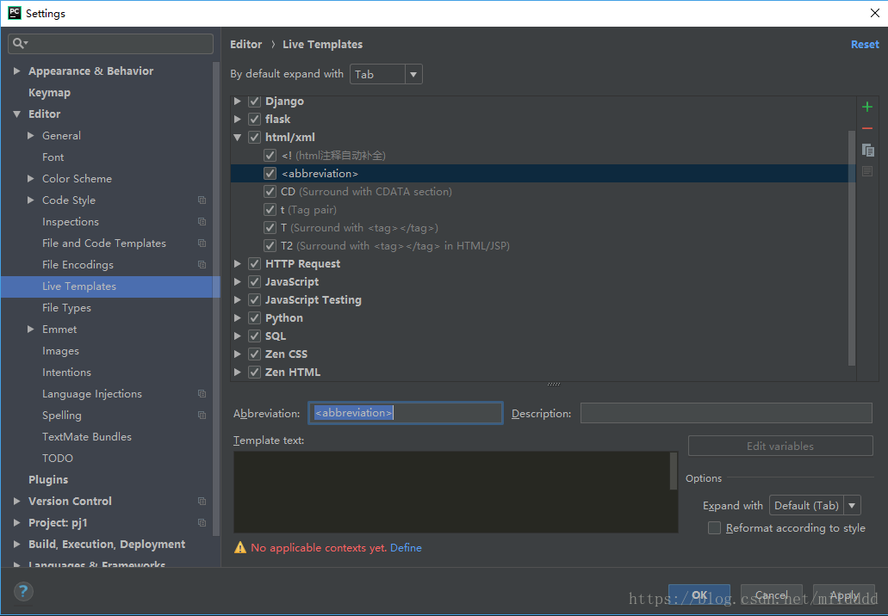

- 编辑自动补全：

    - 修改为触发词

    - Description为解释内容
    - 最下面红字，点击后面的Define选择适用语言
    - 右侧option选择触发按键
        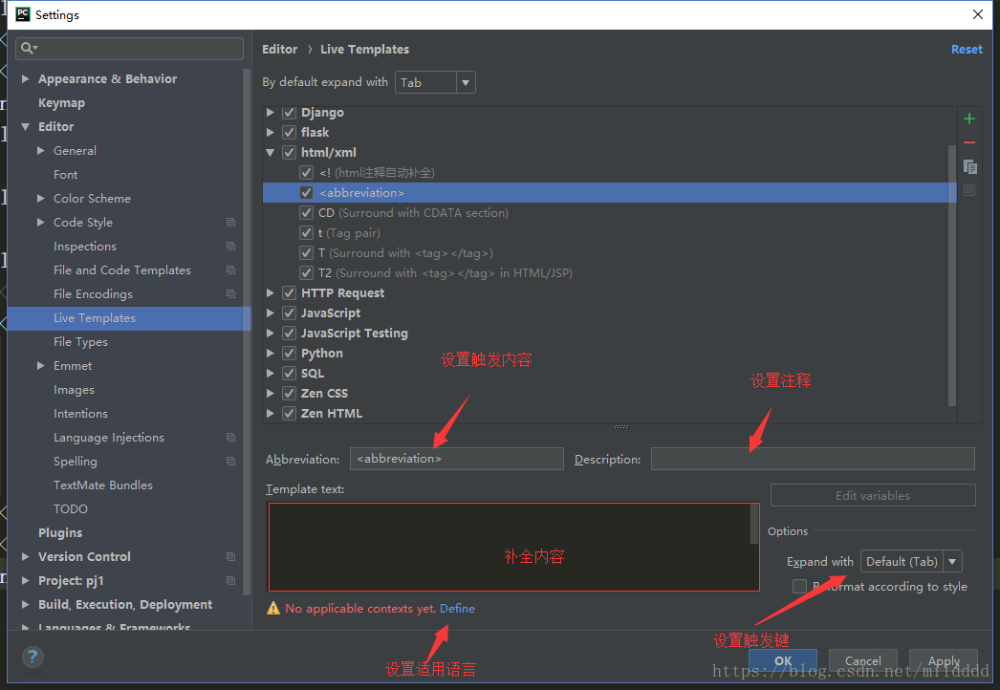

- 点击applay就完成设置。比如下图的设置，在HTML文件里输入`，然后按Tab键就会补全称为``
    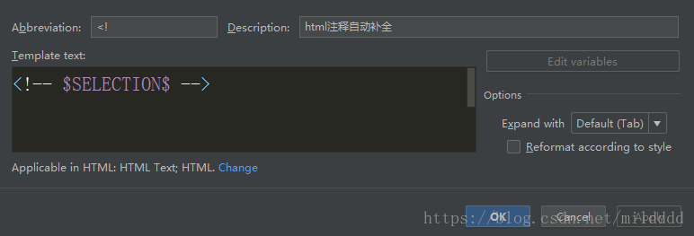