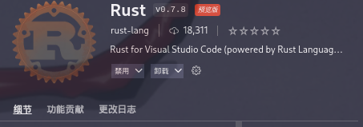

----------------------------------------------
> *Made By Herolh*
----------------------------------------------

# 目录 {#index}

[TOC]


--------------------------------------------

# 配置

## 常用插件

### 主题

#### Material Theme


#####            (配套)


#### Dracula Official


### 半透明

#### Windows opacity

只支持window，安装完成后，可能会有默认的透明度，如果想修改可点击 文件(File)->首选项(Preferences)->设置(Settings),在搜索框搜索`winopacity.opacity`这个参数，可设置为0~255,255是完全不透明。


 慎改成0，如果不小心改成了0，会看不到窗口的（鼠标也选中不了，其实还能接收键盘输入）不要动键盘鼠标，盲按删除键，再写个大概100 ~ 255之间的数就能看见了。实在不行修改 `C:\Users\自己的用户名\AppData\Roaming\Code\User` 下的 `settings.json` 文件的 `winopacity.opacity` 参数。


#### GlassIt-VSC

> VS Code Extension to set window to transparent on Windows and Linux platforms.


​	可能会找不到插件，因为 OSS 版的 vscode 由于担心许可问题，现在默认不使用 ms 的商店。但我认为实际并无许可问题。可以手动修改 `/usr/lib/code/product.json` 的 “extensionGallery” 字段，重新使用 ms 商店。去windows 下 的 vscode 里复制。

```shell
"extensionsGallery": {
		"serviceUrl": "https://marketplace.visualstudio.com/_apis/public/gallery",
		"cacheUrl": "https://vscode.blob.core.windows.net/gallery/index",
		"itemUrl": "https://marketplace.visualstudio.com/items",
		"controlUrl": "https://az764295.vo.msecnd.net/extensions/marketplace.json",
		"recommendationsUrl": "https://az764295.vo.msecnd.net/extensions/workspaceRecommendations.json.gz"
	},
```

- 首先下载插件 `GlassIt-VSC`

- 按 `F1` 进入设置页面

    > ##### 搜索打开`工作区设置`，进入设置页面后搜索 `glassit.alpha`，然后就可以设置透明度了.

    【快捷键：透明度提高 (Ctr + Alt +Z)，透明度降低 (Ctr + Alt +C)】


### Docker


### Project Manager

工作中，我们经常会来回切换多个项目，每次都要找到对应项目的目录再打开，比较麻烦。Project Manager 插件可以解决这样的烦恼，它提供了专门的视图来展示你的项目，我们可以把常用的项目保存在这里，需要时一键切换，十分方便。


### Image preview

> 图片预览


### vscode-icons

改变编辑器里面的文件图标


### settings sync

在不同电脑间同步你的插件。需要 github 账号辅助的


## 常用配置

### markdown 预览

> 配合 `Image preview` 插件食用更佳

#### Markdown All in One (在用)


#### Markdown Preview Github Styling

以 GitHub 风格预览 Markdown 样式，十分简洁优雅。就像下面这样，左侧书写 Markdown 文本，右侧预览 Markdown 的渲染效果：


### 前端开发环境

#### HTML

##### 编写 HTML 文件

在项目内新建 .html 文件，VScode 并不知道你想要写什么，在第一行输入 `!`，然后按下 Tab 即可快速生成标准的 HTML 代码。

```html
<!DOCTYPE html>
<html lang="en">
<head>
    <meta charset="UTF-8">
    <meta http-equiv="X-UA-Compatible" content="IE=edge">
    <meta name="viewport" content="width=device-width, initial-scale=1.0">
    <title>Document</title>
</head>
<body>
    
</body>
</html>
```


##### 运行 HTML 文件

###### View In Browser


&emsp;&emsp;安装完成后，返回你要运行的文件界面，右击该文件，选择 “View In Browser” 选项，即可在默认浏览器中运行该文件。VScode 不会像 HBuilder 那样每次运行前提示保存，所以每次运行前请先手动保存。


###### Live Server


部分情况下 *View In Browser* 会出现找不到浏览器的情况, 可以试试这个插件


#### HTML Snippets

智能提示 HTML 标签，以及标签含义


##### Auto Rename Tag

自动完成另一侧标签的同步修改


#### javascript

##### JavaScript (ES6) code snippets

ES6 语法智能提示以及快速输入，除 js 外还支持.ts，.jsx，.tsx，.html，.vue，省去了配置其支持各种包含 js 代码文件的时间。


#### Css

##### HTML CSS Support

让 html 标签上写 class 智能提示当前项目所支持的样式


#### Vue 开发环境

##### Vetur


[插件文档地址](https://marketplace.visualstudio.com/items?itemName=octref.vetur)

Vetur 不用说了吧，开发 Vue 必装的一个插件, 未安装之前 vue 文件显示这样的


安装完成后显示这样的，看着舒服多了


##### Vue 2 Snippets


[插件文档地址](https://marketplace.visualstudio.com/items?itemName=hollowtree.vue-snippets)，主要加强 vue 的便捷写法


### python 开发环境

#### 插件

##### python

安装完成后需要重新加载 VSCode 使插件生效。


#### 配置 Python 环境

在 VSCode 中点击状态栏左下角的 Python 图标，然后选择 Python 解释器：


#### 错误提示和格式化

Python 默认的语法提示工具是 PyLint，也可以选择其他的 linter 工具，比如 flake8。flake8 是 Python 官方发布的一款静态代码检查工具，如果想使用它的话首先用 `pip install flake8` 安装；另外，在保存代码的时候 VSCode 可以自动进行 code formatting ，这个功能默认是关闭的且工具是 autopep8 , 如果想使用 yafp，则继续在命令行工具中用命令 `pip install yapf` 安装。 安装好这两个工具之后在 VSCode 的配置文件中进行设置：


### go 开发环境

#### 下载 Go 插件


- 创建一个项目（文件夹）然后打开他（左上角的 File -> Open Folder）

- 然后点击下方的 TERMINAL，输入命令 `go mod init 项目名`，会创建一个新的 `go.mod`

    

- 新建一个 Go 文件， VSCode 会激活 Go 插件，提示的工具全部安装就行了，等待安装完成，我们的 VSCode 就可以正常使用了


### rust 开发环境

#### rust 插件




### Flutter 开发环境

#### Dart 插件


#### code runner


## 个人喜好

### 显示代码的行号

VS Code 默认显示代码的行号。你可以在设置项里搜索 `editor.lineNumbers`修改设置，配置项如下：


### 面包屑（Breadcrumb）

打开 VS Code 的设置项，选择「用户设置 -> 工作台 -> 导航路径」，如下图所示：


上图中，将红框部分打钩即可。设置成功后，我们就可以查看到当前文件的「层级结构」，非常方便。如下图所示：


### 去除窗口标题框

在 Vscode 设置中找到 `Title Bar Style`，将值改为 `custom`


### 修改系统界面和编辑面板字体大小

> Linux 下新安装的 VS Code 可能字体很小，包括系统字体（标题栏，工具栏、状态栏）和编辑面板的字体很小。

Ctrl + Shitf + p，输入 settings，选择打开那个 JSON 的系统配置文件：

```shell
    "editor.fontSize": 18,
    "window.zoomLevel": 1.25
```

修改这两个值即可，第一个是编辑面板的，第二个是系统界面的。没有则新增。


## 配置同步

### 上传配置

- 在VSCode扩展商店中搜索 “Settings Sync”并安装，安装完后，可以重启一下VSCode（可以不重启）。

    

- 在 VSCode 程序中任意位置使用快捷键 “Ctrl+Shift+P”，输入 sync，点击 Sync: Upload / Update Settings

    

- 首次使用快捷键 “Ctrl+Alt+U” 可以跳转到 sync 扩展的如下图配置页面，点击图中标注的按钮，跳转至 GITHUB 登录授权页

    

- 正常只要你默认的浏览器登录了github，他会自动跳转授权页面，没有登录过的或者没有注册过的用户需要自行注册和登录。

    

- 在浏览器中授权后，回到VSCode程序，如果有多个授权令牌，需要手动选择要在本地使用哪个令牌，我这里不经意多点了几次，就多了一个令牌，正常新配置的一个令牌都没，只要点击下面的大按钮跳过即可，他会自动创建一个。

    

- 同步扩展插件配置好以后我们就可以上传我们的配置信息了。（使用快捷键“Ctrl+Alt+U”）

    


### 新设备同步配置

- 同理，需要在新设备的VSCode安装相同的扩展配置。

- 使用快捷键“Ctrl+Alt+U”可以跳转到sync扩展的如下图配置页面，点击图中标注的按钮，跳转至GITHUB登录授权页。

- 授权成功！回到VSCode程序。

    

- 这里有一点，不能像上面最初配置的一样直接点SKIP跳过，这里要手动选择跟上面生成的令牌对应的选项。（这里我第一个选项是对应刚才sync提示的令牌）
- 配置好sync扩展后，接下来就是下载我们的配置，全局命令快捷键“Ctrl+Shift+P”输入 sync，点击 Sync: Download Settings进行下载同步。 K
