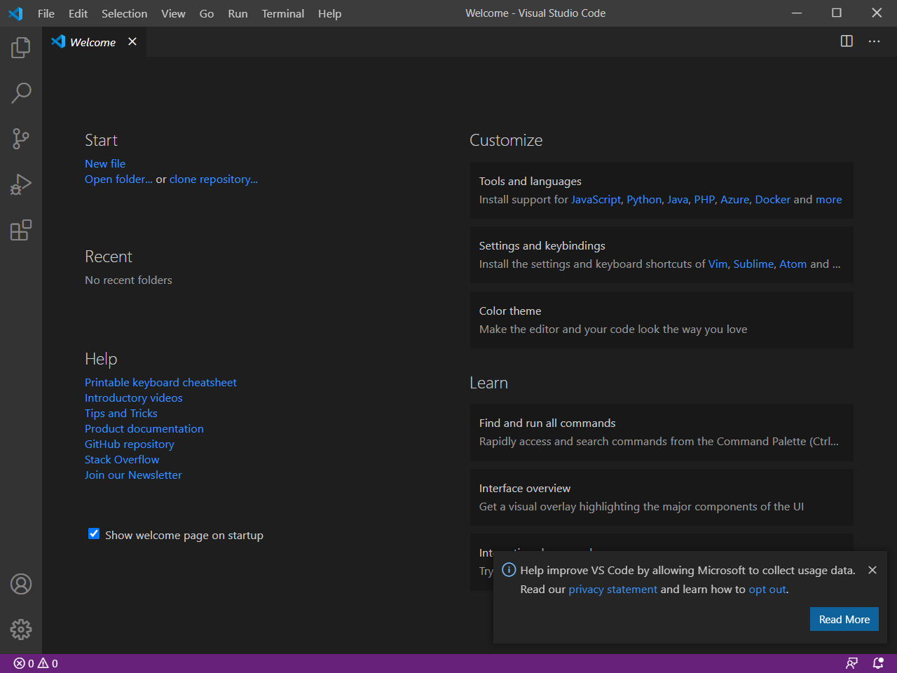
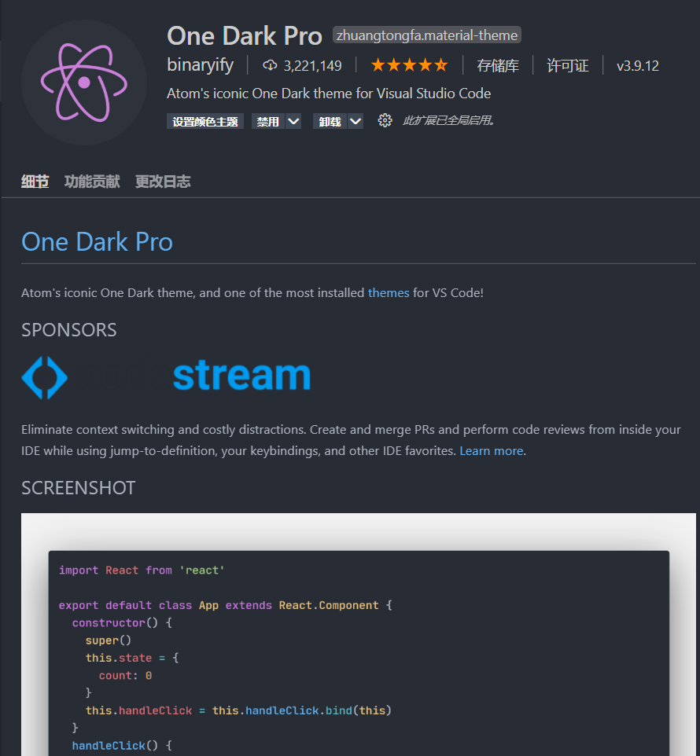
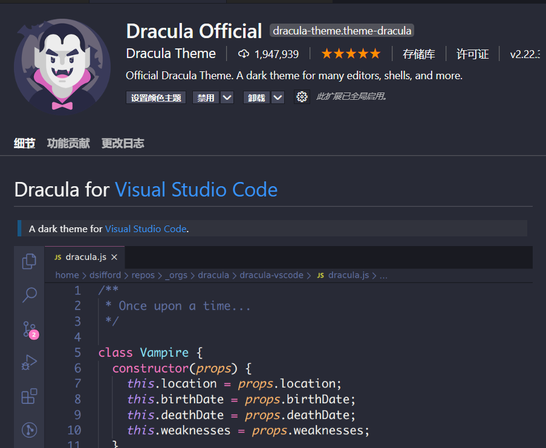
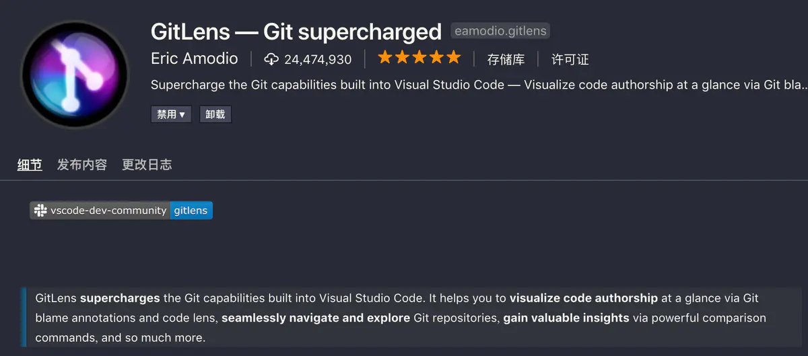
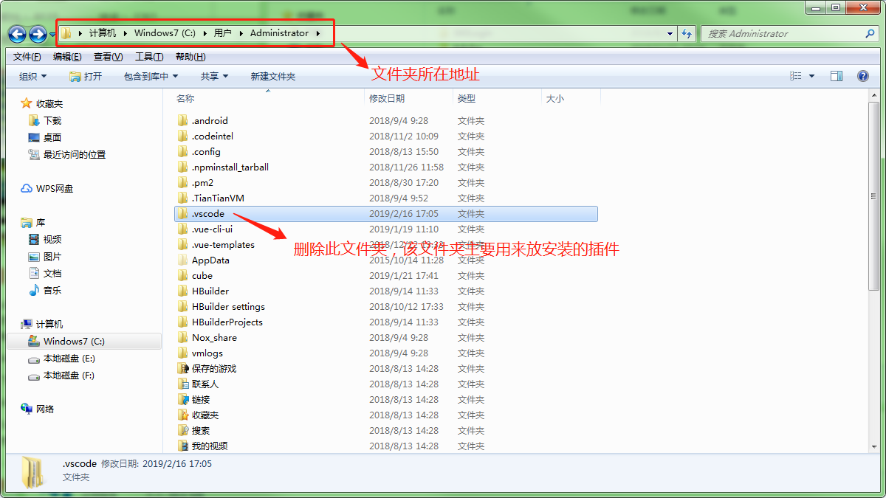
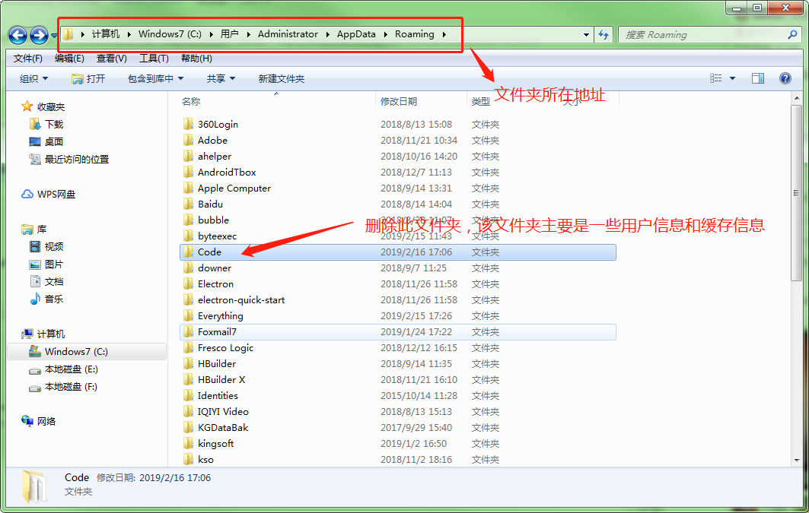

----------------------------------------------
> *Made By Herolh*
----------------------------------------------

# 目录 {#index}

[TOC]

--------------------------------------------

# 安装

> [官方下载地址](https://code.visualstudio.com/)

无脑安装

# 初始化配置

## 基本插件

###  中文汉化包

> Chinese(Simplified) Language Pack for Visual Stidio Code

对于一些英文不太好的小伙伴，上来第一件事肯定是要切换成中文语言环境，安装汉化包插件之后，按快捷键 `Ctrl+Shift+P` 调出命令面板，输入`Configure Display Language`，选择` zh-ch`，然后重启vs code即可。

 

### 主题

#### One Dark Pro

#### Dracula Official

>  吸血鬼主题（本人目前使用的一款）

### GitLens 查看 Git 信息

将光标移到代码行上，即可显示当前行最近的commit信息和作者，多人开发的时候十分有用，责任到人，防止甩锅。

# 完全卸载

> [博客园 - 彻底删除vscode及安装的插件和个人配置信息](https://www.cnblogs.com/muou2125/p/10388440.html)

- **卸载vscode应用软件**

    进入控制面板里面进行卸载，此步骤虽然删掉了应用软件，但是此时重新安装会发现之前下载的插件和个人配置信息都还会重新加载出来

- **卸载 vscode 插件**

    找到下图中文件夹的目录，然后将之删除，即可彻底清除已安装的插件个个人配置信息

    

- **删除用户信息与缓存**

    