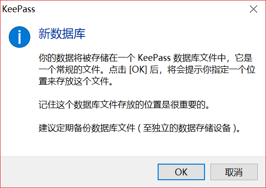
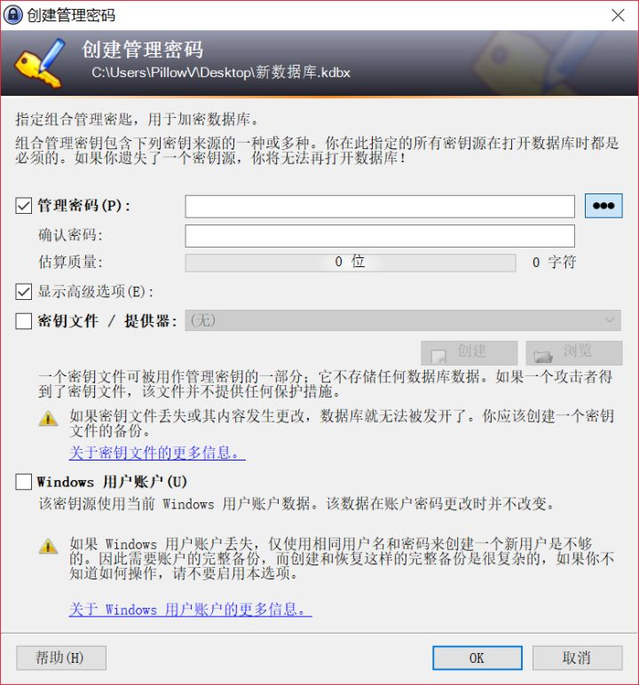
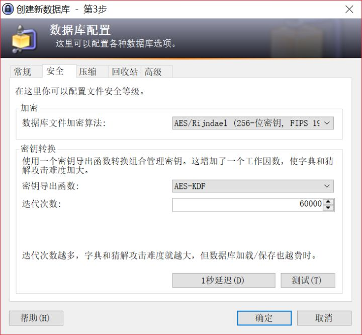

----------------------------------------------
> *Made By Herolh*
----------------------------------------------

# KeePass 使用指南 {#index}

[TOC]

--------------------------------------------

免费、开源、功能强大、多平台使用，密码数据库保存在本地。

https://zhuanlan.zhihu.com/p/35907865

## KeePass 的下载安装

[官方下载页](https://link.zhihu.com/?target=https%3A//keepass.info/download.html)

分为安装版和非安装版，根据需要下载。

[中文包](https://link.zhihu.com/?target=https%3A//downloads.sourceforge.net/keepass/KeePass-2.38-Chinese_Simplified.zip)

中文包解压缩后放在 keepass 目录的 Languages 目录中。然后进入 “View”-“Change Language...” 选择简体中文语言包，并点击确定重启。

重启后 keepass 应该就是中文界面了，打开 keepass，点击软件左上角的“文件”-“新建”创建一个新的密码数据库

点击 ok 后选定一个位置保存，可以用一个临时位置比如桌面（以后这个数据库文件可以随时剪切去别的地方）。选定密码数据库位置后，需要创建管理密码：

密钥文件是一个密码校验文件，如果选择了密钥文件，则以后打开数据库除了密码还需要这个密钥文件才能打开，可以选择以提高安全性。密钥文件可以是一个文本，一张图片，一个表情包或者一个key文件等等等等。你甚至可以用你的身份证扫描件或者你喜欢的大姐姐视频做密钥文件。

注意！！windows用户账户千万别勾选！！

密码创建后就是创建数据库文件，其他选项都不重要，重要的是安全这一步：

你可以选择你喜欢的加密方式，如果不懂的话（比如我），随便改改不用默认的就是了（不负责任）。下一步：

我会好好保管我的数据库，密码以及密钥文件的，所以我没打印，有需要的可以打印。

然后数据库就打开了，打开后的数据库别急着生成密码，先做以下几个配置

在“工具”-“生成密码表”中，将你以后需要自动生成的密码规则选好，包括密码长度和所需字符，以后新建密码的自动生成就是按这个规则生成的。

