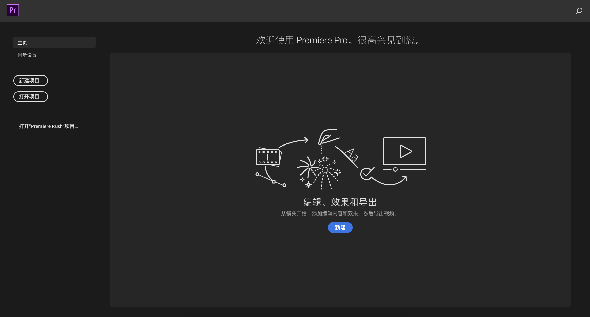
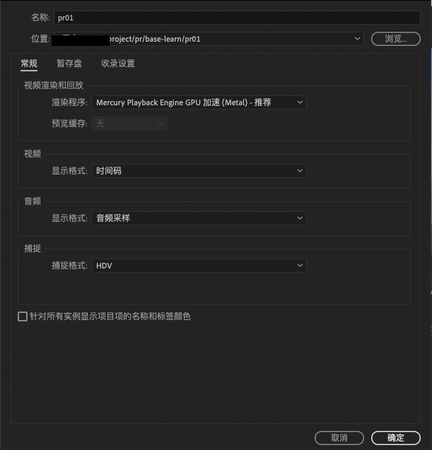
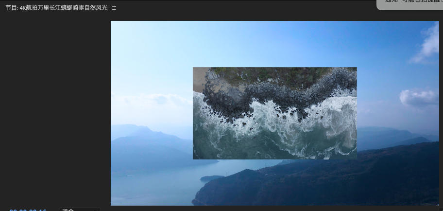
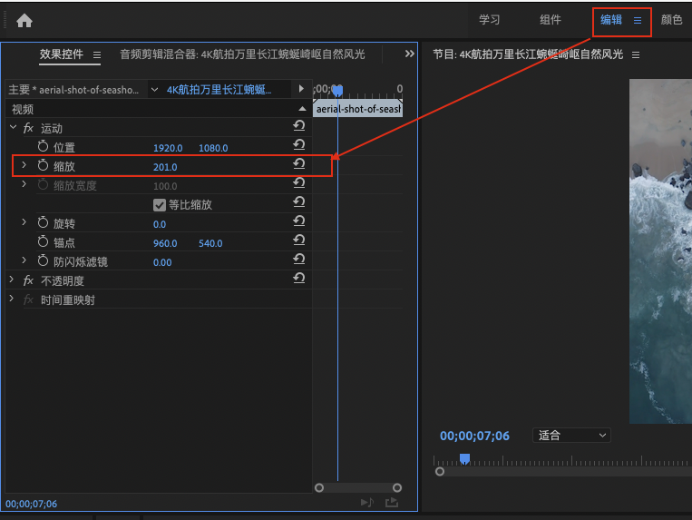
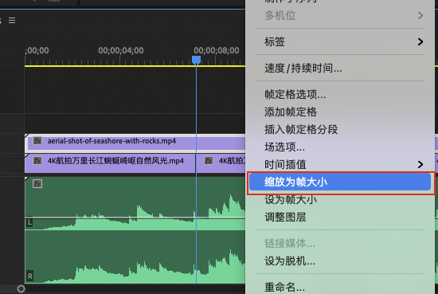

----------------------------------------------
> *Made By Herolh*
----------------------------------------------

# Adobe Premiere Pro 基本使用 {#index}

[TOC]

 

--------------------------------------------

## 文档版本

|    时间    | 修改人 | 内容     |
| :--------: | :----: | :------- |
| 2021-09-11 | Herolh | 文档创建 |
|            |        |          |

## 简介

> [知乎 - 马克笔Mkbi - 【Pr教程】快速入门Adobe Premiere](https://zhuanlan.zhihu.com/p/57551463)

&emsp;&emsp;Adobe Premiere 是 Adobe 家族的一款剪辑软件，用于视频段落的组合和拼接， 并提供了一定的特效和调色功能，它给我的感觉就是入门快、功能强大，无论是对于新手还是专业人士，pr在大部分情况下都是很友好的。

## 基本界面

### 新建项目

## 快捷键

### 全局

| 快捷键   | 说明     | 备注               |
| -------- | -------- | ------------------ |
| Ctrl + m | 导出媒体 | mac 为 command + m |
|          |          |                    |
|          |          |                    |

### 时间轴

|      快捷键      | 说明                     | 备注                             |
| :--------------: | ------------------------ | -------------------------------- |
|        c         | 剃刀工具                 | 对素材进行切割                   |
|        v         | 选择工具                 | 对素材进行移动                   |
|    Alt + 滚轮    | 左右缩放时间轴的显示比例 | 鼠标放在 A1 或 V1 上面会上下缩放 |
|        m         | 标记                     |                                  |
|    shift + m     |                          |                                  |
| ctrl + shift + m |                          |                                  |

### 检视器

| 快捷键 | 说明     | 备注 |
| ------ | -------- | ---- |
| i      | 视频入点 |      |
| o      | 视频出点 |      |
|        |          |      |

## 工作流程

## 常见问题

### 视频或图片没铺满整个监视器

#### 解决方法

##### 法一： 编辑缩放

> 点击编辑面板， 点选效果控件，调缩放大小

##### 法二： 缩放为帧大小

> 右键时间轴里的视频，点击缩放为帧大小

