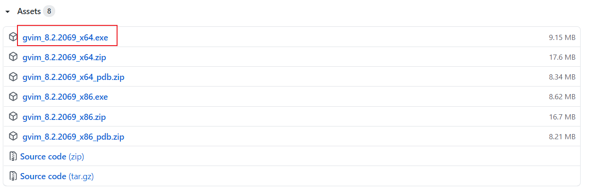
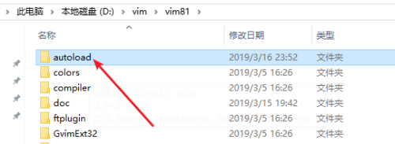
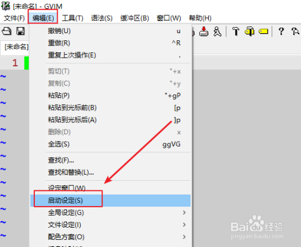
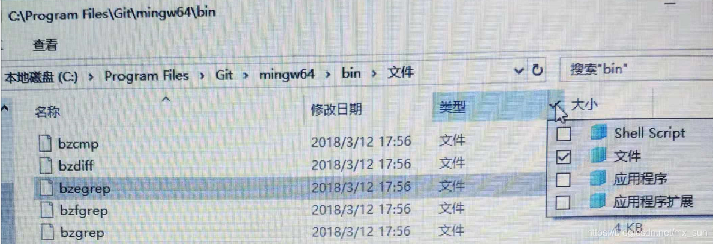

----------------------------------------------
> *Made By Herolh*
----------------------------------------------

# 目录 {#index}

[TOC]


--------------------------------------------

# 软件介绍

&emsp;&emsp;Vim 是 Linux 上的著名的文本编辑器，他是早年的 Vi 编辑器的加强版。这个 GVim 是 windows 版的，并且有了标准的 windows 风格的图形界 面，所以叫 g(graphical)Vim。这是一个国际版本，会根据安装的平台自动选择相应语言包，支持中文及其各种编码，连界面也是中文的，请放心使 用。这个极具 Unix 特色和风格(simple is the best)的编辑器相信会给您带来不同的感受。

——[开源中国 -  Windows版的VIM编辑器](https://www.oschina.net/p/gvim)


# Gvim 的下载、安装

下载地址：[Releases · vim/vim-win32-installer](https://github.com/vim/vim-win32-installer/releases)



下载后点击一步步默认安装即可，安装类型可选择`完全安装`。


# 配置

&emsp;&emsp;进行下一步之前，了解一下 vim 配置文件的位置：位于家目录下的`.vimrc`(Linux、Mac) 和`_vimrc`(Windows)，因此配置我们会在家目录下的 `_vimrc`  下操作 (若没有则手动创建，无后缀名)，最终配置文件是：`C:\Users\youname\_vimrc`，配置文件的注释为英文的双引号：`"`。

配置参考：[Gvim 的安装及配置](https://blog.csdn.net/was172/article/details/90326173)

```shell

"""""""""""""""""""""""""""""""""""""""""""""""""""""""""""""""""""""""
" 隐藏GVIM菜单及设置
"""""""""""""""""""""""""""""""""""""""""""""""""""""""""""""""""""""""
" 窗口大小
set lines=35 columns=140
" 分割出来的窗口位于当前窗口下边/右边
set splitbelow
set splitright
"不显示工具/菜单栏
set guioptions-=T
set guioptions-=m
set guioptions-=L
set guioptions-=r
set guioptions-=b
" 使用内置 tab 样式而不是 gui
set guioptions-=e
set nolist

" Vim 的默认寄存器和系统剪贴板共享
set clipboard+=unnamed
" 设置 alt 键不映射到菜单栏
set winaltkeys=no
"Vim 会在离开 Insert 模式时自动切换至英文输入法，回到Insert 切回原来的
set noimdisable


"""""""""""""""""""""""""""""""""""""""""""""""""""""""""""""""""""""""
" 缓存设置
"""""""""""""""""""""""""""""""""""""""""""""""""""""""""""""""""""""""
set nobackup        "设置不备份
set noswapfile      "禁止生成临时文件
set autoread        "文件在vim之外修改过，自动重新载入
set autowrite       "设置自动保存
set confirm         "在处理未保存或只读文件时，弹出确认


" 背景透明
au GUIEnter * call libcallnr("vimtweak.dll", "SetAlpha", 220) 
"最大化窗口 
map <F11> :call libcallnr("vimtweak.dll","EnableMaximize",1)<cr>
map <F12> :call libcallnr("vimtweak.dll","EnableMaximize",0)<cr>


"""""""""""""""""""""""""""""""""""""""""""""""""""""""""""""""""""""""
" 通用设置
"""""""""""""""""""""""""""""""""""""""""""""""""""""""""""""""""""""""
" 定义 leader 键
let mapleader=" "

" 按下 Tab 键时，Vim 显示的空格数。
set tabstop=4
" 如果行尾有多余的空格（包括 Tab 键），该配置将让这些空格显示成可见的小方块。
"set listchars=tab:?\ ,trail:■
set list

" 不同模式下光标样式不一样(兼容性不强)
"let &t_SI = "\<Esc>]50;CursorShape=1\x7"
"let &t_SR = "\<Esc>]50;CursorShape=2\x7"
"let &t_EI = "\<Esc>]50;CursorShape=0\x7"
" 调整配色
" let &t_ut=''
"开启256色支持
set t_Co=256
set guifont=Consolas:h12

" 打开语法高亮。自动识别代码，使用多种颜色显示。
syntax on
"开启语法高亮功能
syntax enable       


" 不与 Vi 兼容（采用 Vim 自己的操作命令
set nocompatible
" vim 默认是 vi 兼容的。解决退格键会失效问题
set backspace=indent,eol,start

" 显示行号
set number
" 显示光标所在的当前行的行号，其他行都为相对于该行的相对行号。
set relativenumber
" 光标所在的当前行高亮。
set cursorline
"总是显示光标的位置
set ruler
"允许光标出现在最后一个字符的后面
set virtualedit=block,onemore
"设置光标键跨行
" set whichwrap+=<,>,h,l，


"是否显示状态栏。0 表示不显示，1 表示只在多窗口时显示，2 表示显示。
set laststatus=2
" 命令模式下，在底部显示，当前键入的指令。比如，键入的指令是2y3d，那么底部就会显示2y3，当键入d的时候，操作完成，显示消失。
set showcmd
"命令模式下，底部操作指令按下 Tab 键自动补全。第一次按下 Tab，会显示所有匹配的操作指令的清单；第二次按下 Tab，会依次选择各个指令。
set wildmenu
"补全时不显示窗口，只显示补全列表
set completeopt-=preview
"设置命令行高度
set cmdheight=2
" 在底部显示，当前处于命令模式还是插入模式。
set wildmode=longest:list,full
" 确保页面顶部和底部永远有五行显示
"set scrolloff = 5


" 自动切换工作目录。这主要用在一个 Vim 会话之中打开多个文件的情况，默认的工作目录是打开的第一个文件的目录。该配置可以将工作目录自动切换到，正在编辑的文件的目录。
set autochdir
" 支持使用鼠标
" set mouse=a


"""""""""""""""""""""""""""""""""""""""""""""""""""""""""""""""""""""""
" 编码设置
"""""""""""""""""""""""""""""""""""""""""""""""""""""""""""""""""""""""
" 设置编码格式为 utf-8
set encoding=utf8
set langmenu=zh_CN.GBK
set helplang=cn
set termencoding=utf-8
set encoding=utf8
set fileencodings=utf8,ucs-bom,gbk,cp936,gb2312,gb18030


source $VIMRUNTIME/delmenu.vim
source $VIMRUNTIME/menu.vim


"""""""""""""""""""""""""""""""""""""""""""""""""""""""""""""""""""""""
" 搜索设置
"""""""""""""""""""""""""""""""""""""""""""""""""""""""""""""""""""""""
" 搜索时，高亮显示匹配结果
set hlsearch 
exec "nohlsearch"
" 输入搜索模式时，每输入一个字符，就自动跳到第一个匹配的结果。
set incsearch                                                                           
" 搜索时忽略大小写。
set ignorecase  
" 如果同时打开了ignorecase，那么对于只有一个大写字母的搜索词，将大小写敏感；其他情况都是大小写不敏感。比如，搜索Test时，将不匹配test；搜索test时，将匹配Test。
set smartcase 
"取消搜索高亮
noremap <LEADER><CR> :nohlsearch<CR>


" 按键映射
map s <nop>
map S :w<CR>
map <C-s> :w!<CR>
map Q :wq!<CR>
vnoremap <C-c> "+y
noremap <C-v> "+p
"在插入模式中使用Ctrl+v粘贴全局剪贴板内容
inoremap <C-v> <esc>:set paste<cr>mui<C-R>+<esc>mv'uV'v=:set nopaste<cr>

map MV :source $MYVIMRC<CR>
"快速打开vim配置文件：_vimrc
nnoremap <leader>e :e ~/_vimrc<CR>

"快速移动光标
noremap H 0
noremap J 10j
noremap K 10k
noremap L $

" 插入模式下快速移动光标
inoremap <C-o> <Esc>o  
inoremap <C-l> <Esc>$a
inoremap <C-h> <Esc>0i
inoremap <C-k> <Up>
inoremap <C-j> <Down>
inoremap <C-b> <PageUp>
inoremap <C-f> <PageDown>

" 分屏映射
map sr :set splitright<CR>:vsplit<CR>
map sl :set nosplitright<CR>:vsplit<CR>
map su :set nosplitbelow<CR>:split<CR>
map sb :set splitbelow<CR>:split<CR>

" 分屏下光标移动方向
map <LEADER>l <C-w>l
map <LEADER>k <C-w>k
map <LEADER>h <C-w>h
map <LEADER>j <C-w>j

" 每次打开文件，光标会停留在关闭之前的位置
au BufReadPost * if line("'\"") > 1 && line("'\"") <= line("$") | exe "normal! g'\"" | endif

"设置开启文件类型侦测
filetype on     
"加载对应文件类型插件
filetype plugin on
"自适应不同语言的智能缩进
filetype indent on

call plug#begin('~/.vim/plugged')
" 显示模式
Plug 'vim-airline/vim-airline'
" snazzy 配色
Plug 'connorholyday/vim-snazzy'
Plug 'dracula/vim', { 'as': 'dracula' }

" File navigation
Plug 'scrooloose/nerdtree', { 'on': 'NERDTreeToggle' }
Plug 'Xuyuanp/nerdtree-git-plugin'

Plug 'mhinz/vim-signify'
Plug 'gisphm/vim-gitignore', { 'for': ['gitignore', 'vim-plug'] }

" Markdown
Plug 'iamcco/markdown-preview.nvim', { 'do': { -> mkdp#util#install_sync() }, 'for' :['markdown', 'vim-plug'] }
Plug 'dhruvasagar/vim-table-mode', { 'on': 'TableModeToggle' }
Plug 'ferrine/md-img-paste.vim'
" 个人维基
" Plug 'vimwiki/vimwiki'
"
" 纯净阅读
Plug 'junegunn/goyo.vim' 


" Auto Complete
"Plug 'Valloric/YouCompleteMe'

call plug#end()


" 背景半透明
" let g:SnazzyTransparent = 1

"开启snazzy 配色
" color snazzy
color dracula

" ===
" === NERDTree
" ===
" 打开 NERDTree
map ff :NERDTreeToggle<CR>
" 通过ctrl h/l切换标签等
nnoremap <C-l> gt
nnoremap <C-h> gT
" 建立对指定文件新的tab 
nnoremap <leader>tt : tabe<CR>
"关闭当前的 tab 
nnoremap <leader>tc : tabc<CR>
"关闭所有其他的 tab 
nnoremap <leader>to : tabo<CR>


" ===
" === Goyo
" ===
map <LEADER>gy :Goyo<CR>


" ===
" === MarkdownPreview
" ===
"打开文件后自动弹出, 0 为否"
let g:mkdp_auto_start = 0
"关闭文件后自动关闭预览窗口, 1 为是
let g:mkdp_auto_close = 0
"慢速预览, 修改后退出 insert 模式后方会刷新视图, 1 为是
let g:mkdp_refresh_slow = 0
let g:mkdp_command_for_global = 0
"开启公网链接, 0 为否
let g:mkdp_open_to_the_world = 0
let g:mkdp_open_ip = ''
"指定浏览器, 默认会跟随系统浏览器
let g:mkdp_browser = 'chrome'
let g:mkdp_echo_preview_url = 0
let g:mkdp_browserfunc = ''
let g:mkdp_preview_options = {
    \ 'mkit': {},
    \ 'katex': {},
    \ 'uml': {},
    \ 'maid': {},
    \ 'disable_sync_scroll': 0,
    \ 'sync_scroll_type': 'middle',
    \ 'hide_yaml_meta': 1
    \ }
let g:mkdp_markdown_css = ''
let g:mkdp_highlight_css = ''
let g:mkdp_port = ''
"指定浏览器窗口标题, 默认为 Markdown 文件名
let g:mkdp_page_title = '「${name}」'

autocmd FileType markdown nmap <buffer><silent> <leader>i :call mdip#MarkdownClipboardImage()<CR>
let g:mdip_imgdir = '.assets'
let g:mdip_imgname = 'image'


" ===
" === vim-table-mode
" ===
map <LEADER>tt :TableModeToggle<CR>


" Compile function
map <LEADER>r :call CompileRunGcc()<CR>
func! CompileRunGcc()
  exec "w"
  if &filetype == 'c'
    exec "!g++ % -o %<"
    exec "!time ./%<"
  elseif &filetype == 'cpp'
    exec "!g++ % -o %<"
    exec "!time ./%<"
  elseif &filetype == 'java'
    exec "!javac %"
    exec "!time java %<"
  elseif &filetype == 'sh'
    :!time bash %
  elseif &filetype == 'python'
    silent! exec "!clear"
    exec "!time python3 %"
  elseif &filetype == 'html'
    exec "!firefox % &"
  elseif &filetype == 'markdown'
    exec "MarkdownPreview"
  endif
endfunc

map <LEADER>R :call CompileBuildrrr()<CR>
func! CompileBuildrrr()
  exec "w"
  if &filetype == 'vim'
    exec "source $MYVIMRC"
  elseif &filetype == 'markdown'
    exec "echo"
  endif
endfunc


"autocmd Filetype markdown map <leader>w yiWi[<esc>Ea](<esc>pa)
autocmd Filetype markdown inoremap ,f <Esc>/<++><CR>:nohlsearch<CR>c4l
autocmd Filetype markdown inoremap ,n ---<Enter><Enter>
autocmd Filetype markdown inoremap ,i ** <++><Esc>F*i
autocmd Filetype markdown inoremap ,b **** <++><Esc>F*hi
autocmd Filetype markdown inoremap ,d ~~~~ <++><Esc>F~hi
autocmd Filetype markdown inoremap ,cc `` <++><Esc>F`i
autocmd Filetype markdown inoremap ,cd ```<Enter><++><Enter>```<Enter><Enter><++><Esc>4kA
autocmd Filetype markdown inoremap ,h ====<Space><++><Esc>F=hi
autocmd Filetype markdown inoremap ,p  <++><Esc>F[a
autocmd Filetype markdown inoremap ,a [](<++>) <++><Esc>F[a
autocmd Filetype markdown inoremap ,1 #<Space><Enter><++><Esc>kA
autocmd Filetype markdown inoremap ,2 ##<Space><Enter><++><Esc>kA
autocmd Filetype markdown inoremap ,3 ###<Space><Enter><++><Esc>kA
autocmd Filetype markdown inoremap ,4 ####<Space><Enter><++><Esc>kA
autocmd Filetype markdown inoremap ,5 #####<Space><Enter><++><Esc>kA
autocmd Filetype markdown inoremap ,6 ######<Space><Enter><++><Esc>kA
autocmd Filetype markdown inoremap ,l --------<Enter>
autocmd Filetype markdown inoremap ,t \|<Space><Esc>F\|li

```


## gvim 半透明

https://github.com/mattn/vimtweak


# 插件管理

## vim-plug

首先下载 vim-plug，可以去 github 下载。https://github.com/junegunn/vim-plug


下载完成后将其复制到 vim 安装目录下的 autoload 文件夹下，即可完成 vim-plug 的安装。



之后点击 gvim 的 “编辑”——“启动设定”，打开_vimrc 配置文件。



在_vimrc 中添加如下图所示的内容，这里以用 vim-plug 下载 nerdtree 插件为例。设置完成后保存设置。 ：


# 配置 git 的 vim 为 gvim

新建一个文件，名为 `gvim` , 输入下列代码:

```shell
 #!/bin/sh
"C:\Program Files (x86)\Vim\vim81\gvim.exe" $1 &
```

**代码解释：**第一行表示这是一个 shell 脚本，第二行双引号里面输入的是 `gvim` 的安装路径，`$1` 表示取命令之后输入的参数，`&` 表示在后台打开。

然后另存为到 “\Git\mingw64\bin” 目录下，“保存类型” 选择 All types：




```shell
git config --global core.editor gvim
```


# vim 和 markdown

