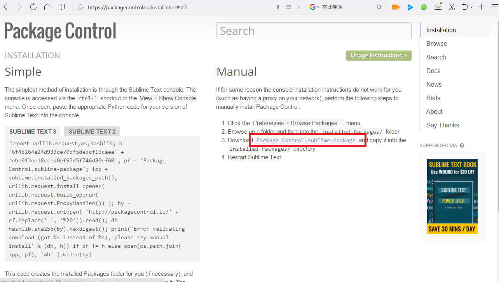
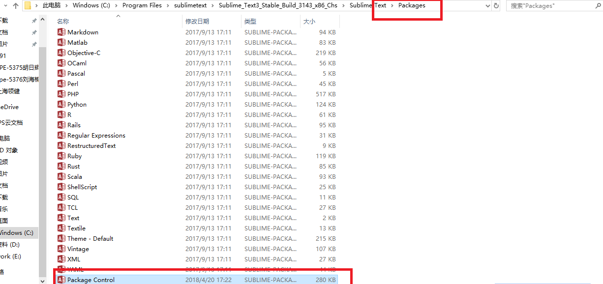

----------------------------------------------
> *Made By {Author}*
----------------------------------------------

# 目录 {#index}

[TOC]

--------------------------------------------

[官网](https://www.sublimetext.com/3)

# 常用插件

## Package Control

Package Control 用来方便的管理各种插件，其实他自己也是一个插件。

### 手动安装

进入页面，点击红框内的插件，下载到桌面（比较方便找到），附上下载地址：https://packagecontrol.io/installation#st3

下载完成后，打开 sublime text 3 的安装包，找到 sublime  text => Packages 文件夹，将我们上图中下载好的 package control 插件复制到这个文件中，再重新运行 sublime，就已经安装上了。

