----------------------------------------------
> *Made By Herolh*
----------------------------------------------

# ipad 基本使用 {#index}

[TOC]

--------------------------------------------

## 手势操作技巧

> [知乎 - topbook - 有哪些好用的 iPad 手势操作技巧？](https://zhuanlan.zhihu.com/p/362545678)

### 一指

- 从屏幕底端，轻划，打开程序坞 Dock 从屏幕底端

    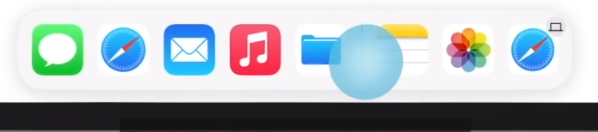

- 从屏幕底端，轻滑到中间位置并停住，打开运行程序列表从屏幕底端

    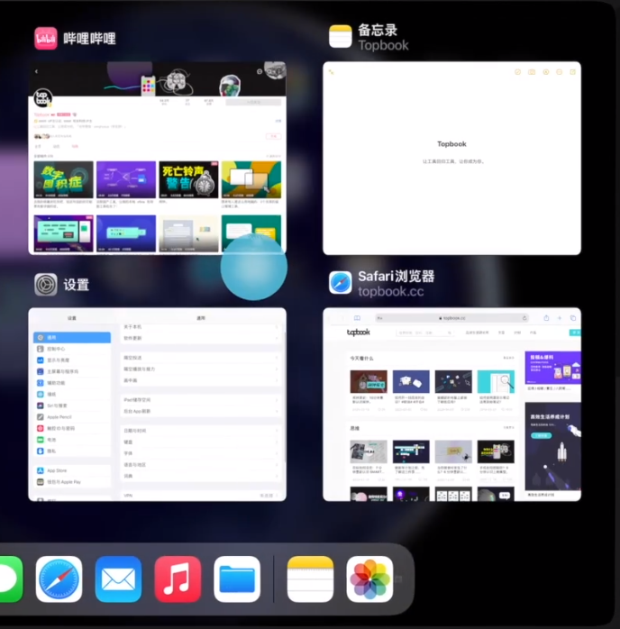

- 从屏幕底端，快滑到中间位置，快速返回桌面

- 从屏幕右上角，下划，打开控制中心

    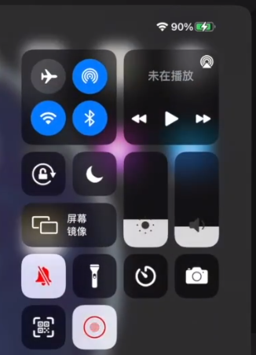

- 从屏幕顶部下滑，进入屏保界面

- 输入时，长按键盘空格，移动光标位置

    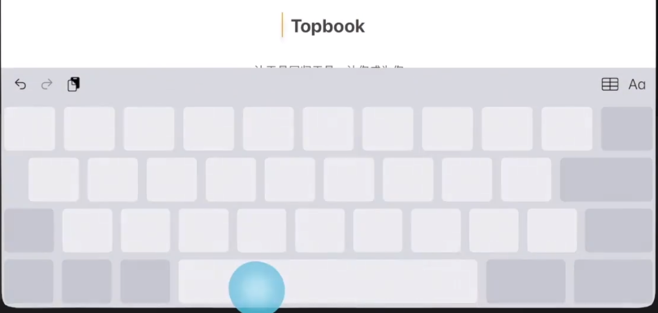

### 两指

- 捏合键盘，使其缩小为浮动键盘

    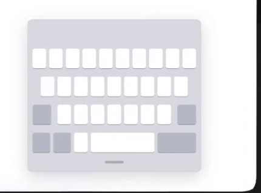

- 放大键盘，使键盘复原在大键盘上

    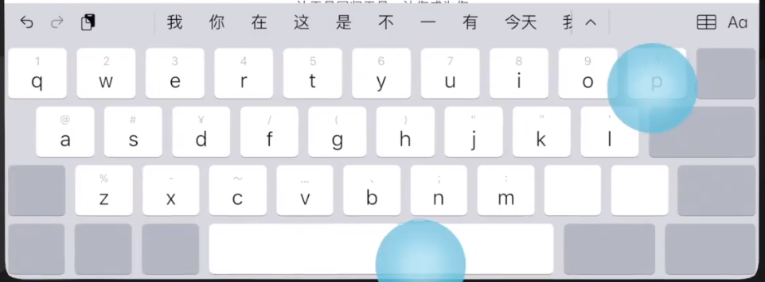

- 在大键盘上任意滑动，移动光标位置

- 在 QQ iPad 版中，使用两指，长按，截屏

### 三指

- 三指捏合，拷贝选中文字

    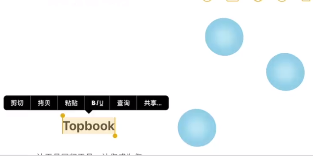

- 放开，粘贴剪切板拷贝

    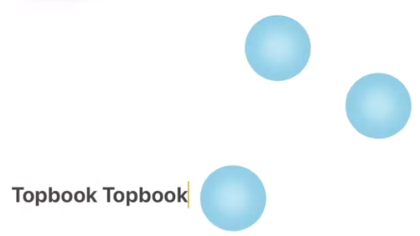

- 左划，撤销

    

- 右划，重做

    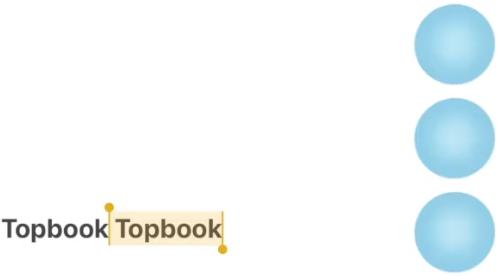

### 四指

- 快速上滑，退回主界面

- 小幅上滑，并停止，打开运行程序列表

- 左右滑动，切换最近打开程序

### 五指

- 捏合，并停住，打开运行程序列表
- 快速捏合，返回主界面
- 左右滑动，切换最近打开程序

### 分屏

打开某应用，从屏幕底部向上轻扫，打开 “程序坞”，轻触并按住想要打开的第二个应用，然后将它拖到屏幕上。

### 选词

- 两指在大键盘上轻点一下，选中一个词语
- 两指在大键盘上轻点两下，选中一段话
- 一指双击文字，选中一个词
- 三击文字，选中一段话。

## 外置键盘使用技巧

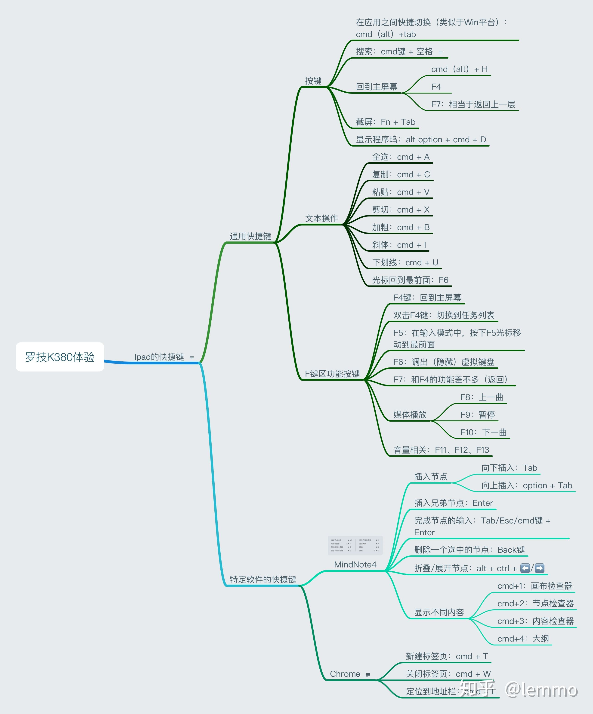

### 常用组合键

|         按键          |                             说明                             |
| :-------------------: | :----------------------------------------------------------: |
|      长按 `win`       |                    查看当前应用快捷键显示                    |
|    `win` + `space`    |              搜索 `win` + `f`: 应用内搜索               |
|      `win` + `h`      |                           回到屏幕                           |
|     `win` + `Tab`     | 在各个应用之间正向快速切换 `win` + `shift` + `Tab` : 反向切换 |
|  `win` + `alt` + `d`  |                          显示程序坞                          |
| `win` + `shift` + `3` | 拍摄屏幕截图 `win` + `shift` + `4`: 截图并进入编辑界面  |
| `win` + `Ctrl` + `Q`  |                           快速锁屏                           |

### 输入法

|       按键       |    描述    |
| :--------------: | :--------: |
| `Ctrl` + `space` | 输入法切换 |
|   `alt` + `;`    |   颜文字   |

- 颜文字： ait + ；

    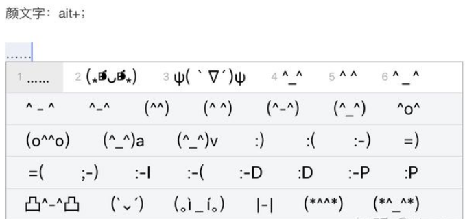

## Pencil 使用技巧

> [bilibili - topbook - 如何高效使用 Apple Pencil ？iPadOS14 让它成为真正的效率工具](https://www.bilibili.com/video/BV1SK411N7ev)

### 一代 pencil

- 锁屏界面用笔双击，即可进入备忘录界面

### 二代 pencil

- 锁屏界面轻触屏幕， 即可进入备忘录界面