----------------------------------------------
> *Made By Herolh*
----------------------------------------------

# procreate  基础使用 {#index}

[TOC]

 

--------------------------------------------

## 文档版本

|    时间    | 修改人 | 内容     |
| :--------: | :----: | :------- |
| xxxx-xx-xx | Herolh | 文档创建 |
|            |        |          |

## 简介

### 视频教程

- [bilibili - 插画教程免费学 - 如何使用 PROCREATE 绘画？看完这个视频，你就会啦](https://www.bilibili.com/video/BV1LA411P7pJ)

- [bilibili - 野马插画教程 - 2021 B 站首个 procreate 全套系统课程，从 0 基础到大佬，这里全都有！](https://www.bilibili.com/video/BV1v44y127e5?p=2&spm_id_from=pageDriver)

## 前期准备

- ipad + pencli

- procreate

    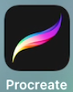

## 初始图库界面

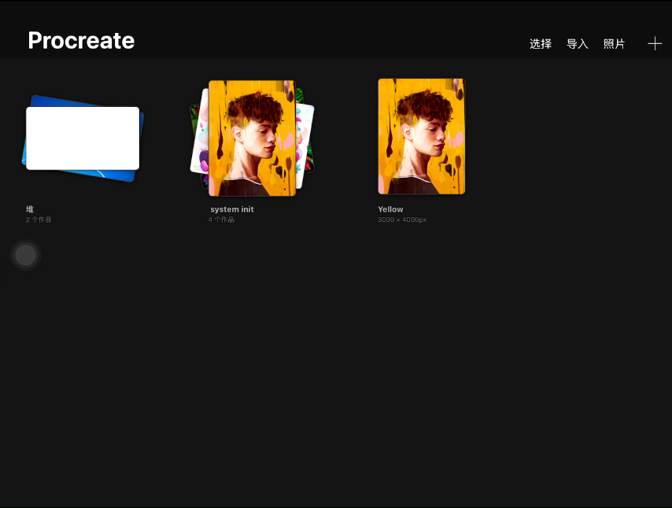

### 菜单

#### 选择

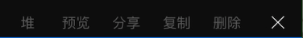

#### 导入

#### 照片

#### 新建画布

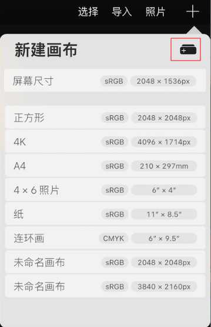

##### 自定义画布

###### 尺寸

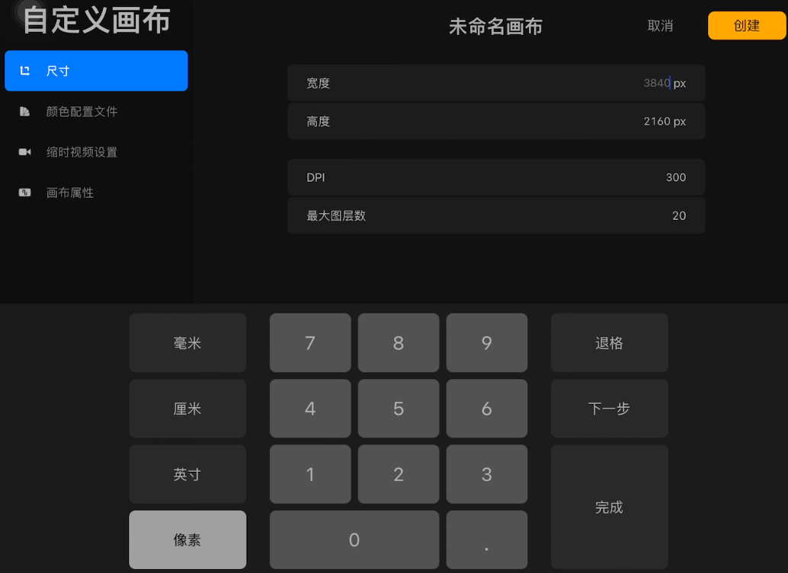

###### 颜色配置文件

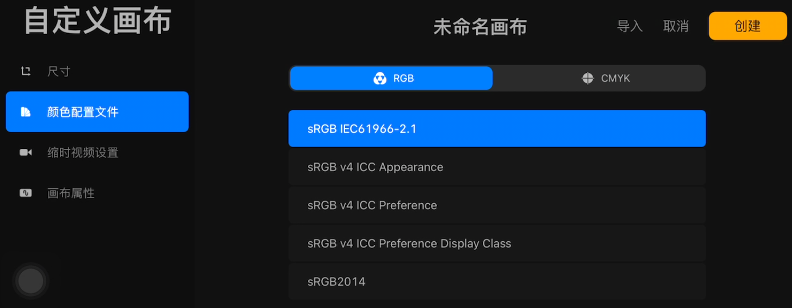

###### 缩时视频设置

###### 画布属性

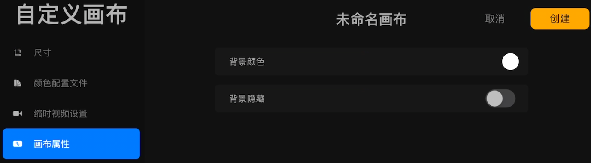

## 画布界面

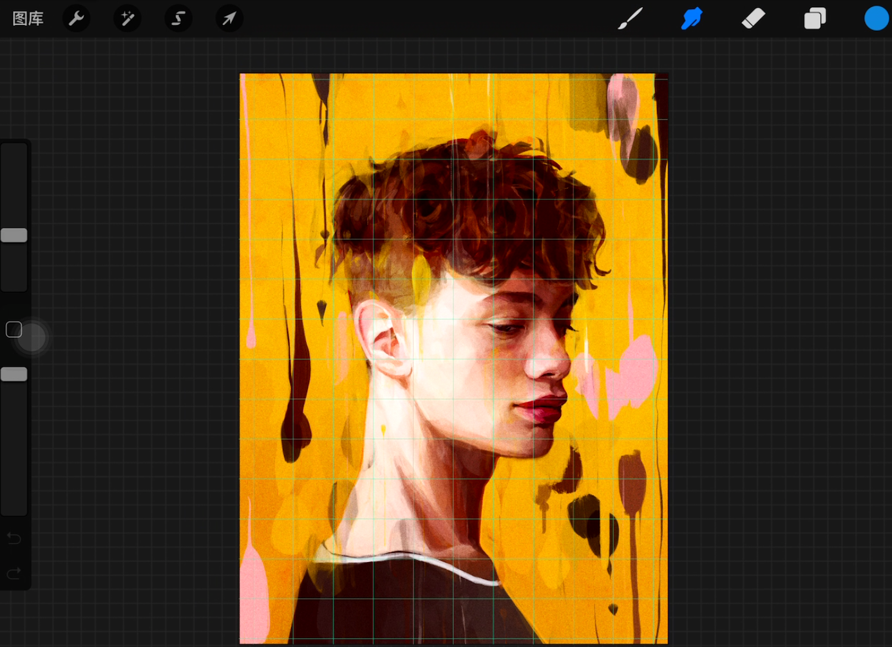

### 菜单

#### 操作

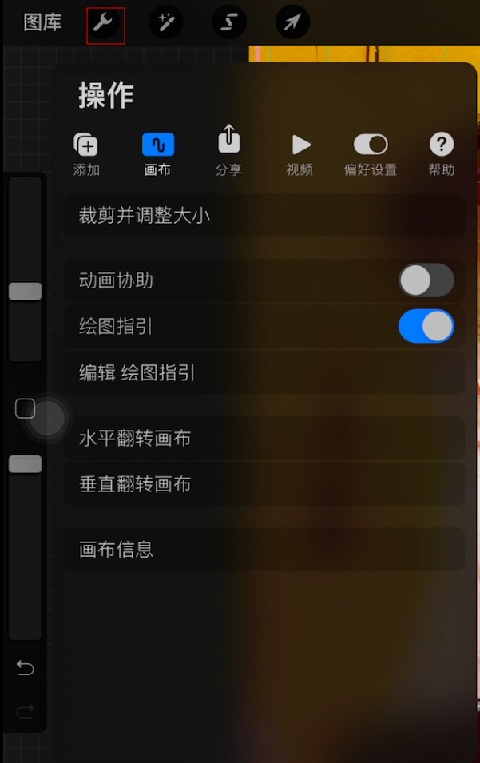

#### 画笔库

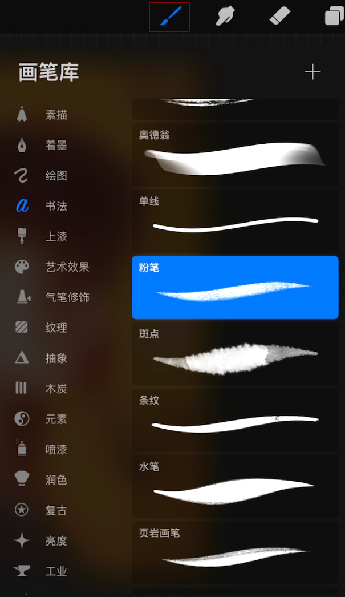

#### 图层

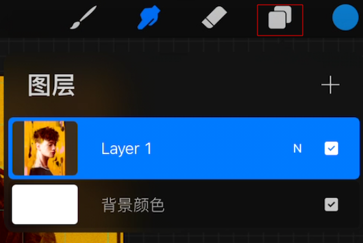

## 常用画笔

### 素描 - 6b 铅笔

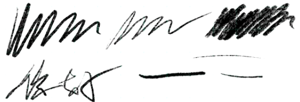

