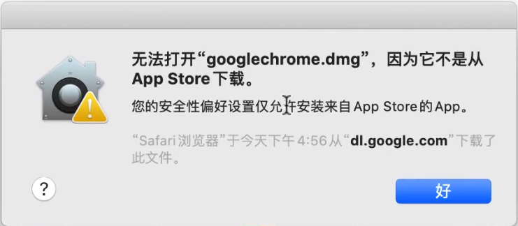
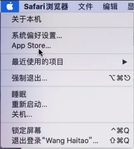
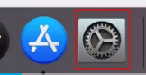
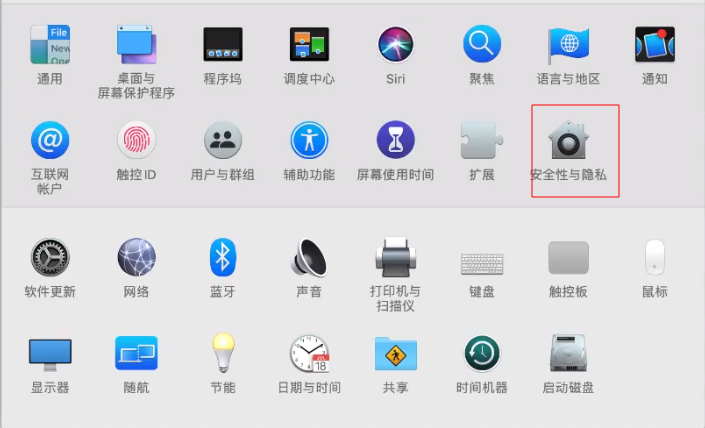
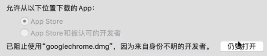
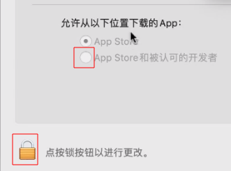
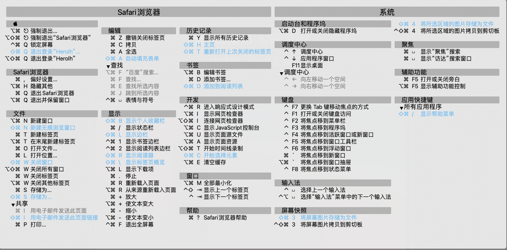

----------------------------------------------
> *Made By Herolh*
----------------------------------------------

# 推荐安装应用 {#index}

[TOC]

 

--------------------------------------------

## 文档版本

|    时间    | 修改人 | 内容     |
| :--------: | :----: | :------- |
| 2021-09-02 | Herolh | 文档创建 |
|            |        |          |

## 简介

## 快捷键

### 窗口

|              快捷键               | 说明       | 备注                     |
| :-------------------------------: | ---------- | ------------------------ |
|           command + Tab           | 切换程序   |                          |
|           command + ～            | 程序内切换 |                          |
|            command + W            | 关闭窗口   |                          |
|            command + M            | 最小化窗口 | 无法再通过切换程序调出来 |
|            command + H            | 隐藏窗口   |                          |
|            command + Q            | 退出       |                          |
| command + F 或 command + ctrl + F | 窗口全屏   |                          |

### 文件管理

|         快捷键         | 说明             | 备注                       |
| :--------------------: | ---------------- | -------------------------- |
|     command + del      | 删除文件         | 放入回收站                 |
| command + option + del | 直接删除         | 不放入回收站               |
| command + Shift + Del  | 清空废纸篓       |                            |
|      command + C       | 拷贝             |                            |
|      command  + V      | 粘贴             |                            |
|  command + option + V  | 粘贴并删除源文件 |                            |
|      command + Z       | 返回上一操作     |                            |
|     command + 空格     | 聚焦搜索         | command + b 打开浏览器搜索 |

### 输入法

|        快捷键         | 说明       | 备注                                         |
| :-------------------: | ---------- | -------------------------------------------- |
|      Ctrl + 空格      | 切换输入法 |                                              |
|       capslock        | 中/英 切换 | 长按 capslock 才是大写锁定(关闭只要再按一下) |
|     Shift + 空格      | 合字       | 例如 输入“马马马” 后按快捷键，得到 ”驫“      |
| ctrl + command + 空格 | 插入 emoji |                                              |
|  ctrl + shift + 空格  | 手写输入   |                                              |

### 截屏

|        快捷键         | 说明       | 备注                         |
| :-------------------: | ---------- | ---------------------------- |
|  command + shift + 3  | 全屏       |                              |
|  command + shift + 4  | 区域       | 再按 空格键 可以选取窗口截取 |
|  command + shift + 4  | 视频       |                              |
| ctrl + command + 空格 | 插入 emoji |                              |
|  ctrl + shift + 空格  | 手写输入   |                              |

> `+ ctrl` 存在剪切板, 默认存储在桌面

## 安装 dmg 格式软件

- 进入系统偏好设置

    - 左上角苹果标记

        

    - 从dock 栏进入

        

- 进入安全与隐私

    

- 任要打开

    

- 下次直接安装

    

## Safari 浏览器

### 快捷键

