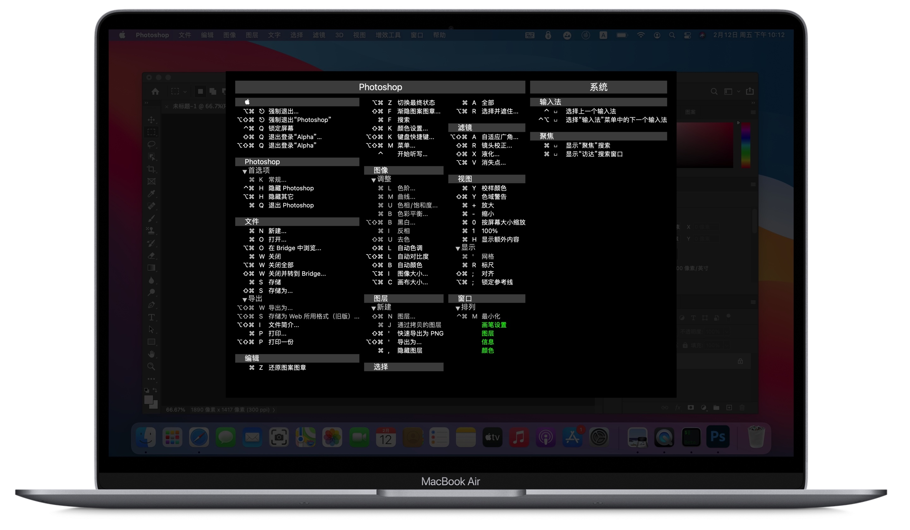
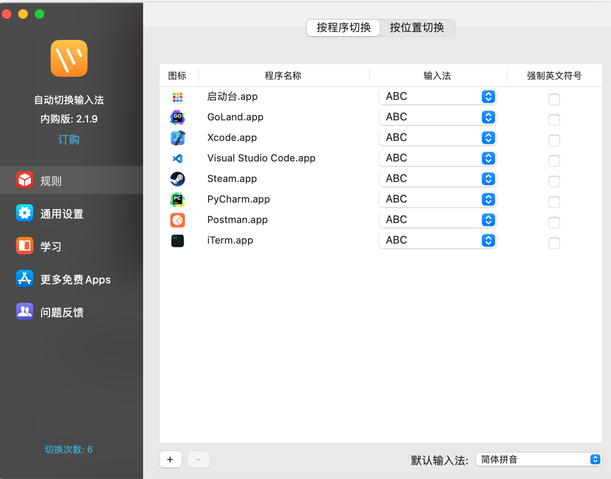
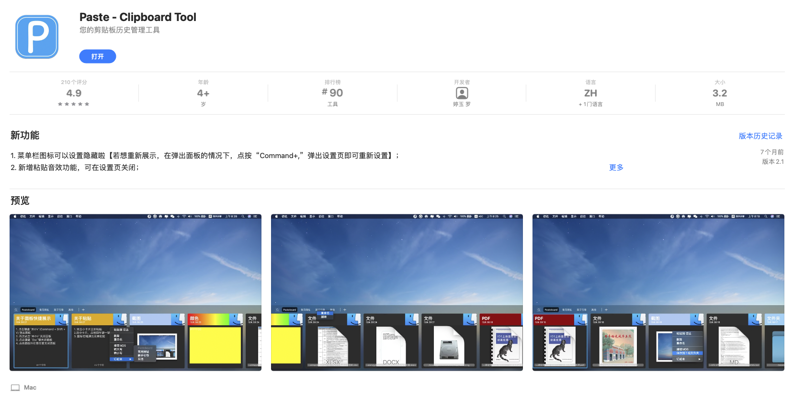
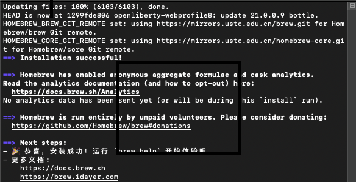
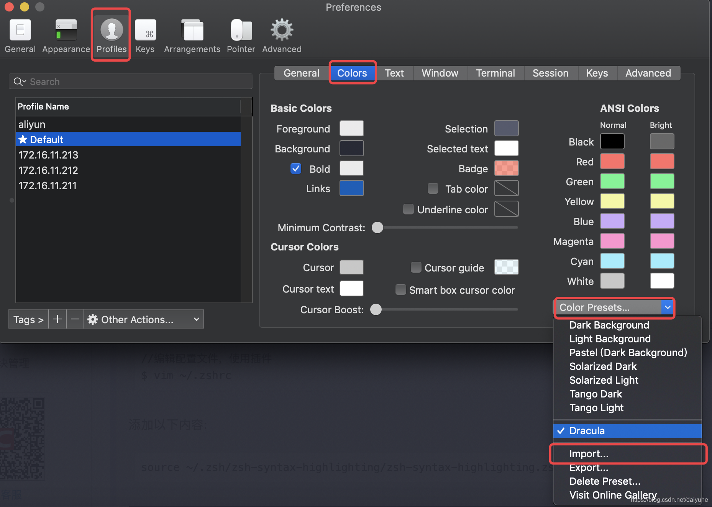
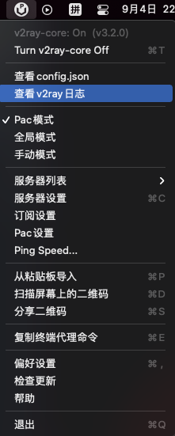
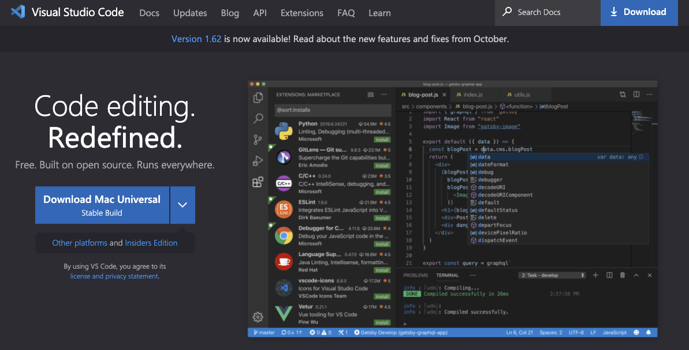

----------------------------------------------
> *Made By Herolh*
----------------------------------------------

# 推荐安装应用 {#index}

[TOC]


 


--------------------------------------------

## 文档版本

|    时间    | 修改人 | 内容     |
| :--------: | :----: | :------- |
| 2021-09-02 | Herolh | 文档创建 |
|            |        |          |


## 必备工具

### FlyKey

> 快捷键是提升Mac使用效率的重要手段，键指如飞为你展现App所有快捷键，助你快速掌握App快捷操作。默认使用双击 Command 显示当前 App 的所有快捷键，当然你也可以设置 Control、Shift 进行双击打开。[官方网址](https://www.better365.cn/FlyKey.html)




### 自动切换输入法

> 自动切换中英文、输入法，畅快输入， AppStore 可下载。




### 剪切板工具

#### Paste - Clipboard Tool



无限制的剪贴板历史查看，可自定义历史存储数量；
双击或者一键【enter】即可粘贴到您的目标程序；
支持文本、图片、文件等任意格式剪贴板历史，也可以分组管理；
所有历史记录仅保存在您的电脑中，无泄漏风险，未请求任何网络权限；
当您需要时才会出现（默认唤醒快捷键: Shift+Command+V）；
可根据自己喜好，设置展示位置（展示在屏幕上下左右）；
精准搜索，根据多种维度匹配并呈现搜索结果；


### 桌面管理工具

#### slate


[Slate](https://github.com/jigish/slate/blob/master/README.md) 是一个类似于 Divvy 和 SizeUp 的窗口管理应用程序（除了更好和免费！）。 由于每个工作方式的一些限制，最初编写它们是为了替换它们，它试图通过简单的可配置来克服它们。 因此，进行配置可能有点令人生畏，但一旦完成，好处是巨大的。

- 高度可定制
- 将击键绑定到:
    - 移动和/或调整窗口大小
    - 定向聚焦窗口
    - 启动预设布局
    - 创建、删除和激活窗口当前状态的快照
- 为不同的监视器配置设置默认布局，当检测到该配置时将激活该配置
- 窗口提示: 改变窗口焦点的直观方法
- 更好、更可定制的应用程序切换器


##### 安装

```shell
# 只要在你的终端上运行这个:
cd /Applications && curl http://www.ninjamonkeysoftware.com/slate/versions/slate-latest.tar.gz | tar -xz
```


##### 配置 

可以使用 `~/.slate.js` 或 `~/.slate` 文件来使用 JavaScript 配置 slate。还可以使用状态菜单上的“ Load Config”菜单选项重新加载配置。


## 包管理工具

### Homebrew

```shell
/bin/bash -c "$(curl -fsSL https://cdn.jsdelivr.net/gh/ineo6/homebrew-install/install.sh)"
```

将以上命令粘贴至终端。脚本内置 [中科大镜像](https://mirrors.ustc.edu.cn/help/brew.git.html) ，所以能让Homebrew安装的更快。




最后更新下：

```bash
brew update
```


#### 设置镜像

&emsp;&emsp;`brew`、`homebrew/core`是必备项目，`homebrew/cask`、`homebrew/bottles`按需设置。
通过 `brew config` 命令可以查看相关配置信息。更多可选源请访问 [镜像助手](https://link.zhihu.com/?target=https%3A//brew.idayer.com/guide/change-source)。


##### 中科大源

```bash
git -C "$(brew --repo)" remote set-url origin https://mirrors.ustc.edu.cn/brew.git

git -C "$(brew --repo homebrew/core)" remote set-url origin https://mirrors.ustc.edu.cn/homebrew-core.git

git -C "$(brew --repo homebrew/cask)" remote set-url origin https://mirrors.ustc.edu.cn/homebrew-cask.git

brew update
```


##### 清华大学源

```bash
git -C "$(brew --repo)" remote set-url origin https://mirrors.tuna.tsinghua.edu.cn/git/homebrew/brew.git

git -C "$(brew --repo homebrew/core)" remote set-url origin https://mirrors.tuna.tsinghua.edu.cn/git/homebrew/homebrew-core.git

git -C "$(brew --repo homebrew/cask)" remote set-url origin https://mirrors.tuna.tsinghua.edu.cn/git/homebrew/homebrew-cask.git

brew update
```


#### 设置bottles镜像

设置环境变量需要注意终端`Shell`的类型，请看下面说明：

镜像以**中科大源**为例。

从`macOS Catalina`(10.15.x) 版开始，`Mac`使用`zsh`作为默认`Shell`，对应文件是`.zprofile`，所以命令为：

```bash
echo 'export HOMEBREW_BOTTLE_DOMAIN=https://mirrors.ustc.edu.cn/homebrew-bottles/bottles' >> ~/.zprofile
source ~/.zprofile
```

如果是`macOS Mojave` 及更低版本，并且没有自己配置过`zsh`，对应文件则是`.bash_profile`：

```bash
echo 'export HOMEBREW_BOTTLE_DOMAIN=https://mirrors.ustc.edu.cn/homebrew-bottles/bottles' >> ~/.bash_profile
source ~/.bash_profile
```

> 注意：上述区别仅仅是`.zprofile`和`.bash_profile`不同，文章如有再次提及编辑`.zprofile`，均按此方法替换。

如果想使用清华源：

```bash
把
https://mirrors.ustc.edu.cn/homebrew-bottles/bottles

替换为
https://mirrors.tuna.tsinghua.edu.cn/homebrew-bottles/bottles
```

至此，安装和设置操作都完成了。


#### 恢复默认源

```shell
git -C "$(brew --repo)" remote set-url origin https://github.com/Homebrew/brew.git


git -C "$(brew --repo homebrew/core)" remote set-url origin https://github.com/Homebrew/homebrew-core.git


git -C "$(brew --repo homebrew/cask)" remote set-url origin https://github.com/Homebrew/homebrew-cask.git


brew update
```

`homebrew-bottles`配置只能手动删除，将 `~/.zprofile` 文件中的 `HOMEBREW_BOTTLE_DOMAIN=https://mirrors.xxx.com`内容删除，并执行 `source ~/.zprofile`。


#### 卸载Homebrew

使用官方脚本同样会遇到`uninstall`地址无法访问问题，可以使用下面脚本：

```bash
/bin/bash -c "$(curl -fsSL https://cdn.jsdelivr.net/gh/ineo6/homebrew-install/uninstall.sh)"
```


## 终端工具

#### item2

```shell
brew install iterm2
```


##### 快捷键

| 快捷键               | 备注                               |
| -------------------- | ---------------------------------- |
| command + d          | 垂直分屏                           |
| command + shift + d  | 水平分屏                           |
| command + shift + h  | 打开剪切板(复制历史)               |
| command + ;          | 命令自动补全                       |
| command + shift + ;  | 查看历史命令                       |
| command + option + b | 按键回放(输入命令回放, 通过时间线) |


##### 更换主题

###### Dracula

> [参考教程原文](https://blog.csdn.net/daiyuhe/article/details/88667875)

```shell
下载 item2 的 Dracula 主题
git clone https://github.com/dracula/iterm.git
```

- 设置主题：

    ```shell
    - iTerm2 > Preferences > Profiles > Colors Tab
    - Open the Color Presets... 
    - 从列表中选择import
    - 选择刚才下载主题中 Dracula.itermcolors 文件，确定
    - 再次打开 Color Presets... ，选择Dracula 
    ```

    


## 科学上网工具

### V2rayU

下载地址：

```shell
https://github.com/yanue/V2rayU/releases
```




## 开发工具

### 语言

#### anaconda

```shell
brew install anaconda
```


### IDE

#### Vscode

[下载地址](https://code.visualstudio.com/)




