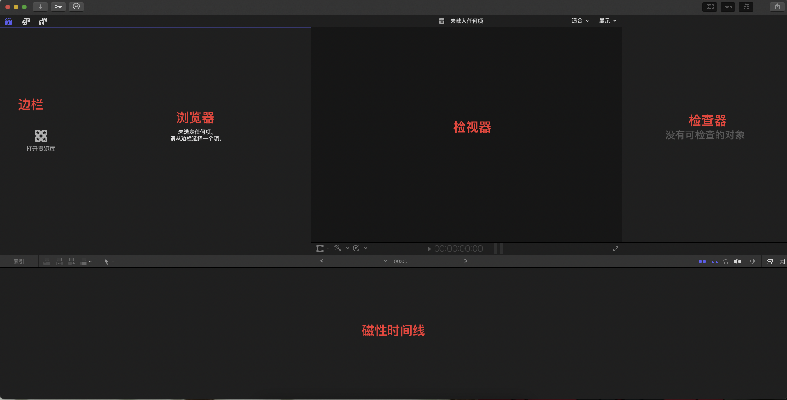
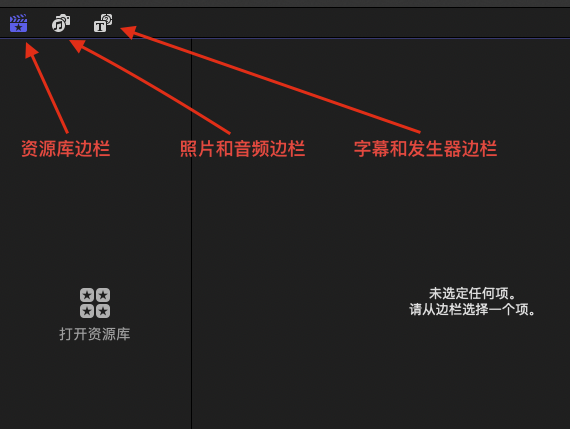
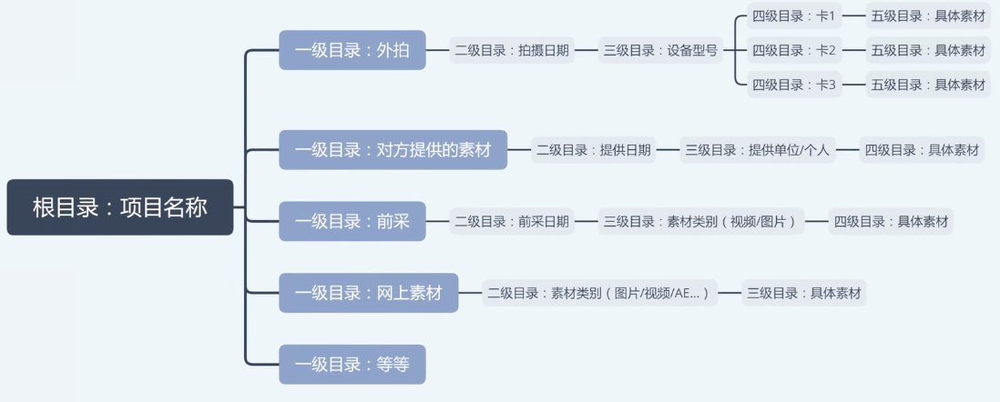

----------------------------------------------
> *Made By Herolh*
----------------------------------------------

# Final Cut Pro X 基本使用 {#index}

[TOC]

 

## 文档版本

|    时间    | 修改人 | 内容     |
| :--------: | :----: | :------- |
| 2021-09-08 | Herolh | 文档创建 |
|            |        |          |

## 简介

## 认识界面

### 边栏

> 储存了所有导入的素材、编辑决定和元数据

#### 资源库

> 

##### 素材整理

### 浏览器

> 媒体整理，包括分角色、关键词设定和粗剪

| 快捷键 | 说明               | 备注               |
| ------ | ------------------ | ------------------ |
| j      | 倒放               | 按几下就是乘几倍   |
| k      | 暂停               |                    |
| l      | 播放               | 按几下就是快进几倍 |
| k+j    | 逐帧倒放           |                    |
| k+l    | 逐帧播放           |                    |
| i      | 视频片段入点       |                    |
| o      | 视频片段出点       |                    |
| f      | 将视频放入个人收藏 |                    |
| u      | 重做               |                    |
| ;      | 上一个编辑点       |                    |
| ,      | 下一个编辑点       |                    |

### 检视器

> 负责播放浏览器和时间线中的视频

### 检查器

> 负责音视频参数的调整、调色、信息检查

### 磁性时间线

> 有效果浏览器和转场浏览器，运用精剪和包装

