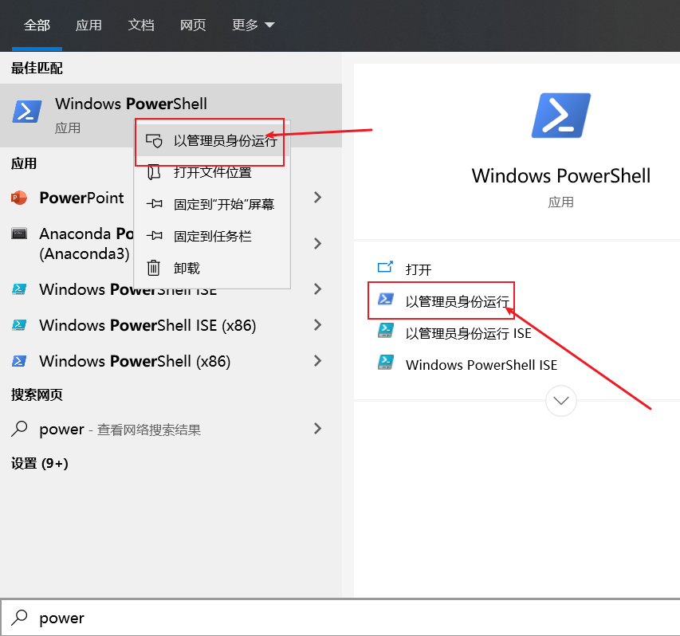
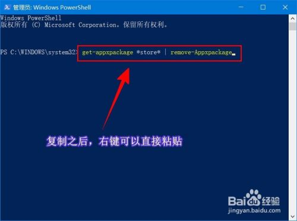
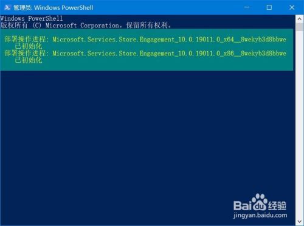
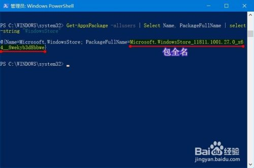
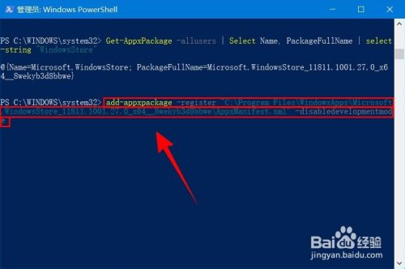
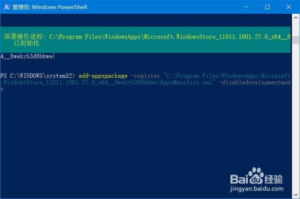

----------------------------------------------
> *Made By {Author}*
----------------------------------------------

# 目录 {#index}

[TOC]


--------------------------------------------

# copy by

> [百度经验 - 【Windows】如何重新安装Microsoft Store](https://jingyan.baidu.com/article/11c17a2cfe97ebf446e39d81.html)


## 工具/原料

已安装 Windows 的电脑。


## 方法/步骤

### 删除原 Microsoft Store

- 搜索框搜索“powershell”，以管理员方式运行。

    


- 首先删除原来的Microsoft Store。输入以下命令回车：

    ```powershell
    get-appxpackage *store* | remove-Appxpackage
    ```

    

    之后显示如图信息，或无显示，表示已经卸载成功。

    


### 重新安装

- 输入如下命令，获取要安装的包名：

    ```shell
    Get-AppxPackage -allusers | Select Name, PackageFullName | select-string "WindowsStore"
    ```

    注意，复制包全名。

    


- 开始安装。输入以下命令开始安装：

    ```powershell
    add-appxpackage -register "C:\Program Files\WindowsApps\<包全名>\AppxManifest.xml" -disabledevelopmentmode
    ```

    

    等待一会就会显示如下信息，安装完成。如果开始菜单找不到，可以搜索添加到开始屏幕。至此，已经重新安装成功。

    


