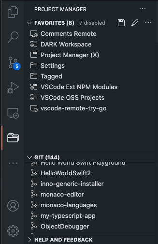
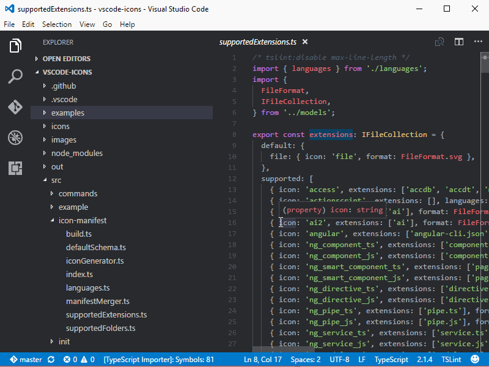
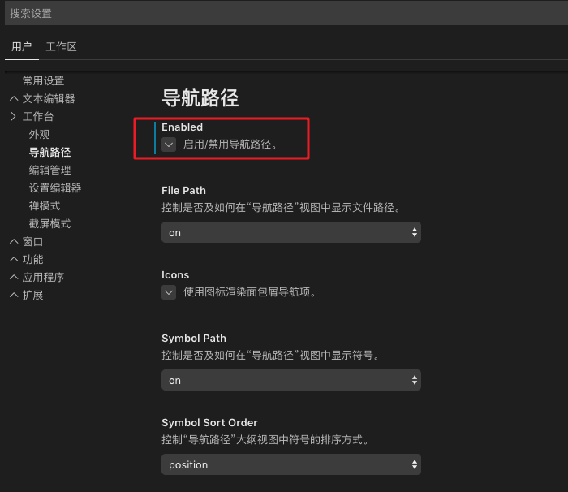

----------------------------------------------
> *Made By Herolh*
----------------------------------------------

# 目录 {#index}

[TOC]


--------------------------------------------

# 配置

## 常用插件

### 半透明

#### Windows opacity

只支持window，安装完成后，可能会有默认的透明度，如果想修改可点击 文件(File)->首选项(Preferences)->设置(Settings),在搜索框搜索`winopacity.opacity`这个参数，可设置为0~255,255是完全不透明。


 慎改成0，如果不小心改成了0，会看不到窗口的（鼠标也选中不了，其实还能接收键盘输入）不要动键盘鼠标，盲按删除键，再写个大概100 ~ 255之间的数就能看见了。实在不行修改 `C:\Users\自己的用户名\AppData\Roaming\Code\User` 下的 `settings.json` 文件的 `winopacity.opacity` 参数。


#### GlassIt-VSC

> VS Code Extension to set window to transparent on Windows and Linux platforms.


​	可能会找不到插件，因为 OSS 版的 vscode 由于担心许可问题，现在默认不使用 ms 的商店。但我认为实际并无许可问题。可以手动修改 `/usr/lib/code/product.json` 的 “extensionGallery” 字段，重新使用 ms 商店。去windows 下 的 vscode 里复制。

```shell
"extensionsGallery": {
		"serviceUrl": "https://marketplace.visualstudio.com/_apis/public/gallery",
		"cacheUrl": "https://vscode.blob.core.windows.net/gallery/index",
		"itemUrl": "https://marketplace.visualstudio.com/items",
		"controlUrl": "https://az764295.vo.msecnd.net/extensions/marketplace.json",
		"recommendationsUrl": "https://az764295.vo.msecnd.net/extensions/workspaceRecommendations.json.gz"
	},
```

- 首先下载插件 `GlassIt-VSC`

- 按 `F1` 进入设置页面

    > ##### 搜索打开`工作区设置`，进入设置页面后搜索 `glassit.alpha`，然后就可以设置透明度了.

    【快捷键：透明度提高 (Ctr + Alt +Z)，透明度降低 (Ctr + Alt +C)】


### docker


### Project Manager

工作中，我们经常会来回切换多个项目，每次都要找到对应项目的目录再打开，比较麻烦。Project Manager 插件可以解决这样的烦恼，它提供了专门的视图来展示你的项目，我们可以把常用的项目保存在这里，需要时一键切换，十分方便。





### Image preview

> 图片预览


### vscode-icons

改变编辑器里面的文件图标




### settings sync

在不同电脑间同步你的插件。需要 github 账号辅助的


## 常用配置

### markdown 预览

> 配合 `Image preview` 插件食用更佳

#### Markdown All in One (在用)


#### Markdown Preview Github Styling

以 GitHub 风格预览 Markdown 样式，十分简洁优雅。就像下面这样，左侧书写 Markdown 文本，右侧预览 Markdown 的渲染效果：


### python 开发环境

#### 插件

##### python

安装完成后需要重新加载 VSCode 使插件生效。


#### 配置 Python 环境

在 VSCode 中点击状态栏左下角的 Python 图标，然后选择 Python 解释器：


#### 错误提示和格式化

Python 默认的语法提示工具是 PyLint，也可以选择其他的 linter 工具，比如 flake8。flake8 是 Python 官方发布的一款静态代码检查工具，如果想使用它的话首先用 `pip install flake8` 安装；另外，在保存代码的时候 VSCode 可以自动进行 code formatting ，这个功能默认是关闭的且工具是 autopep8 , 如果想使用 yafp，则继续在命令行工具中用命令 `pip install yapf` 安装。 安装好这两个工具之后在 VSCode 的配置文件中进行设置：


### go 开发环境

#### 下载 Go 插件


- 创建一个项目（文件夹）然后打开他（左上角的 File -> Open Folder）

- 然后点击下方的 TERMINAL，输入命令 `go mod init 项目名`，会创建一个新的 `go.mod`

    

- 新建一个 Go 文件， VSCode 会激活 Go 插件，提示的工具全部安装就行了，等待安装完成，我们的 VSCode 就可以正常使用了


## 个人喜好

### 显示代码的行号

VS Code 默认显示代码的行号。你可以在设置项里搜索 `editor.lineNumbers`修改设置，配置项如下：


### 面包屑（Breadcrumb）

打开 VS Code 的设置项，选择「用户设置 -> 工作台 -> 导航路径」，如下图所示：



上图中，将红框部分打钩即可。设置成功后，我们就可以查看到当前文件的「层级结构」，非常方便。如下图所示：


### 去除窗口标题框

在 Vscode 设置中找到 `Title Bar Style`，将值改为 `custom`


### 修改系统界面和编辑面板字体大小

> Linux 下新安装的 VS Code 可能字体很小，包括系统字体（标题栏，工具栏、状态栏）和编辑面板的字体很小。

Ctrl + Shitf + p，输入 settings，选择打开那个 JSON 的系统配置文件：

```shell
    "editor.fontSize": 18,
    "window.zoomLevel": 1.25
```

修改这两个值即可，第一个是编辑面板的，第二个是系统界面的。没有则新增。