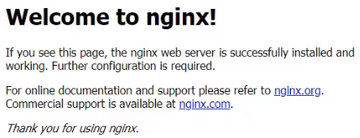

----------------------------------------------
> *Made By Herolh*
----------------------------------------------

# 目录 {#index}

[TOC]


[狂神说](https://www.kuangstudy.com/bbs/1353634800149213186)

--------------------------------------------

## windows 下安装

- **下载 nginx**

    [官网下载](http://nginx.org/en/download.html) 下载稳定版本

- **启动 nginx**

    有很多种方法启动 nginx

    - 直接双击 `nginx.exe`，双击后一个黑色的弹窗一闪而过。

    - 打开 `cmd` 命令窗口，切换到 nginx 解压目录下，输入命令 `nginx.exe` ，回车即可。

- **检查 nginx 是否启动成功**

    直接在浏览器地址栏输入网址 [http://localhost:80](http://localhost/) 回车，出现以下页面说明启动成功！
    
    


## linux 下安装

### Centos 下安装

#### 前期准备

- **安装 gcc**

    安装 nginx 需要先将官网下载的源码进行编译，编译依赖 gcc 环境，如果没有 gcc 环境，则需要安装：

    ```shell
    yum install gcc-c++
    ```

- **PCRE pcre-devel 安装**

    PCRE (Perl Compatible Regular Expressions) 是一个 Perl 库，包括 perl 兼容的正则表达式库。nginx 的 http 模块使用 pcre 来解析正则表达式，所以需要在 linux 上安装 pcre 库，pcre-devel 是使用 pcre 开发的一个二次开发库。nginx 也需要此库。命令：

    ```shell
    yum install -y pcre pcre-devel
    ```

- **zlib 安装**

    zlib 库提供了很多种压缩和解压缩的方式， nginx 使用 zlib 对 http 包的内容进行 gzip ，所以需要在 Centos 上安装 zlib 库。

    ```shell
    yum install -y zlib zlib-devel
    ```

- **OpenSSL 安装**
    OpenSSL 是一个强大的安全套接字层密码库，囊括主要的密码算法、常用的密钥和证书封装管理功能及 SSL 协议，并提供丰富的应用程序供测试或其它目的使用。nginx 不仅支持 http 协议，还支持 https（即在 ssl 协议上传输 http），所以需要在 Centos 安装 OpenSSL 库。

    ```shell
    yum install -y openssl openssl-devel
    ```


#### 下载安装

- **下载安装包**

    [官网](http://nginx.org/en/download.html) 手动下载.tar.gz 安装包，下载完毕上传到服务器上 /root

- **解压**

    ```shell
    tar -zxvf nginx-1.18.0.tar.gz
    cd nginx-1.18.0
    ```

- **配置**

    使用默认配置，在 nginx 根目录下执行

    ```shell
    ./configuremakemake install
    ```

    查找安装路径： `whereis nginx`


#### 注意事项

> 如何连接不上，检查阿里云安全组是否开放端口，或者服务器防火墙是否开放端口！

```shell
service firewalld start								# 开启防火墙
service firewalld restart							# 重启防火墙
service firewalld stop								# 关闭防火墙
firewall-cmd --list-all								# 查看防火墙规则
firewall-cmd --query-port=8080/tcp					# 查询端口是否开放
firewall-cmd --permanent --add-port=80/tcp			# 开放 80 端口
firewall-cmd --permanent --remove-port=8080/tcp		# 移除 8080 端口
firewall-cmd --reload								#重启防火墙(修改配置后要重启防火墙)

" 参数解释
" firwall-cmd：是Linux提供的操作firewall的一个工具；
" --permanent：表示设置为持久；
" --add-port：标识添加的端口；
```


### Arch 下安装

> [Arch 安装 Nginx](https://blog.csdn.net/tangcuyuha/article/details/80330863)

- **下载安装**

    ```shell
    sudo pacman -S nginx   # 安装位于官方仓库的nginx 软件包。
    ```

- **服务管理**

    ```shell
    " 要启动 Nginx 服务，运行以下命令:
    systemctl start nginx
    
    " Nginx 服务开机时启动
    systemctl enable nginx
    ```

- **配置位置**

    ```shell
    " http://127.0.0.1 的默认页面是:
    /usr/share/nginx/html/index.html
    ```

    你可以修改在 `/etc/nginx/` 目录中的文件来更改配置

     `./etc/nginx/nginx.conf` 是主配置文件


