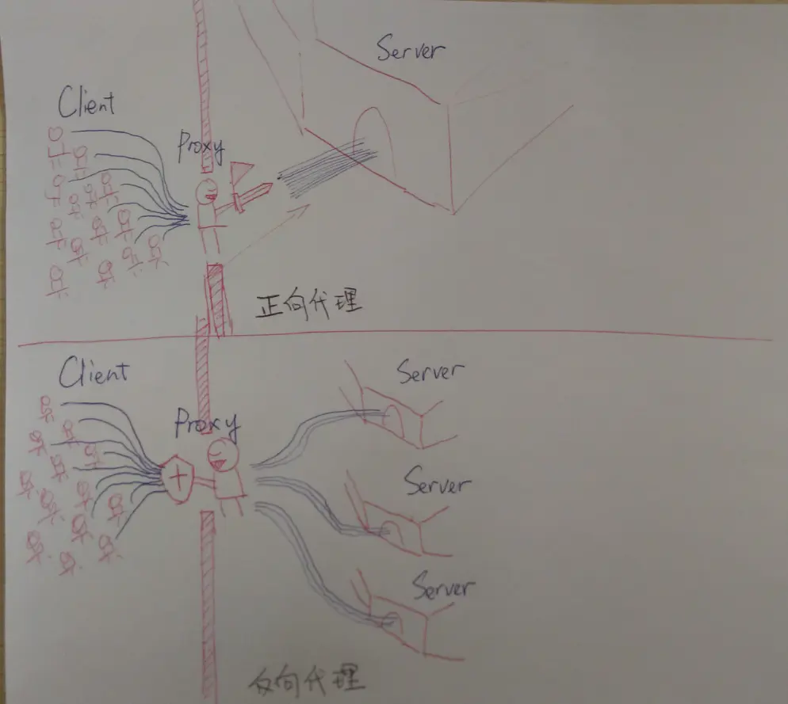
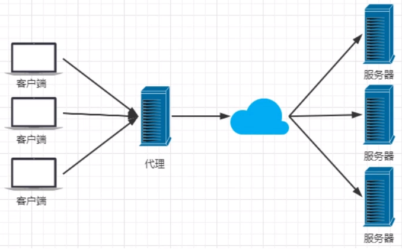
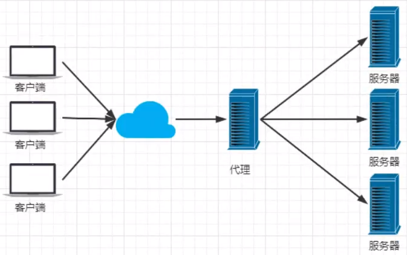
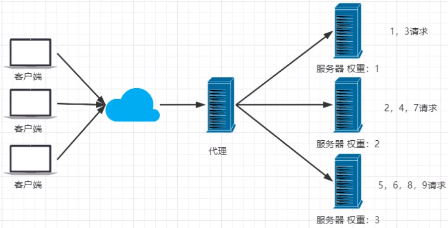
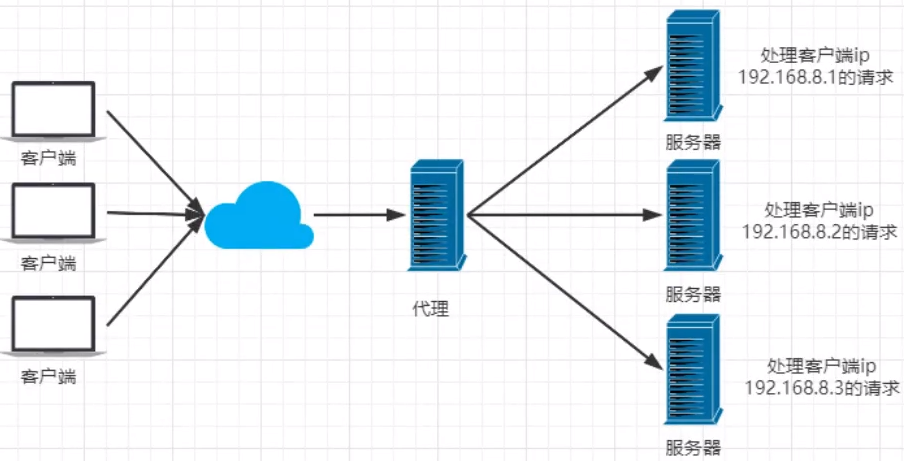
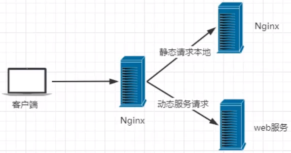

----------------------------------------------
> *Made By Herolh*
----------------------------------------------

# 目录 {#index}

[TOC]


[狂神说 - Nginx 快速入门](https://www.kuangstudy.com/bbs/1353634800149213186)

[bilibili视频 - 狂神说 - Nginx 最新教程通俗易懂，40 分钟搞定！](https://www.bilibili.com/video/BV1F5411J7vK?p=1)

--------------------------------------------

## nginx 的基本介绍

### 什么是 nginx
&emsp;&emsp;Nginx (engine x) 是一个高性能的 HTTP 和反向代理 web 服务器，同时也提供了 IMAP/POP3/SMTP 服务。在BSD-like 协议下发行。Nginx 是由伊戈尔・赛索耶夫为俄罗斯访问量第二的 Rambler.ru 站点（俄文：Рамблер）开发的，第一个公开版本 0.1.0 发布于 2004 年 10 月 4 日。2011 年 6 月 1 日，nginx 1.0.4 发布。
&emsp;&emsp;其特点是占有内存少，并发能力强，事实上 nginx 的并发能力在同类型的网页服务器中表现较好，中国大陆使用 nginx 网站用户有：百度、京东、新浪、网易、腾讯、淘宝等。在全球活跃的网站中有 12.18% 的使用比率，大约为 2220 万个网站。
&emsp;&emsp;Nginx 是一个安装非常的简单、配置文件非常简洁（还能够支持 perl 语法）、Bug 非常少的服务。Nginx 启动特别容易，并且几乎可以做到 7*24 不间断运行，即使运行数个月也不需要重新启动。你还能够不间断服务的情况下进行软件版本的升级。
&emsp;&emsp;Nginx 代码完全用 C 语言从头写成。官方数据测试表明能够支持高达 **50,000** 个并发连接数的响应。


### Nginx 的作用

#### 代理服务

> [简书 - 唐龙隆 - Nginx 正向代理与反向代理](https://www.jianshu.com/p/ae76c223c6ef)

> &emsp;&emsp;实践中客户端无法直接跟服务端发起请求的时候，我们就需要代理服务。代理可以实现客户端与服务端之间的通信，代理分为正向代理和反向代理，Nginx 作为 web 服务器最常用的功能之一，就是代理服务，尤其是反向代理。
> &emsp;&emsp;反向代理和正向代理的区别就是：**正向代理代理客户端，反向代理代理服务器。**




##### 正向代理

> 客户端 < == > 代理 == > 服务端

&emsp;&emsp;是一个位于客户端和目标服务器之间的服务器(代理服务器)，为了从目标服务器取得内容，客户端向代理服务器发送一个请求并指定目标， 然后代理服务器向目标服务器转交请求并将获得的内容返回给客户端。



**举例说明：**VPN 就是做正向代理的。

> 正向代理服务器位于客户端和服务器之间，为了向服务器获取数据，客户端要向代理服务器发送一个请求，并指定目标服务器，代理服务器将目标服务器返回的数据转交给客户端。这里客户端是要进行一些正向代理的设置的。我们在访问 Google 时，先连上 VPN 服务器将我们的 IP 地址变成美国的 IP 地址，然后就可以顺利的访问了。


##### 反向代理

> 客户端 == > 代理 < == > 服务端

&emsp;&emsp;反向代理服务器可以隐藏服务器的存在和特征。它充当互联网和 web 服务器之间的中间层。这对于安全方面来说是很好的，特别是在使用 web 托管服务时。
&emsp;&emsp;反向代理中客户端对代理是无感知的，因为客户端不需要任何配置就可以访问，我们只需要将请求发送到反向代理服务器，由反向代理服务器去选择目标服务器获取数据后，在返回给客户端，此时反向代理服务器和目标服务器对外就是一个服务器，暴露的是代理服务器地址，隐藏了真实服务器 IP 地址。



**举例说明：**

> 以租房子为例，我们以为我们接触的是房东(服务端)，其实有时候也有可能并非房主(服务端)本人，有可能二房东(代理)。 但是我们并不知道和我们沟通的并不是真正的房东(服务端)。这种帮助真正的房主(服务端)租房的二房东(代理)其实就是反向代理服务器。这个过程就是反向代理。


##### 正向代理和反向代理的区别

正向代理简单地打个租房的比方

```shell
A(客户端) 想租 C(服务端) 的房子，但是 A(客户端) 并不认识 C(服务端) 租不到。
B(代理) 认识 C(服务端) 能租这个房子所以你找了 B(代理) 帮忙租到了这个房子。

这个过程中 C(服务端) 不认识 A(客户端) 只认识 B(代理)；
C(服务端) 并不知道 A(客户端) 租了房子，只知道房子租给了 B(代理)。
```


反向代理也用一个租房的例子

```shell
A(客户端) 想租一个房子，B(代理) 就去找 CDEFG(服务端) 然后把房子租给了他。
这时候实际上 CDEFG(服务端) 才是房东，B(代理) 是中介把这个房子租给了 A(客户端)。

这个过程中 A(客户端) 并不知道这个房子到底谁才是房东，他都有可能认为这个房子就是 B (代理) 的
```


#### 负载均衡

> Nginx 提供的负载均衡策略有 2 种：内置策略和扩展策略。内置策略为轮询，加权轮询，Iphash。扩展策略，就天马行空，只有你想不到的没有他做不到的。

- **轮询**

    

- **加权轮询**

    

- iphash

    > iphash 对客户端请求的 ip 进行 hash 操作，然后根据 hash 结果将同一个客户端 ip 的请求分发给同一台服务器进行处理，可以解决 session 不共享的问题。

    


#### 动静分离

> 在我们的软件开发中，有些请求是需要后台处理的，有些请求是不需要经过后台处理的（如：css、html、jpg、js 等等文件），这些不需要经过后台处理的文件称为静态文件。让动态网站里的动态网页根据一定规则把不变的资源和经常变的资源区分开来，动静资源做好了拆分以后，我们就可以根据静态资源的特点将其做缓存操作。提高资源响应的速度。




## nginx 基本使用

### Nginx 常用命令

```shell
cd /usr/local/nginx/sbin/
./nginx  						# 启动
./nginx -s stop  				# 停止
./nginx -s quit  				# 安全退出
./nginx -s reload  				# 重新加载配置文件
ps aux|grep nginx  				# 查看 nginx 进程
```

启动成功访问 服务器 ip:80


