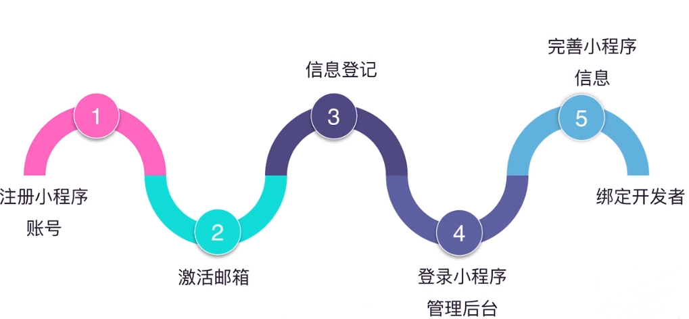
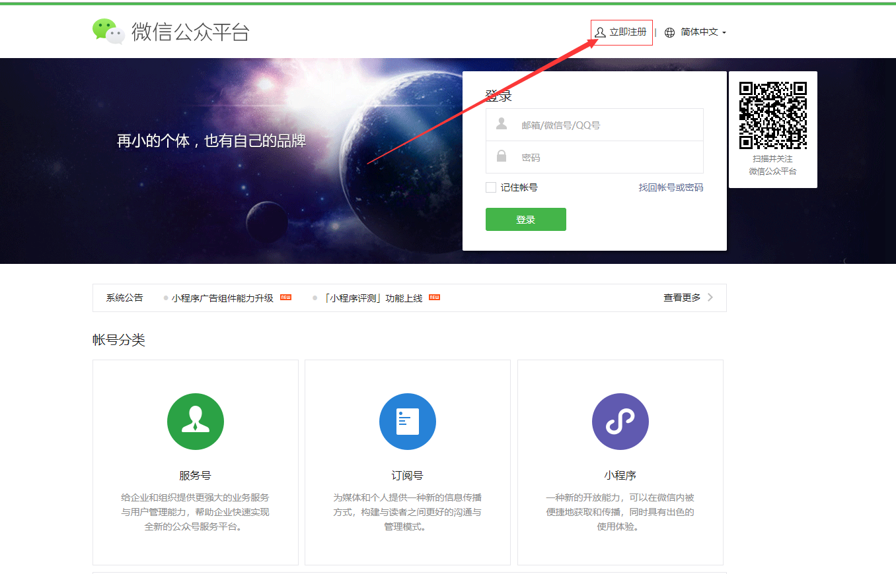
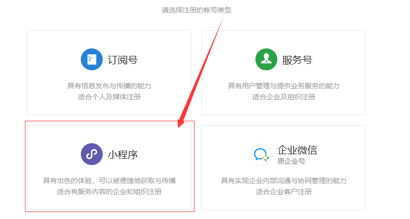
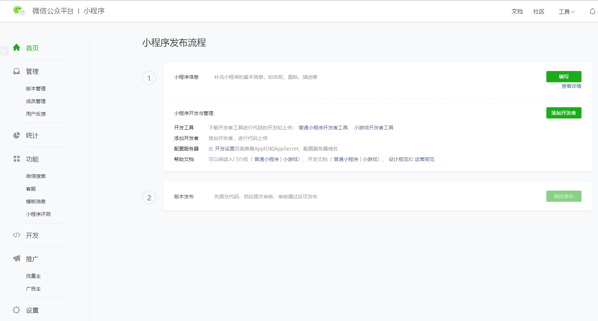
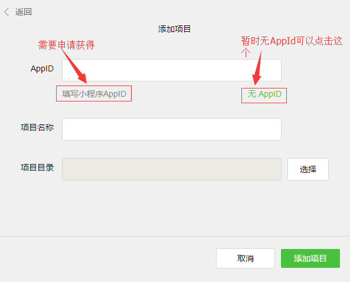
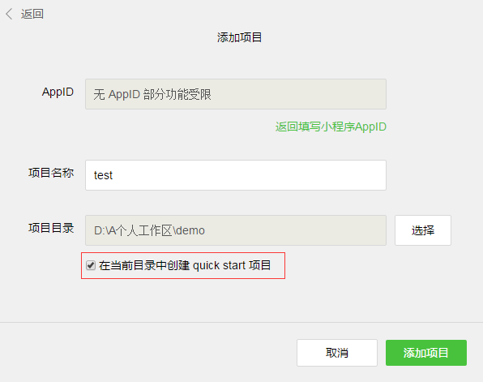
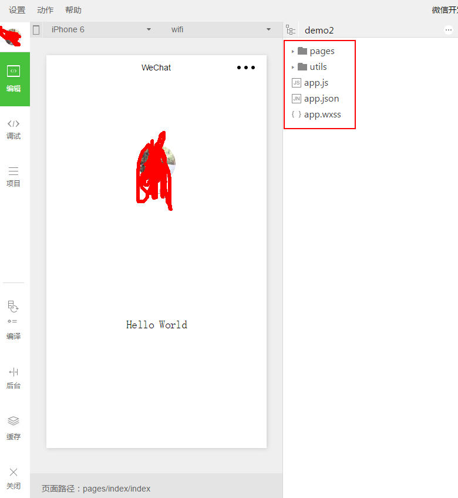

目录 {#index}

[TOC]


--------------------------------------------
## 一、初识小程序开发

微信小程序官方开发文档链接为：https://mp.weixin.qq.com/debug/wxadoc/dev/index.html

### 第一步：注册小程序账号



- 首先进入[微信公众号平台官网](<https://mp.weixin.qq.com/>) 点击右上角的立即注册



- 选择注册账号类型,填写相关账号信息,激活账号之后即可



- 注册完毕后,登陆账号进入小程序管理后台进行相关设置




### 第二步：下载微信小程序开发者工具并安装

​	下载路径：<https://mp.weixin.qq.com/debug/wxadoc/dev/devtools/download.html>

​	开发一个微信应用号，你需要提前到微信的官方网站（ weixin.qq.com ）下载开发者工具。进到下载界面后，根据自己的操作系统选择相应的链接进行下载，下载完成后进行安装。

 

### 第三步：登录工具

​	开发者工具安装完成后我们就可以将其打开，初次打开会需要用微信扫码登录，入下图，用手机微信扫一扫后确认登录就可以了。


### 第四步：创建一个项目

​	登录成功后，如果是第一次使用该工具会弹出创建项目的窗口，如下图：



**该页面内的各项内容需要注意:**

- AppID：依照官方解释来填。
- 项目名称: 项目最外层文件夹名称，如你将其命名为「ABC」，则之后的全部项目内容均将保存在「/ABC/…」目录下。
- 本地开发目录：项目存放在本地的目录。

​	创建过程中，如果选择的本地文件夹是个空文件夹会出来一个勾选项“*在当前目录中创建quick start项目*”，为方便初学者了解微信小程序的基本代码结构，请勾选此项，勾选后，开发者工具会帮助我们在开发目录里生成一个简单的 demo，如下图：



&emsp;&emsp;&emsp;项目创建成功后，我们就可以点击该项目，进入并看到完整的开发者工具界面，点击左侧导航，在「编辑」里可以查看和编辑我们的代码，在「调试」里可以测试代码并模拟小程序在微信客户端效果，在「项目」里可以发送到手机里预览实际效果。


#### 获取微信小程序的 AppID

&emsp;&emsp;&emsp;首先，我们需要拥有一个帐号，注意不可直接使用服务号或订阅号的 AppID。 利用提供的帐号，登录[https://mp.weixin.qq.com](https://mp.weixin.qq.com/) ，就可以在网站的「设置」-「开发者设置」中，查看到微信小程序的 AppID 了。


&emsp;&emsp;&emsp;注意：如果我们不是用注册时绑定的管理员微信号，在手机上体验该小程序。那么我们还需要操作「绑定开发者」。即在「用户身份 - 开发者」模块，绑定上需要体验该小程序的微信号。本教程默认注册帐号、体验都是使用管理员微信号。


### 第五步：项目代码结构解释


&emsp;&emsp;点击开发者工具左侧导航的“编辑”，我们可以看到这个项目，已经初始化并包含了一些简单的代码文件。最关键也是必不可少的，是 `app.js`、`app.json`、`app.wxss` 这三个。其中，`.js`后缀的是脚本文件，`.json`后缀的文件是配置文件，`.wxss`后缀的是样式表文件。微信小程序会读取这些文件，并生成小程序实例。下面我们简单了解这三个文件的功能，方便修改以及从头开发自己的微信小程序。

1. **app.js是小程序的脚本代码**。我们可以在这个文件中监听并处理小程序的生命周期函数、声明全局变量。调用框架提供的丰富的 API，如本例的同步存储及同步读取本地数据。

2. **app.json 是对整个小程序的全局配置**。我们可以在这个文件中配置小程序是由哪些页面组成，配置小程序的窗口背景色，配置导航条样式，配置默认标题。注意该文件不可添加任何注释。

3. **app.wxss 是整个小程序的公共样式表。**我们可以在页面组件的 class 属性上直接使用 app.wxss 中声明的样式规则。

4. utils文件夹是放通用工具类方法的一个文件夹.
5. pages文件夹是存放所有页面的文件夹。


### 第六步：小程序页面文件构成

####  页面结构文件 index.wxml 和logs.wxml：

 	本例中使用了`<view/>` `<image/>` `<text/>` 来搭建页面结构，绑定数据和交互处理函数。

```html
<!-- index.wxml -->
<view class="container">
  <view  bindtap="bindViewTap" class="userinfo">
    <image class="userinfo-avatar" src="{{userInfo.avatarUrl}}" background-size="cover"></image>
    <text class="userinfo-nickname">{{userInfo.nickName}}</text>
  </view>
  <view class="usermotto">
    <text class="user-motto">{{motto}}</text>
  </view>
</view>
```


​	logs 页面使用 `<block/>` 控制标签来组织代码，在` <block/>` 上使用 `wx:for-items` 绑定 logs 数据，并将 logs 数据循环展开节点

```html
<!-- logs.wxml -->
<view class="container log-list">
  <block wx:for-items="{{logs}}" wx:for-item="log">
    <text class="log-item">{{index + 1}}. {{log}}</text>
  </block>
</view>
```


#### 页面脚本文件  index.js 和 logs.js:

​	在这个文件中我们可以监听并处理页面的生命周期函数、获取小程序实例，声明并处理数据，响应页面交互事件等。

```javascript
//index.js
//获取应用实例
var app = getApp()
Page({
  data: {
    motto: 'Hello World',
    userInfo: {}
  },
  //事件处理函数
  bindViewTap: function() {
    wx.navigateTo({
      url: '../logs/logs'
    })
  },
  onLoad: function () {
    console.log('onLoad')
    var that = this
    //调用应用实例的方法获取全局数据
    app.getUserInfo(function(userInfo){
      //更新数据
      that.setData({
        userInfo:userInfo
      })
    })
  }
})
```

```javascript
//logs.js
var util = require('../../utils/util.js')
Page({
  data: {
    logs: []
  },
  onLoad: function () {
    this.setData({
      logs: (wx.getStorageSync('logs') || []).map(function (log) {
        return util.formatTime(new Date(log))
      })
    })
  }
})
```


#### 页面样式文件  index.wxss：

 	页面的样式表是非必要的。当有页面样式表时，页面的样式表中的样式规则会层叠覆盖 app.wxss 中的样式规则。如果不指定页面的样式表，也可以在页面的结构文件中直接使用 app.wxss 中指定的样式规则。

```CSS
/**index.wxss**/
.userinfo {
  display: flex;
  flex-direction: column;
  align-items: center;
}

.userinfo-avatar {
  width: 128rpx;
  height: 128rpx;
  margin: 20rpx;
  border-radius: 50%;
}

.userinfo-nickname {
  color: #aaa;
}

.usermotto {
  margin-top: 200px;
}
```


#### 页面配置文件  index.json：

​	页面的配置文件是非必要的。当有页面的配置文件时，配置项在该页面会覆盖 app.json 的 window 中相同的配置项。如果没有指定的页面配置文件，则在该页面直接使用 app.json 中的默认配置。

#### 运行结果:


​	在这个示例中，我们有两个页面，index 页面和 logs 页面，即欢迎页和小程序启动日志的展示页，他们都在 pages 目录下。微信小程序中的每一个页面的【路径+页面名】都需要写在 app.json 的 pages 中，且 pages 中的第一个页面是小程序的首页。

 	每一个小程序页面是由同路径下同名的四个不同后缀文件的组成，如：index.js、index.wxml、index.wxss、index.json。`.js`后缀的文件是脚本文件，`.json`后缀的文件是配置文件，`.wxss`后缀的是样式表文件，`.wxml`后缀的文件是页面结构文件。


### 第七步：手机预览

开发者工具左侧菜单栏选择"项目"，点击"预览"，扫码后即可在微信客户端中体验。

#### !attention:

```
只有获得AppId的才有权限预览
```


## 二、项目框架

​	微信目前用户群体非常庞大，微信推出公众号以后，火爆程度大家都看得到，也同样推动着 h5 的高速发展，随着公众号业务的需求越来越复杂，应用号现在的到来也是恰到好处。微信开放的接口更为严谨，结构必须采用他提供给我们的组件，外部的框架和插件都不能在这里使用上，让开发者完全脱离操作 DOM，开发思想转变很大。工欲善其事，必先利其器。理解它的核心功能非常重要，先了解它的整个运作流程。

### 1、小程序的配置

app.json主要分为五个部分：

- **pages**：页面组，

- **window**：框架样式（状态栏、导航条、标题、窗口背景色）

- **tabBar**：底部菜单

- **networkTimeout**：网络超时设置

- **debug**：开启debug模式

page.json针对页面单独设置,是全局配置，能够覆盖掉app.json的全局设置

```JavaScript
//app.json
{
  "pages":[											// pages：页面组
    "pages/index/index",
    "pages/logs/logs"
  ],
  "window":{						// window：框架样式（状态栏、导航条、标题、窗口背景色）
    "backgroundTextStyle":"light",
    "navigationBarBackgroundColor": "#000",
    "navigationBarTitleText": "WeChat",
    "navigationBarTextStyle":"white"
  }
}
```


### 2、小程序的逻辑

使用App()来注册一个小程序，必须在`app.js`中注册，且不能注册多个App()

```JavaScript
App({							//如下为小程序的生命周期
  onLaunch: function() { },		//监听初始化
  onShow: function() {  },		//监听显示（进入前台）
  onHide: function() {  },		//监听隐藏（进入后台：按home离开微信）
  onError: function(msg) {  },	//监听错误
  
    //如下为自定义的全局方法和全局变量  
  globalFun:function(){},
  globalData: 'I am global data'
})
```


使用Page()注册一个页面，在每个页面的js文件中注册

```JavaScript
Page({
  data: {text: "This is page data."},		//页面数据，用来维护视图，json格式
  onLoad: function(options) {  },			//监听加载
  onReady: function() {  },					//监听初次渲染完成
  onShow: function() {  },					//监听显示
  onHide: function() {  },//监听隐藏
  onUnload: function() {  },//监听卸载
  onPullDownRefresh: function() {  },//监听下拉
  onReachBottom: function() {  },//监听上拉触底
  onShareAppMessage: function () {  },//监听右上角分享
  //如下为自定义的事件处理函数（视图中绑定的）
  viewTap: function() {//setData设置data值，同时将更新视图
    this.setData({text: 'Set some data for updating view.'})
  }
})
```

9999999 