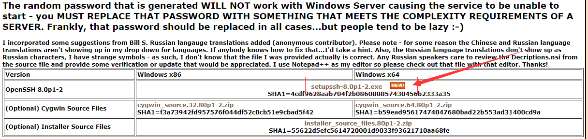

----------------------------------------------
> *Made By Herolh*
----------------------------------------------

# 目录 {#index}
[TOC]

--------------------------------------------

# windows7下cmd窗口使用ssh命令

第一步: 下载 openssh for windows

https://www.mls-software.com/opensshd.html

点下一步下一步安装openssh软件到win7默认安装即可。

接下去就可以打开cmd窗口，使用ssh命令登录您的linux了。

