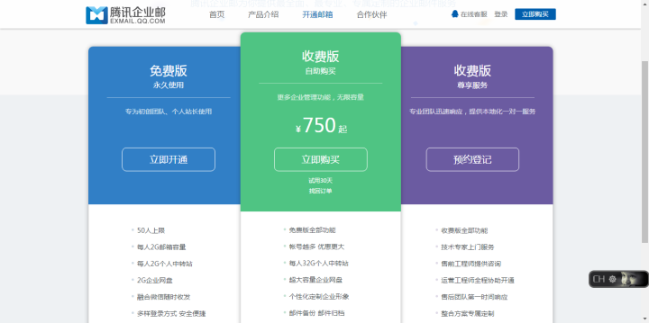
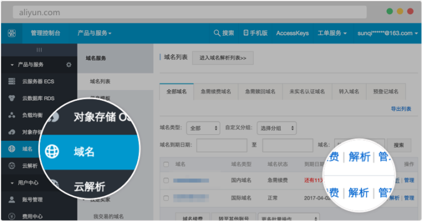
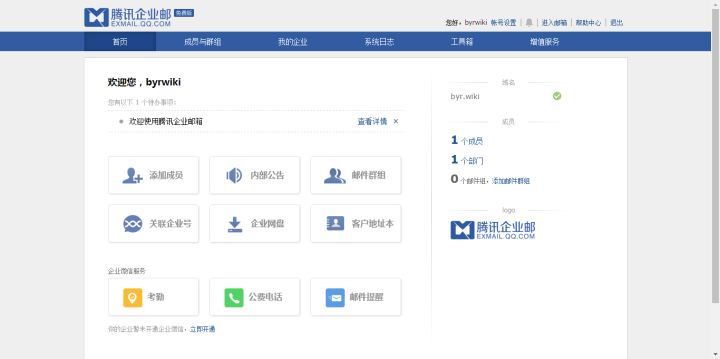
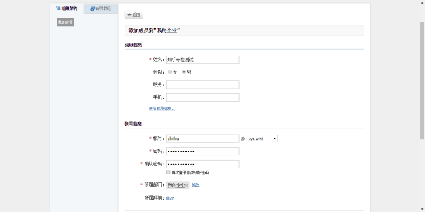
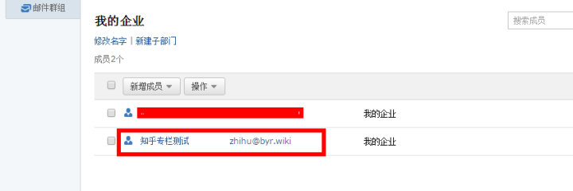
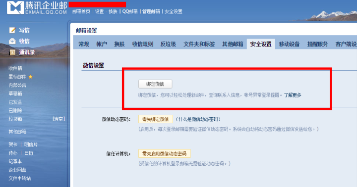

----------------------------------------------
> *Made By Herolh*
----------------------------------------------

# 目录 {#index}
[TOC]


--------------------------------------------

## 什么是域名邮箱？
&emsp;&emsp;可能目前你的邮箱后缀是 @qq、163、126、Gmail、Foxmail 等，可是你有木有想过某一天，自己可以搞一个相对另类而又独一无二的邮箱呢？比如你如果在知乎上班，可能你的公司邮箱是 XXX@zhihu.com；如果是在谷歌，则可能是 XXX@google.com。
&emsp;&emsp;这种看起来有点 6 的邮箱，只有公司、单位才能够拥有吗？答案是否定的。本文的目的就是简单给大家科普下，让不太懂域名邮箱的你，也能够分分钟搭建一个专属自己的邮箱。


## 第一步：注册域名

&emsp;&emsp;可能很多技术大神会推荐国外的域名注册商，但我更倾向于推荐：[域名注册_虚拟主机](https://wanwang.aliyun.com/)。打开网站之后，在输入框里面，输入一个自己感兴趣的、特别想要的域名，比如这里用域名：zhihuzhuanlan 进入测试。之后可以看到若干不同后缀的域名，有的已经被注册了，有的没有被注册。这个时候你可以选择一个你自己感兴趣的后缀域名（如果选择了 com\cn 等域名，则可能在未备案的前无法正常解析使用 ），且价格是你能够接受的即可，选择之后加入清单，并且支付即可。

>  注：目前可支持的域名如下（不区分大小写）：
> **biz; cc; cm; cn; cn.com; co; com; com.cn; com.hk; de; edu.cn; eu; gd; gov; gov.cn; hk; in; info; jp; me; net; net.cn; org; org.cn; ru; tech; tv; tw; us; vip; work。**（更新至20160602）

&emsp;&emsp;注意：不在以上列表的域名即为不可支持的域名。另外，由于反垃圾策略的需要，不可支持的域名会随时调整，请以系统提示为准。  
&emsp;&emsp;所以在选择域名时，请尽量选择以上名单里的后缀域名。如果你已经注册了不被腾讯企业邮箱支持的域名，你可以选择使用阿里云免费的邮箱 [企业邮箱开通指南](https://help.aliyun.com/knowledge_detail/36698.html)，和腾讯企业邮箱功能基本一致，只是无法绑定微信以及 QQ 等。


## 第二步：域名解析

- 完成第一步之后，可以在阿里云的个人中心选择【域名】查看，找到自己新注册的域名，并且选择后面的解析。

- 接下来，我们打开这个腾讯企业邮箱官网：[腾讯企业邮箱](https://exmail.qq.com/onlinesell/intro)，选择免费版，申请开通，并且按照网页提示流程进行相关操作。

    

- 在域名和腾讯企业邮箱绑定期间，会需要如下操作：

    点击阿里云管理控制台左边主导航栏【产品与服务】--【域名】，点击【解析】；



点击【添加解析】，添加如下MX记录，主机记录可不填。其它保持默认。

```markdown
记录值：http://mxbiz1.qq.com 优先级：5
记录值：http://mxbiz2.qq.com 优先级：10
```


- 点击保存之后，再返回到腾讯企业邮箱，会看到如下界面：




## 第三步：开通域名邮箱账号

在上面一张截图里选择【添加成员】，接下来看到如下的界面，接下来以知乎专栏为例，添加相关成员账号信息



设置好基本信息之后，确定即可。截图里所用的域名邮箱为：zhihu # byr.wiki。



接下来基本可以说成是大功告成。可以开始使用这个专属于自己的域名邮箱啦，当然如果你身边有朋友也想要一个的话，你也完全可以在腾讯企业邮箱的后台进行添加。


## 第四步：绑定你的域名邮箱到微信

&emsp;&emsp;域名邮箱开通之后，一般是需要登录到专门的后台页面 [腾讯企业邮箱-登录入口](https://exmail.qq.com/login) 才能查收邮件，但是由于是腾讯的服务，所以支持绑定个人的微信和 QQ，这样可以方便很多，还能直接用微信查收、写邮件，方便至极。




## copy文章:

[15 分钟 教你搞一个专属于你的域名邮箱](https://zhuanlan.zhihu.com/p/22421809)


