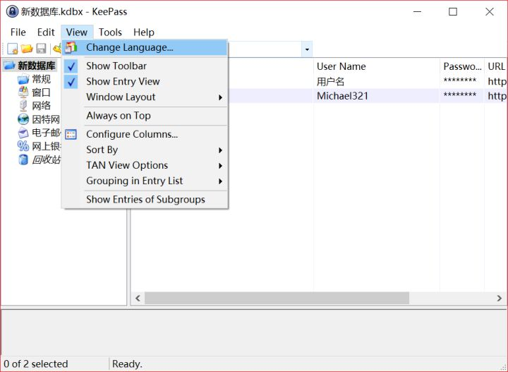

[官方下载页](https://link.zhihu.com/?target=https%3A//keepass.info/download.html)

分为安装版和非安装版，根据需要下载。

[中文包](https://link.zhihu.com/?target=https%3A//downloads.sourceforge.net/keepass/KeePass-2.38-Chinese_Simplified.zip)

中文包解压缩后放在 keepass 目录的 Languages 目录中。然后进入 “View”-“Change Language...” 选择简体中文语言包，并点击确定重启。



重启后 keepass 应该就是中文界面了，打开 keepass，点击软件左上角的“文件”-“新建”创建一个新的密码数据库


https://zhuanlan.zhihu.com/p/35907865


```go
"user_add_org" 				// 用户变更, 通讯录用户增加
"user_modify_org" 			// 用户变更, 通讯录用户更改
"user_leave_org" 			// 用户变更, 通讯录用户离职
"user_active_org" 			// 用户变更, 加入企业后用户激活
"org_admin_add" 			// 用户变更, 通讯录用户被设为管理员
"org_admin_remove" 			// 用户变更, 通讯录用户被取消设置管理员
"org_dept_create" 			// 部门变更, 通讯录企业部门创建
"org_dept_modify" 			// 部门变更, 通讯录企业部门修改
"org_dept_remove" 			// 部门变更, 通讯录企业部门删除
"org_remove" 				// 企业信息变更, 企业被解散
"org_change" 				// 企业信息变更, 企业信息发生变更
"label_user_change" 		// 角色变更, 员工角色信息发生变更
"label_conf_add" 			// 角色变更, 增加角色或者角色组
"label_conf_del" 			// 角色变更, 删除角色或者角色组
"label_conf_modify" 		// 角色变更, 修改角色或者角色组
```

