----------------------------------------------
> *Made By Herolh*
----------------------------------------------

# 目录 {#index}
[TOC]


--------------------------------------------

# 一、初识 Redis

## 缓存数据库介绍

&emsp;&emsp;NoSQL (NoSQL = Not Only SQL )，意即“不仅仅是SQL”，泛指非关系型的数据库,随着互联网 web2.0 网站的兴起，传统的关系数据库在应付 web2.0 网站，特别是超大规模和高并发的 SNS 类型的 web2.0 纯动态网站已经显得力不从心，暴露了很多难以克服的问题，而非关系型的数据库则由于其本身的特点得到了非常迅速的发展。NoSQL 数据库的产生就是为了解决大规模数据集合多重数据种类带来的挑战，尤其是大数据应用难题。


### NoSQL数据库的四大分类

- **键值( Key-Value )存储数据库**

    > 这一类数据库主要会使用到一个[哈希表](http://baike.baidu.com/view/329976.htm)，这个表中有一个特定的键和一个指针指向特定的数据。Key/value模型对于IT系统来说的优势在于简单、易部署。但是如果[DBA](http://baike.baidu.com/subview/67156/5112091.htm)只对部分值进行查询或更新的时候，Key/value就显得效率低下了。[3] 举例如：Tokyo Cabinet/Tyrant, Redis, Voldemort, Oracle BDB.

- **列存储数据库**

    > 这部分数据库通常是用来应对分布式存储的海量数据。键仍然存在，但是它们的特点是指向了多个列。这些列是由列家族来安排的。如：Cassandra, HBase, Riak.

- **文档型数据库**

    > 文档型数据库的灵感是来自于Lotus Notes办公软件的，而且它同第一种键值存储相类似。该类型的数据模型是版本化的文档，半结构化的文档以特定的格式存储，比如JSON。文档型数据库可 以看作是键值数据库的升级版，允许之间嵌套键值。而且文档型数据库比键值数据库的查询效率更高。如：CouchDB, MongoDb. 国内也有文档型数据库SequoiaDB，已经开源。

- **图形(Graph)数据库**

    > 图形结构的数据库同其他行列以及刚性结构的 SQL 数据库不同，它是使用灵活的图形模型，并且能够扩展到多个服务器上。NoSQL 数据库没有标准的查询语言(SQL)，因此进行数据库查询需要制定数据模型。许多 NoSQL 数据库都有 REST 式的数据接口或者查询API。[2] 如：Neo4J, InfoGrid, Infinite Graph.

&emsp;&emsp;因此，我们总结 NoSQL 数据库在以下的这几种情况下比较适用：1、数据模型比较简单；2、需要灵活性更强的IT系统；3、对数据库性能要求较高；4、不需要高度的数据一致性；5、对于给定key，比较容易映射复杂值的环境。


### NoSQL数据库的四大分类表格分析

|       分类        |                   Examples 举例                    |                         典型应用场景                         |                    数据模型                     |                             优点                             |                             缺点                             |
| :---------------: | :------------------------------------------------: | :----------------------------------------------------------: | :---------------------------------------------: | :----------------------------------------------------------: | :----------------------------------------------------------: |
| 键值（key-value） | Tokyo Cabinet/Tyrant, Redis, Voldemort, Oracle BDB | 内容缓存，主要用于处理大量数据的高访问负载，也用于一些日志系统等等。 | Key 指向 Value 的键值对，通常用hash table来实现 |                          查找速度快                          |        数据无结构化，通常只被当作字符串或者二进制数据        |
|   列存储数据库    |               Cassandra, HBase, Riak               |                       分布式的文件系统                       |       以列簇式存储，将同一列数据存在一起        |         查找速度快，可扩展性强，更容易进行分布式扩展         |                         功能相对局限                         |
|   文档型数据库    |                  CouchDB, MongoDb                  | Web应用（与Key-Value类似，Value是结构化的，不同的是数据库能够了解Value的内容） |    Key-Value对应的键值对，Value为结构化数据     | 数据结构要求不严格，表结构可变，不需要像关系型数据库一样需要预先定义表结构 |            查询性能不高，而且缺乏统一的查询语法。            |
| 图形(Graph)数据库 |          Neo4J, InfoGrid, Infinite Graph           |           社交网络，推荐系统等。专注于构建关系图谱           |                     图结构                      |     利用图结构相关算法。比如最短路径寻址，N度关系查找等      | 很多时候需要对整个图做计算才能得出需要的信息，而且这种结构不太好做分布式的集群方案。 |

 


## redis 介绍

&emsp;&emsp;redis 是业界主流的 key-value nosql 数据库之一。和 Memcached 类似，它支持存储的 value 类型相对更多，包括 **string(字符串)、list(链表)、set(集合)、zset(sorted set 有序集合)和 hash(哈希类型)**。这些数据类型都支持 push/pop、add/remove 及取交集并集和差集及更丰富的操作，而且这些操作都是原子性的。在此基础上，redis支持各种不同方式的排序。
&emsp;&emsp;与 memcached 一样，为了保证效率，数据都是缓存在内存中。区别的是 **redis 会周期性的把更新的数据写入磁盘或者把修改操作写入追加的记录文件**，并且在此基础上实现了 master-slave(主从) 同步。


### Redis优点

- **异常快速** : Redis 是非常快的，每秒可以执行大约110000设置操作，81000个/每秒的读取操作。

- **支持丰富的数据类型** : Redis支持最大多数开发人员已经知道如列表，集合，可排序集合，哈希等数据类型。

    这使得在应用中很容易解决的各种问题，因为我们知道哪些问题处理使用哪种数据类型更好解决。

- **操作都是原子的** : 所有 Redis 的操作都是原子，从而确保当两个客户同时访问 Redis 服务器得到的是更新后的值（最新值）。

- **MultiUtility工具**：Redis是一个多功能实用工具，可以在很多如：缓存，消息传递队列中使用（Redis原生支持发布/订阅），在应用程序中，如：Web应用程序会话，网站页面点击数等任何短暂的数据；


### redis 安装

#### windows 下安装

**下载地址：**https://github.com/tporadowski/redis/releases。

Redis 支持 32 位和 64 位。这个需要根据你系统平台的实际情况选择，这里我们下载 [Redis-x64-5.0.9.msi](https://github.com/tporadowski/redis/releases/download/v5.0.9/Redis-x64-5.0.9.msi)直接进行安装。


#### Ubuntu 安装

```shell
sudo apt-get install redis-server
```

```shell
# 启动 Redis
redis-server
#  查看 redis 是否还在运行
redis-cli
```

这将打开一个 Redis 提示符，如下图所示：

```
redis 127.0.0.1:6379>
```

在上面的提示信息中：127.0.0.1 是本机的IP地址，6379是 Redis 服务器运行的端口。现在输入 PING 命令，如下图所示：

```
redis 127.0.0.1:6379> ping
PONG
```

这说明现在你已经成功地在计算机上安装了 Redis。


### redis 图形化管理界面

https://github.com/uglide/RedisDesktopManager


## Redis API 使用

### 常用命令

```shell
# 获取帮助
help set

SET key value [expiration EX seconds|PX milliseconds] [NX|XX]
```

```shell
# 设置值
set key value ex 3				# 3 秒后过期
set key value px 3000			# 3 秒后过期

# 获取值, 根据模型获取redis的name
keys(pattern='*')
# KEYS * 匹配数据库中所有 key 。
# KEYS h?llo 匹配 hello ， hallo 和 hxllo 等。
# KEYS h*llo 匹配 hllo 和 heeeeello 等。
# KEYS h[ae]llo 匹配 hello 和 hallo ，但不匹配 hillo


get key
get key *						# 获取所有的键

# 根据删除redis中的任意数据类型
delete(*names)

# 将redis的某个值移动到指定的db下
move(name, db))

# 检测redis的name是否存在
exists(name)

# 为某个redis的某个name设置超时时间
expire(name ,time)

# 对redis的name重命名为
rename(src, dst)

# 随机获取一个redis的name（不删除）
randomkey()

# 获取name对应值的类型
type(name)

# 同字符串操作，用于增量迭代获取key
scan(cursor=0, match=None, count=None)
scan_iter(match=None, count=None)
```


redis-py 的 API 的使用可以分类为：

- 连接方式
- 连接池
- 操作
    - String 操作
    - Hash 操作
    - List 操作
    - Set 操作
    - Sort Set 操作
- 管道
- 发布订阅


### 操作

#### String 操作

redis 中的 String 在内存中按照一个 name 对应一个 value 来存储。如图：

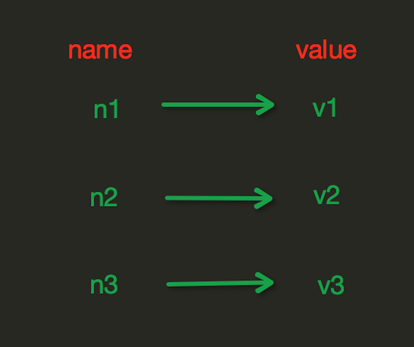

##### 设置值

- **set(name, value, ex=None, px=None, nx=False, xx=False)**

    > 在Redis中设置值，默认不存在则创建，存在则修改，参数：
    >
    > ```shell
    > ex，过期时间（秒）
    > px，过期时间（毫秒）
    > nx，如果设置为 True，则只有 name 不存在时，当前set操作才执行
    > xx，如果设置为 True，则只有 name 存在时，岗前set操作才执行
    > ```
    >
    > 示例：
    >
    > ```shell
    > set name1 "lin"			# 不会自动过期
    > set name "lin" ex 5		# 5 秒后过期
    > set name1 "lin" nx		# name1 有值故无法执行
    > set name1 "lin1" xx		# name1 有值故可以执行(修改值)
    > ```
    >
    > 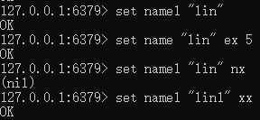


- **setnx(name, value)**

    > 设置值，只有 name 不存在时，执行设置操作（添加）

- **setex(name, value, time)**

    > 设置值，time，过期时间（数字秒 或 timedelta 对象）

- **psetex(name, time_ms, value)**

    > 设置值，time_ms，毫秒级过期时间（数字毫秒 或 timedelta 对象）

- **mset(*args, **kwargs)**

    > 批量设置值
    >
    > ```shell
    > # 如：
    > mset(k1='v1', k2='v2')
    > # 或
    > mget({'k1': 'v1', 'k2': 'v2'})
    > ```
    >
    > 示例：
    >
    > ```shell
    > mset name lin age 18
    > ```
    >
    > 

- **setbit(name, offset, value)**

    > 对name对应值的二进制表示的位进行操作
    > ```shell
    > # 参数：
    > name:		redis的name
    > offset:		位的索引（将值变换成二进制后再进行索引）
    > value:		值只能是 1 或 0
    > 
    > # 注：如果在Redis中有一个对应： n1 = "foo"，
    >      那么字符串foo的二进制表示为：01100110 01101111 01101111
    >  所以，如果执行 setbit('n1', 7, 1)，则就会将第7位设置为1，
    >      那么最终二进制则变成 01100111 01101111 01101111，即："goo"
    > ```
    >
    > 示例：
    >
    > ```shell
    > setbit name 7 1
    > ```
    >
    > 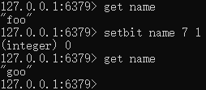


##### 获取值
- **get(name)**
  
  > 获取值
- **mget(keys, *args)**
  
    > 批量获取
    > ```shell
    > # 如：
    > mget('ylr', 'wupeiqi')
    > # 或
    > r.mget(['ylr', 'wupeiqi'])
    > ```
    >
    > 示例：
    >
    > ```shell
    > mget name age
    > ```
    >
    > 

- **getrange(key, start, end)**

    > 获取子序列(根据字节获取，非字符)。**切片**
    >
    > ```shell
    > # 参数：
    > name，Redis 的 name
    > start，起始位置（字节）
    > end，结束位置（字节）
    > ```
    >
    > 示例
    >
    > ```shell
    > getrange name1 0 2  
    > getrange name1 0 -1			# 取到最后一位数  
    > ```
    >
    > 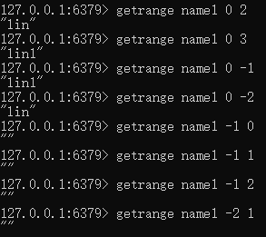

- **getbit(name, offset)**

    > 获取name对应的值的二进制表示中的某位的值 （0或1）
    >
    > ```shell
    > getbit name 7
    > # 字符串 goo 的二进制表示为：01100111 01101111 01101111
    > # 所以，第7位为1, 第0位为0
    > ```
    >
    > 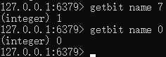

- **bitcount(key, start=None, end=None)**

    > 获取name对应的值的二进制表示中 1 的个数
    >
    > ```shell
    > key:		Redis的name
    > start:		位起始位置
    > end:		位结束位置
    > ```
    >
    > 示范：
    >
    > ```shell
    > bitcount name
    > bitcount name 0 0
    > bitcount name 0 1
    > ```
    >
    > 


##### 更新值

- **setrange(name, offset, value)**

    > ```shell
    > # 修改字符串内容，从指定字符串索引开始向后替换（新值太长时，则向后添加）
    > # 参数：
    > offset:		字符串的索引，字节（一个汉字三个字节）
    > value:		要设置的值
    > ```
    >
    > 示例：
    >
    > ```shell
    > setrange name1 3 2
    > setrange name1 3 22222222
    > ```
    >
    > 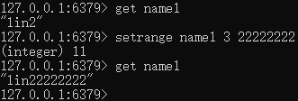


- **getset(name, value)**
  
    > ```
    > 设置新值并获取原来的值
    > ```
    >
    > 示例：
    >
    > ```shell
    >  getset age 19
    > ```
    >
    > 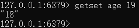


##### 特殊

- **strlen(name)**

    > 返回name对应值的字节长度（一个汉字3个字节）
    >
    > ```shell
    > strlen name2
    > ```
    >
    > 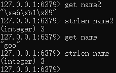

- **incr(self, name, amount=1)**

    > 自增 name对应的值，当name不存在时，则创建name＝amount，否则，则自增。
    >
    > ```shell
    > name:			Redis的name
    > amount:			自增数（必须是整数)		# redis 语法是没有的
    > # 注：同incrby
    > ```
    >
    > 示例：
    >
    > ```shell
    > incr age
    > ```
    >
    > 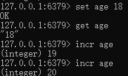

- **incrbyfloat(self, name, amount=1.0)**

    > 自增 name 对应的值，当 name 不存在时，则创建 name＝amount，否则，则自增。
    >
    > ```shell
    > name:		Redis的name
    > amount:		自增数（浮点型）
    > ```
    >
    > 示例：
    >
    > ```shell
    > incrbyfloat age 5
    > incrbyfloat age 1.1
    > ```
    >
    > 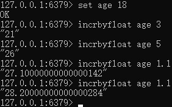

- **decr(self, name, amount=1)**

    > 自减 name对应的值，当name不存在时，则创建name＝amount，否则，则自减。
    >
    > ```shell
    > name:			Redis的name
    > amount:			自减数（必须是整数)			# redis 语法是没有的
    > ```
    >
    > 示例：
    >
    > ```shell
    > decr age
    > ```
    >
    > 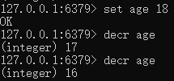

- **append(key, value)**

    > 在 redis name 对应的值后面追加内容
    >
    > ```shell
    > key:		redis的name
    > value:		要追加的字符串
    > ```
    >
    > 示例：
    >
    > ```shell
    > append name1 123
    > ```
    >
    > 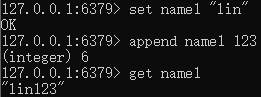


#### Hash 操作

&emsp;&emsp;hash 表现形式上有些像 pyhton 中的 dict,可以存储一组关联性较强的数据，redis 中 Hash 在内存中的存储格式如下图：　　


##### 设置值

- **hset(name, key, value)**

    > name对应的hash中设置一个键值对（不存在，则创建；否则，修改）

- 


# 案例

## 统计用户登录

> 登录数量，用户是否登录

````shell
set usercount "\x00"				# 初始化所有位为 0
bitcount usercount
setbit usercount 10000 1			# 第 10000 名客户登陆
setbit usercount 100 1				# 第 100 名 拥护的登录
bitcount usercount					# 统计登录人数
getbit usercount 100				# 查看第 100 用户是否登录
````


> 一亿个用户，占一亿位，约等于 10M


# 思考

- **自己写的程序数据也是存在内存，Redis 也是存在内存里，为什么我们还要用 Redis？**

    > 自己写的程序数据存在的是独立的内存，其他应用程序无法访问


