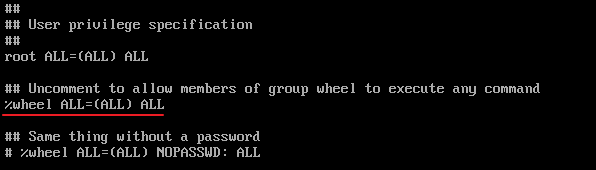
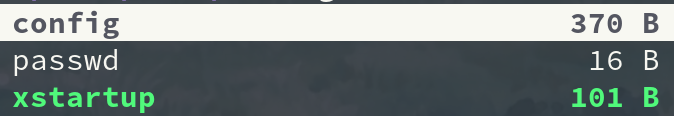
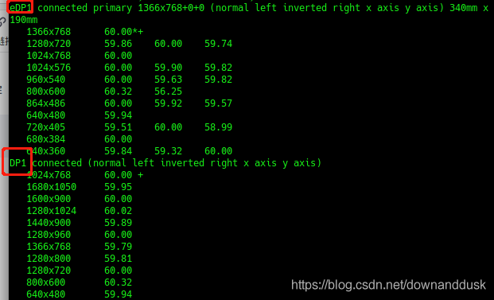
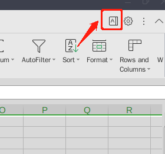
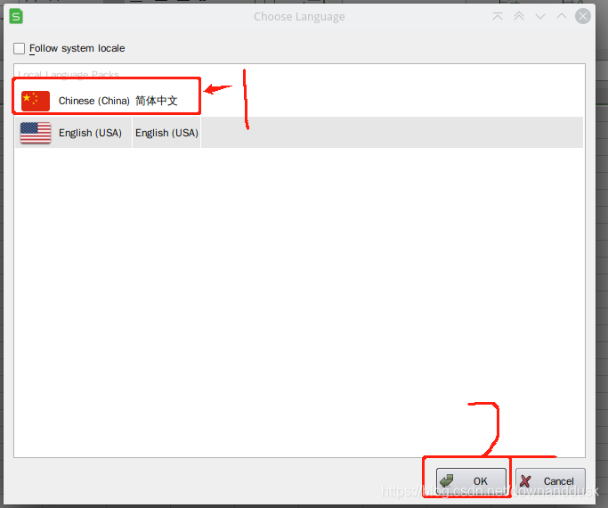
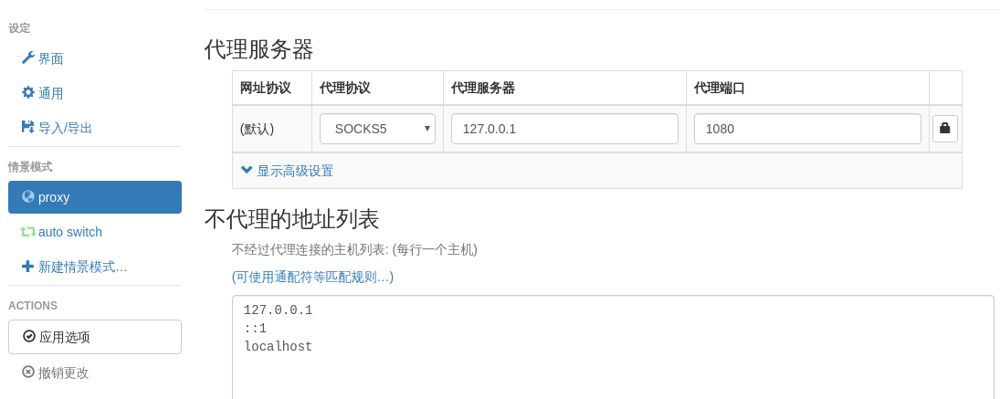
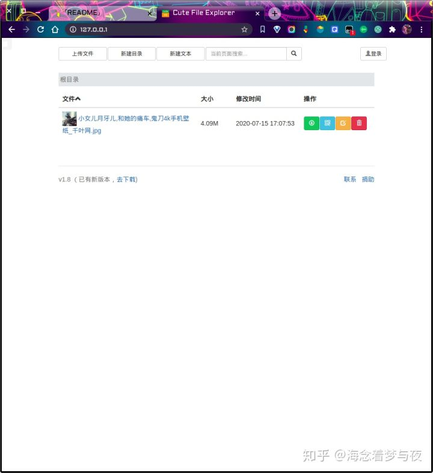

----------------------------------------------
> *Made By Herolh*
----------------------------------------------

# 目录 {#index}

[TOC]


--------------------------------------------

# 前期准备

```shell
wait...
```


# 正式安装

## 调整并选择字体

```shell
setfont /usr/share/kbd/consolefonts/LatGrkCyr-12x22.psfu.gz
```


## 更改键盘锁定:

```shell
vim keymap.conf
# 写入以下内容
keycode 1 = Caps_Lock
keycode 58 = Escape

 # 1 代表键盘上的 Escape
 # 58 代表键盘上的 Caps_Lock
```

```shell
loadkeys keymap.conf
```


## *联网

> 直连网线的可以跳过

```shell
 # 查看网络设备
ip link

 # 启用 wifi 设备
ip link set wlan0 up

 # 扫描 wifi 名称
 # iwlist wlan0 scan
iwlist wlan0 scan | grep ESSID

 # wifi-menu 不支持很多企业级的协议，后面的 arch 版本取消了
wpa_passphrase 网络名ESSID 密码 > internet.conf
vim internet.conf

 ###### 内容
network={
	ssid="网络名ESSID"
	pwk="密码"
}
 ###### 内容

wpa_supplicant -c internet.conf -i wlan0 &

 # 动态分配ip地址
dhcpcd &
```


## 同步时间

```shell
timedatectl set-ntp true
```


## *硬盘分区

### 查看硬盘设备

```shell
 # 查看硬盘设备
fdisk -l

 # 进入硬盘
fdisk /dev/sda
```


### 硬盘分区

```shell
 # 查看硬盘设备
fdisk -l

 # 进入硬盘
fdisk /dev/sda

 # m for help
 # p to print info
g
```


#### 创建系统分区

> 如果如果已经有一个系统(双系统)，该步骤可省略

```shell
 # (这一步要根据官方文档来， UEFI 和 EMAR 是不一样的)
 # 创建系统分区
n
1

+512M
Y
```


#### 创建缓存分区

```shell
 # 创建缓存分区
n
3

+8G
Y
```


#### 创建主分区

```shell
 # 创建主分区
n
2


Y
```


#### 修改分区格式

```shell
 # 修改分区格式
t
1
l						# 找到EFI System 的序号，此处为1
1

t
3
l						# 找到linux swap 的序号， 此处为19
19

 # 写入
w
```


### 格式化分区

```shell
 # 修改系统分区格式(必须是fat格式)
mkfs.fat -F 32 /dev/sda1

 # 修改主分区格式
mkfs.ext4 /dev/sda2

 # 制作缓存分区并打开
mkswap /dev/sda3
swapon /dev/sda3
```


## *配置 pacman 配置文件

```shell
vim /etc/pacman.conf

Color
ILoveCandy				# 下载变成吃豆人
```

```shell
vim /etc/pacman.d/mirrorlist

 # 将所有的中国源移到顶部
```


## *挂载硬盘

```shell
 # 挂载主分区到 /mnt 目录下
mount /dev/sda2 /mnt

 # 挂载系统分区
mkdir /mnt/boot
mount /dev/sda1 /mnt/boot
```


## *正式安装系统

```shell
pacstrap /mnt base linux linux-firmware base-devel NetworkManager vim git intel-ucode
 # base : linux 基础软件
 # linux : linux 内核
 # linux-firmware： linux 框架
 # base-devel:
 
 # 写入应用程序
genfstab -U /mnt >> /mnt/etc/fstab
```


## *设置安装好的系统

进入安装好的程序

```shell
arch-chroot /mnt
```

设置时区

```shell
ln -sf /usr/share/zoneinfo/Asia/Shanghai /etc/localtime
 # 同步系统时间
hwclock --systohc

exit
```

设置系统语言

```shell
vim /mnt/etc/locale.gen

 # 找到 en_US.UTF-8 和 zh_CN.UTF-8 取消注释
arch-chroot /mnt
locale-gen

# 设置语言 
vim /etc/locale.conf
#### 内容
LANG=en_US.UTF-8

```

设置系统键盘映射

```shell
vim /etc/vconsole.conf
#### 内容
keycode 1 = Caps_Lock
keycode 58 = Escape
```

设置主机名映射

```shell
vim /etc/hostname
#### 内容
主机名
```

设置主机本地IP名称

```shell
vim /etc/hosts

127.0.0.1	localhost
::1			localhost
127.0.1.1 	主机名.localdomain		主机名
```

修改root密码

```shell
passwd
```


## *引导管理

```shell
bootctl install

cd /boot/loader
vim loader.conf
 # 修改内容如下
timeout 5


cd entries
vim Arch.conf
 # 写入
title	Arch linux
linux	/vmlinuz-linux
initrd	/intel-ucode.img
initrd	/initramfs-linux.img
options	root="PARTUUID=xxxxxxx"	rw

 # PARTUUID 获得方法：
 # :r! blkid

```


## *解除挂载

```shell
umount -R mnt

reboot
```


# 系统设置

## 设置默认应用

设置默认编辑器为 vim

```shell
ln -s /usr/bin/vim /usr/bin/vi
```


## 新增用户

```shell
Useradd -m -G wheel admin
passwd admin
visudo
# 将以下注释去掉
```




## 安装图形化界面

### deepin 桌面

```shell
# 安装deepin 前必须要先有一个除root外的用户
# deepin
pacman -S xorg sddm
pacman -S deepin deepin-extra
pacman -Qs lightdm
vim /etc/lightdm/lightdm.conf
# 追加以下内容
greeter-session=lightdm-deepin-greeter
# 追加以上内容

sudo systemctl enable lightdm
sudo systemctl start lightdm
```

> 安装完浏览器，出现未知错误时直接浏览器弹出官网广告，不能忍！


### DWM 桌面

#### 安装

- 安装图形化桌面资源

    ```shell
    sudo pacman -S xorg xorg-server xorg-apps xorg-xinit
    ```

- 下载源码

    ```shell
    git clone git://git.suckless.org/dwm --depth=1
    git clone git://git.suckless.org/dmenu --depth=1
    git clone git://git.suckless.org/st --depth=1
    ```

- 安装

    ```shell
    cd dwm
    make
    sudo make clean install
    
    cd ..
    cd dmenu
    make
    sudo make clean install
    
    cd ..
    cd st
    make
    sudo make clean install
    ```

- 修改启动桌面为 dwm

    ```shell
    vim ~/.xinitrc
    
    exec dwm
    ```

- 启动 dwm

    ```shell
    startx
    ```


#### 配置

> 单独文章讲


## 安装网络链接系统托盘

```shell
sudo pacman -S network-manager-applet
```


## 安装蓝牙驱动

```shell
sudo pacman -S bluez bluez-utils
sudo systemctl enable bluetooth
sudo systemctl start bluetooth

 # 开启蓝牙扫描连接
 bluetoothctl
 power on
 agent on
 default-agent
 scan on
 pair 蓝牙MAC地址
 trust 蓝牙 MAC 地址
 connect 蓝牙 MAC 地址
 
 scan off
```


## 安装声音驱动

```shell
pacman -Sy alsa-lib alsa-utils

pacman -S alsa-utils 
 # 安装 alsa-tray 从托盘控制音量大小
yay -S alsa-tray
" 加入开机脚本脚本
LANG=zh_CN.utf-8 alsa-tray &

# 接触静音
amixer sset Master unmute 
amixer
# 也可以使用 pulseaudio 控制音量
pacman -S pulseaudio pavucontrol 
systemctl --user start pulseaudio
systemctl --user enable pulseaudio
```

[ArchLinux下Alsa的简单配置](https://blog.csdn.net/xiaoyi239/article/details/83123904)


## 安装显卡驱动

> [[Arch双显卡方案](https://mrhuanhao.cn/2020/04/05/arch-newsil/)](https://mrhuanhao.cn/2020/04/05/arch-newsil/)

&emsp;&emsp;&emsp;&emsp;如果只安装闭源驱动，当然可以，但是要知道，耗电速度可能远远超过你的持久现在我给你介绍[NVIDIA Optimus](https://wiki.archlinux.org/index.php/NVIDIA_Optimus)这一个在arch下最好的最简单的双显卡方案。它和ubuntu下的PRIME类似，通过在显卡管理器中更改配置文件来使用核显或独显。我们只需要安装两个包:

```shell
pacman -S nvidia bbswitch    

yay -S optimus-manager-qt
# 托盘程序
#如果配置有archlinuxcn源，也可以使用pacman来安装
#如果使用KDE桌面，需安装optimus-manager-qt-kde
```

&emsp;&emsp;注意: 安装英伟达闭源驱动时，如果使用自定义内核，或者不想驱动崩掉，那就安装`nvidia-dkms`，`bbswitch`也是同理，安装`bbswitch-dkms`:

```shell
pacman -S nvidia-dkms bbswitch-dkms
```

安装`optimus-manager-qt`时，kde桌面需要在后面加上`-kde`

```shell
yay -S optimus-manager-qt
```

重启。此时你可以在托盘看见英伟达的图片，`右键-设置`在项`optimus`中，把`switching method`改为`Bbswitch`然后确定即可。使用：

```shell
 # 直接右键，有三个选项

switch to intel
switch to Nvidia
switch to Hybrid（无需理会）
```


## TLP 为电池节能

&emsp;&emsp;**TLP** 提供优秀的 Linux 高级电源管理功能,不需要您了解所有技术细节。默认配置已经对电池使用时间进行了优化，只要安装即可享受更长的使用时间。除此之外，TLP 也是高度可配置的，可以满足您的各种特定需求

```shell
sudo pacman -S tlp
sudo systemctl enable tlp.service tlp-sleep.service
sudo tlp start
```

[archwiki]([https://wiki.archlinux.org/index.php?title=TLP_(%E7%AE%80%E4%BD%93%E4%B8%AD%E6%96%87)&printable=yes](https://wiki.archlinux.org/index.php?title=TLP_(简体中文)&printable=yes))


## SSH 远程链接

```shell
 # Archlinux开启ssh服务命令：
systemctl enable sshd.service  开机启动
systemctl start sshd.service     立即启动
systemctl restart sshd.service   立即重启


```


## VNC 远程桌面

- **安装**

    ```shell
    sudo pacman -S tigervnc
    ```

- **配置**

    ```shell
     # vncserver命令用于第一次设置密码。问答式的，然后到.vnc下面。介绍几个配置文件。–和配置服务器一样的。
    vncserver
    
    cd ~/.vnc
    ```

    

    ```shell
     # config
    ## Supported server options to pass to vncserver upon invocation can be listed
    ## in this file. See the following manpages for more: vncserver(1) Xvnc(1).
    ## Several common ones are shown below. Uncomment and modify to your liking.
    ##
    #securitytypes=vncauth,tlsvnc
    securitytypes=tlsvnc
    desktop=sandbox
    geometry=1920x1080
    #geometry=1440x900
    dpi=96
    localhost
    alwaysshared
    ```

    config就是调分辨率，连接方式，连接参数的，照着我的填就ok了。然后 `cp xstartup xstartup.bak` 备份一下。直接放我的xstartup文件内容:

    ```shell
    #!/bin/sh
    unset SESSION_MANAGER
    unset DBUS_SESSION_BUS_ADDRESS
    export XKL_XMODMAP_DISABLE=1
    exec dwm
    ```

    解释一下，我用的是窗口管理器 dwm。因此我最后一行填 `exec dwm`。那么你用的其他桌面环境就填对应的就ok了。然后 `export XKL_XMODMAP_DISABLE=1` 是为了解决一些VNC传递过程中可能出现的按键错乱的问题。然后编写启动arch上vnc服务的脚本。

- **编写启动arch上vnc服务的脚本**

    ```shell
    vim vnc.sh
     # 内容
    x0vncserver  -display :0 -passwordfile ~/.vnc/passwd &
     # 内容
    
    chmod u+x vnc.sh
    ./vnc.sh
    ```

    然后就可以在windows上的客户端访问了。输入arch的`ip:5900`就可以访问了。全屏，就和用arch一样了。

- **不使用 VNC**

    注意，不用的时候可以运行这个脚本:

    ```shell
    #!/usr/bin/env bash
    killall x0vncserver
    ```


## 双屏显示

> [Archlinux配置双屏显示](https://blog.csdn.net/ggshiney/article/details/8188755)

### 安装驱动

```shell
wait
```

### 配置双屏

如果需要扩展显示桌面，还需要进行一番配置。`randr`(X Resize, Rotate and Reflect Extension)可以控制桌面的显示输出效果，如镜像、旋转等。`xrandr`是`randr`的命令行接口。首先查看当前显示状态，列出X显示设备：

```shell
xrandr -q
```

记住你屏幕上红框圈住地方对应位置的英文即可，这时每个显示屏的代号，这里eDP1是我的电脑主屏幕，DP1是副屏幕。

```shell
xrandr --output DP1 --auto --output eDP1 --auto --right-of DP1
```



设置电脑屏幕为主屏幕（**注意大小写**）

```shell
xrandr --output eDP1 --auto --primary
```

设置副屏幕显示，此时两个屏幕是同步的

```shell
xrandr --output DP1 --auto
```

把副屏幕设置到主屏幕左边，如果想改成右边，则将left改为right

```shell
xrandr --output DP1 --left-of eDP1
```

此时副屏幕设置成功。如果需要关闭屏幕则：

```shell
关闭副屏幕
```


## 解决 arch 下挂载 ntfs 格式硬盘
> [manjaro挂载NTFS系统的方法](https://www.cnblogs.com/suge-0620/p/13587224.html)
> [解决arch下挂载ntfs格式硬盘](https://my.oschina.net/chliny/blog/70478)

为了实现读写ntfs文件系统的功能，我们采用ntfs-3g方案。

```shell
sudo pacman -S ntfs-3g
```

重启后就可以在 windows 盘中新建文件了，虽然我也不知道为什么。也就是说你已经可以写盘了。但是要做到开机即能检测到盘，我们还是将它挂载。我们查看下哪个分区是NTFS分区。

```shell
sudo fdisk -l
```

知道哪个是 NTFS分区 后,我们来编辑 ``/etc/fstab`, 实现自动挂载.加入类似如下的内容:(只是一个例子)

```shell
/dev/sda1  /mnt/windows  ntfs-3g  users,noauto,uid=1000,gid=100,fmask=0113,dmask=0002,locale=zh_CN.utf8  0 0

 
/dev/sda6  /mnt/backup   ntfs-3g  users,uid=1000,gid=100,fmask=0113,dmask=0002,locale=zh_CN.utf8         0 0

 #/mnt是根目录下路径，是你的NTFS文件系统的挂载点。windows或者backup都是名字，可以随便取。
```

写入代码的特点为:

1. 可以让任何用户挂载和卸载你的NTFS分区。
2. `user(uid=1000)` 和 `group(gid=100)` 拥有分区的所有文件，并且对文件有 `-rw-rw-r-- (0664)` 权限，对目录有 `drwxrwxr-x (1775)` 权限。
3. 使用 `zh_CN.utf8` 作为 `locale`
4. `/dev/sda6` 在启动时自动挂载，`/dev/sda1` 则不会


## 添加中文社区仓库

> [Arch Linux 中文社区仓库](https://www.ituring.com.cn/article/215935)

使用方法：在 `/etc/pacman.conf`文件末尾添加以下内容：

```shell
[archlinuxcn]
Server = https://mirrors.zju.edu.cn/archlinuxcn/$arch
 # Server = https://cdn.repo.archlinuxcn.org/$arch
```

然后：

```shell
$ sudo pacman -Syy
$ sudo pacman -Syu
$ sudo pacman -S archlinuxcn-keyring
$ sudo pacman -S archlinuxcn-mirrorlist-git
```


# 推荐安装应用

> [安装和使用ArchLiunx超详细教程](https://blog.csdn.net/langxultisky/article/details/106188361)
>
> [Manjaro**的一站式安装流程**（以kde版本为例）](https://zhuanlan.zhihu.com/p/335337120)
>
> [[Arch Linux 记录](https://www.cnblogs.com/maxuewei2/p/6298566.html)](https://www.cnblogs.com/maxuewei2/p/6298566.html)


## 必备工具

### man

```shell
sudu pacman -S man
```

```shell
" 使用
LANG=zh_CN.UTF8 man mplayer
```


### yay

```shell
pacman -S --needed git
git clone https://aur.archlinux.org/yay.git
cd yay
makepkg -si
```


### neofetch

```shell
sudo pacman -S neofetch
```

#### 配置

> neofetch的配置文件，路径在~/.config/neofetch/

```shell
# See this wiki page for more info:
# https://github.com/dylanaraps/neofetch/wiki/Customizing-Info
print_info() {
    # info title 			# 包含主机名和登录名，只有我自己用，也不需要，注释掉
    info underline

    info "OS" distro
    info "Host" model
    info "Kernel" kernel
    info "Uptime" uptime
    # info "Packages" packages # 查找所有包的数量，耗时间也没啥用，注释掉
    info "Shell" shell
    info "Resolution" resolution
    info "DE" de
    info "WM" wm
    info "WM Theme" wm_theme
    info "Theme" theme
    info "Icons" icons
    info "Terminal" term
    info "Terminal Font" term_font
    info "CPU" cpu
    info "GPU" gpu
    info "Memory" memory

    # info "GPU Driver" gpu_driver  # Linux/macOS only
    info "CPU Usage" cpu_usage 		# CPU使用情况
    info "Disk" disk  				# 磁盘使用情况
    # info "Battery" battery
    # info "Font" font
    # info "Song" song
    # [[ "$player" ]] && prin "Music Player" "$player"
    # info "Local IP" local_ip
    # info "Public IP" public_ip
    # info "Users" users
    # info "Locale" locale  # This only works on glibc systems.
    # info cols
}

# 在第644行左右，配置image_source为自定义的ascii图形文件的位置
image_source="/root/.config/neofetch/ascii-name"
```

生成ascii文字，可用网站:http://www.network-science.de/ascii/，有很多的字体可以选择。


### alacritty 终端模拟器

```shell
sudo pacman -S alacritty

 # 生成配置文件
cd ~/.config
mkdir alacritty
cp /usr/share/doc/alacritty/example/alacritty.yml ~/.config/alacritty
cd ~/.config/alacritty
chmod -R 664 alacritty.yml
```


### noto 字体

```shell
sudo pacman -S noto-fonts-cjk
 # 查看字体
fc-match -a | grep "SC"
```


### google 浏览器

```shell
yay -S google-chrome
```


### ranger 终端文件管理

> 专门文章介绍


### 壁纸管理

#### nitrogen

> 没仔细研究，不知道可不可以随机壁纸

```shell
sudo pacman -S nitrogen

vi ~/.xinitrc
nirtogen --restore
```


#### feh

> bash 脚本定时随机抽取当脚本

```shell
sudo pacman -S feh
```

```shell
feh --recursive --randomize --bg-fill ~/github/theniceboy/wallpapers/ghibili
```


### picom 终端美化

```shell
sudo pacman -S picom
vi ~/.xinitrc
picom -b
```


### net-tools

> 包含 nestat

```shell
sudo pacman -S net-tools
```


### 文件管理器

```shell
sudo pacman -S pcmanfm
```


## 输入法工具

###  安装字体和Emoji

#### Emoji

```shell
yay -S ttf-linux-libertine ttf-inconsolata ttf-joypixels ttf-twemoji-color noto-fonts-emoji ttf-liberation ttf-droid
```


#### 中文

```shell
yay -S wqy-bitmapfont wqy-microhei wqy-microhei-lite wqy-zenhei adobe-source-han-mono-cn-fonts adobe-source-han-sans-cn-fonts adobe-source-han-serif-cn-fonts
```


### googlepinyin 输入法

```shell
sudo pacman -S fcitx fcitx-im fcitx-googlepinyin fcitx-configtool

 # 配置环境变量
vi ~/.xinitrc
export GTK_IM_MODULE=fcitx
export QT_IM_MODULE=fcitx
export XMODIFIERS=@im=fcitx

fcitx &


fcitx-configtool

```

如果通过sddm 等启动的要去 `etc/environment` 下添加内容：

```shell
GTK_IM_MODULE=fcitx
QT_IM_MODULE=fcitx
XMODIFIERS=@im=fcitx
```


## 办公工具

### wps-office

```shell
yay -S wps-office-cn ttf-wps-fonts wps-office-mui-zh-cn
```

打开WPS软件，随便新建一个文件（word,excel,ppt都可以),不新建文件是看不到A标志的，看到后点它。






## 影音工具

### 终端下工具

> ranger 下可用

#### mplayer

```shell
sudo pacman -S mplayer
```

> `man mplayer` 查看使用说明

```shell
" 播放目录下所有
mplayer ./*

" 深度遍历所有 mp3 文件并生成 播放列表
find ./ -type f -name '*.mp3' >> playlist.lst

# 指定播放列表，-shuffle 指定随机播放
mplayer -playlist playlist.lst -shuffle

# 循环播放 5 遍， 如果为 0 则表示不停播放
mplayer -loop 5 file
```


### vlc

```shell
sudo pacman -S vlc
```


### 网易云音乐

```shell
sudo pacman -S netease-cloud-music
```


### 屏幕取色工具

```shell
sudo pacman -Sy gpick
```


### 截屏软件

```shell
sudo pacman -S flameshot
```


### 录屏软件

```shell
pacman  -S  simplescreenrecorder
```


### 剪辑视频

```shell
pacman -S kdenlive
```


### 修图

#### gimp

> 较为专业的工具

```shell
pacman -S gimp
```


#### pinta

> 类似 windows 的画图工具

```shell
yay -S pinta
```


## 通讯工具

### 微信(可多开)

> [ArchLinux微信多开wine-wechat多开](https://www.jianshu.com/p/581abc92bf29)

先修改成国内社区源，再执行以下内容：

```shell
yay -S wine-for-wechat wine-wechat
```

如果产生库依赖的错误，则进行如下操作：

```shell
sudo vim /etc/pacman.conf

//取消下面两句的注释*
#[multilib]*
#Include = /etc/pacman.d/mirrorlist*

sudo pacman -Syy
```


### Tim

```shell
yay -S wine-tim
```


## 翻墙工具

### v2ray

> [Manjaro安装V2ray客户端](https://bbs.xiao2.me/thread-1539.htm)

#### 安装配置

```shell
sudo pacman -S v2ray
```

配置文件存放目录：`/etc/v2ray/config.json`，配置文件参考[官方文档](https://github.com/v2ray/manual/blob/master/zh_cn/chapter_00/start.md)

```shell
 #备份
sudo cp /etc/v2ray/config.json config.json.bak
 #修改
sudo vim /etc/v2ray/config.json
```


#### 浏览器安装插件

[SwitchyOmega插件下载](https://www.crx4chrome.com/crx/998/)

步骤：

- 选择情景模式：proxy

- 代理服务器信息填写：

    ```shell
    代理协议：SOCKS5
    代理服务器：127.0.0.1 	// 为配置文件中inbounds中的监听IP
    代理端口：10808 			// 为配置文件中inbounds中的监听端口
    ```

- 选择扩展中对应的代理模式：proxy




#### 运行V2ray

```shell
sudo v2ray -config /etc/v2ray/config.json
```


```shell
 #启动
sudo systemctl start v2ray.service 
 #关闭
sudo systemctl stop v2ray.service 
 #开机启动
sudo systemctl enable v2ray.service

```


## 开发工具

### python 3

```shell
sudo pacman -S python
sudo pacman -S python-pip
```


### pycharm

```shell
yay -S pycharm-professional
```

如果是 dwm 的话还需要安装 wmname，这可以解决出现在[Awesome](https://wiki.archlinux.org/index.php/Awesome)或[Dwm](https://wiki.archlinux.org/index.php/Dwm)或[Ratpoison之](https://wiki.archlinux.org/index.php/Ratpoison)类的窗口管理器中的Java GUI渲染问题。尝试设置“ compiz”或“ LG3D”，否则会有一个灰色的界面，无法进入项目界面：

```shell
sudo pacman  -S wmname
```

```shell
wmname LG3D
 # 或者  wmname compiz
 # 可以将该命令加到 dwm 的开机脚本里
```

发出wmname命令后，必须重新启动有问题的应用程序。之所以可行，是因为JVM包含已知的非重新父窗口管理器的硬编码列表。为了最大程度地讽刺，某些用户更喜欢[使用Java](https://en.wikipedia.org/wiki/Project_Looking_Glass)来模拟[Sun编写](https://en.wikipedia.org/wiki/Project_Looking_Glass)`LG3D`的非重新父窗口管理器。


解决方法路径：

[arch forums](https://bbs.archlinux.org/viewtopic.php?id=256945) -> [arch wiki](https://wiki.archlinux.org/index.php/Java#Impersonate_another_window_manager) -> [wmname](https://tools.suckless.org/x/wmname/)

wmname是一个很好的实用程序，用于修复JDK版本和其他损坏的程序的问题，例如，假设存在重新创建窗口的窗口管理器。


### goland

要先安装 snap

```shell
sudo snap install goland --classic
```


### postman

```shell
sudo pacman -S postman-bin
```


### Navicat

```shell
yay -S navicat121_premium_cs_x64
```

```shell
F" 修改中文乱码
sudo find / -name navicat
cd /opt/navicat
vim start_navicat
" 修改
export LANG="zh_CN.UTF-8"


“ 重新试用
rm -rf ～/.navicat64
```


### redis-manager

```shell
yay -S redis-desktop-manager
```


### redis

```shell
sudo pacman -S redis
sudo systemctl start redis
" sudo systemctl enable redis
```


## 虚拟化工具

### virtualbox

- 安装基本包

    ```shell
    sudo pacman -S virtualbox 
     # 选择virtualbox-host-modules-arch模块
    
    sudo pacman -S virtualbox-guest-iso
    ```

- 加载 VirtualBox 内核模块

    ```shell
    sudo modprobe vboxdrv vboxnetadp vboxnetflt
    ```

    > `vboxdrv`驱动模块
    > `vboxnetadp` 桥接网络
    > `vboxnetflt`host-only 网络
    > `vboxpci`：若要让虚拟机使用主体机的 PCI 设备，那么就需要这个模块。

- 安装扩展包

    ```shell
    yay -S virtualbox-ext-oracle
    ```

- 把当前用户组添加到vboxusers里面

    ```shell
    sudo usermod -G vboxusers -a 用户名
    ```

    


## 图书工具

### Zathura

> [wiki](https://wiki.archlinux.org/index.php/Zathura)
>
> [Linux 下的 PDF 阅读软件 Zathura](http://rachpt.cn/2018/01/22/linux-pdfreader-zathura/)

```shell
sudo pacman -S zathura zathura-pdf-mupdf
 # zathura-pdf-mupdf-基于MuPDF的EPUB，PDF和XPS支持
 # zathura-pdf-mupdf-基于MuPDF的EPUB，PDF和XPS支持
```

> 如何使用单独单独讲，有学习门槛


### evince

> PDF 阅读器

```shell
sudo pacman -S evince 
```


## snap

Snap是 Ubuntu 母公司 Canonical 于 2016 年 4 月发布 Ubuntu16.04 时候引入的一种安全的、易于管理的、沙盒化的软件包格式，与传统的dpkg/apt有着很大的区别。

> [Ubuntu 使用 snap 常用操作](https://blog.csdn.net/gulang03/article/details/85251620)

```shell
git clone https://aur.archlinux.org/snapd.git
cd snapd
makepkg -si

sudo systemctl enable --now snapd.socket

 # snap支持，请在/var/lib/snapd/snap和/snap之间创建符号链接：
sudo ln -s /var/lib/snapd/snap /snap
```

使用：

```shell
 #搜索要安装的Snap软件包
sudo snap find xxxx

 #查看Snap软件的更多信息
sudo snap info xxxx

 # 安装软件
sudo snap install pycharm-professional --classic

 # 列出已安装的snaps
snap list


 #更新Snap软件包
sudo snap refresh xxxx

 #还原到之前版本
sudo snap revert xxxx

 # 删除snap
sudo snap remove hello-world
```


## typora 文本编辑器md

```shell
yay -S typora
```


## 百度网盘

### BaiduPCS-Go 

> 百度网盘命令行版本， [BaiduPCS-Go的使用](https://www.jianshu.com/p/57167f6d89f2)

#### 安装

```shell
sudo pacman -S baidupcs-go
```


#### 使用

```shell
 # 打开
baidupcs
```

第一次使用需要有登陆的操作，输入 `login` 即可登陆，尊许提示依次输入账户和密码即可，如果需要验证码，则会输出一个链接，打开就可以看到验证码了。


## remmina 远程桌面客户端

```shell
pacman -S remmina freerdp libvncserver telepathy-glib gnome-keyring nxproxy spice-gtk3 xorg-server-xephyr
```


## chfs 局域网文件共享

[一个小型局域网web](https://link.zhihu.com/?target=http%3A//iscute.cn/chfs)，方便手机与电脑传文件，当然用wine.qq也很方便，不过wine.qq没法在局域网共享资源吧。 `init.sh`默认安装并设置了开机自动启动它，使用`ip a`查看主机的ip地址，然后用浏览器访问就ok。




## 捕捉键盘软件

```shell
pacman  -S  screenkey
```


## 密码管理器

```shell
sudo pacman -S keepass
```


## electerm 

> 类似 xshell，

```shell
sudo pacman -Rs electerm
```


# 系统清理

```shell
sudo pacman -R $(pacman -Qdtq)          #清理系统中无用的依赖包
sudo pacman -Scc            			#清理缓存，看路径像是之前下载的安装包

" 日志清洗
sudo journalctl --disk-usage                #查看日志大小
sudo journalctl --vacuum-time=5d                  #超过5天的自动删除
sudo journalctl --vacuum-size=500M                #超过500M的自动删除
sudo rm /var/lib/systemd/coredump/*             #崩溃日志，文件不多，也不大，删不删随你
```

清理/ home目录中的缓存。在这一步中，我将向您展示如何通过删除/ home / user文件夹中的缓存文件来清理Arch Linux。在使用我们的系统时，缓存将填满并占用大量空间。 因此，您可能要做的第一件事是清除用户目录中的缓存。 如果要检查缓存文件夹的大小，可以使用以下命令。

```shell
du -sh ~/.cache


```


# 遇到问题

## Linux+Windows双系统Windows时间不对

> https://jingyan.baidu.com/article/1974b289307564f4b1f774f7.html

### 问题情况

&emsp;&emsp;很多人装了Linux+Windows双系统后发现Windows时间不对，这是因为，两个操作系统对电脑硬件时间的定义不一样，Windows 认为电脑硬件时间是“本地时间”，因此它启动后直接用该时间作为“系统时间”并显示在桌面右下角的系统托盘里；而 Ubuntu 等 Linux 发行版则认为电脑硬件时间是“全球统一时间”（即 UTC，可百度了解），它在启动后在该时间的基础上，再加上电脑设置的时区数（比如我们在中国，它就加上“8”）。两种模式各有利弊，但是后一种模式在遇到时区转换、夏令时等情况时，通用性更强，基于上述原因，协调 Win/Lin 双系统时间一致的方法，就是让 Windows 也和 Linux 一样，将电脑硬件时间看作“全球统一时间”。


### 解决方法

- 进入Windows，按Win键+R，启动运行，输入“regedit”启动注册表

1. 依次进入以下路径：计算机\HKEY_LOCAL_MACHINE\SYSTEM\CurrentControlSet\Control\TimeZoneInformation 可以直接粘贴进上方路径
2. 新建一个QWORD值，如果电脑是32位系统，则新建DWORD值，重命名为“RealTimeIsUniversal”
3. 双击编辑，将数值数据改为1，基数是16进制
4. 重启电脑，时间正常了ra
5. ra