# [领域驱动设计从0到1之事件风暴](https://www.jianshu.com/p/797d96c1faab)

> 作者：万学凡
> 链接：https://www.jianshu.com/p/797d96c1faab
> 来源：简书
> 著作权归作者所有。商业转载请联系作者获得授权，非商业转载请注明出处。

下文源于我12月21日在 TGO 成都分会E家宴上的分享。我本人也是领域驱动设计的初学者，DDD（Domain-driven-design）是一种思考问题的方式和解决问题的方法，要想深入理解还需要反复的思考和练习。

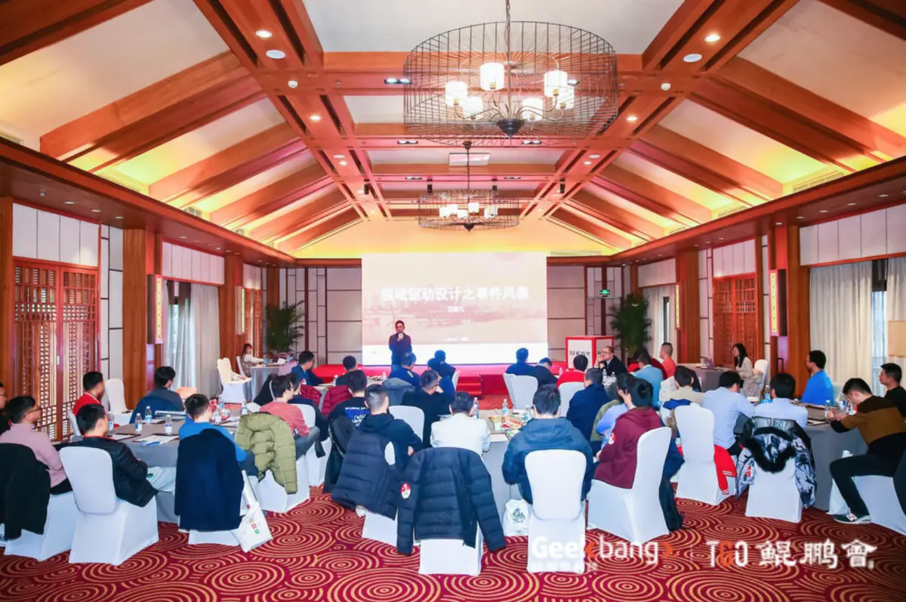

正文：

今天我分享的主题是《领域驱动设计之事件风暴》。当我每次去思考把一个话题讲清楚的时候，习惯于从Why（为什么），How（如何做），What（是什么）的角度展开。坦白地说，短时间甚至没可能把领域驱动设计中的Why讲清楚。所以构思今天这个分享的时候， 我反复斟酌，希望通过一条主线和大家一起走进领域驱动设计的世界。

我们还是从“为什么”开始：软件系统设计面临的挑战。

我们都理解软件开发的不确定性贯穿了整个软件工程的生命周期，很多时候我们希望通过敏捷的方式来应对不确定性，在软件工程里面这种不确定性包括进度、需求、成本等等。然而本就没有所谓的“银弹”：没有一种单纯的技术或管理上的进步，能够独立地承诺在10年内大幅度地提高软件的生产率、可靠性和简洁性。

那么如何应对业务的复杂性呢？在这个背景下，领域驱动设计横空出世。

领域驱动设计是一种处理高度复杂领域的设计思想，试图通过分离技术实现的复杂性，围绕业务概念构建领域模型来控制业务的复杂性，以解决软件难以理解、难以演化等问题。团队应用它可以成功地开发复杂业务软件系统，使系统在增大时仍然保持敏捷。

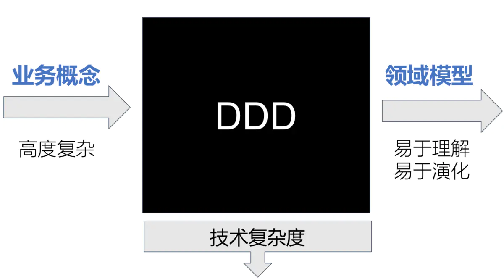

DDD有几个核心思想：

> 1.软件项目的主要聚焦点应该在领域和领域逻辑，不应该直接从需求开始设计数据库表结构。
>
> 2.复杂的领域设计应该基于领域模型，领域模型是封装了数据和行为的对象。
>
> 3.软件工程核心实质是社会工程，优秀团队的竞争力来源于互相的信任及良好的沟通。DDD强调技术专家和领域专家一起进行创造性的合作，从而可以不断地切入问题域的核心。

领域驱动设计包括两个阶段：

> 以一种领域专家、设计人员、开发人员都能理解的通用语言作为相互交流的工具，在交流的过程中发现领域概念，然后将这些概念设计成一个领域模型；
>
> 由领域模型驱动软件设计，用代码来实现该领域模型。

Eric Evans在《领域驱动设计》中建议开发一个共享域模型，作为领域专家和IT之间的桥梁，它以无处不在的语言编写并由应用程序代码实现。近年来，为这些活动建立了两种研讨会的形式。

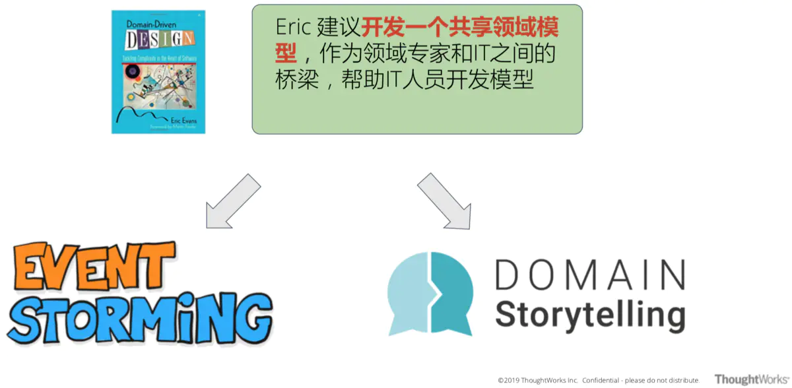

这两种形式的研讨会都有助于为IT专业人员提供对域的深入洞察和开发域的通用可视化模型。

下面我来以一个具体的电商场景为例，分享**事件风暴工作坊**是如何开展的。

### 事件风暴工作坊

#### **准备工作**

> 正确的人：领域专家，技术人员，用户体验设计师，测试人员等关键角色要参与其中。
>
> 开放空间：有足够的空间可以将事件流可视化，让团队可以交互讨论。
>
> 即时贴 & 笔：至少四种颜色，分别代表事件，命令，角色，聚合，外部系统，其他约束等。

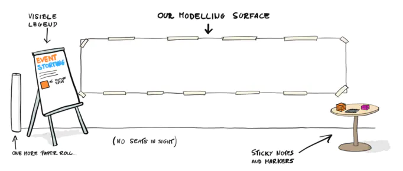

#### **事件风暴**

**设计业务场景**：根据产品愿景与价值定位，设计关键场景，找出起点与终点。

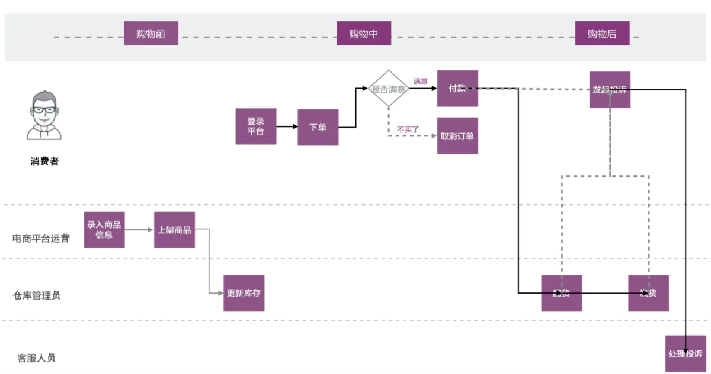

**找出领域事件**

> 根据设计的业务场景，将领域事件写在即时贴上。
>
> 每个即时贴表示一个事件。
>
> 事件采用“XX已XX”的格式，如“订单已创建”。

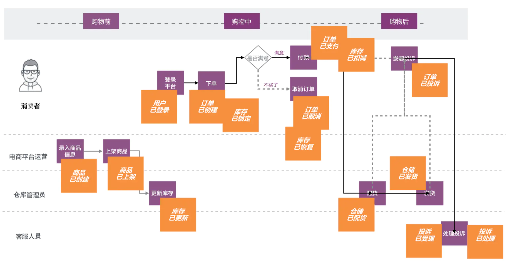

**事件排序**

> 将自己的事件贴纸贴在白板纸上。
>
> 每个事件从左到右按时间顺序排列。
>
> 不同事件需保证相对顺序。

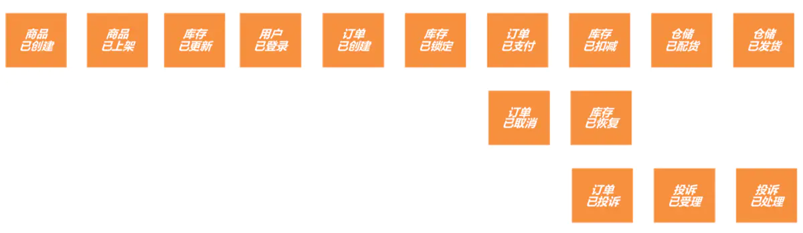

#### **命令风暴**

命令是产生事件的领域行为或领域活动，它可以是:

> 用户的动作，比如提交客户订单。
>
> 外部系统触发，比如启动夜间对账。
>
> 定时任务，比如锁定账户。

**找出命令**

> 将命令写在蓝色即时贴上（关注用户从UI界面进行的操作）。
>
> 将命令贴在所产生的事件旁边。
>
> 识别出触发命令的角色并进行标识（黄色即时贴）。

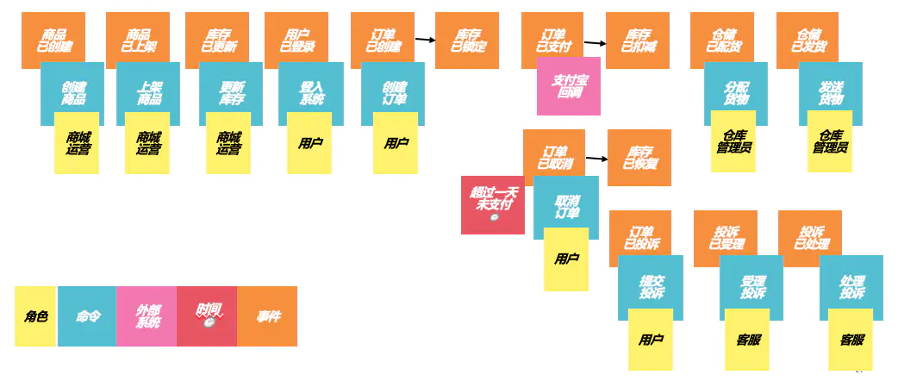

#### 寻找聚合

**找出领域名词**

通过分析前一步产生的领域事件寻找领域名词，规则如下：

> 识别事件中有业务含义的名词；
>
> 将含有相同名词的事件合并；
>
> 确保名词代表的业务概念清晰完整且没有歧义；
>
> 用大黄色即时贴进行标记。

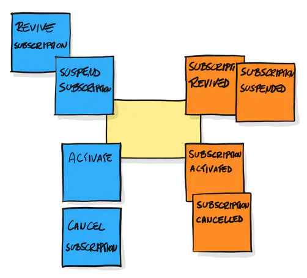

**确定领域聚合**

在确定领域聚合的时候，我们可以这样思考：它是否可以被独立访问，如果可以被独立访问就是一个聚合，如果不能被独立访问就应该属于它依赖的聚合。

最后留下聚合即时贴：命令在左面，事件在右面。

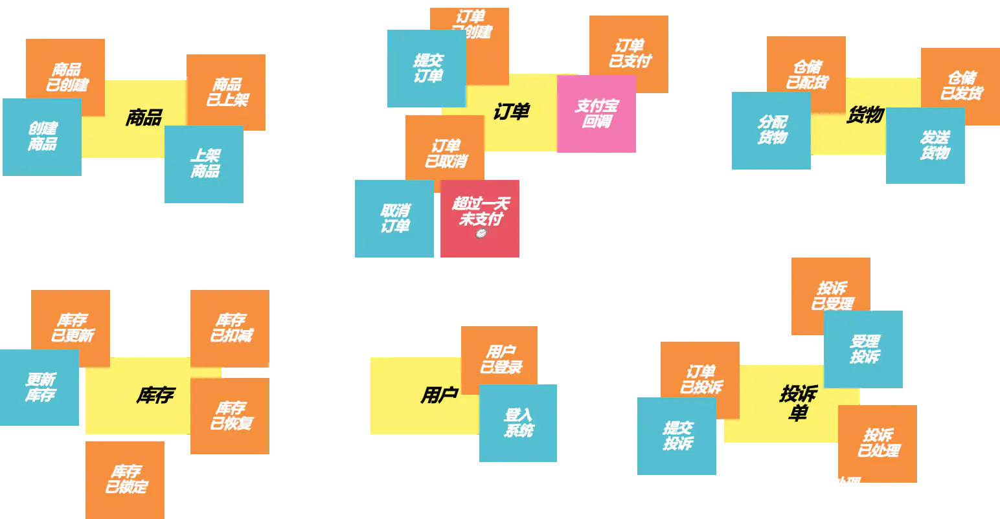

#### 未完待续

在这个电商的场景中，如果我们聚焦于订单的上下文，可以拆分出三个领域事件，分别是：订单已创建、订单已取消和订单已支付。下一步我们要做的就是用代码来实现该领域模型。

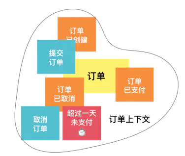

最后给大家推荐两本非常经典的软件管理学著作：《人月神话》和《人件》。这两本书都不约而同地提到了软件工程的核心思想：软件工程核心实质是社会工程，优秀团队的竞争力来源于互相的信任及良好的沟通。让我们共勉，谢谢大家！