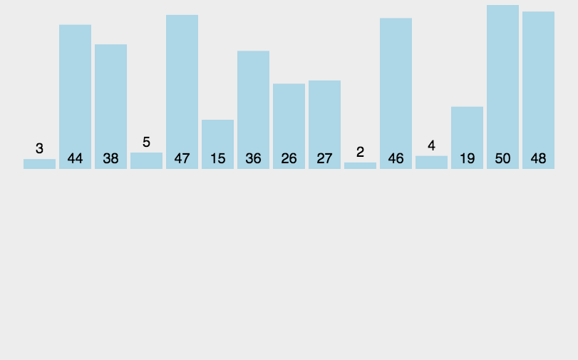
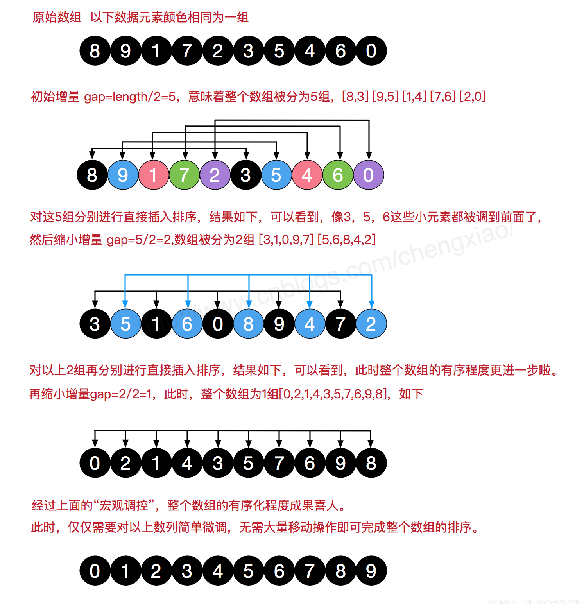
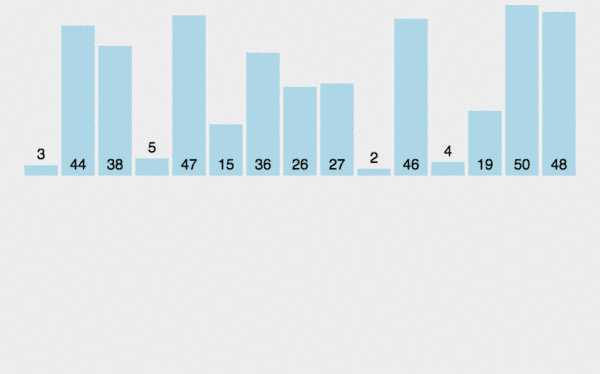
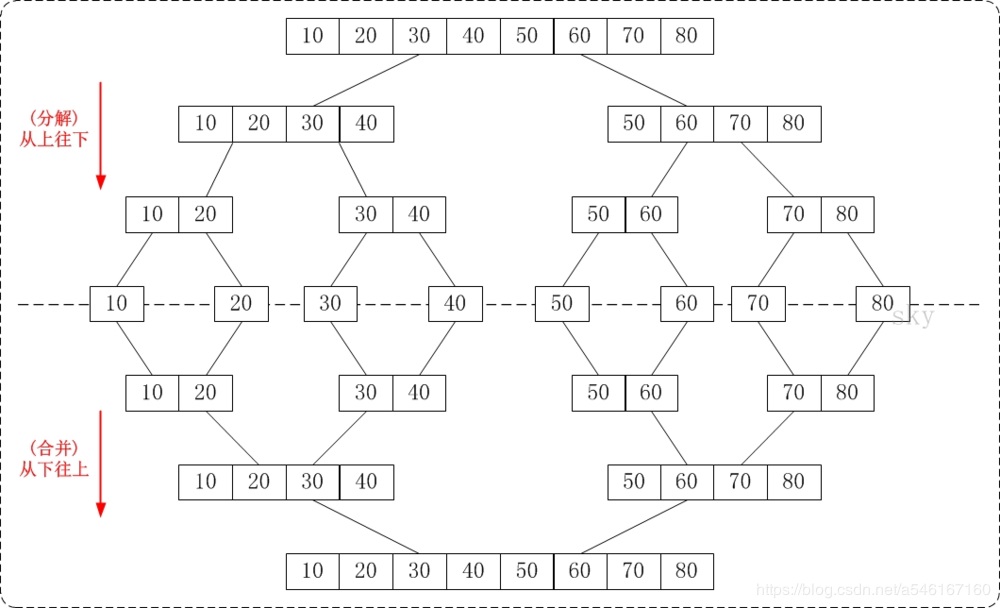
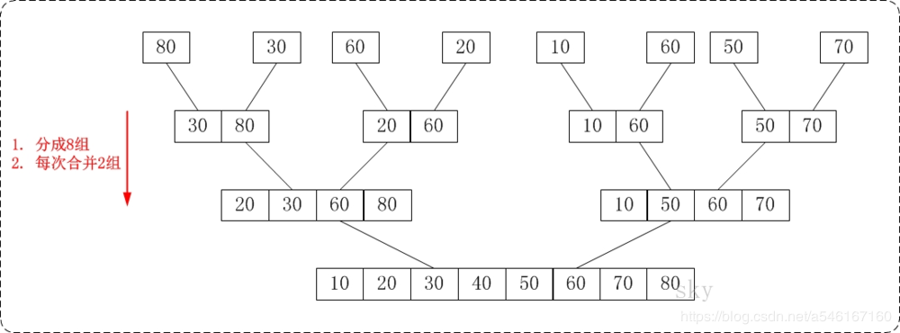

----------------------------------------------
> *Made By Herolh*
----------------------------------------------

# 目录 {#index}
[TOC]


--------------------------------------------

## python 十大经典排序算法

&emsp;&emsp;排序算法可以分为内部排序和外部排序，内部排序是数据记录在内存中进行排序，而外部排序是因排序的数据很大，一次不能容纳全部的排序记录，在排序过程中需要访问外存。常见的内部排序算法有：**插入排序、希尔排序、选择排序、冒泡排序、归并排序、快速排序、堆排序、基数排序**等。用一张图概括：


### **关于时间复杂度**

1. 平方阶 O($n^2$)  排序各类简单排序：直接插入、直接选择和冒泡排序。

2. 线性对数阶 $O(nlog^2n)$ 排序 快速排序、堆排序和归并排序。

3. O(n1+§) 排序，§ 是介于 0 和 1 之间的常数。 希尔排序。

4. 线性阶 O(n))排序 基数排序，此外还有桶、箱排序。

     

### **关于稳定性**

- 稳定的排序算法：冒泡排序、插入排序、归并排序和基数排序。

- 不是稳定的排序算法：选择排序、快速排序、希尔排序、堆排序。


### 名词解释

|   名词    |                       说明                        |
| :-------: | :-----------------------------------------------: |
|     n     |                     数据规模                      |
|     k     |                    “桶”的个数                     |
| In-place  |           占用常数内存，不占用额外内存            |
| Out-place |                   占用额外内存                    |
|  稳定性   | 排序后 2 个相等键值的顺序和排序之前它们的顺序相同 |


### **冒泡排序**

&emsp;&emsp;冒泡排序（Bubble Sort）也是一种简单直观的排序算法。它重复地走访过要排序的数列，一次比较两个元素，如果他们的顺序错误就把他们交换过来。走访数列的工作是重复地进行直到没有再需要交换，也就是说该数列已经排序完成。这个算法的名字由来是因为越小的元素会经由交换慢慢“浮”到数列的顶端。
&emsp;&emsp;冒泡排序还有一种优化算法，就是立一个 flag，当在一趟序列遍历中元素没有发生交换，则证明该序列已经有序。但这种改进对于提升性能来说并没有什么太大作用。

#### **1. 算法步骤**

1. 比较相邻的元素。如果第一个比第二个大，就交换他们两个。
2. 对每一对相邻元素作同样的工作，从开始第一对到结尾的最后一对。这步做完后，最后的元素会是最大的数。
3. 针对所有的元素重复以上的步骤，除了最后一个。
4. **持续每次对越来越少的元素重复上面的步骤，直到没有任何一对数字需要比较。**


#### 2. 动图演示


#### **3. Python 代码实现**
```python
def bubbleSort(arr):
    for i in range(1, len(arr)):
        for j in range(0, len(arr)-i):
            if arr[j] > arr[j+1]:
                arr[j], arr[j + 1] = arr[j + 1], arr[j]
    return arr
```


#### **4. 算法分析**

&emsp;&emsp;冒泡排序是一种简单直接暴力的排序算法，因为每一轮比较可能多个元素移动位置，而元素位置的互换是需要消耗资源的，所以这是一种**偏慢**的排序算法，仅适用于对于含有**较少元素**的数列进行排序。

- **稳定性**：我们从代码中可以看出只有前一个元素大于后一个元素才可能交换位置，所以相同元素的相对顺序不可能改变，所以它是**稳定排序**
- **比较性：**因为排序时元素之间需要比较，所以是**比较排序**
- **时间复杂度：**因为它需要双层循环 $n*(n-1)$，所以平均时间复杂度为$O(n^2)$
- **空间复杂度：**只需要常数个辅助单元，所以空间复杂度为 O(1)，我们把空间复杂度为 O(1) 的排序成为**原地排序（in-place）**


### **选择排序**
&emsp;&emsp;选择排序是一种简单直观的排序算法，无论什么数据进去都是 O(n²) 的时间复杂度。所以用到它的时候，数据规模越小越好。唯一的好处可能就是不占用额外的内存空间了吧。( 保存索引值就不需要太多额外的空间 )

#### **1. 算法步骤**
1. 首先在未排序序列中找到最小(大)元素，存放到排序序列的起始位置
2. 再从剩余未排序元素中继续寻找最小(大)元素，然后放到已排序序列的末尾。
3. 重复第二步，直到所有元素均排序完毕。


#### 2. 动图演示


#### **3. Python 代码实现**
```python
def selectionSort(arr):
    for i in range( len(arr) - 1 ):
        minIndex = i								# 记录最小数的索引
        for j in range(i + 1, len(arr)):
            if arr[j] < arr[minIndex]:
                minIndex = j
        # i 不是最小数时，将 i 和最小数进行交换
        if i != minIndex:
            arr[i], arr[minIndex] = arr[minIndex], arr[i]
    return arr
```


#### **4. 算法分析**

&emsp;&emsp;选择排序和冒泡排序很类似，但是选择排序每轮比较只会有一次交换，而冒泡排序会有多次交换，交换次数比冒泡排序少，就减少cpu的消耗，所以在数据量小的时候可以用选择排序，实际适用的场合非常少。

- **比较性：**因为排序时元素之间需要比较，所以是**比较排序**
- **稳定性**：因为存在任意位置的两个元素交换，比如[5, 8, 5, 2]，第一个5会和2交换位置，所以改- 变了两个5原来的相对顺序，所以为**不稳定排序**。
- **时间复杂度：**我们看到选择排序同样是双层循环 $n*(n-1)$，所以时间复杂度也为：$O(n^2)$
- **空间复杂度：**只需要常数个辅助单元，所以空间复杂度也为 O(1)


### **插入排序**                                                   
&emsp;&emsp;插入排序的代码实现虽然没有冒泡排序和选择排序那么简单粗暴，但它的原理应该是最容易理解的了，因为只要**打过扑克牌**的人都应该能够秒懂。插入排序是一种最简单直观的排序算法，它的工作原理是通过构建有序序列，对于未排序数据，在已排序序列中从后向前扫描，找到相应位置并插入。
&emsp;&emsp;插入排序和冒泡排序一样，也有一种优化算法，叫做拆半插入。

**1. 算法步骤**

1. 将第一待排序序列第一个元素看做一个有序序列，把第二个元素到最后一个元素当成是未排序序列。
2. 从头到尾依次扫描未排序序列，将扫描到的每个元素插入有序序列的适当位置。（如果待插入的元素与有序序列中的某个元素相等，则将待插入元素插入到相等元素的后面。）


#### 2.动图演示




#### **3. Python 代码实现**

```python
def insertionSort(arr):
    for i in range(len(arr)):
        preIndex = i-1
        current = arr[i]
        while preIndex >= 0 and arr[preIndex] > current:
            arr[preIndex+1] = arr[preIndex]
            preIndex-=1
        arr[preIndex+1] = current
    return arr
```


#### **4. 算法分析**

&emsp;&emsp;插入排序的适用场景：**一个新元素需要插入到一组已经是有序的数组中**，或者是一组**基本有序的数组排序**。

- **比较性：**排序时元素之间需要比较，所以为**比较排序**
- **稳定性：**从代码我们可以看出只有比较元素大于当前元素，比较元素才会往后移动，所以相同元素是不会改变相对顺序
- **时间复杂度：**插入排序同样需要两次循坏一个一个比较，故时间复杂度也为 $O(n^2)$
- **空间复杂度：**只需要常数个辅助单元，所以空间复杂度也为 **O(1)**


### **希尔排序**
&emsp;&emsp;希尔排序，也称**递减增量排序算法**，是插入排序的一种更高效的改进版本。但希尔排序是非稳定排序算法。希尔排序是基于插入排序的以下两点性质而提出改进方法的：

- 插入排序在对几乎已经排好序的数据操作时，效率高，即可以达到线性排序的效率；
- 但插入排序一般来说是低效的，因为插入排序每次只能将数据移动一位；

&emsp;&emsp;希尔排序的基本思想是：先将整个待排序的记录序列分割成为若干子序列分别进行直接插入排序，待整个序列中的记录“基本有序”时，再对全体记录进行依次直接插入排序。


#### **1. 算法步骤**

1. 选择一个增量序列 t1，t2，……，tk，其中 ti > tj, tk = 1；
2. 按增量序列个数 k，对序列进行 k 趟排序；
3. 每趟排序，根据对应的增量 ti，将待排序列分割成若干长度为 m 的子序列，分别对各子表进行直接插入排序。仅增量因子为 1 时，整个序列作为一个表来处理，表长度即为整个序列的长度。


#### 2. 算法图解




#### **3. Python 代码实现**

```python
def shellSort(arr):
    import math
    gap=1
    while(gap < len(arr)/3):
        gap = gap*3+1
    while gap > 0:
        for i in range(gap,len(arr)):
            temp = arr[i]
            j = i-gap
            while j >=0 and arr[j] > temp:
                arr[j+gap]=arr[j]
                j-=gap
            arr[j+gap] = temp
        gap = math.floor(gap/3)
    return arr
```


#### **4.算法分析**
**比较性：**排序时元素之间需要比较，所以为**比较排序**
**稳定性：**因为希尔排序是间隔的插入，所以存在相同元素相对顺序被打乱，所以是不**稳定排序**
**时间复杂度：** 最坏时间复杂度 $O(n^2)$ 平均复杂度为 $O(n^{1.3})$
**空间复杂度：**只需要常数个辅助单元，所以空间复杂度也为**O(1)**


### **归并排序**

&emsp;&emsp;归并排序（Merge sort）是建立在归并操作上的一种有效的排序算法。该算法是采用分治法（Divide and Conquer）的一个非常典型的应用。作为一种典型的分而治之思想的算法应用，归并排序的实现由两种方法：
- 自上而下的递归（所有递归的方法都可以用迭代重写，所以就有了第 2 种方法）；
- 自下而上的迭代；

&emsp;&emsp;和选择排序一样，归并排序的性能不受输入数据的影响，但表现比选择排序好的多，因为始终都是 $O(nlogn)$ 的时间复杂度。代价是需要额外的内存空间。


#### **1. 算法步骤**

1. 申请空间，使其大小为两个已经排序序列之和，该空间用来存放合并后的序列；
2. 设定两个指针，最初位置分别为两个已经排序序列的起始位置；
3. 比较两个指针所指向的元素，选择相对小的元素放入到合并空间，并移动指针到下一位置；
4. 重复步骤 3 直到某一指针达到序列尾；
5. 将另一序列剩下的所有元素直接复制到合并序列尾。


#### 2. 动图演示




#### 3. 算法实现

##### 递归实现



1. 如果给的数组只有一个元素的话，直接返回（也就是递归到最底层的一个情况）
2. 把整个数组分为尽可能相等的两个子数组
3. 对于两个子数组分别进行归并排序
4. 把排好序的两个数组按大小组合成新的有序的序列

```python
# 归并排序
def mergeSort(arr):
    n = len(arr)
    if n <= 1:
        return arr
    n = n//2
    sub1 = mergeSort(arr[:n])
    sub2 = mergeSort(arr[n:])
    return merge(sub1, sub2)

# 合并两个有序数组
def merge(sub1, sub2):
    n1 = len(sub1)
    n2 = len(sub2)
    i = 0
    j = 0
    merge = []
    while i < n1 and j < n2:
        if sub1[i] < sub2[j]:
            merge.append(sub1[i])
            i += 1
        else:
            merge.append(sub2[j])
            j += 1
    # 没复制完的
    while i < n1:
        merge.append(sub1[i])
        i += 1
    while j < n2:
        merge.append(sub2[j])
        j += 1
    return merge
```


##### 非递归实现

自底向上，从最小子问题开始一步一步解决，直到复杂的问题。



```python
# 非递归的归并排序
def MergeSort(arr):
    n = len(arr)
    size = 1 # 表示每一步要归并的数组的长度
    m = []
    while size <= n:
        for i in range(0, n-size, size+size):
            m = merge(arr[i: i+size], arr[i+size: min(i+size+size, n)]) # min(i+size+size, n)为了最后一组数组可能不够全
            arr[i: min(i+size+size, n)] = m[:] # 把merge得到的结果赋值给原始数组
        size += size # 数组长度每次乘二
    return arr
```


#### 4. 算法分析
- **比较性：**排序时元素之间需要比较，所以为**比较排序**
- **稳定性：**我们从代码中可以看到当左边的元素小于等于右边的元素就把左边的排前面，而原本左边的就是在前面，所以相同元素的相对顺序不变，故为**稳定排序**
- **时间复杂度：** 复杂度为 $O(nlog^n)$
- **空间复杂度：**在合并子列时需要申请临时空间，而且空间大小随数列的大小而变化，所以空间复杂度为**O(n)**


### **快速排序**

&emsp;&emsp;快速排序是由东尼·霍尔所发展的一种排序算法。在平均状况下，排序 n 个项目要 $Ο(nlogn)$ 次比较。在最坏状况下则需要 $Ο(n^2) $ 次比较，但这种状况并不常见。事实上，快速排序通常明显比其他 $Ο(nlogn)$ 算法更快，因为它的内部循环(inner loop) 可以在大部分的架构上很有效率地被实现出来。

&emsp;&emsp;快速排序使用分治法（Divide and conquer）策略来把一个串行（list）分为两个子串行（sub-lists）。快速排序又是一种分而治之思想在排序算法上的典型应用。本质上来看，快速排序应该算是在冒泡排序基础上的递归分治法。

&emsp;&emsp;快速排序的名字起的是简单粗暴，因为一听到这个名字你就知道它存在的意义，就是快，而且效率高！它是处理大数据最快的排序算法之一了。虽然 Worst Case 的时间复杂度达到了 O(n²)，但是人家就是优秀，在大多数情况下都比平均时间复杂度为 O(n logn) 的排序算法表现要更好，可是这是为什么呢，我也不知道。好在我的强迫症又犯了，查了 N 多资料终于在《算法艺术与信息学竞赛》上找到了满意的答案：

> 快速排序的最坏运行情况是 O(n²)，比如说顺序数列的快排。但它的平摊期望时间是 O(nlogn)，且 O(nlogn) 记号中隐含的常数因子很小，比复杂度稳定等于 O(nlogn) 的归并排序要小很多。所以，对绝大多数顺序性较弱的随机数列而言，快速排序总是优于归并排序。


