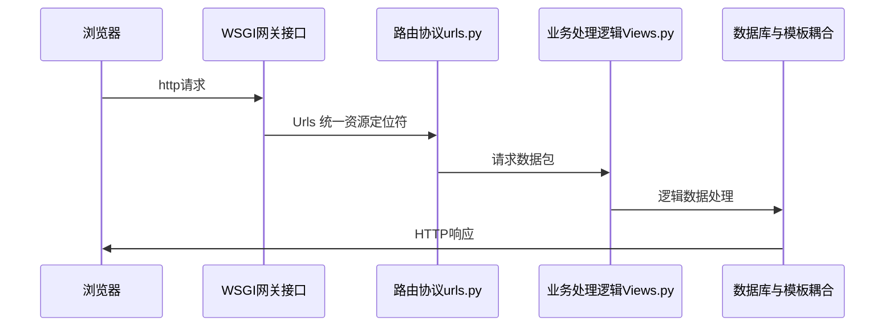
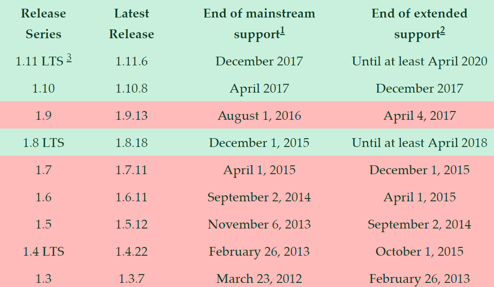
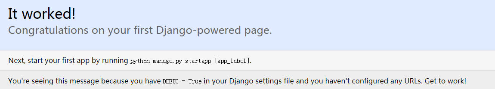
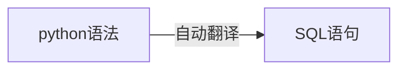
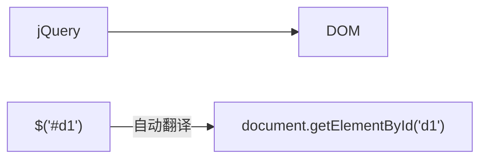
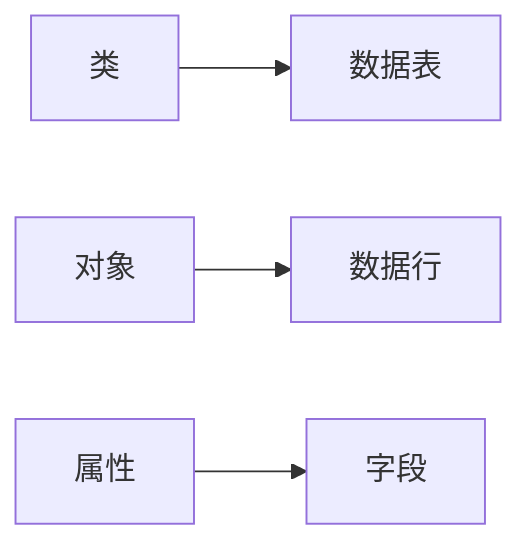
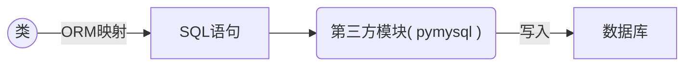

目录 {#index}

[TOC]


--------------------------------------------
## 一、Python的WEB开发介绍  

### 1. python的Web开发技术栈  
- **前端技术**：  	&emsp;&emsp;HTML、CSS、JS、Jquery、Bootstrap、Ajax...  
- **Web服务器**：  	&emsp;&emsp;Apache、Nginx、Lighttpd、ssl...  
- **Web框架**： 	&emsp;&emsp;Django、Tornado、Flask、Twisted...  
- **公共组件**： 	&emsp;&emsp;Virtualnv、vWSGI、Gunisorn、RabbitMQ、Celery...  
- **访问数据库**： 	&emsp;&emsp;pymysql、SQLAlchemy、Django model...  
- **数据库**： 		&emsp;&emsp;Oracel、Mysql、SQLite、Postgres...  


### 2. 最早的web标准  
&emsp;&emsp;最简单、原始和直接的办法是使用CGI标准 `CQI   ---->    生成.cgi文件`,前端页面直接操作数据库,开销大且不安全
#### 示例：
```python
import cgi
import pymysql
print("Content-Type: text/html\n")
print("<html><head><title>products</title></head>")
print("<body>")
print("<h1>products</h1>")
print("<ul>")

connection = pymysql.connect(user='user', passwd='pwd', db='product_db')
cursor = connection.cursor()
cursor.execute("SELECT name FROM products ORDER BY create_date DESC LIMIT 10")

for row in cursor.fetchall():
	print("<li>%s</li>" % row[0])

print("</ul>")
print("</body></html>")

connection.close()
```


### 3、Web框架：
#### 什么是web框架：
> 建立 web 应用的一种方式

#### 一般Web框架的架构：




<hr>


#### python常用web框架:


##### Django  

```markdown
- 发布于2003年，是当前Python世界里最负盛名且最成熟的Web框架，最初被用来制作在线新闻的Web站点。
- Django的各模块之间结合得比较紧密，所以在功能强大的同时又是一个相对封闭的系统（依然是可以自定义的），但是其健全的在线文档及开发社区，使开发者在遇到问题时能找到解决办法。
- Django则是直接使用了现成的WSGI，并实现了大部分功能，提供了大量的应用工具。
```

##### Tornado
```markdown
- 一个强大的、支持协程、高效并发且可扩展的Web服务器，
- 发布于2009年9月，应用于FriendFeed、Facebook等社交网站。
- 它的强项在于可以利用异步协程机制实现高并发的服务。Tornado用的是自己的异步非阻塞“WSGI”网关接口
```
##### Flask：
```markdown
- Python Web框架家族里比较年轻的一个
- 发布于2010年，它吸收了其他框架的优点并且把自己的主要领域定义在了微小项目上，以短小精干，简洁明了著称。
- Flask则只提供了最精简和基本的框架,没有“WSGI”网关接口
```
##### Twisted：
```markdown
- 一个有着十多年历史的开源事件驱动框架。
- 它不像前三种着眼于Web应用开发，而是适用从传输层到自定义应用协议的所有类型的网络程序的开发，
- 并能在不同的操作系统上提供很高的运行效率。但是，目前对Python3的支持有限，建议使用Python2.7。
```


------------------------------
## 二、Django初入门
### 0、django基本介绍：
#### !注意：
> Django是一个同步 web 框架，不支持异步( websocket 等 )，只接受 http 开头的; ws 开头的无法识别，连路由系统都无法到达.
> 若要用 Django 实现异步，则需要依赖 Gevent ( Gevent又基于greenlet )


​	

​	

#### Django历史来历：
&emsp;&emsp;Django 诞生于 2003 年，2006 年加入了`BSD许可证`，成为开源的 Web 框架。  Django这一词语是根据比利时的爵士音乐家 Django Reinhardt 命名的，有希望 Django 能够优雅地演奏（开发）各种乐曲（Web应用）的美好含义。  
&emsp;&emsp;Django 是由美国堪萨斯（Kansas）州 Lawrence 城中的一个新闻开发小组开发出来的。当时 Lawrence Journal-World 报纸的程序员 Adrian Holovaty 和 Simon Willison 用 Python 编写 Web 新闻应用，他们的 World Online 小组制作并维护了当地的几个新闻站点。  
&emsp;&emsp;新闻界独有的特点是快速迭代，从开发到上线，通常只有几天或几个小时的时间。为了能在截止时间前完成工作，Adrian 和 Simon 打算开发一种**通用的高效的网络应用开发框架**，也就是 Django。2005年的夏天，当这个框架开发完成时，它已经用来制作了很多个 World Online 的站点。不久，小组中的 Jacob Kaplan-Moss 决定把这个框架发布为一个开源软件，于是短短数年，Django 项目就有着数以万计的用户和贡献者，在世界范围内广泛传播。   

&emsp;&emsp;原来的 World Online 的两个开发者（Adrian and Jacob）仍然掌握着Django，但是其发展方向受社区团队的影响更大。


#### Django特点：
##### 功能完善、要素齐全  
- 该有的、可以没有的都有，常用的、不常用的工具都用。
- Django提供了大量的特性和工具，无须你自己定义、组合、增删及修改。
- 但是，在有些人眼里这被认为是‘臃肿’不够灵活，发挥不了程序员的主动能力。(一体机和DIY你更喜欢哪个？)


##### 完善的文档  
- 经过十多年的发展和完善，Django有广泛的实践经验和完善的在线文档（可惜大多数为英文）。
- 开发者遇到问题时可以搜索在线文档寻求解决方案。  
- 强大的数据库访问组件  
   - Django 的 Model 层自带数据库 ORM 组件，使得开发者无须学习其他数据库访问技术( SQL、pymysql、SQLALchemy等)。
   - 当然你也可以不用Django自带的ORM ，而是使用其它访问技术，比如 SQLALchemy。


##### 灵活的URL映射  		
> Django使用正则表达式管理URL映射，灵活性高。


##### 丰富的Template模板语言  
> 类似jinjia模板语言，不但原生功能丰富，还可以自定义模板标签。


##### 自带免费的后台管理系统  
- 只需要通过简单的几行配置和代码就可以实现一个完整的后台数据管理控制平台。
- 完整的错误信息提示：	
		- 在开发调试过程中如果出现运行错误或者异常，Django可以提供非常完整的错误信息帮助定位问题。


#### MVC及MTV设计模式：
&emsp;&emsp;在目前基于Python语言的几十个Web开发框架中，几乎所有的 **全栈框架**[^全栈框架]都强制或引导开发者使用 MVC 设计模式。  Djang o本身基于 MVC 模型，即`Model(模型)`+`View(视图)`+ `Controller(控制器)`设计模式，因此天然具有 MVC 的出色基因：开发快捷、部署方便、可重用性高、维护成本低等。

[^全栈框架]:全栈框架：是指除了封装网络和线程操作，还提供HTTP、数据库读写管理、HTML模板引擎等一系列功能的Web框架，比如Django、Tornado和Flask。


##### MVC设计模式：

&emsp;&emsp;最早由Trygve Teenskaug 在 1978 年提出，上世纪 80 年代是程序语言 Smalltalk 的一种内部架构。 后来MVC被其他领域借鉴，成为了软件工程中的一种软件架构模式。  
	

###### MVC把Web框架分为3个基础部分
**模型(Model)**：
> 用于封装与应用程序的业务逻辑相关的数据及对数据的处理方法,是 Web 应用程序中用于处理应用程序的数据逻辑的部分，
> Model 只提供功能性的接口，通过这些接口可以获取Model的所有功能。

简单地说：
&emsp;&emsp;这个模块就是Web框架和数据库的交互层。


**视图(View)：**
> 负责数据的显示和呈现，是对用户的直接输出。


**控制器(Controller)：**
> 负责从用户端收集用户的输入，可以看成提供View的反向功能。

&emsp;&emsp;这三个部分互相独立，但又相互联系，使得改进和升级界面及用户交互流程，在 Web 开发过程任务分配时，不需要重写业务逻辑及数据访问代码。  
&emsp;&emsp;MVC 在 Python 之外的语言中也有广泛应用，例如 VC++ 的 MFC，Java 的 Structs 及 Spring、C# 的 .NET 开发框架等等。  


​	
##### MTV设计模式：
Django对传统的MVC设计模式进行了修改： 
>将视图分成 View 模块和 Template 模块两部分，将动态的逻辑处理与静态的页面展现分离开。
>控制器(Controller) 由 Django 帮你实现好了。
>而 Model 采用了 ORM 技术，将关系型数据库表抽象成面向对象的 Python 类，将表操作转换成类操作，避免了复杂的 SQL 语句编写。


##### MTV和MVC本质上是一样的：
###### 模型(Model)：
>和MVC中的定义一样


###### 模板(Template)：
>将数据与HTML语言结合起来的引擎


###### 视图(View)：
>负责实际的业务逻辑实现


### 1、Django安装：
#### 1.1 版本支持

| Django 版本 |                   Python 版本                   |
| :---------: | :---------------------------------------------: |
|     1.8     | 2.7, 3.2 (until the end of 2016), 3.3, 3.4, 3.5 |
|  1.9, 1.10  |                  2.7, 3.4, 3.5                  |
|    1.11     |               2.7, 3.4, 3.5, 3.6                |
|     2.0     |                  3.4, 3.5, 3.6                  |
|     2.1     |    3.5, 3.6, 3.7( 不支持MYSQL5.5以下的版本)     |

###### 版本支持时间



###### 版本的未来计划节点
.png)			


#### 1.2 pip安装
> `win+r`，调出 cmd 命令行，运行命令：`pip install django`，自动安装PyPi提供的最新版本。
>如果要指定版本，可使用 `pip install django==1.11.7` 这种形式。


##### 验证安装
> 进入Python交互式环境（注意一定要进入刚才安装了Django的Python解释器），按下面所示查看安装版本：

```python
import django
print(django.get_version())			# 或者 django.VERSION
2.0.7
```

进入cmd命令行形式，按下面所示查看安装版本：
```shell
python -m django --version
```


##### 配置系统环境
- 其实不配置也没关系，安装完就默认配置了
- 成功安装Django后，以windows为例，在Python根目录下的Scripts目录中可找到一个django-admin.exe文件，这是Django的核心管理程序，最好将它加入操作系统的环境变量中，这样在以后的调用会比较方便。		

##### !attention:
  ```
安装的时候也会安装Django的唯一依赖：pytz( 时区管理 )
  ```


### 2、创建项目：
#### 两种创建项目方案：
- a 在 windows 的 **cmd环境** 中(Linux中类同)，新建或者进入你想创建 Django 项目的目录，然后输入下面的命令：
```
    django-admin startproject mysite
```


​    

- b 在 windows 下使用 **Pycharm** 创建 Django 项目:( pycharm必须为专业版才可以，社区版本不支持 )
  - 前面介绍的是在命令行环境中项目的创建和服务器的启动。其实，在大多数情况下，我们都是在Windows操作系统下，使用Pycharm进行Django开发。

  - 方法： 

    ```
    1. 启动Pycharm后，点击file-->new project，出现下面的对话框。
    2. 在左边选择Django项目
    ```

   - 可以看到Django自动帮我们创建了一个mysite文件夹，这是项目的根目录。			

      ```python
      目录结构：
      |mysite					-- 项目的根目录，与Django无关，只是你项目的容器，可以任意命名
      						-- 一些关键字还是不能随便用的， 如Django，django，test 等
      ---|manage.py			-- 整个项目的管理脚本，一个命令行工具
      						-- 用于与Django进行不同方式的交互脚本，非常重要！
      ---|mysite				-- 整个项目的配置文件目录
      -------|__init__.py		-- 一个定义包的空文件
      -------|settings.py		-- 项目的主配置文件，非常重要！
      -------|urls.py			-- 路由文件，所有的任务都是从这里开始分配，
      						-- 起分发任务的作用,相当于Django驱动站点的内容表格，非常重要！
      -------|wsgi.py			-- 一个基于WSGI的web服务器进入点，提供底层的网络通信功能			
      ```

      

#### !attention：

```markdown
Linux下最好别放在	/var/www/ 目录下，因为这是黑客的首要攻击目标，存在暴露数据危险
```


### 3、启动开发服务器：

- Django提供了一个用于开发的web服务器，使你无需配置一个类似Ngnix的线上服务器，就能让站点运行起来。这是一个由Python编写的轻量级服务器，***简易并且不安全***，因此不要将它用于生产环境。

- 在项目根目录下，运行 `Python manage.py runserver`，Django会以 `127.0.0.1:8000` 这个默认配置启动开发服务器。或者在 Pycharm 中，点击Tools 中的 `Run manage.py Task...` 然后·直接输入 `runserver` 即可.

#### 运行信息：

```
Performing system checks...  						# 运行系统检查
System check identified no issues (0 silenced).		# 系统检查没有问题
You have 13 unapplied migration(s). Your project may not work properly until you
apply the migrations for app(s): admin, auth, contenttypes, sessions.
Run 'python manage.py migrate' to apply them.
October 20, 2017 - 11:28:59
Django version 1.11.6, using settings 'mysite.settings'
Starting development server at http://127.0.0.1:8000/
Quit the server with CTRL-BREAK.
```


 #### 访问站点:	
- 打开你的浏览器，在地址栏输入`127.0.0.1:8000`，看到**“It worked!”**,说明 Django 一切正常，你可以放心大胆的开始Django之旅了！
    

    

    django2.0之后的提示页面不太一样：
     `The install worked successfully! Congratulations!`

    访问后，运行信息下面会添加一些信息：
    `[11/Jul/2018 00:24:22] "GET /favicon.ico HTTP/1.1" 404 1972	`				

- favicon.ico是页面标签图标，这里的404是因为页面标签图标未定义


#### 修改访问ip或端口：
##### 修改访问端口：
Django的开发服务器（以后简称服务器）默认运行在内部的8000端口，如果你想指定端口，请在命令中显示给出：

```python
python manage.py runserver 8080
```


##### 修改访问IP：

- 如果想修改服务器的ip地址，请按下面的方式运行命令：

    ```
    python manage.py runserver 0.0.0.0:8000
    ```

    

    这时候如果没去setting.py里面修改一个配置，访问ip:8000会报以下错误

    > *Invalid HTTP_HOST header: '192.168.233.130:8000'. You may need to add '192.168.233.130' to ALLOWED_HOSTS.*  

    **解决方法：**
    将本机的IP地址添加到 setting.py 里的  **ALLOWED_HOSTS = []** 如： 

    ```
    ALLOWED_HOSTS = [“192.168.233.130”]	·或 	ALLOWED_HOSTS = [“*”]
    ```

    

    这时，Django将运行在8000端口，整个局域网内都将可以访问站点，而不只是是本机。


#### !attention： 

```markdown
    Django的开发服务器具有自动重载功能，当你的代码有修改，每隔一段时间服务器将自动更新。
    但是，有一些例如**增加文件**的动作，不会触发服务器重载，这时就需要你自己手动重启。
PS:
    这一步操作也可以在Pycharm里完成。
```


### 4、创建应用

#### 4.1 app应用与project项目的区别：

- 一个app实现某个功能，方便我们在一个大的Django项目中,管理实现不同的业务功能；
- 一个project是配置文件和多个app的集合，这些app组合成整个站点；
- 一个project可以包含多个app；一个app可以属于多个project！( 复用 )


#### 4.2 创建应用步骤：
- a、进入mysite项目根目录，确保与 `manage.py` 文件处于同一级，输入下述命令：

    ```
    python manage.py startapp 应用名
    ```

    

- b、然后将“应用名”添加到 `settings,py` 中的 `INSALLED_APP` 中
    要将应用添加到项目中，需要在 `INSTALLED_APPS` 设置中增加指向该应用的配置文件的链接。
    对于该应用，它的配置类文件是 `bolgs/apps.py`，路径格式为 `blog.apps.BlogConfig`。
    我们需要在 `mysite/settings.py` 文件的`INSTALLED_APPS` 中，将该路径添加进去：

    ```python
    INSTALLED_APPS = [
        'django.contrib.admin',
        'django.contrib.auth',
        'django.contrib.contenttypes',
        'django.contrib.sessions',
        'django.contrib.messages',
        'django.contrib.staticfiles',
        
        'blog.apps.BlogConfig',
    ]
    ```

    实际上，在多数情况下，我们简写成‘blog’就可以了：

    ```python
    INSTALLED_APPS = [
        'django.contrib.admin',
        'django.contrib.auth',
        'django.contrib.contenttypes',
        'django.contrib.sessions',
        'django.contrib.messages',
        'django.contrib.staticfiles',
        
        'blog',
    ]
    ```

    

- app目录结构：

    ```
    blog
    ---|__init__.py			
    ---|admin.py				-- 管理后台
    ---|apps.py					-- 应用的一些设置
    ---|models.py				-- 模型层
    ---|tests.py				-- 撰写测试脚本
    ---|views.py				-- 视图处理文件,专门用来定义处理请求的函数
    ---|migrations				-- 数据库的迁移记录
    -------|__init__.py
    ```

    

#### !attention:

```
app的存放位置可以是任何地点，但是通常都将它们放在与 manage.py 脚本同级的目录下，这样方便导入文件。
```


### 5、views.py 和 urls.py 初探：

#### a、编写视图

```python
在blog/views.py文件中，添加代码：

from django.http import HttpResponse
def index(request):
    # request :每个视图都应该有的第一个参数，保存了所有和用户浏览器请求相关的数据
    return HttpResponse("Hello, world！")
```


#### b、分发路由urls( 路由分发 )

- 为了调用该视图，我们还需要编写urlconf，也就是路由路径。

##### 1. 在应用目录下新建一个文件，名字为urls.py

##### 2. 修改应用目录下的urls.py：

- 使用正则表达式：

  ```python
  from django.conf.urls import url
  from . import views
  
  # 保存了路径和函数的对应关系:
   urlpatterns = [
   	url(r'^$', views.index, name='index'),
   ]
  ```

- 不用正则表达式：

    ```python
     from django.urls import path
     from . import views
     
     # 保存了路径和函数的对应关系
     urlpatterns = [
     	path(r'', views.index, name='index'),
     ]
    ```

    

##### 3.修改项目的主urls文件:

​	在项目的主urls文件中添加`urlpattern`条目，指向我们刚才建立的这个 app 独有的 urls 文件，这里需要导入 `include` 模块。修改代码如下：

- 使用正则表达式：

    ```python
     from django.conf.urls import include, url		# 新增
     from django.contrib import admin
     
     urlpatterns = [
         url(r'^blog/', include('blog.urls')),		# 新增
         url(r'^admin/', admin.site.urls),
         
         url( r"^(?P<question_id>[0-9]+)/$", views.detail, name = 'detail' ),
        # ()				:  括号内的内容会被获取到，当成参数传递给视图
        # ?P<question_id>	： 取个参数名，必须和视图的形参一致
        # [0-9]+			： 正则匹配
        # $:				: 结束了，后面不能跟其他的东西了
     ]
    ```

- 不用正则表达式：

    ```python
    from django.contrib import admin
    from django.urls import path,include			# 新增
    
    urlpatterns = [
        path('blog/', include('blog.urls') ),		# 新增
        path('admin/', admin.site.urls),
    ]
    ```

    

##### 4.启动服务器

​	然后在浏览器中访问地址http://localhost:8000/blog/。一切正常的话，你将看到“Hello, world”


##### 5.url.py 详解:

###### include：

- include语法相当于多级路由，它把接收到的url地址去除前面的正则表达式，将剩下的字符串传递给下一级路由进行判断。
- include的背后是一种即插即用的思想。项目根路由不关心具体app的路由策略，只管往指定的二级路由转发，实现了应用解耦。
- app所属的二级路由可以根据自己的需要随意编写，不会和其它的app路由发生冲突。app目录可以放置在任何位置，而不用修改路由。
    这是软件设计里很常见的一种模式。
- **建议：**  
		除了admin路由外，尽量给每个app设计自己独立的二级路由。


- view( 处理函数 )：

    ```
    view指的是处理当前url请求的视图函数。
    当正则表达式匹配到某个条目时，自动将封装的HttpRequest对象作为第一个参数，
    正则表达式“捕获”到的值作为第二个参数，传递给该条目指定的视图view。
    如果是简单捕获，那么捕获值将作为一个位置参数进行传递，如果是命名捕获，那么将作为关键字参数进行传递。
    ```

    

- kwargs：

    ```
    任意数量的关键字参数可以作为一个字典传递给目标视图。
    ```

    

- name( 匹配地址别名 )：

    ```
    对你的URL进行命名，让你能够在Django的任意处，尤其是模板内显式地引用它。
    这是一个非常强大的功能，相当于给URL取了个全局变量名，不会将url匹配地址写死。
    ```


### 6、setting.py 配置文件详解：

```python
"""
# Django为mysite项目设置。
Django settings for mysite project.					

# 使用Django 2.0.7由'django-admin startproject'生成。
Generated by 'django-admin startproject' using Django 2.0.7.	

# 有关此文件的更多信息，请参阅
For more information on this file, see								
https://docs.djangoproject.com/en/2.0/topics/settings/

# 有关设置及其值的完整列表，请参阅
For the full list of settings and their values, see					
https://docs.djangoproject.com/en/2.0/ref/settings/
"""

import os
# 在项目中构建路径，如下所示：os.path.join（BASE_DIR，...）
# Build paths inside the project like this: os.path.join(BASE_DIR, ...)

BASE_DIR = os.path.dirname(os.path.dirname(os.path.abspath(__file__)))
# 项目根目录

# 快速启动开发设置 - 不适合生产
# Quick-start development settings - unsuitable for production
# See https://docs.djangoproject.com/en/1.11/howto/deployment/checklist/

# 安全警告：保密密钥中使用的密钥！
# SECURITY WARNING: keep the secret key used in production secret!
SECRET_KEY = 'n8)&lgg5xn(iwzik9^2=)fhgjwbws%e+9xj5kw*rz6)e@zy591'
# 安全码


# SECURITY WARNING: don't run with debug turned on in production!
"""！调试
安全警告：不要在实际生产中打开它！
如果打开debug那么这个网页异常就会直接抛给网页前端
"""
DEBUG = True

ALLOWED_HOSTS = []
"""
只允许外界通过[]里的地址访问服务器,其他的所有地址都被屏蔽了
例如['localhost']
那么此时用127.0.0.1是不能访问的
‘ip’	: 通过ip访问
‘*’		：所有人都能访问
"""

# Application definition
"""已安装的应用
以下默认生成的是django自带的应用，额外提供的
如果今后我们创建了自己的应用，也需要将自己的应用写在这里面，这样django才能识别
"""
INSTALLED_APPS = [
    'django.contrib.admin',				# admin管理后台站点
    'django.contrib.auth',				# 身份认证系统
    'django.contrib.contenttypes',		# 内容类型框架
    'django.contrib.sessions',			# 会话框架
    'django.contrib.messages',			# 消息框架
    'django.contrib.staticfiles',		# 静态文件管理框架
    'blog'								# 应用
]

"""中间件，django自带的一些工具集
应用名是不能和模块名相同的
"""
MIDDLEWARE = [
    'django.middleware.security.SecurityMiddleware',
    'django.contrib.sessions.middleware.SessionMiddleware',
    'django.middleware.common.CommonMiddleware',
    'django.middleware.csrf.CsrfViewMiddleware',
    'django.contrib.auth.middleware.AuthenticationMiddleware',
    'django.contrib.messages.middleware.MessageMiddleware',
    'django.middleware.clickjacking.XFrameOptionsMiddleware',
]

ROOT_URLCONF = 'myblog.urls'
"""url根文件的配置文件
指向urls.py文件
"""

"""模版
在django·中模版其实就是一个一个的html文件
这里的是关于模板的配置
"""
TEMPLATES = [
    {
        #模版引擎，可修改为其他第三方模板引擎
        'BACKEND': 'django.template.backends.django.DjangoTemplates',
        'DIRS': [],
        'APP_DIRS': True,
        'OPTIONS': {
            'context_processors': [
                'django.template.context_processors.debug',
                'django.template.context_processors.request',
                'django.contrib.auth.context_processors.auth',
                'django.contrib.messages.context_processors.messages',
            ],
        },
    },
]

WSGI_APPLICATION = 'myblog.wsgi.application'

# Database
# https://docs.djangoproject.com/en/1.11/ref/settings/#databases

"""数据库配置
默认是使用sqlite3
如果要使用其他数据库就打开上面那个链接，到django的官方文档里去找
"""
DATABASES = {
'default': {
'ENGINE': 'django.db.backends.sqlite3',
'NAME': os.path.join(BASE_DIR, 'db.sqlite3'),
}
}

# 密码认证
# Password validation
# https://docs.djangoproject.com/en/1.11/ref/settings/#auth-password-validators
AUTH_PASSWORD_VALIDATORS = [
    {
        'NAME': 'django.contrib.auth.password_validation.UserAttributeSimilarityValidator',
    },
    {
        'NAME': 'django.contrib.auth.password_validation.MinimumLengthValidator',
    },
    {
        'NAME': 'django.contrib.auth.password_validation.CommonPasswordValidator',
    },
    {
        'NAME': 'django.contrib.auth.password_validation.NumericPasswordValidator',
    },
]

#国际化
# Internationalization
# https://docs.djangoproject.com/en/1.11/topics/i18n/

#语言，默认是美式英语							“zh-Hans” 可变为中文 
LANGUAGE_CODE = 'en-us'
#时区			设为中国时区：Asia/Shanghai
TIME_ZONE = 'UTC'
USE_I18N = True
USE_L10N = True
USE_TZ = True

#静态文件的地址
# Static files (CSS, JavaScript, Images)
# https://docs.djangoproject.com/en/1.11/howto/static-files/
# 静态文件保存的别名，即在HTML 文件中要引用的地址
STATIC_URL = '/static/'
```


### 7、模型 models.py 初探：

采用ORM框架( 关系映射对象 )

#### 1. ORM框架：

​	ORM框架将SQL封装起来，程序员不再需要关心数据库的具体操作，只需要专注于自己本身代码和业务逻辑的实现。最典型的ORM就是SQLAlchemy了，如果你的Web框架自身不带ORM系统，那么你可以安装使用它

ORM将一个Python的对象映射为数据库中的一张关系表。



就像是：  




##### ORM能做的事儿:

###### 操作数据表  

​	操作models.py里面的类 --> 创建表/删除表/修改表

###### 操作数据行  --> 数据的增删改查


##### ORM的优缺点: 

**优点:**

```markdown
    1. 简单,不用自己写SQL语句
    2. 开发效率高
    3. 兼容性高
```

**缺点:**

```markdown
    1. 记忆你这个特殊的语法
    2. 相对于大神写的SQL语句,肯定执行效率有差距
```


##### ORM的对应关系:



4.ORM 原理：




推导：

```python
class User:
def __init__(self):
    self.id =..
    self.name =.
    self.email

def order_by():
	sss

obj = User()
obj.__dict__ = {
    id:'',
    name:,
    email:
}
```


#### 2. 自己动手创建数据库

```mysql
create database 数据库名 character set utf8;

例如:
create database mysite character set utf8;
```


!attention:
ORM 框架只能自己创建表，不能自己创建数据库
不能创建数据库,自己动手创建数据库


#### 3.默认数据库配置：

​	Django默认使用SQLite数据库，因为Python源生支持SQLite数据库，所以你无须安装任何程序，就可以直接使用它。当然，如果你是在创建一个实际的项目，可以使用类似PostgreSQL的数据库，避免以后数据库迁移的相关问题。
打开`mysite/settings.py` 配置文件，找到DATABASES：

```
# Database
# https://docs.djangoproject.com/en/1.11/ref/settings/#databases

DATABASES = {
    'default': {
    	'ENGINE': 'django.db.backends.sqlite3',
    	'NAME': os.path.join(BASE_DIR, 'db.sqlite3'),
    }
}


```


##### ENGINE（引擎）：

可以是`django.db.backends.sqlite3`,`django.db.backends.postgresql`,`django.db.backends.mysql`、`django.db.backends.oracle`，当然其它的也行。

##### NAME（名称）：

类似Mysql数据库管理系统中用于保存项目内容的数据库的名字。
如果你使用的是默认的SQLite，那么数据库将作为一个文件将存放在你的本地机器内，此时的NAME应该是这个文件的完整绝对路径包括文件名，默认值os.path.join(BASE_DIR, ’db.sqlite3’)，将把该文件储存在你的项目目录下。

#### 4.使用其他数据库：

如果你想使用其他的数据库，请先安装相应的数据库操作模块，并将 settings 文件中 DATABASES 位置的 `default` 的键值进行相应的修改，用于连接你的数据库。

基于pymysql操作Mysql数据库：

```
import pymysql         			# 一定要添加这两行！通过pip install pymysql！
pymysql.install_as_MySQLdb()	# 或者，可以将这两句放在在 项目/__init__.py文件中( 初始化 )

# 告诉Django用pymysql来代替默认的MySQLdb( MySQLdb 不支持 Python3 )
DATABASES = {
    'default': {
        'ENGINE': 'django.db.backends.mysql',
        'NAME': 'mysite',
        'HOST': '127.0.0.1',
        'USER': 'root',
        'PASSWORD': 'pwd',
        'PORT': '3306',
    }
}
```


#### 5.自带应用模型迁移(migrate)：

>  migreate:			从数据库缓冲区提取表数据创建数据表
>  makemigrations：	  将models.py 中的变化推送到数据库缓冲区

使用下面的命令在数据库中创建数据表:

```python
python manage.py migrate
```

**运行信息**：

```
Operations to perform:											# 执行的操作：
Apply all migrations: admin, auth, contenttypes, sessions		# 应用所有迁移：
Running migrations:												# 正在运行迁移：
Applying contenttypes.0001_initial... OK
Applying auth.0001_initial... OK
Applying admin.0001_initial... OK
Applying admin.0002_logentry_remove_auto_add... OK
Applying contenttypes.0002_remove_content_type_name... OK
Applying auth.0002_alter_permission_name_max_length... OK
Applying auth.0003_alter_user_email_max_length... OK
Applying auth.0004_alter_user_username_opts... OK
Applying auth.0005_alter_user_last_login_null... OK
Applying auth.0006_require_contenttypes_0002... OK
Applying auth.0007_alter_validators_add_error_messages... OK
Applying auth.0008_alter_user_username_max_length... OK
Applying auth.0009_alter_user_last_name_max_length... OK
Applying sessions.0001_initial... OK
```


**默认生成数据库文件**：

```
+----------------------------+
| auth_group                 |
| auth_group_permissions     |
| auth_permission            |
| auth_user                  |
| auth_user_groups           |
| auth_user_user_permissions |
| blog_choice                |		# 这是用户自己创建的表
| blog_question              |		# 这是用户自己创建的表
| django_admin_log           |
| django_content_type        |
| django_migrations          |		# 所有数据库修改创建的记录
| django_session             |
+----------------------------+
```


migrate命令将遍历 `INSTALLED_APPS` 设置中的所有项目，在数据库中创建对应的表，并打印出每一条动作信息。
提示：
	对于极简主义者，你完全可以在INSTALLED_APPS内注释掉任何或者全部的Django提供的通用应用。
	这样，migrate也不会再创建对应的数据表。

##### 

#### 6.简单模型创建：

模型本质上就是数据库表的布局，再附加一些元数据。
Django通过自定义Python类的形式来定义具体的模型，每个模型的物理存在方式就是一个Python的类Class，
每个模型代表数据库中的一张表，每个类的实例代表数据表中的一行数据，类中的每个变量代表数据表中的一列字段。
Django通过模型，将Python代码和数据库操作结合起来，实现对SQL查询语言的封装。
也就是说，你可以不会管理数据库，可以不会SQL语言，你同样能通过Python的代码进行数据库的操作。
Django通过ORM对数据库进行操作，奉行代码优先的理念，将Python程序员和数据库管理员进行分工解耦。

##### 编辑blog/models.py文件：

```python
from django.utils import timezone   # 时区时间
import datetime

class Question(models.Model):		# 每一个类都是django.db.models.Model的子类
    # 每一个字段都是Field类的一个实例，
    # 例如用于保存字符数据的CharField，它们告诉Django每一个字段保存的数据类型。
    # 一些Field类必须提供某些特定的参数。
    	# 例如CharField需要你指定max_length。这不仅是数据库结构的需要，同样也用于数据验证功能。

    # 每一个Field实例的名字就是字段的名字（如: question_text ）。
        #在你的Python代码中会使用这个值，你的数据库也会将这个值作为表的列名
        # 你也可以在每个Field中使用一个可选的第一位置参数用于提供一个人类可读的字段名，并且将被作为文档的一部分来增强代码的可读性。
    question_text = models.CharField(max_length=200)						
    pub_date = models.DateTimeField('发布日期')

    # 类方法
    def __str__(self):			# 在python2版本中使用的是__unique__
        # 建议养成好的习惯，给自己每一个模型类都添加这个方法
        return self.question_text

    def was_published_recently(self):
    	return self.pub_date >= timezone.now() - datetime.timedelta(days=1)

    
class Choice(models.Model):
    # 我们使用ForeignKey定义了一个外键关系。
    # 它告诉Django，每一个Choice关联到一个对应的Question（注意要将外键写在‘多’的一方）。
    # Django支持通用的数据关系：一对一，多对一和多对多。
    #！ 在2.0之后，外键一定要写 on_delete=models.CASCADE	：级联删除
    question = models.ForeignKey(Question, on_delete=models.CASCADE)
    choice_text = models.CharField(max_length=200)
    votes = models.IntegerField(default=0)			# 可选参数，设其默认值为0.

    # 类方法
    def __str__(self):
        # 只要你返回的是一个字符串，访问什么都没问题，以下举四个例子
        # return 'hahahahah'
        # return self.choice_text + str( self.votes )
        # return self.question.question_text + self.choice_text
        return self.choice_text
```


#### 7.模型迁移和数据库同步(makemigrations)：

##### a. 改动模型创建迁移记录：			

```python
python manage.py makemigrations	blog
```

通过运行 makemigrations 命令，相当于告诉 Django 你对模型有改动，并且你想把这些改动保存为一个“迁移(migration)”。


###### makemigrations：

- 是Django保存模型修改记录的文件，这些文件保存在磁盘上。
- 在例子中，它就是blog/migrations/0001_initial。
- 你可以打开它看看，里面保存的都是人类可读并且可编辑的内容，方便你随时手动修改

**运行信息**：

```
Migrations for 'blog':
blog\migrations\0001_initial.py
	- Create model Choice
	- Create model Question
	- Add field question to choice
```


###### 生成模型类文件：

```python
# blog/migrations/0001_initial.py

# Generated by Django 2.0.7 on 2018-07-11 14:13
from django.db import migrations, models
import django.db.models.deletion

class Migration(migrations.Migration):
    initial = True					# 初始
    dependencies = [ ]				# 依赖
    operations = [					# 操作
        migrations.CreateModel(		# 创建模型
            name='Choice',
            fields=[
                ('id', models.AutoField(auto_created=True, primary_key=True, serialize=False, verbose_name='ID')),
                ('choice_text', models.CharField(max_length=200)),
                ('votes', models.IntegerField(default=0)),
            ],
        ),
        migrations.CreateModel(		# 创建模型
            name='Question',
            fields=[
                ('id', models.AutoField(auto_created=True, primary_key=True, serialize=False, verbose_name='ID')),
                ('question_text', models.CharField(max_length=200)),
                ('pub_date', models.DateTimeField(verbose_name='date published')),
            ],
        ),
        migrations.AddField(
            model_name='choice',
            name='question',
            field=models.ForeignKey(on_delete=django.db.models.deletion.CASCADE, to='blog.Question'),
        ),
	]
```


###### 生成数据表：

​	应用名_小写模型名

###### 查看转化成的SQL语句：

```
python manage.py sqlmigrate blog 0001
```

运行结果：

```python
BEGIN;
-- 
-- Create model Choice
-- 
CREATE TABLE `blog_choice` (`id` integer AUTO_INCREMENT NOT NULL PRIMARY KEY, `choice_text` varchar(200) NOT NULL, `votes` integer NOT NULL);
-- 
-- 
-- Create model Question
-- 
-- CREATE TABLE `blog_question` (`id` integer AUTO_INCREMENT NOT NULL PRIMARY KEY, `question_text` varchar(200) NOT NULL, `pub_date` datetime NOT NULL);
-- 
-- Add field question to choice
--
ALTER TABLE `blog_choice` ADD COLUMN `question_id` integer NOT NULL;
ALTER TABLE `blog_choice` ADD CONSTRAINT `blog_choice_question_id_a5be0596_fk_blog_question_id` FOREIGN KEY (`question_id`) REFERENCES `blog_question` (`id`);
COMMIT;
```


###### !attention:

```markdown
实际的输出内容将取决于您使用的数据库会有所不同。上面的是MySQL的输出。
表名是自动生成的，通过组合应用名_ (blog) + 小写的模型名question和choice 。 	( 你可以重写此行为。)
主键 (IDs) 是自动添加的。											( 你也可以重写此行为。)
按照惯例，Django 会在外键字段名上附加 "_id" 。 							(你仍然可以重写此行为。)

生成SQL语句时针对你所使用的数据库，会为你自动处理特定于数据库的字段，例如 auto_increment (MySQL), serial (PostgreSQL), 或integer primary key (SQLite)。在引用字段名时也是如此 – 比如使用双引号或单引号。

这些SQL命令并没有在你的数据库中实际运行，它只是在屏幕上显示出来，以便让你了解Django真正执行的是什么。

如果你感兴趣，也可以运行 python manage.py check 命令，它将检查项目中的错误，并不实际进行迁移或者链接数据库的操作。
```


##### b、同步数据库：( migrate )

```python
python manage.py migrate
```


**运行信息：**

```
Operations to perform:
Apply all migrations: admin, auth, blog, contenttypes, sessions
Running migrations:
Applying blog.0001_initial... OK
```


###### 创建和实施迁移的动作分离的原因：

```
之所以要将创建和实施迁移的动作分成两个命令两步走是因为你也许要通过版本控制系统（例如github，svn）提交你的项目代码，
如果没有一个中间过程的保存文件（migrations），那么github如何知道以及记录、同步、实施你所进行过的模型修改动作呢？
毕竟，github不和数据库直接打交道，也没法和你本地的数据库通信。
但是分开之后，你只需要将你的migration文件（例如上面的0001）上传到github，它就会知道一切。
```


!attention:
修改修改模型类方法不会造成数据库的迁移与同步，只有在修改上面的字段及定义才会进行数据库迁移与同步


### 8、使用模型的API

​	下面，让我们进入Python交互环境，尝试使用Django提供的数据库访问API。要进入Python的shell，请输入命令：

```
python manage.py shell
```

​	我们也可以直接在cmd下输入python进入交互环境，但是导入项目配置文件比较麻烦，不建议使用：

```python
import django
django.setup()
```


#### 进入shell后，尝试一下下面的API：

```python
from blog.models import Question, Choice 		# 导入我们写的模型类

Question.objects.all()							# objects : 管理器
<QuerySet []>									# 现在数据库内还没有questions对象


# 创建一个新的question对象
from django.utils import timezone
q = Question(question_text="What's new?", pub_date  =timezone.now() )
# Django推荐使用timezone.now()代替python内置的datetime.datetime.now()
# 这个timezone就来自于Django唯一的依赖库pytz
q.save()
# 你必须显式的调用save()方法，才能将对象保存到数据库内

q.id					# 默认情况，你会自动获得一个自增的名为id的主键,自增字段
>>> 1

q.question_text			# 通过python的属性调用方式，访问模型字段的值
>>> "What's new?"

q.pub_date
>>> datetime.datetime(2018, 7, 12, 6, 37, 17, 532713, tzinfo=<UTC>)

q.question_text = "What's up?"		# 通过修改属性来修改字段的值，然后显式的调用save方法进行保存。
>>> q.save()

Question.objects.all()				# objects.all() 用于查询数据库内的所有questions
>>> <QuerySet [<Question: Question object (1) >]>
```


#### !attention：

上面的<Question: Question object>是一个不可读的内容展示，你无法从中获得任何直观的信息，为此我们需要一点小技巧，让Django在打印对象时显示一些我们指定的信息。
返回blog/models.py文件，修改一下question和Choice这两个类，代码如下：

```python
from django.db import models
from django.utils.encoding import python_2_unicode_compatible

@python_2_unicode_compatible 			# 当你想支持python2版本的时候才需要这个装饰器
class Question(models.Model):
    # ...
    def __str__(self):   				# 在python2版本中使用的是__unique__
    	return self.question_text

@python_2_unicode_compatible 
class Choice(models.Model):
    # ...
    def __str__(self):
		return self.choice_text
```


修改后不需要再迁移和同步数据库，现在再查询，显示信息为：

```
<QuerySet [<Question: What's up?>]>
```


#### Django提供的对模型的增删改查API：

##### 查询：

###### all():

查询表内所有内容，返回数据行列表

```python
ret = Question.objects.all()
								# 还可以为其加上 order_by( "字段" ) ，对返回的数据寒进行排序
ret.order_by( "字段" )
```


###### filter( 条件 )：						

查询一个不存在的ID，不会弹出异常

```python
Question.objects.filter(id=1)								# 特定条件查询
>>> <QuerySet [<Question: What's up?>]>

Question.objects.filter(question_text__startswith='What')	# startswith默认不区分大小写
>>> <QuerySet [<Question: What's up?>]>

>>> result = Foo.objects.filter(id=1).first()					# 结果集的第一个元素
```


###### get( "条件",默认值 )：			

查询一个不存在的ID，会弹出异常，提供一个默认值就不会报错了

```python
from django.utils import timezone
current_year = timezone.now().year
Question.objects.get(pub_date__year=current_year)
>>> <Question: What's up?>

Question.objects.get(id=2)							# 查询一个不存在的ID，会弹出异常
    Traceback (most recent call last):
    ...
    DoesNotExist: Question matching query does not exist.

Question.objects.get(pk=1, None )					# 如果不存在返回None
# Django为主键查询提供了一个缩写：pk。
# 下面的语句和Question.objects.get(id=1)效果一样.
>>> <Question: What's up?>

q = Question.objects.get(pk=1)
q.was_published_recently()							# 使用自定义的类方法
>>> True
```


###### getlist()						

当前段提交的数据是多个值的时候，一定要用getlist;例如多选的 checkbox 和多选的 select：	

```html
<select multiple name="books">
```


###### values('属性名','fk_id','反向表名__属性名')    

对象字典

###### values_list('属性名','fk_id','反向表名__属性名')

对象元组


##### 查询到的结果集：

###### 对象：

```python
Question.objects.get(id=2)							# object
Question.objects.filter(id=2)
```

###### 对象列表：

```python
Question.objects.all()								# [obj,obj]
Question.objects.filter(id__gt = 1 )
```

###### 对象元组：

```python
Question.objects.all().value_list('id','name')		# [(id,name),(id,name) ]
```

###### 对象字典：

```python
Question.objects.all().value('id','name')			# [{'id':'obj','name':'obj' }]
```


###### !attention:

```python
结果集为元组和字典的结果不能跨表，因为他们的结果是个值，而不是对象

解决方法：
    在查询的时候就跨表把值取好，不要在取值的时候跨表
    Question.objects.all().value_list('id','name'，'ut__title')
```


##### create 创建：

```python
q.choice_set.all()			# 显示所有与q对象有关系的choice集合，目前是空的，还没有任何关联对象。
<QuerySet []>

# 创建3个choices.
q.choice_set.create(choice_text='Not much', votes=0)
>>> <Choice: Not much>
q.choice_set.create(choice_text='The sky', votes=0)
>>> <Choice: The sky>
c = q.choice_set.create(choice_text='Just hacking again', votes=0)
>>> <Choice: Just hacking again>

c.question					# Choice对象可通过API访问和他们关联的Question对象
>>> <Question: What's up?>

q.choice_set.all()			# 同样的，Question对象也可通过API访问关联的Choice对象
>>> <QuerySet [<Choice: Not much>, <Choice: The sky>, <Choice: Just hacking again>]>
q.choice_set.count()
>>> 3


# API会自动进行连表操作，通过双下划线分割关系对象。连表操作可以无限多级，一层一层的连接。
# 下面是查询所有的Choices，它所对应的Question的发布日期是今年。（重用了上面的current_year结果）
>>> Choice.objects.filter(question__pub_date__year=current_year)
<QuerySet [<Choice: Not much>, <Choice: The sky>, <Choice: Just hacking again>]>
```


##### delete方法删除
```python
del_obj = Question.objects.get(pub_date__year=current_year)
del_obj.delete()
```


##### 更新：

```python
up_obj = Question.objects.get(pub_date__year=current_year)
up_obj.pub_date = 值
up_obj.save()
```


#### 语法糖：

##### 神奇的双下划线：

```python
id__gt = 2:	 		# 获取id 值大于等于2的
id__lt = 2:	 		# 获取id 值小于等于2的
```


### 9、admin后台：

- 很多时候，我们不光要开发针对客户使用的前端页面，还要给后台管理人员提供相应的管理界面。Django最大的优点之一，就是体贴的为你提供了一个基于项目model创建的一个后台管理站点admin。
- 这个界面只给站点管理员使用，并不对大众开放( 不安全 )。
- 虽然admin的界面可能不是那么美观，功能不是那么强大，内容不一定符合你的要求，但是它是免费的、现成的，并且还是可定制的，有完善的帮助文档。

#### 1.创建管理员用户：

输入命令：

```
python manage.py createsuperuser
```

按照提示输入用户名、邮箱、密码即可创建成功

```markdown
!attention：
	Django1.10版本后，超级用户的密码强制要求具备一定的复杂性，不能再偷懒了。
```


#### 2.进入admin站点：

- **启动开发服务器**

    服务器启动后，在浏览器访问http://127.0.0.1:8000/admin/。你就能看到admin的登陆界面了：

- **!attention:**
    在实际环境中，为了站点的安全性，我们不能将管理后台的url随便暴露给他人，不能用 `/admin/` 这么简单的路径。打开根url路由文件 `mysite/urls.py`，修改其中 `admin.site.urls` 对应的正则表达式，换成你想要的，比如：

    ```python
    from django.conf.urls import url
    from django.contrib import admin
    
    urlpatterns = [
    	url(r'^my/set/', admin.site.urls),
    }
    ```

    这样，我们必须访问http://127.0.0.1:8000/my/set/才能进入admin界面。


#### 3.在admin中注册模型类：

打开之后并不能看见我们创建的应用，必须先在 `admin` 中进行注册，告诉admin站点，请将应用的的模型加入站点内，接受站点的管理。
打开 `blog/admin.py` 文件，加入下面的内容：

```python
from django.contrib import admin
from .models import Question，Choice

admin.site.register(Question)
admin.site.register(Choice)
```


#### 4.Django 后台中文显示：

修改setting.py 文件下的设置如下：

```
LANGUAGE_CODE = 'zh-hans'
```


### 10、模板 Templates 初探:	

- 视图其实就是一个简单的Python函数（在基于类的视图中称为方法）。一个视图就是一个页面，通常提供特定的功能，使用特定的模板。

- 在Django中，网页和其它的一些内容都是通过视图来处理的。

- Django通过对比请求的URL地址来选择对应的视图。

#### 10.1、编写视图：

打开 `polls/views.py` 文件，输入下列代码：

```python
from .models import Question
def index(request):
	# request :每个视图都应该有的第一个参数
	# Question.objects.order_by("pub_date")			# 从小到大正序排列，返回列表
    latest_question_list =  Question.objects.order_by("-pub_date") 	# 从大到小逆序排列
    output = ','.join( [ q.question_text for q in latest_question_list] )
    												# 为了防止有些列表不能join
    return HttpResponse(output)						# 字符串封装成HTTP报文格式

def detail(request, question_id):
	return HttpResponse("You're looking at question %s." % question_id)

def results(request, question_id):
    response = "You're looking at the results of question %s."
    return HttpResponse(response % question_id)

def vote(request, question_id):
	return HttpResponse("You're voting on question %s." % question_id)
```


#### 10.2、urls映射：  

##### 使用正则表达式：

```python
from django.conf.urls import url
urlpatterns = [
    # ex: /blog/
    url(r'^$', views.index, name='index'),
    
    # ex: /blog/5/
    url(r'^(?P<question_id>[0-9]+)/$', views.detail, name='detail'),
    
    # ex: /blog/5/results/
    url(r'^(?P<question_id>[0-9]+)/results/$', views.results, name='results'),
    
    # ex: /blog/5/vote/
    url(r'^(?P<question_id>[0-9]+)/vote/$', views.vote, name='vote'),
]
```


##### 不使用正则表达式：

```python
from django.urls import path,re_path		
urlpatterns = [
    path(r'', views.index, name='index'),
    re_path( r"^(?P<question_id>[0-9]+)/$", views.detail, name = 'detail' ),
    # ()				:  括号内的内容会被获取到，当成参数传递给视图
    # ?P<question_id>	： 取个参数名，必须和视图的形参一致
    # [0-9]+			： 正则匹配
    # $:				: 结束了，后面不能跟其他的东西了
    re_path( r"^(?P<question_id>[0-9]+)/results/$", views.results , name = 'results' ),
    re_path( r"^(?P<question_id>[0-9]+)/vote/$", views.vote , name = 'vote' ),
]
```


​	

##### URL names的命名空间:

在现实中很显然会有5个、10个、更多的app同时存在一个项目中。Django是如何区分这些app之间的URL name呢？
答案是使用URLconf的命名空间。在 `blog/urls.py` 文件的开头部分，添加一个 `app_name` 的变量来指定该应用的命名空间：

```python
app_name = 'polls'  # 关键是这行
urlpatterns = [
	# ...
] 
```


#### 10.3、模板

在当前视图中的HTML页面是硬编码的。如果你想改变页面的显示内容，就必须修改这里的Python代码。为了解决这个问题，需要使用Django提供的模板系统，***解耦视图和模板之间的硬连接***。

- 首先，在 `blog` 目录下创建一个新的 `templates` 目录，Django会在它里面查找模板文件。
- 在 `templates` 目录中，再创建一个新的子目录名叫`blog`，进入该子目录，创建一个新的html文件`index.html`。
- 换句话说，你的模板文件应该是 `blog/templates/blog/index.html`。可以在DJango中直接使用 `blog/index.html` 引用该文件。

##### 模板命名空间：

你也许会想，为什么不把模板文件直接放在 `blog/templates` 目录下，而是费劲的再建个子目录 `blog` 呢?

```
因为django会查找所有应用目录下的templates下的文件
设想这么个情况，有另外一个app，它也有一个名叫index.html的文件，当Django在搜索模板时，有可能就找到它，然后退出搜索，这就命中了错误的目标，不是我们想要的结果。
解决这个问题的最好办法就是在templates目录下再建立一个与app同名的子目录，将自己所属的模板都放到里面，从而达到独立命名空间的作用，不会再出现引用错误。
```


##### HTML模板：
在 `blog/templates/blog/index.html ` 文件写入下列代码：

```python

    <ul>
    
        <li>
            <a href="s">
            	{{ question.question_text }}
            </a>
        </li>
    
    </ul>


	<p>No polls are available.</p>

```


##### 简单模板语言格式：

只能用在HTML中，不能在其他静态文件中，如CSS，js中

###### 取值语句：
```python
{{ var }}										# var 变量名

# 获取列表里的值：
{{ list.0 }}									# 获取列表第一个元素

# 获取字典里的值：
{{ dict.key }}									# 获取字典里key的值

# 关系表取值：
表1( id, name, sex )
表2( id, foreignkeyId )

{{ 表2.foreignkeyId.name }}
```


###### 条件判断语句：
```python
		# 如果 latest_question_list 列表存在，则执行以下内容

							# 如果 latest_question_list 列表不存在，则执行以下内容

							# 结束判断
```


###### 循环语句：
```python
	
# 循环从 latest_question_list 列表取值赋值给 question
	{{ forloop.counter }}					# 循环的次数，默认从1开始
	{{ forloop.last }}						# 循环的最后一次，boolean值
    	
    # 每循环一次，随机抓取一个value出来，注意：即没有逗号，也不能换行
    
    # 嵌套循环
    				# 字典的循环
    	{{ key, value }}
    				
    ：
    										# 为空执行
    ...
										# 结束循环


```


###### url标签：
```python
# 修改了html文件中的硬编码，之后即使url修改了，也不会gg

```


###### static标签：
```python
# 修改了html文件中的硬编码

```


###### :
```html
放置在表单内任意位置：
<form action="" method="post">

# ...
</form>
```

由于我们发送了一个POST请求，就必须考虑一个**跨站请求伪造**的安全问题，简称 **CSRF**（具体含义请百度）。
Django为你提供了一个简单的方法来避免这个困扰，那就是在form表单内添加一条 `` 标签，
标签名不可更改，固定格式，位置任意，只要是在form表单内。
这个方法对form表单的提交方式方便好使，但如果是**用ajax的方式提交数据，那么就不能用这个方法了**。


###### 
```python
# 加载文件

```


##### 修改视图文件：
```python
from django.template import loader
def index(request):
    latest_question_list = Question.objects.order_by('-pub_date')
    template = loader.get_template('blog/index.html')
    context = {
    	'latest_question_list': latest_question_list,
    }
    return HttpResponse( template.render(context, request) )

    # 偷懒写法1：
    # return render( request, 'blog/index.html',{'latest_question_list': latest_question_list,} )

    # 偷懒写法2：
    # return render( request, 'blog/index.html',locals() )

    # 偷懒写法3：
    # template.render( context, request )		
    #使用 context 渲染 template，request 是我们封装好的请求

    # 最后render函数返回一个经过字典数据渲染过的模板封装而成的HttpResponse对象。

    # locals()                   # 将该视图函数内的所有变量导入

    #上面的代码会加载 blog/index.html 文件，并传递给它一个参数。
    #这个参数是一个字典，包含了模板变量名和Python对象之间的映射关系。
```


##### 返回404错误：
404页面也是可以自定义的
###### 修改视图文件：
```python
from django.http import Http404
# ...
def detail(request, question_id):
    try:
    	question = Question.objects.get(pk=question_id)
    except Question.DoesNotExist:
    	raise Http404("Question does not exist")
    return render(request, 'polls/detail.html', {'question': question})
```


###### 更简洁的404代码：
```python
question = get_object_or_404( Question, pk = question_id )\

# 上面这句相当于下面这一大段：

try:
	question = Question.objects.get(pk=question_id)
except Question.DoesNotExist:
	raise Http404("Question does not exist")

# 区别在于不能提示报错信息
```


###### html模板：
```html
<h1>
	{{ question.question_text }}
</h1>
<ul>
    <!-- 正向查询直接用.all()就可以了，反向查询就需要用_set.all() 来查询 -->
    
        <li>
        	{{ choice.choice_text }}
        </li>
    
</ul>
```


##### 模板骚操作：
###### 对话框级别页面：
```html
<style>
    .hide{
        display: none;
    }
    .shadow{
        position: fixed;
        left: 0;
        top: 0;
        right: 0;
        bottom: 0;
        background-color: black;
        opacity: 0.4;
        z-index: 999;
    }
    .modal{
        z-index: 1000;
        position: fixed;
        left: 50%;
        top: 50%;
        height: 300px;
        width: 400px;
        background-color: white;
        margin-left: -200px;
        margin-top: -150px;
    }
</style>

<body>
    <div>
    	<a onclick="showModal();">对话框添加</a>
    </div>

    <div id="shadow" class="shadow hide"></div>
    <div id="modal" class="modal hide">
        <p>
            <input id="title" type="text" name="title" />
        </p>
        <input type="button" value="提交" onclick="AjaxSend();"  />
        <span id="errormsg"></span>
        <input type="button" value="取消" onclick="cancleModal();"  />
    </div>
</body>
					
<script>
    function showModal(){
        document.getElementById('shadow').classList.remove('hide');
        document.getElementById('modal').classList.remove('hide');
    }

    function cancleModal(){
        document.getElementById('shadow').classList.add('hide');
        document.getElementById('modal').classList.add('hide');
    }
    function AjaxSend(){
        $.ajax({
            url: '/modal_add_class/',
            type: 'POST',
            data: {'title': $('#title').val()},
            success: function(data){
                // 当服务端处理完成后，返回数据时，该函数自动调用
                // data=服务端返回的值
                console.log(data);
                if(data == "ok"){
                    location.href= "/classes/";
                }else{
                    $('#errormsg').text(data);
                }
            }
        })
    }
</script>
```


#### 10.4、静态文件：
##### 创建静态文件存放目录
- 首先在你的polls目录中创建一个 `static` 目录
    Django将在则里查找静态文件，这与 `Django在blog/templates/` 中寻找对应的模板文件的方式是一致的。
- 在static下创建blog目录，然后将css、js、img、font等文件放在该目录下

	

##### 修改HTML模板：
接下来在模板文件 `blog/templates/blog/index.html` 的头部加入下面的代码：

```html

<link rel="stylesheet" type="text/css" href="" />
```

```python
# 修改 setting.py：
STATICFILES_DIRS = [
  os.path.join(BASE_DIR, 'static'),
]
```

或者：

##### 修改 url.py 文件
```python
from django.views import static 
from django.conf import settings 

urlpatterns = [
	...,
    url(r'^static/(?P<path>.*)$', static.serve,
      {'document_root': settings.STATIC_ROOT}, name='static'),
]


# 修改 setting.py
STATIC_ROOT = 'static'
STATICFILES_DIRS = [
  os.path.join(BASE_DIR, 'static'),
]
```


##### 重启服务器
##### !attention:
```
有些浏览器会缓存静态文件，所以你修改了静态文件之后不会立马显示出来
解决办法：
	CTRL + F5	：	强制刷新
```


### 11、前后端数据交互
#### 表单
- **特性：**提交即刷新整个页面
##### HTML模板:
```html
blog/detail.html
    <h1>
        {{ question.question_text }}
    </h1>

    
    <p>
        <strong>
        	{{ error_message }}
        </strong>
    </p>
    

    <form action="" method="post">
    <!-- action表示你要发送的目的url，method表示提交数据的方式，一般分POST和GET。 -->
    
    	
    	<input type="radio" name="choice" id="choice{{ forloop.counter }}" value="{{ choice.id }}" />
    	<label for="choice{{ forloop.counter }}">{{ choice.choice_text }}</label><br />
    	
    	<input type="submit" value="Vote" />
    </form>
```

```html
blog/results.html
    <h1>
    	{{ question.question_text }}
    </h1>
    <ul>
    
    	<li>
        {{ choice.choice_text }} -- {{ choice.votes }} vote{{ choice.votes|pluralize }}			</li>
    
    </ul>

    <a href="">
    	Vote again?
    </a>
```


##### 修改视图：
```python
from django.http import HttpResponseRedirect    # 防止表单重复提交
from django.urls import reverse					# 帮助我们避免在视图函数中硬编码URL
def vote(request, question_id):
    question =  get_object_or_404( Question,pk = question_id )
    try:
    	selected_choice = question.choice_set.all( pk = request.POST['choice'] )
    	# request.POST是一个类似字典的对象，允许你通过键名访问提交的数据。
    	# 本例中，request.POST[’choice’]返回被选择选项的ID，并且值的类型永远是string字符串，那怕它看起来像数字！
		# 同样的，你也可以用类似的手段获取GET请求发送过来的数据，一个道理。

    except( KeyError, Choice.DoesNotExist ):
    	# request.POST[’choice’]有可能触发一个KeyError异常，如果你的POST数据里没有提供choice键值，在这种情况下，上面的代码会返回表单页面并给出错误提示。
    	# PS：通常我们会给个默认值，防止这种异常的产生，例如request.POST[’choice’,None]，一个None解决所有问题。
    	# 发生 choice 未找到异常时，重新返回表单页面，并给出提示信息

    	return render( request,"blog/detail.html",
                      { 'question':question, "erroe_message":"You didn't select choice"})
    else:
    	selected_choice.votes += 1
    	selected_choice.save()
        # 成功处理数据后，自动跳转到结果页面，防止用户连续多次提交。
        # HttpResponseRedirect需要一个参数：重定向的URL。
        # 这里有一个建议，当你成功处理POST数据后，应当保持一个良好的习惯，始终返回一个HttpResponseRedirect。
        # 这不仅仅是对Django而言，它是一个良好的WEB开发习惯。
        # 在上面HttpResponseRedirect的构造器中使用了一个reverse()函数。
        # 它能帮助我们避免在视图函数中硬编码URL。
        # 它首先需要一个我们在URLconf中指定的name，然后是传递的数据。例如'/blog/3/results/'，
        # 其中的3是某个question.id的值。重定向后将进入polls:results对应的视图，并将question.id传递给它。白话来讲，就是把活扔给另外一个路由对应的视图去干。
    	return HttpResponseRedirect( reverse('blog:results', args=(question.id,) ) )

def results(request, question_id):
    question = get_object_or_404(Question, pk=question_id)
    return render(request, 'polls/results.html', {'question': question})
```


##### 表单提交数据需要注意三点:
1. form不是from,所有获取用户输入的标签都应该放在form里面, 并且必须要有name属性
2. action属性控制往哪儿提交,method一般都设置成post
3. 提交按钮必须是type=submit,不能是别的类型
4. form表单提交只能通过 get 和 post 提交( 其他提交方式请通过Ajax )


##### 表单骚操作：
用户看不见id，但是提交的时候却一起提交过去了

```html
<form action = "/deal/" method="POST" >
	<input style = "display:none" name = "nid" value = "{{id }}" />
	<input name = "title" value = "{{title }}" />
	<input type = "submit" value = "提交">
</form>
```

用户获取的时候：
```python
request.POST.get( "nid" )
request.POST.get( "title" )
```


相当于：
```html
<form action = "/deal/?nid={{id }}" method="POST" >
    <input name = "title" value = "{{title }}" />
	<input type = "submit" value = "提交">
</form>
```

用户获取的时候：
```python
request.GET.get( "nid" )
request.POST.get( "title" )	
```


##### 不通过表单进行提交数据的方法：
```html
<a class="btn btn-danger" href="/delete_publisher/?id={{ publisher.id }}">删除</a>
```


#### Ajax:
**特性:**	页面不刷新的情况下偷偷提交数据
		基于JQuery

##### **!attention:**
```
AJAX 只能接受字符串，所以不能直接跳转
本来后台直接返回 render() 就能跳转，但是在 Ajax 这都不好使，必须使用 JS 进行跳转
location.href = "/原网页/"				JS 跳转

阻止默认事件：
	<a href="..." onclick='return func(){ return False };'></a>		//不会执行 href 跳转
```


##### 数据格式：
```javascript
$.ajax({
	url: '要提交的地址',
	type: 'POST', 						// GET或POST,提交方式
	data: {'k1': 'v1','k2':'v2'}, 		// 提交的数据.value可以是列表，但不能是字典
	success:function(data){
		// 当前服务端处理完毕后，自动执行的回调函数
		// data返回的数据
	}
})
```

例子：
```html
<form action="/action/" method="POST">
	<input type="text" name="name" id="name" /><span class="errormsg"></span>
	<input type="button" value="提交" onclick="AjaxSend();" />
</form>
<script>
function AjaxSend(){
    $.ajax({
        url:"/action/",
        type:"POST",
        data:{
        	"name":$("#name").val(), 
        },
        success:function(data){
            if( data == "success"){			/* return HttpResponse("success") */
            	console.log("send success")
            	location.href = "/原网页/"
            }else{
            	console.log("send error");
            	$("#errormsg").text(data)
            }
        }
	})
}
</script>
```


##### JSON 数据处理：
###### 数据转换：
```python
python：
	json.dumps( obj )		#==>		字符串
	json.loads( str )		#==>		对象
```

```html
HTML：
	JSON.parse(字符串)			#==>		对象
	JSON.stringify(对象)		#==>		字符串
```


###### 取值：
arg.key
###### eg:
**编写视图：**
```python
import json			
def modal_edit_class(request):
    ret = {'status': True, 'message':None}
    try:
        nid = request.POST.get('nid')
        content = request.POST.get('content')
        sqlheper.modify('update class set title=%s where id=%s',[content,nid,])
    except Exception as e:
        ret['status'] = False
        ret['message'] = "处理异常"
    return HttpResponse(json.dumps(ret))				# 前端拿到的还是一个字符串
```

**编写模版：**
```javascript
function editAjaxSend(){
    var nid = $('#editId').val();
    var content = $('#editTitle').val();
    $.ajax({
        url:'/modal_edit_class/',
        type: 'POST',
        data: {'nid':nid, 'content': content},
        success:function(arg){
            // arg字符串类型
            arg = JSON.parse(arg);		// ==> 对象
            if(arg.status){
                // location.href = "/classes/"
                location.reload();
            }else{
            	alert(arg.message);
            }
        }
    })
}
```


### 12、自动化测试( test.py )：
#### 什么是自动化测试：
> 测试是一种例行的、不可缺失的工作，用于检查你的程序是否符合预期。
> 测试可以划分为不同的级别。
> 	一些测试可能专注于小细节（比如某一个模型的方法是否会返回预期的值？）
> 	一些测试则专注于检查软件的整体运行是否正常（用户在对网站进行了一系列的输入后，是否返回了期望的结果？）。


#### 测试的分类:
测试可以分为手动测试和自动测试。
手动测试很常见，有时候print一个变量内容，都可以看做是测试的一部分。手动测试往往很零碎、不成体系、不够完整、耗时费力、效率低下，测试结果也不一定准确。
自动化测试则是系统地较为完整地对程序进行测试，效率高，准确性高，并且大部分共同的测试工作会由系统来帮你完成。
一旦你创建了一组自动化测试程序，当你修改了你的应用，你就可以用这组测试程序来检查你的代码是否仍然同预期的那样运行，而无需执行耗时的手动测试。

#### 为什么需要测试？
测试可以节省你的时间
测试不仅仅可以发现问题，还能防止问题
测试使你的代码更受欢迎
测试有助于团队合作


### 13、返回处理请求的方法：
1. 基本必备四件套

```python
#通常用于直接返回数据( 字符串)
HttpResponse( 字符串 ):							
    from django.http import HttpResponse

# 重定向，服务器端跳转
HttpResponseRedirect( URL ):					
    from django.http import HttpResponseRedirect

# 模板渲染，结合一个给定的模板和一个给定的上下文字典，并返回一个渲染后的HttpResponse对象
render( request, 模版路径，渲染数据(必须是字典类型) ):			
		from django.shortcuts import render

# 跳转重定向，为传递进来的参数返回HttpResponseRedirect
redirect( URL ):								
		from django.shortcuts import redirect
```


### 14、GET 和 POST:
#### GET请求:
1. GET请求携带的数据都拼在了URL上
2. GET请求携带的数据有长度限制 40k

#### POST请求
1. form表单提交数据
2. 上传文件

#### 实际中GET和POST的应用场景:
##### GET:
- 直接在浏览器地址栏输入URL访问网站
- a标签( 删除一般用a标签提交 )
- 搜索引擎检索

##### POST:
- 登录注册
- 修改(新增)大段的数据
- 上传文件

#### Django 后端获取值方法：
```python
request.POST.get("key")				# -->获取的是请求体
request.GET.get("key")				# -->获取的是请求头中的url中的值
request.GET.getlist("select name")	# -->获取的是多选的值
```


### 15、request 参数：
1. request.method     	--> 查看请求的方法
2. request.POST       	--> 获取 POST 请求的数据
3. request.GET 		 	--> 获取 GET 请求的数据
4. request.COOKIES 		--> 获取请求对象的 cookie


### 16、django 报错集锦：
#### Django提交表单时遇到403错误：CSRF verification failed：

##### 粗暴解决方案：

```
setting.py -> MIDDLEWARE -> 注释 django.middleware.csrf.CsrfViewMiddleware
```

##### 优雅解决方案

```python
from django.views.decorators.csrf import csrf_exempt,csrf_protect
@csrf_exempt 		# 该函数无需认证
@csrf_protect		# 该函数必需认证
```


#### Django 环境以外调用 django 数据库

```python
# 没有问题
python manage.py .shell
from app import model
```

```python
# 会报错
python
from app import model
```

##### 报错信息

```python
django.core.exceptions.ImproperlyConfigured: Requested setting AUTHENTICATION_BACKENDS, but settings are not configured. You mus
t either define the environment variable DJANGO_SETTINGS_MODULE or call settings.configure() before accessing settings.
```

##### 解决方案

```python
# 在调用脚本的头加上一句
import os,django
os.environ.setdefault("DJANGO_SETTINGS_MODULE", "untitled.settings")
django.setup()
```


## 三、Django中级开发：
### 1.模型层：
- 在 MVC 或者说 MTV 设计模式中，模型 (M) 代表对数据库的操作。那么如何操作数据库呢?
>Django自带ORM系统，不需要额外安装别的ORM。当然，也可以安装并使用其它的ORM，比如 SQLAlchemy, 但是不建议这么做，因为Django**系统庞大，集成完善**，模型层与视图层、模板层结合得比较紧密，使用自带的ORM更方便更可靠，并且Django自带的ORM功能也非常强大，也不难学。  

> **Django的ORM系统体现在框架内就是模型层。**
> 想要理解模型层的概念，关键在于理解用Python代码的方式来定义数据库表的做法！
> **一个Python的类，就是一个模型，代表数据库中的一张数据表！**Django奉行Python优先的原则，一切基于Python代码的交流，完全封装SQL内部细节

#### 1.1什么是模型与字段：

	一个模型（model）就是一个单独的、确定的数据的信息源，包含了数据的字段和操作方法。通常，每个模型映射为一张数据库中的表。基本的原则如下：

- 每个模型在Django中的存在形式为一个Python类
- 每个模型都是django.db.models.Model的子类
- 模型的每个字段（属性）代表数据表的某一列
- Django将自动为你生成数据库访问API
      	

##### (0)简单示例：

下面的模型定义了一个“person”类，它具有first_name和last_name字段：
```python
模型：
from django.db import models
class Person(models.Model):
    first_name = models.CharField(max_length=30)
    last_name = models.CharField(max_length=30)
```

以上相当于以下原生SQL语句：

```mysql
CREATE TABLE myapp_person (
	"id" serial NOT NULL PRIMARY KEY,
	"first_name" varchar(30) NOT NULL,
	"last_name" varchar(30) NOT NULL
);

# 上面的SQL语句基于PostgreSQL语法。
```

###### !attention:

- 表名 myapp_person 由Django自动生成，默认格式为“项目名称+下划线+小写类名”，**你可以重写这个规则**。
- Django默认自动创建自增主键id，当然，你也可以自己指定主键。


#### 1.2 模型字段 fields 介绍：

- 字段是模型中最重要的内容之一，也是唯一必须的部分。
- 字段在Python中表现为一个类属性，体现了数据表中的一个列。

- 请不要使用clean、save、delete等Django内置的模型API名字，防止命名冲突。   


字段命名约束：
与Python关键字冲突。这会导致语法错误。例如：
    class Example(models.Model): pass = models.IntegerField() # 'pass'是Python保留字！

字段名中不能有两个以上下划线在一起，因为两个下划线是Django的查询语法。例如：
class Example(models.Model): foo__bar = models.IntegerField() # 'foo__bar' 有两个下划线在一起!

命名注意：
由于你可以自定义表名、列名，上面的规则可能被绕开，但是请养成良好的习惯，一定不要那么起名。
SQL语言的join、where和select等保留字可以作为字段名，因为Django对它们都进行了转义。

字段类型的作用：
决定数据库中对应列的数据类型( 例如：INTEGER, VARCHAR, TEXT )
HTML中对应的表单标签的类型，例如<input type=“text” />
在admin后台和自动生成的表单中最小的数据验证需求

(2)常用字段类型：
Django内置了许多字段类型，它们都位于django.db.models中，例如models.CharField。这些类型基本满足需求，如果还不够，你也可以自定义字段。
    	
    			1.自增字段类型：
    				AutoField：
    					一个自动增加的整数类型字段。
    					通常你不需要自己编写它，Django会自动帮你添加字段：
    						id = models.AutoField(primary_key=True)，						# 这是一个自增字段，从1开始计数。
    					
    					如果你非要自己设置主键，那么请务必将字段设置为primary_key=True。如：
    						sn = models.IntegerField( primary_key = True )					# 这样django就不会自动创建自增字段
    					Django在一个模型中只允许有一个自增字段，并且该字段必须为主键！
    					
    					!注意：	
    						django没有提供更多的自增属性，如果你想让自增id从1000开始，那你只能手动定义id = 1000，然后之后的就会从1001开始计数
    	
    					BigAutoField：
    						(1.10新增)64位整数类型自增字段，数字范围更大，从1到9223372036854775807
    	
    					UUIDField：
    						用于保存通用唯一识别码（Universally Unique Identifier）的字段。使用Python的UUID类。
    						在PostgreSQL数据库中保存为uuid类型，其它数据库中为char(32)。
    						这个字段是自增主键的最佳替代品，下面有例子展示：
    							数据库无法自己生成uuid，因此需要如下使用default参数：
    							import uuid     # Python的内置模块
    							from django.db import models
    							class MyUUIDModel(models.Model):
    								id = models.UUIDField(primary_key=True, default=uuid.uuid4, editable=False)
    						
    			2.整数字段类型：
    				IntegerField：
    					整数类型，最常用的字段之一。取值范围-2147483648到2147483647。在HTML中表现为NumberInput标签。
    			
    				BigIntegerField：
    					64位整数字段（看清楚，非自增），类似IntegerField ，-9223372036854775808 到9223372036854775807。在Django的模板表单里体现为一个textinput标签。
    	
    				SmallIntegerField：
    					小整数，包含-32768到32767。
    					
    				PositiveIntegerField：
    					正整数字段，包含0,最大2147483647。
    	
    				PositiveSmallIntegerField：
    					较小的正整数字段，从0到32767。
    					
    				BinaryField：
    					二进制数据类型。使用受限，少用。
    	
    				CommaSeparatedIntegerField：
    					逗号分隔的整数类型。必须接收一个max_length参数。常用于表示较大的金额数目，例如1,000,000元。
    	
    			3.小数字段类型：
    				DecimalField：
    					固定精度的十进制小数。相当于Python的Decimal实例，必须提供两个指定的参数！
    					参数max_digits：最大的位数，必须大于或等于小数点位数 。
    					decimal_places：小数点位数，精度。 
    					当localize=False时，它在HTML表现为NumberInput标签，否则是text类型。
    					例子：储存最大不超过999，带有2位小数位精度的数，定义如下：
    						models.DecimalField(..., max_digits=5, decimal_places=2)。
    	
    				FloatField：
    					浮点数类型，参考整数类型
    	
    			4.字符字段类型：
    				CharField：
    					字符串类型。必须接收一个max_length参数，表示字符串长度不能超过该值。默认的表单标签是input text。最常用的filed，没有之一！
    	
    				TextField：
    					大量文本内容，在HTML中表现为Textarea标签，最常用的字段类型之一！
    					如果你为它设置一个max_length参数，那么在前端页面中会受到输入字符数量限制，然而在模型和数据库层面却不受影响。
    					只有CharField才能同时作用于两者。
    	
    			5.布尔字段类型：
    				BooleanField：
    					布尔值类型。默认值是None。
    					在HTML表单中体现为CheckboxInput标签。如果要接收null值，请使用NullBooleanField。
    				
    				NullBooleanField：
    					类似布尔字段，只不过额外允许NULL作为选项之一。
    				
    			6.时间字段类型：
    				DateField：
    					class DateField(auto_now=False, auto_now_add=False, **options)日期类型。
    					一个Python中的datetime.date的实例。在HTML中表现为TextInput标签。
    					在admin后台中，Django会帮你自动添加一个JS的日历表和一个“Today”快捷方式，以及附加的日期合法性验证。
    					两个重要参数：（参数互斥，不能共存[ 即不能同时为True ]） 
    						auto_now:每当对象被保存时将字段设为当前日期，常用于保存最后修改时间。	( 注意，每修改一次，字段就更新一次 )
    						auto_now_add：每当对象被创建时，设为当前日期，常用于保存创建日期		( 注意，它是不可修改的)。
    						设置上面两个参数就相当于给field添加了editable=False和blank=True属性。
    						如果想具有修改属性，请用default参数。
    					例子：pub_time = models.DateField(auto_now_add=True)，自动添加发布时间。只管年月日
    					
    				DateTimeField：
    					日期时间类型。Python的datetime.datetime的实例。与DateField相比就是多了小时、分和秒的显示，其它功能、参数、用法、默认值等等都一样。
    	
    				TimeField：
    					时间字段，Python中datetime.time的实例。接收同DateField一样的参数，只作用于小时、分和秒。
    					
    				DurationField：
    					持续时间类型。存储一定期间的时间长度。类似Python中的timedelta。
    					在不同的数据库实现中有不同的表示方法。常用于进行时间之间的加减运算。
    					！但是小心了，这里有坑，PostgreSQL等数据库之间有兼容性问题！
    	
    			7.特殊字段类型：
    				EmailField：
    					邮箱类型，默认max_length最大长度254位。
    					使用这个字段的好处是，可以使用DJango内置的EmailValidator进行邮箱地址合法性验证。
    	
    				SlugField：
    					slug是一个新闻行业的术语。
    					一个slug就是一个某种东西的简短标签，包含字母、数字、下划线或者连接线，通常用于URLs中。
    					可以设置max_length参数，默认为50。
    	
    				URLField：
    					一个用于保存URL地址的字符串类型，默认最大长度200。
    					
    				FileField：
    					class FileField(upload_to=None, max_length=100, **options)上传文件类型。
    						重要参数upload_to用于设置上传地址的目录和文件名
    					
    					上传文件字段（不能设置为主键）。默认情况下，该字段在HTML中表现为一个ClearableFileInput标签。
    					在数据库内，我们实际保存的是一个字符串类型，默认最大长度100，可以通过max_length参数自定义。
    					真实的文件是保存在服务器的文件系统内的。
    					
    					eg1：
    						class MyModel(models.Model):
    							# 文件被传至`MEDIA_ROOT/uploads`目录，MEDIA_ROOT由你在settings文件中设置
    							upload = models.FileField(upload_to='uploads/')
    							# 或者
    							# Django很人性化地帮我们实现了根据日期生成目录的方式！
    							# 被传到`MEDIA_ROOT/uploads/2018/07/13`目录，增加了一个时间划分
    							upload = models.FileField(upload_to='uploads/%Y/%m/%d/')
    							
    					eg2:
    						def user_directory_path(instance, filename):
    							#文件上传到MEDIA_ROOT/user_<id>/<filename>目录中
    							return 'user_{0}/{1}'.format(instance.user.id, filename)
    	
    						class MyModel(models.Model):
    							upload = models.FileField(upload_to=user_directory_path)
    							
    						user_directory_path这种回调函数，必须接收两个参数，然后返回一个Unix风格的路径字符串。
    						参数instace代表一个定义了FileField的模型的实例，说白了就是当前数据记录。
    						filename是原本的文件名。
    	
    					使用FileField字段的步骤：
    						在settings文件中，配置MEDIA_ROOT，作为你上传文件在服务器中的基本路径（为了性能考虑，这些文件不会被储存在数据库中）。
    						再配置个MEDIA_URL，作为公用URL，指向上传文件的基本路径。请确保Web服务器的用户账号对该目录具有写的权限。
    						添加FileField字段到你的模型中，定义好upload_to参数，文件最终会放在MEDIA_ROOT目录的“upload_to”子目录中。
    						所有真正被保存在数据库中的，只是指向你上传文件路径的字符串而已。
    						可以通过url属性，在Django的模板中方便的访问这些文件。
    							eg：
    								假设你有一个ImageField字段，名叫mug_shot，那么在Django模板的HTML文件中，可以使用{{ object.mug_shot.url }}来获取该文件。
    								其中的object用你具体的对象名称代替。
    								
    						可以通过name和size属性，获取文件的名称和大小信息。
    	
    					安全建议
    						无论你如何保存上传的文件，一定要注意他们的内容和格式，避免安全漏洞！务必对所有的上传文件进行安全检查，确保它们不出问题！
    						如果你不加任何检查就盲目的让任何人上传文件到你的服务器文档根目录内，比如上传了一个CGI或者PHP脚本，很可能就会被访问的用户执行，这具有致命的危害。
    	
    				FilePathField：
    					文件路径类型，后面单独介绍
    				
    				ImageField：
    					图像类型,用于保存图像文件的字段。
    					其基本用法和特性与FileField一样，只不过多了两个属性height和width。
    						height_field参数：保存有图片高度信息的模型字段名。 
    						width_field参数：保存有图片宽度信息的模型字段名。
    						
    					默认情况下，该字段在HTML中表现为一个ClearableFileInput标签。
    					在数据库内，我们实际保存的是一个字符串类型，默认最大长度100，可以通过max_length参数自定义。
    					真实的图片是保存在服务器的文件系统内的。
    					
    					class ImageField(upload_to=None, height_field=None, width_field=None, max_length=100, **options)[source]
    					
    					字段依赖：
    						使用Django的ImageField需要提前安装pillow模块( 图形处理模块 )，pip install pillow即可。
    					
    					使用ImageField字段的步骤：
    						在settings文件中，配置MEDIA_ROOT，作为你上传文件在服务器中的基本路径（为了性能考虑，这些文件不会被储存在数据库中）。
    						再配置个MEDIA_URL，作为公用URL，指向上传文件的基本路径。请确保Web服务器的用户账号对该目录具有写的权限。
    						添加ImageField字段到你的模型中，定义好upload_to参数，文件最终会放在MEDIA_ROOT目录的“upload_to”子目录中。
    						所有真正被保存在数据库中的，只是指向你上传文件路径的字符串而已。
    						可以通过url属性，在Django的模板中方便的访问这些文件。
    							eg：
    								假设你有一个ImageField字段，名叫mug_shot，那么在Django模板的HTML文件中，可以使用{{ object.mug_shot.url }}来获取该文件。
    								其中的object用你具体的对象名称代替。
    								
    						可以通过name和size属性，获取文件的名称和大小信息。
    	
    					安全建议
    						无论你如何保存上传的文件，一定要注意他们的内容和格式，避免安全漏洞！务必对所有的上传文件进行安全检查，确保它们不出问题！
    						如果你不加任何检查就盲目的让任何人上传文件到你的服务器文档根目录内，比如上传了一个CGI或者PHP脚本，很可能就会被访问的用户执行，这具有致命的危害。
    						
    				GenericIPAddressField：
    						class GenericIPAddressField(protocol='both', unpack_ipv4=False, **options)[source],IPV4或者IPV6地址，字符串形式，
    						例如192.0.2.30或者2a02:42fe::4在HTML中表现为TextInput标签。
    						参数protocol默认值为‘both’，可选‘IPv4’或者‘IPv6’，表示你的IP地址类型。
    				
    			eg1：图片和文件：
    				建立新的应用，将应用信息添加到 setting.py 文件的 INSTALLED_APPS 中
    				
    				建立模型：
    					class User(models.Model):
    						name = models.CharField( max_length= 256 )
    						img = models.ImageField( upload_to='img/' )
    						introduce = models.FileField( upload_to='introduce/')
    	
    						def __str__(self):
    							return self.name
    												
    				配置文件和图片路径：
    					设置个存放文件的文件夹，该例子将文件夹建立在项目目录下，取名为 media
    					在setting.py 文件末尾加上：
    						# 以下两个必须保持一致
    						MEDIA_URL = '/media/'
    						MEDIA_ROOT = os.path.join( BASE_DIR,'Media' )
    					
    					!attention:
    						如果上传的文件相同，Django会自动为你加上“_字符串”以区分相同文件，不会产生冲突
    	
    				后台管理注册模型：
    					from . import models
    					admin.site.register( models.User )
    					
    				模型迁移以及数据库同步：
    					python manage.py makemigrations
    					python manage.py migrate
    					
    				配置url：
    					修改 mysite/urls.py 文件：
    						from django.contrib import admin                # 导入后台管理
    						from django.conf.urls import include, url
    	
    						# --begin--: 显示静态文件图片等需要导入的内容
    						from django.conf.urls.static import static
    						from  django.conf import settings
    						# -- end --: 显示静态文件图片等需要导入的内容
    	
    						urlpatterns = [
    							url(r'^blog/', include('blog.urls')),
    							url(r'^uploads/', include('uploads.urls')),
    							url(r'^admin/', admin.site.urls),
    						] + static( settings.MEDIA_URL, document_root = settings.MEDIA_ROOT )           # 静态文件显示图片还要再加上这一句
    							# document_root : 文件的根目录
    	
    					创建 uploads/urls.py 
    						from django.urls import path
    						from . import  views
    						urlpatterns = [
    							path('index/', views.index ),
    							path('detail/', views.Detail ),
    						]
    											
    				编写视图：
    					from . import models
    	
    					def Add(request):
    						if request.method == "POST":                                    # request.method ：HTTP报文的传递方式
    							username = request.POST.get('username')                     # request.POST : 是一个指点，get() 从 HTTP 报文中获取 username 内容
    							img = request.POST.get('img')
    							introduce = request.POST.get("introduce")
    	
    							# 将从页面获取的到信息存放到数据库内中
    							user = models.User( name=username, img=img, introduce= introduce )
    							user.save()
    							return render( request, "uploads/add.html", locals() )
    						return render( request, "uploads/add.html", locals() )
    					
    					def Detail(request):
    						user_list = models.User.objects.all()
    						return render( request, "uploads/detail.html",locals() )
    					
    				编写HTML模板：
    					Add.html
    						<h1>
    							创建新用户
    						</h1>
    						<form action="/uploads/add/" enctype="multipart/form-data" method="post">
    							<!-- enctype="multipart/form-data": 这样才表示我们的这个表单会发生文件类型的数据 -->
    							
    							<label for = "username">用户名称：</label>
    							<input type="text" name="username"/><br /><br />
    	
    							<label for = "img">用户头像：</label>
    							<input type="file" id = "img" name="img" /><br /><br />
    	
    							<label for = "introduce">用户简历：</label>
    							<input type="file" id = 'introduce' name="introduce" /><br/><br />
    							<inout type="submit" value = '提交'/>
    						</form>
    	
    					Detail.html
    						
    						<h1>{{ user.name }}</h1>
    						
    							<!-- user.img 会导致图片无法加载，只能使用url方法将其显示出来
    								user.img 生成的信息为：        "img/Chrysanthemum.jpg"
    								user.img.img 生成的信息为：    "/media/img/Chrysanthemum.jpg"
    							-->
    						<p>{{ user.img.name }}</p>                  <!-- 图片的名称 -->
    						<p>{{ user.img.size }}</p>                  <!-- 图片的尺寸 -->
    						<br />
    						<br />
    						<p>{{ user.introduce }}</p>
    							           <!-- 打开文件，循环读取每一行，其实就是python得io文件操作,采用二进制文件类型 -->
    							 <p>{{ line }}</p>                                      <!-- b'username\xa3\xbaroot\r\n' -->
    							 <p>{{ line.decode }}</p>                              <!-- django2.0 以下可行 -->
    							
    						
    	
    		(3)关系类型字段：
    			一对多：
    				一对多的关系，通常被称为外键( 从另一张表取的 )。外键字段类的定义如下：
    					class ForeignKey(to, on_delete, **options)[source]
    					
    					外键需要两个位置参数，一个是to是关联的模型，另一个是on_delete选项。
    					实际上，在2.0版本之前，on_delete选项也可以不设置，但Django极力反对如此，因此在Django2.0版本后，该选项会设置为必填。
    					生成的属性名为 "字段名_关联键"
    					如果to = model名， 那么会主动和model的主键进行关联
    					
    				!attention：
    					外键要定义在‘多’的一方！例如：
    						class Child(models.Model):
    							father = models.ForeignKey(
    								'Father',								# 关联的模型，也可以直接不用引号，
    																		# 但是必须保证 Child 写在 Father 后面。加引号之后，安放位置随意
    								on_delete=models.CASCADE,
    							)
    							# ...
    	
    						class Father(models.Model):
    							# ...
    							pass
    						
    						上面的例子中，每个孩子都只能有一个父亲，但一个父亲可以有多个孩子，于是用一个外键字段manufacturer表示，并放在Child模型中。
    						注意，此Father非彼Father模型类，它是一个字段的名称。在Django的模型定义中，经常出现类似的英文单词大小写不同，一定要注意区分！
    					
    					如果要关联的对象在另外一个app中，可以显式的指出。下例假设Manufacturer模型存在于production这个app中，则
    						class Car(models.Model):
    							manufacturer = models.ForeignKey(
    								'production.Manufacturer',      			# 关键在这里！！
    								on_delete=models.CASCADE,
    							)
    						
    						方案二( 最合适 )：
    							from app.models import 某model
    	
    					递归引用外键：
    						如果要创建一个递归的外键，也就是自己关联自己的的外键，使用下面的方法：
    							class Comment( models.Model):                               # 多级子评论，一条评论可以被很多人继续评论
    								# parent_conment = models.ForeignKey( 'Comment')        # 这样不好，存在循环引用
    								parent_conment = models.ForeignKey('self', on_delete=models.CASCADE )			# 核心在于‘self’这个引用
    	
    							注意上面的外键字段定义的是父评论，而不是子评论。为什么呢？因为外键要放在‘多’的一方！
    							在实际的数据库后台，Django会为每一个外键添加_id后缀，并以此创建数据表里的一列。
    							
    							关系字段的定义还有个小坑：
    								在后面我们会讲到的verbose_name参数用于设置字段的别名。
    								很多情况下，为了方便，我们都会设置这么个值，并且作为字段的第一位置参数。
    								但是对于关系字段，其第一位置参数永远是关系对象，不能是verbose_name，一定要注意！
    	
    				参数说明：
    					verbose_name：			为字段起个起别名。
    						对于关系字段，其第一位置参数永远是关系对象，不能是verbose_name，一定要注意！
    							eg：
    								parent_conment = models.ForeignKey('self', on_delete=models.CASCADE,verbose_name="父评论" )
    								name = models.CharField( verbose_name="用户名", max_length= 256 )
    								name = models.CharField( "用户名", max_length= 256 )
    	
    					on_delete：
    						当一个被外键关联的对象被删除时，Django将模仿on_delete参数定义的SQL约束执行相应操作。
    							user = models.ForeignKey(
    								User,
    								models.SET_NULL,
    								blank=True,
    								null=True,
    							)
    	
    						该参数可选的值都内置在django.db.models中，包括：
    							CASCADE：		模拟SQL语言中的ON DELETE CASCADE约束，将定义有外键的模型对象同时删除！（该操作为当前Django版本的默认操作！）
    							PROTECT:		阻止上面的删除操作，但是弹出ProtectedError异常
    							SET_NULL：		将外键字段设为null，只有当字段设置了null=True时，方可使用该值。
    							SET_DEFAULT:	将外键字段设为默认值。只有当字段设置了default参数时，方可使用。
    							DO_NOTHING：	什么也不做。
    							SET()：			设置为一个传递给SET()的值或者一个回调函数的返回值。注意大小写。
    						
    					related_name:			用于关联对象反向引用模型的名称。
    						通常情况下，这个参数我们可以不设置，Django会默认以模型的小写作为反向关联名，
    						如book和user的类模型:
    							当book关联user得时候使用：book.user.name
    							当user调用book的时候使用：user.book_set
    						
    						eg：
    							user = models.ForeignKey( "User", on_delete=models.CASCADE,related_name = "my_book“ )
    							
    							设置后的调用如下：
    								当book关联user得时候使用：book.user.name
    								当user调用book的时候使用：user.my_book
    						
    					related_query_name:		反向关联查询名。用于从目标模型反向过滤模型对象的名称
    						eg:
    							class Tag(models.Model):
    								article = models.ForeignKey(
    									Article,
    									on_delete=models.CASCADE,
    									related_name="tags",
    									related_query_name="tag",       # 注意这一行
    								)
    								name = models.CharField(max_length=255)
    	
    							# 现在可以使用‘tag’作为查询名了
    							Article.objects.filter(tag__name="important")
    						
    					to_field:				关联到指定的字段上
    						默认情况下，外键都是关联到被关联对象的主键上（一般为id）。
    						如果指定这个参数，可以关联到指定的字段上，但是该字段必须具有unique=True属性，也就是具有唯一属性。
    						
    					limit_choices_to:		该参数用于限制外键所能关联的对象
    						只能用于Django的ModelForm（Django的表单模块）和admin后台，对其它场合无限制功能。
    						其值可以是一个字典、Q对象或者一个返回字典或Q对象的函数调用，如下例所示：
    							staff_member = models.ForeignKey(
    								User,
    								on_delete=models.CASCADE,
    								limit_choices_to={'is_staff': True},
    							)
    						
    						这样定义，则ModelForm的staff_member字段列表中，只会出现那些is_staff=True的Users对象，这一功能对于admin后台非常有用。
    						可以参考下面的方式，使用函数调用：
    							def limit_pub_date_choices():
    								return {'pub_date__lte': datetime.date.utcnow()}
    	
    							# ...
    							limit_choices_to = limit_pub_date_choices
    	
    					db_constraint:				
    						默认情况下，这个参数被设为True，表示遵循数据库约束，这也是大多数情况下你的选择。如果设为False，那么将无法保证数据的完整性和合法性。
    						在下面的场景中，你可能需要将它设置为False：
    							有历史遗留的不合法数据，没办法的选择
    							你正在分割数据表
    						当它为False，并且你试图访问一个不存在的关系对象时，会抛出DoesNotExist 异常。
    						
    					swappable:
    						控制迁移框架的动作，如果当前外键指向一个可交换的模型。使用场景非常稀少，通常请将该参数保持默认的True。
    						
    			多对多：
    				多对多关系在数据库中也是非常常见的关系类型。比如一本书可以有好几个作者，一个作者也可以写好几本书。
    				多对多的字段可以定义在任何的一方，请尽量定义在符合人们思维习惯的一方，但不要同时都定义。
    						
    				定义：
    					class ManyToManyField(to, **options)[source]
    					
    					多对多关系需要一个位置参数：关联的对象模型。它的用法和外键多对一基本类似。
    					在数据库后台，Django实际上会额外创建一张用于体现多对多关系的中间表。
    					默认情况下，该表的名称是“应用名+关联对象模型名+多对多字段名”，
    						例如‘author_books_9cdf4’，当然你也可以通过db_table选项，自定义表名。
    					*没有 on_delete 参数，无论删除哪一方，都不会对另一方有影响
    						
    				参数说明：
    					related_name
    						参考外键的相同参数。
    	
    					related_query_name
    						参考外键的相同参数。
    	
    					limit_choices_to
    						参考外键的相同参数。但是对于使用through参数自定义中间表的多对多字段无效。
    	
    					db_constraint
    						参考外键的相同参数。
    	
    					swappable
    						参考外键的相同参数。
    						
    					symmetrical
    						默认情况下，Django中的多对多关系是对称的。看下面的例子：
    							from django.db import models
    	
    							class Person(models.Model):
    								friends = models.ManyToManyField("self")
    						Django认为，如果我是你的朋友，那么你也是我的朋友，这是一种对称关系，Django不会为Person模型添加person_set属性用于反向关联。
    						如果你不想使用这种对称关系，可以将symmetrical设置为False，这将强制Django为反向关联添加描述符。	
    					
    					!中间表：
    						through（定义中间表）：
    							through参数在某些使用场景中是必须的，至关重要，请务必掌握！
    							如果你想自定义多对多关系的那张额外的关联表，可以使用这个参数！参数的值为一个中间模型。
    							
    							通常情况下，这张表在数据库内的结构是这个样子的：
    								中间表的id列....模型对象的id列.....被关联对象的id列
    								# 各行数据
    								
    							如果自定义中间表并添加时间字段，则在数据库内的表结构如下：
    								中间表的id列....模型对象的id列.....被关联对象的id列.....时间对象列
    								# 各行数据
    						
    							看下面的例子：
    								from django.db import models
    	
    								class Person(models.Model):
    									name = models.CharField(max_length=50)
    	
    								class Group(models.Model):
    									name = models.CharField(max_length=128)
    							 = models.ManyToManyField(
    										Person,
    										through='Membership',       ## 自定义中间表
    										through_fields=('group', 'person'),
    									)
    	
    								class Membership(models.Model):  # 这就是具体的中间表模型
    									group = models.ForeignKey(Group, on_delete=models.CASCADE)
    									person = models.ForeignKey(Person, on_delete=models.CASCADE)
    									inviter = models.ForeignKey(
    										Person,
    										on_delete=models.CASCADE,
    										related_name="membership_invites",
    									)
    									invite_reason = models.CharField(max_length=64)
    	
    								上面的代码中，通过class Membership(models.Model)定义了一个新的模型，用来保存Person和Group模型的多对多关系，并且同时增加了‘邀请人’和‘邀请原因’的字段。
    	
    						through_fields
    							默认情况下，中间模型只能包含一个指向源模型的外键关系
    							接着上面的例子。Membership模型中包含两个关联Person的外键，Django无法确定到底使用哪个作为和Group关联的对象。
    							所以，在这个例子中，必须显式的指定through_fields参数，用于定义关系。
    							through_fields参数接收一个二元元组('field1', 'field2')，field1是指向定义有多对多关系的模型的外键字段的名称，
    							这里是Membership中的‘group’字段（注意大小写），另外一个则是指向目标模型的外键字段的名称，这里是Membership中的‘person’，而不是‘inviter’。
    							再通俗的说，就是through_fields参数指定从中间表模型Membership中选择哪两个字段，作为关系连接字段。
    							eg:
    								from django.db import models
    								class Person(models.Model):
    									name = models.CharField(max_length=50)
    	
    								class Group(models.Model):
    									name = models.CharField(max_length=128)
    									members = models.ManyToManyField(
    									Person,
    									through='Membership',
    									through_fields=('group', 'person'),								# 关键在这里！！
    									)
    	
    								class Membership(models.Model):
    									group = models.ForeignKey(Group, on_delete=models.CASCADE)
    									person = models.ForeignKey(Person, on_delete=models.CASCADE)	# 关联了一个person
    									inviter = models.ForeignKey(
    									Person,															# 又关联了一个person
    									on_delete=models.CASCADE,
    									related_name="membership_invites",
    									)
    									invite_reason = models.CharField(max_length=64)							
    	
    						db_table
    							设置中间表的名称。不指定的话，则使用默认值.
    							
    				!attention：
    					ManyToManyField多对多字段不支持Django内置的validators验证功能。
    					null参数对ManyToManyField多对多字段无效！设置null=True毫无意义
    					自动提交，无需save
    	
    				eg：
    					简单运用多对多：
    						class Person(models.Model):
    							name = models.CharField(max_length=128)
    	
    							def __str__(self):
    								return self.name
    	
    						class Group(models.Model):
    							name = models.CharField(max_length=128)
    							members = models.ManyToManyField(Person)
    	
    							def __str__(self):
    								return self.name
    	
    						以上会生成三张表：	
    							app1_group, app1_person, app1_group_menbers
    	
    						第三方的表是通过关联两张表的id，对两张表进行多对多的关联，这是默认情况下，Django关联两张表的方式。
    						如果你要设置自定义关联的列，可以使用to_field参数。
    					
    					自定义中间表：
    						一般情况，普通的多对多已经够用，无需自己创建第三张关系表。
    						但是某些情况可能更复杂一点，比如如果你想保存某个人加入某个分组的时间呢？想保存进组的原因呢？
    						
    						Django提供了一个through参数，用于指定中间模型，你可以将类似进组时间，邀请原因等其他字段放在这个中间模型内。
    						
    						模型：	
    							from django.db import models
    							class Person(models.Model):
    								name = models.CharField(max_length=128)
    								def __str__(self): 
    									return self.name
    	
    							class Group(models.Model):
    								name = models.CharField(max_length=128)
    								members = models.ManyToManyField(Person, through='Membership')
    								def __str__(self): 
    									return self.name
    	
    							class Membership(models.Model):
    								person = models.ForeignKey(Person, on_delete=models.CASCADE)
    								group = models.ForeignKey(Group, on_delete=models.CASCADE)
    								date_joined = models.DateField()        						# 进组时间
    								invite_reason = models.CharField(max_length=64)  				# 邀请原因
    					
    							以上会生成三张表：	
    								app1_person, app1_group, app1_menbership
    					
    						使用中间表：
    							>>> ringo = Person.objects.create(name="Ringo Starr")
    							>>> paul = Person.objects.create(name="Paul McCartney")
    							>>> beatles = Group.objects.create(name="The Beatles")
    							>>> m1 = Membership(person=ringo, group=beatles,
    							... date_joined=date(1962, 8, 16),
    							... invite_reason="Needed a new drummer.")
    							>>> m1.save()
    							>>> beatles.members.all()
    							<QuerySet [<Person: Ringo Starr>]>
    							>>> ringo.group_set.all()
    							<QuerySet [<Group: The Beatles>]>
    							>>> m2 = Membership.objects.create(person=paul, group=beatles,
    							... date_joined=date(1960, 8, 1),
    							... invite_reason="Wanted to form a band.")
    							>>> beatles.members.all()
    							<QuerySet [<Person: Ringo Starr>, <Person: Paul McCartney>]>
    	
    						!attention：
    							与普通的多对多不一样，使用自定义中间表的多对多不能使用add(), create(),remove(),和set()方法来创建、删除关系，看下面：
    								>>> # 无效
    								>>> beatles.members.add(john)
    								>>> # 无效
    								>>> beatles.members.create(name="George Harrison")
    								>>> # 无效
    								>>> beatles.members.set([john, paul, ringo, george])
    					
    							因为上面的方法无法提供加入时间、邀请原因等中间模型需要的字段内容。
    							唯一的办法只能是通过创建中间模型的实例来创建这种类型的多对多关联。
    							但是，clear()方法是有效的，它能清空所有的多对多关系:
    								>>> # 甲壳虫乐队解散了
    								>>> beatles.members.clear()
    								>>> # 删除了中间模型的对象
    								>>> Membership.objects.all()
    								<QuerySet []>
    	
    							一旦你通过创建中间模型实例的方法建立了多对多的关联，你立刻就可以像普通的多对多那样进行查询操作：
    								# 查找组内有Paul这个人的所有的组（以Paul开头的名字）
    								>>> Group.objects.filter(members__name__startswith='Paul')
    									<QuerySet [<Group: The Beatles>]>
    									
    							可以使用中间模型的属性进行查询：
    								# 查找甲壳虫乐队中加入日期在1961年1月1日之后的成员
    								>>> Person.objects.filter(
    								... group__name='The Beatles',
    								... membership__date_joined__gt=date(1961,1,1))
    									<QuerySet [<Person: Ringo Starr]>
    								
    							可以像普通模型一样使用中间模型：
    								>>> ringos_membership = Membership.objects.get(group=beatles, person=ringo)
    								>>> ringos_membership.date_joined
    									datetime.date(1962, 8, 16)
    								>>> ringos_membership.invite_reason
    									'Needed a new drummer.'
    								>>> ringos_membership = ringo.membership_set.get(group=beatles)
    								>>> ringos_membership.date_joined
    									datetime.date(1962, 8, 16)
    								>>> ringos_membership.invite_reason
    									'Needed a new drummer.'
    									
    			一对一：
    				一对一关系类型的定义如下：
    					class OneToOneField(to, on_delete, parent_link=False, **options)[source]
    								
    				从概念上讲，一对一关系非常类似具有unique=True属性的外键关系，但是反向关联对象只有一个。
    				这种关系类型多数用于当一个模型需要从别的模型扩展而来的情况。比如，
    					Django自带auth模块的User用户表，如果你想在自己的项目里创建用户模型，又想方便的使用Django的认证功能，
    					那么一个比较好的方案就是在你的用户模型里，使用一对一关系，添加一个与auth模块User模型的关联字段。	
    						eg：
    							from django.contrib.auth.models import User as Auth_user
    							class UserProfile( models.Model):
    								user = models.OneToOneField( Auth_user )
    								# 继承 Auth_User 的所有功能
    								
    				参数说明：
    					OneToOneField一对一关系拥有和多对一外键关系一样的额外可选参数，只是多了一个parent_link参数。
    								
    		(4)字段参数：
    			所有的模型字段都可以接收一定数量的参数，比如CharField至少需要一个max_length参数。
    			下面的这些参数是所有字段都可以使用的，并且是可选的。
    			
    			null( 针对数据库 )
    				该值为True时，Django在数据库用NULL保存空值，可以不赋值。默认值为False。
    				对于保存字符串类型数据的字段，请尽量避免将此参数设为True，那样会导致两种‘没有数据’的情况，一种是NULL，另一种是‘空字符串’。
    	
    			blank( 针对admin后台的 )
    				True时，字段可以为空。默认False。
    				和null参数不同的是，null是纯数据库层面的，而blank是验证相关的，它与表单验证是否允许输入框内为空有关，与数据库无关。
    				所以要小心一个null为False，blank为True的字段接收到一个空值可能会出bug或异常。( 后台验证正常，却存不进数据库 )
    				一般情况下，blank为True， null也必须为True
    	
    			choices
    				用于页面上的选择框标签，需要先提供一个二维的二元元组，第一个元素表示存在数据库内真实的值，第二个表示页面上显示的具体内容。
    				在浏览器页面上将显示第二个元素的值。例如：
    					YEAR_IN_SCHOOL_CHOICES = (
    						('FR', 'Freshman'),							# ( 数据库内真实的值，页面上显示的具体内容 )
    						('SO', 'Sophomore'),
    						('JR', 'Junior'),
    						('SR', 'Senior'),
    						('GR', 'Graduate'),
    					)
    				一般来说，最好将选项定义在类里，并取一个直观的名字，如下所示：
    					from django.db import models
    					class Student(models.Model):
    						FRESHMAN = 'FR'
    						SOPHOMORE = 'SO'
    						JUNIOR = 'JR'
    						SENIOR = 'SR'
    						YEAR_IN_SCHOOL_CHOICES = (
    							(FRESHMAN, 'Freshman'),
    							(SOPHOMORE, 'Sophomore'),
    							(JUNIOR, 'Junior'),
    							(SENIOR, 'Senior'),
    						)
    						year_in_school = models.CharField(
    							max_length=2,
    							choices=YEAR_IN_SCHOOL_CHOICES,
    							default=FRESHMAN,
    						)
    	
    						def is_upperclass(self):
    							return self.year_in_school in (self.JUNIOR, self.SENIOR)
    							
    				要获取一个choices的第二元素的值，可以使用get_FOO_display()方法，其中的FOO用字段名代替。对于下面的例子：
    					from django.db import models
    					class Person(models.Model):
    						SHIRT_SIZES = (
    						('S', 'Small'),
    						('M', 'Medium'),
    						('L', 'Large'),
    						)
    						name = models.CharField(max_length=60)
    						shirt_size = models.CharField(max_length=1, choices=SHIRT_SIZES)
    				
    				!使用方法：
    					>>> p = Person(name="Fred Flintstone", shirt_size="L")
    					>>> p.save()
    					>>> p.shirt_size
    						'L'
    					>>> p.get_shirt_size_display()
    						'Large'
    				
    			db_column( 自定义索引 )
    				该参数用于定义当前字段在数据表内的列名。如果未指定，Django将使用字段名作为列名。
    	
    			db_index
    				该参数接收布尔值。如果为True，数据库将为该字段创建索引。
    	
    			db_tablespace
    				用于字段索引的数据库表空间的名字，前提是当前字段设置了索引。
    				默认值为工程的DEFAULT_INDEX_TABLESPACE设置。如果使用的数据库不支持表空间，该参数会被忽略。
    	
    			default
    				字段的默认值，可以是值或者一个可调用对象。
    				如果是可调用对象，那么每次创建新对象时都会调用。
    				设置的默认值不能是一个可变对象，比如列表、集合等等。
    				lambda匿名函数也不可用于default的调用对象，因为匿名函数不能被migrations序列化。
    	
    				注意：
    					在某种原因不明的情况下将default设置为None，可能会引发intergyerror：not null constraint failed，
    					即非空约束失败异常，导致python manage.py migrate失败，此时可将None改为False或其它的值，只要不是None就行。
    	
    			editable( 是否可编辑 )
    				参数默认值为True
    				如果设为False，那么当前字段将不会在admin后台或者其它的ModelForm表单中显示，同时还会被模型验证功能跳过。。
    	
    			error_messages
    				用于自定义错误信息。参数接收字典类型的值。字典的键可以是null、 blank、 invalid、 invalid_choice、 unique和unique_for_date其中的一个。
    	
    			help_text
    				额外显示在表单部件上的帮助文本。使用时请注意转义为纯文本，防止脚本攻击。
    	
    			primary_key
    				如果你没有给模型的任何字段设置这个参数为True，Django将自动创建一个AutoField自增字段，名为‘id’，并设置为主键。
    				也就是id = models.AutoField(primary_key=True)。
    				如果你为某个字段设置了primary_key=True，则当前字段变为主键，并关闭Django自动生成id主键的功能。
    				
    				primary_key=True隐含null=False和unique=True的意思。一个模型中只能有一个主键字段！
    				!另外，主键字段不可修改，如果你给某个对象的主键赋个新值实际上是创建一个新对象，并不会修改原来的对象。
    					from django.db import models
    					class Fruit(models.Model):
    						name = models.CharField(max_length=100, primary_key=True)
    					###############    
    					>>> fruit = Fruit.objects.create(name='Apple')
    					>>> fruit.name = 'Pear'									# 不能修改，其实是新建一个主讲2
    					>>> fruit.save()
    					>>> Fruit.objects.values_list('name', flat=True)
    					['Apple', 'Pear']
    				
    				!主键的坑：
    					id = models.AutoField( primary_key )
    					生成的信息为：1,2,3,4,5.....
    					这时候如果删除2，再添加一个用户，则会变成1,3,4,5,6....
    					如果想从1000开始自增，那只能手动设置id = 1000
    					
    			unique
    				设为True时，在整个数据表内该字段的数据不可重复。
    				注意：
    					对于ManyToManyField和OneToOneField关系类型，该参数无效。
    					当unique=True时，db_index参数无须设置，因为unqiue隐含了索引。
    					自1.11版本后，unique参数可以用于FileField字段。
    	
    			unique_for_date
    				日期唯一。举个栗子:
    					如果你有一个名叫title的字段，并设置了参数unique_for_date="pub_date"，那么Django将不允许有两个模型对象具备同样的title和pub_date。
    					有点类似联合约束。
    	
    			unique_for_month
    				同上，只是月份唯一。
    	
    			unique_for_year
    				同上，只是年份唯一。
    	
    			verbose_name
    				为字段设置一个人类可读，更加直观的别名。
    				对于每一个字段类型，除了ForeignKey、ManyToManyField和OneToOneField这三个特殊的关系类型，其第一可选位置参数都是verbose_name。
    				如果没指定这个参数，Django会利用字段的属性名自动创建它，并将下划线转换为空格。
    	
    				下面这个例子的verbose name是"person’s first name":
    					first_name = models.CharField("person's first name", max_length=30)
    				下面这个例子的verbose name是"first name":
    					first_name = models.CharField(max_length=30)
    				对于外键、多对多和一对一字字段，由于第一个参数需要用来指定关联的模型，因此必须用关键字参数verbose_name来明确指定。如下：
    					poll = models.ForeignKey(
    						Poll,
    						on_delete=models.CASCADE,
    						verbose_name="the related poll",
    						)
    					sites = models.ManyToManyField(Site, verbose_name="list of sites")
    						place = models.OneToOneField(
    						Place,
    						on_delete=models.CASCADE,
    						verbose_name="related place",
    					)
    				另外，你无须大写verbose_name的首字母，Django自动为你完成这一工作。
    	
    			validators
    				运行在该字段上的验证器的列表。
    								
    		(5)模型的元数据Meta：
    			模型的元数据，指的是“除了字段外的所有内容”，例如排序方式、数据库表名、人类可读的单数或者复数名等等。
    			所有的这些都是非必须的，甚至元数据本身对模型也是非必须的。
    			但是，我要说但是，有些元数据选项能给予你极大的帮助，在实际使用中具有重要的作用，是实际应用的‘必须’。
    			
    			强调：
    				每个模型都可以有自己的元数据类，每个元数据类也只对自己所在模型起作用。
    								
    			想在模型中增加元数据，方法很简单，在模型类中添加一个子类，名字是固定的Meta，然后在这个Meta类下面增加各种元数据选项或者说设置项。
    			参考下面的例子：				
    				from django.db import models
    				class Ox(models.Model):
    					horn_length = models.IntegerField()
    	
    					class Meta:         # 注意，是模型的子类，要缩进！
    						ordering = ["horn_length"]
    						verbose_name_plural = "oxen"	
    			
    				上面的例子中，我们为模型Ox增加了两个元数据‘ordering’和‘verbose_name_plural’，分别表示排序和复数名。
    				这些元数据选项是django提供给我们的，不能随意填写定义。
    								
    			元数据选项：
    				*abstract( 抽象模型 )
    					如果abstract=True，那么模型会被认为是一个抽象模型。
    					抽象模型本身不实际生成数据库表，而是作为其它模型的父类，被继承使用。
    					具体内容可以参考Django模型的继承。
    	
    				app_label
    					如果定义了模型的app没有在INSTALLED_APPS中注册，则必须通过此元选项声明它属于哪个app，例如：
    						app_label = 'myapp'
    						base_manager_name
    					自定义模型的_base_manager管理器的名字。模型管理器是Django为模型提供的API所在。Django1.10新增。
    	
    				db_table( 自定义表名 )
    					指定在数据库中，当前模型生成的数据表的表名。比如：
    						db_table = 'my_freinds'
    					友情建议：使用MySQL数据库时，db_table用小写英文。
    	
    				db_tablespace
    					自定义数据库表空间的名字。默认值是工程的DEFAULT_TABLESPACE设置。
    	
    				default_manager_name
    					自定义模型的_default_manager管理器的名字。Django1.10新增。
    	
    				default_related_name
    					默认情况下，从一个模型反向关联设置有关系字段的源模型，我们使用<model_name>_set，也就是源模型的名字+下划线+set。
    					这个元数据选项可以让你自定义反向关系名，同时也影响反向查询关系名！看下面的例子：
    						from django.db import models
    						class Foo(models.Model):
    							pass
    	
    						class Bar(models.Model):
    							foo = models.ForeignKey(Foo)
    	
    							class Meta:
    								default_related_name = 'bars'   # 关键在这里
    						
    						具体的使用差别如下：
    						>>> bar = Bar.objects.get(pk=1)
    						>>> # 不能再使用"bar"作为反向查询的关键字了。
    						>>> Foo.objects.get(bar=bar)
    						>>> # 而要使用你自己定义的"bars"了。
    						>>> Foo.objects.get(bars=bar)
    				
    				get_latest_by ( 返回一个最近的对象 )
    					Django管理器给我们提供有latest()和earliest()方法，分别表示获取最近一个和最前一个数据对象。
    					但是，如何来判断最近一个和最前面一个呢？也就是根据什么来排序呢？
    					get_latest_by元数据选项帮你解决这个问题：
    						它可以指定一个类似 DateField、DateTimeField或者IntegerField这种可以排序的字段，作为latest()和earliest()方法的排序依据，
    						从而得出最近一个或最前面一个对象。例如：
    							get_latest_by = "order_date"
    					
    				managed
    					该元数据默认值为True，表示Django将按照既定的规则，管理数据库表的生命周期。
    					如果设置为False，将不会针对当前模型创建和删除数据库表。在某些场景下，这可能有用，但更多时候，你可以忘记该选项。
    	
    				order_with_respect_to
    					这个选项不好理解。其用途是根据指定的字段进行排序，通常用于关系字段。看下面的例子：
    						from django.db import models
    	
    						class Question(models.Model):
    							text = models.TextField()
    							# ...
    	
    						class Answer(models.Model):
    							question = models.ForeignKey(Question, on_delete=models.CASCADE)
    							# ...
    	
    							class Meta:
    								order_with_respect_to = 'question'
    								
    						上面在Answer模型中设置了order_with_respect_to = 'question'，
    						这样的话，Django会自动提供两个API，get_RELATED_order()和set_RELATED_order()，其中的RELATED用小写的模型名代替。
    						假设现在有一个Question对象，它关联着多个Answer对象，下面的操作返回包含关联的Anser对象的主键的列表[1,2,3]：
    							>>> question = Question.objects.get(id=1)
    							>>> question.get_answer_order()
    							[1, 2, 3]
    							我们可以通过set_RELATED_order()方法，指定上面这个列表的顺序：
    	
    							>>> question.set_answer_order([3, 1, 2])
    							同样的，关联的对象也获得了两个方法get_next_in_order()和get_previous_in_order()，用于通过特定的顺序访问对象，如下所示：
    	
    							>>> answer = Answer.objects.get(id=2)
    							>>> answer.get_next_in_order()
    							<Answer: 3>
    							>>> answer.get_previous_in_order()
    							<Answer: 1>
    							这个元数据的作用......还没用过，囧。
    	
    				*ordering( 排定该模型生成的所有对象的排序方式 )
    					最常用的元数据之一了！
    					用于指定该模型生成的所有对象的排序方式，接收一个字段名组成的元组或列表。
    					默认按id升序排列，如果在字段名前加上字符“-”则表示按降序排列，如果使用字符问号“？”表示随机排列。请看下面的例子：
    						ordering = ['pub_date']             # 表示按'pub_date'字段进行升序排列
    						ordering = ['-pub_date']            # 表示按'pub_date'字段进行降序排列
    						ordering = ['-pub_date', 'author']  # 表示先按'pub_date'字段进行降序排列，再按`author`字段进行升序排列。
    					
    				permissions
    					该元数据用于当创建对象时增加额外的权限。它接收一个所有元素都是二元元组的列表或元组，每个元素都是(权限代码, 直观的权限名称)的格式。
    					比如下面的例子：
    						permissions = (("can_deliver_pizzas", "可以送披萨"),)
    						default_permissions
    						Django默认给所有的模型设置('add', 'change', 'delete')的权限，也就是增删改。你可以自定义这个选项，比如设置为一个空列表，表示你不需要默认的权限，但是这一操作必须在执行migrate命令之前。
    	
    				proxy
    					如果设置了proxy = True，表示使用代理模式的模型继承方式。具体内容与abstract选项一样，参考模型继承章节。
    	
    				required_db_features
    					声明模型依赖的数据库功能。比如['gis_enabled']，表示模型的建立依赖GIS功能。
    	
    				required_db_vendor
    					声明模型支持的数据库。Django默认支持sqlite, postgresql, mysql, oracle。
    	
    				select_on_save
    					决定是否使用1.6版本之前的django.db.models.Model.save()算法保存对象。默认值为False。这个选项我们通常不用关心。
    	
    				indexes
    					Django1.11新增的选项。
    					接收一个应用在当前模型上的索引列表，如下例所示：
    						from django.db import models
    						class Customer(models.Model):
    							first_name = models.CharField(max_length=100)
    							last_name = models.CharField(max_length=100)
    	
    							class Meta:
    								indexes = [
    									models.Index(fields=['last_name', 'first_name']),
    									models.Index(fields=['first_name'], name='first_name_idx'),
    								]
    					
    				*unique_together( 联合约束 )
    					这个元数据是非常重要的一个！它等同于数据库的联合约束！
    					举个例子，假设有一张用户表，保存有用户的姓名、出生日期、性别和籍贯等等信息。
    					要求是所有的用户唯一不重复，可现在有好几个叫“张伟”的，如何区别它们呢？（不要和我说主键唯一，这里讨论的不是这个问题）
    					我们可以设置不能有两个用户在同一个地方同一时刻出生并且都叫“张伟”，使用这种联合约束，保证数据库能不能重复添加用户（也不要和我谈小概率问题）。
    					在Django的模型中，如何实现这种约束呢？使用unique_together，也就是联合唯一！
    					比如：
    						unique_together = (('name', 'birth_day', 'address'),)
    						这样，哪怕有两个在同一天出生的张伟，但他们的籍贯不同，也就是两个不同的用户。
    						一旦三者都相同，则会被Django拒绝创建。这一元数据经常被用在admin后台，并且强制应用于数据库层面。
    	
    					unique_together接收一个二维的元组((xx,xx,xx,...),(),(),()...)，每一个元素都是一个元组，表示一组联合唯一约束，可以同时设置多组约束。
    					为了方便，对于只有一组约束的情况下，可以简单地使用一维元素，例如：
    						unique_together = ('name', 'birth_day', 'address')
    						联合唯一无法作用于普通的多对多字段。
    	
    				index_together
    					即将废弃，使用index元数据代替。
    	
    				*verbose_name
    					最常用的元数据之一！用于设置模型对象的直观、人类可读的名称。可以用中文。例如：
    						verbose_name = "story"
    						verbose_name = "披萨"
    					如果你不指定它，那么Django会使用小写的模型名作为默认值。
    	
    				*verbose_name_plural
    					英语有单数和复数形式。这个就是模型对象的复数名，比如“apples”。因为我们中文通常不区分单复数，所以保持和verbose_name一致也可以。
    						verbose_name_plural = "stories"
    						verbose_name_plural = "披萨"
    					如果不指定该选项，那么默认的复数名字是verbose_name加上‘s’
    	
    				label
    					前面介绍的元数据都是可修改和设置的，但还有两个只读的元数据，label就是其中之一。
    					label等同于app_label.object_name。例如polls.Question，polls是应用名，Question是模型名。
    	
    				label_lower
    					同上，不过是小写的模型名。
    	
    		(6)模型的继承：
    			类同于Python的类继承，Django也有完善的继承机制。
    			很多时候，我们都不是从‘一穷二白’开始编写模型的，有时候可以从第三方库中继承，有时候可以从以前的代码中继承，甚至现写一个模型用于被其它模型继承。
    			Django中所有的模型都必须继承django.db.models.Model模型，不管是直接继承也好，还是间接继承也罢。
    			你唯一需要决定的是，父模型是否是一个独立自主的，同样在数据库中创建数据表的模型，还是一个只用来保存子模型共有内容，并不实际创建数据表的抽象模型。
    	
    			Django有三种继承的方式：
    				抽象基类：被用来继承的模型被称为( Abstract base classes )，将子类共同的数据抽离出来，供子类继承重用，它不会创建实际的数据表；
    				多表继承：( Multi-table inheritance )，每一个模型都有自己的数据库表；
    				代理模型：如果你只想修改模型的Python层面的行为，并不想改动模型的字段，可以使用代理模型。
    			
    			!attention:
    				同Python的继承一样，Django也是可以同时继承两个以上父类的！
    	
    			抽象基类：( abstract = True )
    				只需要在模型的Meta类里添加abstract=True元数据项，就可以将一个模型转换为抽象基类。
    				
    				Django不会为这种类创建实际的数据库表，它们也没有管理器，不能被实例化也无法直接保存，它们就是用来被继承的。
    				抽象基类完全就是用来保存子模型们共有的内容部分，达到重用的目的。当它们被继承时，它们的字段会全部复制到子模型中。
    				看下面的例子：
    					from django.db import models
    					class CommonInfo(models.Model):							( 只用来保存基因的种子，不计入django的后台户口 )
    						name = models.CharField(max_length=100)
    						age = models.PositiveIntegerField()
    	
    						class Meta:
    							abstract = True
    	
    					class Student(CommonInfo):
    						home_group = models.CharField(max_length=5)
    	
    					Student模型将拥有name，age，home_group三个字段，并且CommonInfo模型不能当做一个正常的模型使用。
    	
    				抽象基类的Meta数据：
    					如果子类没有声明自己的Meta类，那么它将继承抽象基类的Meta类。
    					下面的例子则扩展了基类的Meta：
    						from django.db import models
    						class CommonInfo(models.Model):
    							# ...
    							class Meta:
    								abstract = True
    								ordering = ['name']
    	
    						class Student(CommonInfo):
    							# ...
    							class Meta(CommonInfo.Meta):
    								db_table = 'student_info'
    	
    					!attention：
    						抽象基类中有的元数据，子模型没有的话，直接继承；
    						抽象基类中有的元数据，子模型也有的话，直接覆盖；
    						子模型可以额外添加元数据；
    						抽象基类中的abstract=True这个元数据不会被继承。
    							也就是说如果想让一个抽象基类的子模型，同样成为一个抽象基类，那你必须显式的在该子模型的Meta中同样声明一个abstract = True；
    						有一些元数据对抽象基类无效，比如db_table，首先是抽象基类本身不会创建数据表，其次它的所有子类也不会按照这个元数据来设置表名。
    	
    				警惕related_name和related_query_name参数：( 正向查询名和反向查询名 )
    					如果在你的抽象基类中存在ForeignKey或者ManyToManyField字段，并且使用了related_name或者related_query_name参数，那么一定要小心了。
    					因为按照默认规则，每一个子类都将拥有同样的字段，这显然会导致错误。
    					为了解决这个问题，当你在抽象基类中使用related_name或者related_query_name参数时，它们两者的值中应该包含%(app_label)s和%(class)s部分：
    						%(class)s用字段所属子类的小写名替换
    						%(app_label)s用子类所属app的小写名替换
    						
    					例如：
    						对于common/models.py模块：
    							from django.db import models
    							class Base(models.Model):
    								m2m = models.ManyToManyField(
    								OtherModel,
    								related_name="%(app_label)s_%(class)s_related",
    								related_query_name="%(app_label)s_%(class)ss",
    								)
    								class Meta:
    									abstract = True
    	
    							class ChildA(Base):
    								pass
    	
    							class ChildB(Base):
    								pass
    	
    						对于另外一个应用中的rare/models.py:
    							from common.models import Base
    							class ChildB(Base):
    								pass
    	
    						对于上面的继承关系：
    							common.ChildA.m2m字段的reverse name（反向关系名）应该是common_childa_related；reverse query name(反向查询名)应该是common_childas。
    							common.ChildB.m2m字段的反向关系名应该是common_childb_related；反向查询名应该是common_childbs。
    							rare.ChildB.m2m字段的反向关系名应该是rare_childb_related；反向查询名应该是rare_childbs。
    						
    						当然，如果你不设置related_name或者related_query_name参数，这些问题就不存在了。
    	
    			多表继承：( 直接继承 )	
    				这种继承方式下，父类和子类都是独立自主、功能完整、可正常使用的模型，都有自己的数据库表，内部隐含了一个一对一的关系。
    				例如：
    					from django.db import models
    					class Place(models.Model):
    						name = models.CharField(max_length=50)
    						address = models.CharField(max_length=80)
    	
    					class Restaurant(Place):
    						serves_hot_dogs = models.BooleanField(default=False)
    						serves_pizza = models.BooleanField(default=False)
    				
    				Restaurant将包含Place的所有字段，并且各有各的数据库表和字段
    				比如：
    					>>> Place.objects.filter(name="Bob's Cafe")
    					>>> Restaurant.objects.filter(name="Bob's Cafe")
    				
    				如果一个Place对象同时也是一个Restaurant对象，你可以使用小写的子类名，在父类中访问它
    				例如：
    					>>> p = Place.objects.get(id=12)
    						# 如果p也是一个Restaurant对象，那么下面的调用可以获得该Restaurant对象。
    					>>> p.restaurant
    						<Restaurant: ...>


​					
​					!attention：
​						子类不能调用父类，父类可以调用子类
​					
​					但是，如果这个Place是个纯粹的Place对象，并不是一个Restaurant对象，那么上面的调用方式会弹出Restaurant.DoesNotExist异常。
​					例如：
​						>>> from app1.models import Place, Restaurant  												# 导入两个模型到shell里
​						>>> p1 = Place.objects.create(name='coff',address='address1')
​						>>> p1  																					# p1是个纯Place对象( 父类 )
​							<Place: Place object>
​						>>> p1.restaurant   																		# p1没有餐馆属性( 父类没有子类的属性 )
​							Traceback (most recent call last):
​							  File "<console>", line 1, in <module>
​							  File "C:\Python36\lib\site-packages\django\db\models\fields\related_descriptors.py", line 407, in __get__
​								self.related.get_accessor_name()
​							django.db.models.fields.related_descriptors.RelatedObjectDoesNotExist: Place has no restaurant.
​						
​						>>> r1 = Restaurant.objects.create(serves_hot_dogs=True,serves_pizza=False)					# 创建了一个子类对象
​						>>> r1  																					# r1在创建的时候，只赋予了2个字段的值
​							<Restaurant: Restaurant object>
​						>>> r1.place 																				# 不能这么调用，子类不能调用父类
​							Traceback (most recent call last):
​							  File "<console>", line 1, in <module>
​							AttributeError: 'Restaurant' object has no attribute 'place'
​						
​						>>> r2 = Restaurant.objects.create(serves_hot_dogs=True,serves_pizza=False, name='pizza', address='address2')
​						>>> r2  																					# r2在创建时，提供了包括Place的字段在内的4个字段
​							<Restaurant: Restaurant object>
​						>>> r2.place   																				# 可以看出这么调用都是非法的，异想天开的
​							Traceback (most recent call last):
​							  File "<console>", line 1, in <module>
​							AttributeError: 'Restaurant' object has no attribute 'place'
​						
​						>>> p2 = Place.objects.get(name='pizza') 													# 通过name，我们获取到了一个Place对象
​						>>> p2.restaurant  																			# 这个P2其实就是前面的r2，通过父类可以调用子类
​							<Restaurant: Restaurant object>
​						>>> p2.restaurant.address
​							'address2'
​						>>> p2.restaurant.serves_hot_dogs
​							True
​						
​						>>> lis = Place.objects.all()																# 父类里面所有内容
​						>>> lis
​							·<QuerySet [<Place: Place object>, <Place: Place object>, <Place: Place object>]>
​						>>> lis.values()
​							<QuerySet [{'id': 1, 'name': 'coff', 'address': 'address1'}, {'id': 2, 'name': '', 'address': ''}, {'id': 3, 'name': 'pizza', 'address': 'address2'}]>
​						>>> lis[2]																					# 相当于r2
​						<Place: Place object>
​						>>> lis[2].serves_hot_dogs
​							Traceback (most recent call last):
​							  File "<console>", line 1, in <module>
​							AttributeError: 'Place' object has no attribute 'serves_hot_dogs'
​						
​						>>> lis2 = Restaurant.objects.all()
​						>>> lis2
​						<QuerySet [<Restaurant: Restaurant object>, <Restaurant: Restaurant object>]>
​						>>> lis2.values()
​						<QuerySet [{'id': 2, 'name': '', 'address': '', 'place_ptr_id': 2, 'serves_hot_dogs': True, 'serves_pizza': False}, {'id': 3, 'name': 'pizza', 'address
​						': 'address2', 'place_ptr_id': 3, 'serves_hot_dogs': True, 'serves_pizza': False}]>
​					
​					Meta和多表继承
​						在多表继承的情况下，由于父类和子类都在数据库内有物理存在的表，父类的Meta类会对子类造成不确定的影响，
​						因此，Django在这种情况下关闭了子类继承父类的Meta功能。这一点和抽象基类的继承方式有所不同。
​	
​						但是，还有两个Meta元数据特殊一点，那就是ordering和get_latest_by，这两个参数是会被继承的。
​						因此，如果在多表继承中，你不想让你的子类继承父类的上面两种参数，就必须在子类中显示的指出或重写。
​						如下：
​							class ChildModel(ParentModel):
​								# ...
​	
​								class Meta:
​									# 移除父类对子类的排序影响
​									ordering = []
​	
​			(7)建议：
​				创建模型的时候一定要设置的三个设置：
​					字段内的 verbose_name
​					元数据内的 verbose_name 和 verbose_name_plural
​					__str__(self):
​						pass
​	
​		1.2 模型API:
​			反向关联查询：( 表名小写_set )
​				建立拥有外键的模型：
​					class Dvd_types( models.Model ):
​						id = models.CharField(max_length=20, primary_key=True, verbose_name = 'DVD类型id')
​						typename = models.CharField(max_length= 32,null=False )
​						def __str__(self):
​							return self.typename
​	
​					class Dvd( models.Model ):
​						id = models.CharField( max_length= 20, primary_key=True, verbose_name = '影碟编号')
​						typeId = models.ForeignKey( Dvd_types, on_delete= models.CASCADE )
​						name = models.CharField(max_length= 32,null=False )
​						def __str__(self):
​							return self.name
​				
​				修改视图函数：
​					obj = models.Dvd_types.objects.all().first()
​					print( obj.id, obj.typename )
​					print( obj.dvd_set )						# classwork.Dvd.None
​					print(obj.dvd_set.all() )					# <QuerySet [<Dvd: 铁达尼>]>, 表明这是一个查询对象
​					for row in obj.dvd_set.all():
​						print( row.id,row.name )				# dvd0000001 铁达尼
​	
​			其他：
​				(0)查询ORM生成的 sql 语句
​					val = models.UserInfo.objects.values('id')
​					print( val.query )
​				
​				(1)一般：
​					models.UserInfo.objects.filter(id__gt=1)
​					models.UserInfo.objects.filter(id__lt=1)
​					models.UserInfo.objects.filter(id__lte=1)
​					models.UserInfo.objects.filter(id__gte=1)
​					models.UserInfo.objects.filter(id__in=[1,2,3])
​					models.UserInfo.objects.filter(id__range=[1,2])
​					models.UserInfo.objects.filter(name__startswith='xxxx')
​					models.UserInfo.objects.filter(name__contains='xxxx')
​					models.UserInfo.objects.exclude(id=1)
​				
​				(2)排序( .order_by() ):
​					user_list = models.UserInfo.objects.all().order_by('-id','name')
​						id: 	从大到小排
​						-id：	从小到大排
​	
​				(3)分组( .annotate() ):
​					from django.db.models import Count,Sum,Max,Min					# 导入聚合条件
​					v =models.UserInfo.objects.values('ut_id').annotate( xxxx=Count('id') )
​					print(v.query)
​					v =models.UserInfo.objects.values('ut_id').annotate(xxxx=Count('id')).filter(xxxx__gt=2)
​					print(v.query)
​					v =models.UserInfo.objects.filter(id__gt=2).values('ut_id').annotate(xxxx=Count('id')).filter(xxxx__gt=2)
​					print(v.query)	