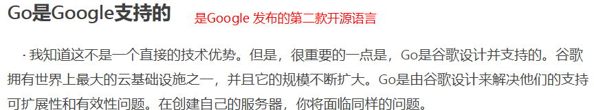
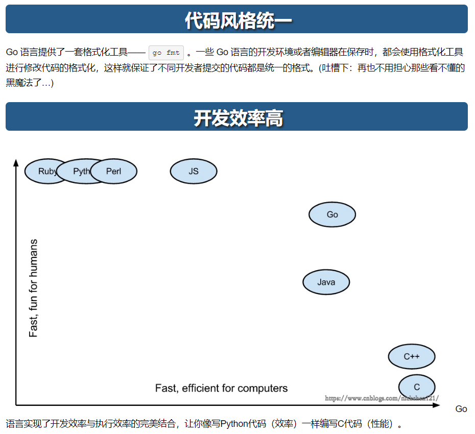

> > *Made By Herolh*
>
> ------
>
> # 目录 {#index}
>
> [TOC]
>
> 
>
> 
>
> 
>
> 
>
> 
>
> ------
>
> ## GO 语言初步了解
>
> ### 什么是Go
>
> > Go is an open source programming language that makes it easy to build simple, reliable, and efficient software.
>
> 这是[Go官网](https://link.jianshu.com?t=https://golang.org/)对Go的定义，翻译过来就是：Go是一门开源的编程语言，Go让编写简洁、可依赖和高效的软件变得简单。
>
> Go是2007年在Google被发明的，2012年3月28日发布了1.0版本，现在已更新到1.8版本了。发明人中就有程序员的男神[Ken Thompson](https://link.jianshu.com?t=http://www.computerhistory.org/fellowawards/hall/ken-thompson/)，他在1969年和[Dennis Ritchie ](https://link.jianshu.com?t=https://en.wikipedia.org/wiki/Dennis_Ritchie)一起设计和实现了Unix操作系统。
>
> 
>
> ### Go适合做什么？为何这么多人偏爱Go语言？
>
> <https://studygolang.com/articles/18151?fr=sidebar>
>
> 
>
> &emsp;&emsp;从 TIOBE 给出的2017年5月编程语言排名来看，Go是增长最快的语言，一年内+1.83%并且从42名提升至16名。
> &emsp;&emsp;2012年，七牛就已经在用了，核心系统也是用Go实现，七牛的创始人许世伟是Go在国内的布道者。现在国内用Go的不少，看到BAT某部门的后台开发岗位，要求应聘者有Go开发经验。
> &emsp;&emsp;现在很火的微服务的两大基础组件：**Docker 和 Kubernetes都是用Go实现的。**
>
> 
>
> ### 为什么一定要学 GO 语言
>
> 
>
> 
>
> 
>
> 
>
> - <https://zhidao.baidu.com/question/182053969281767444.html>
>
> 
>
> 
>
> ### Python、Ruby、Go语言哪个更值得学习？
>
> https://www.zhihu.com/question/21480874?sort=created
>
> 
>
> 
>
> ### GO 语言语法基础
>
> <https://www.runoob.com/go/go-program-structure.html>
>
> 
>
> 
>
> ## 自己对 GO语言的看法
>
> &emsp;&emsp;Go 语言算是一门新生语言,但是依托google背景和自身高效简洁的优势发展迅速, 目前国内大部分的公司可能没有 python 工程师,但是基本都会招收 go工程师,市场份额占据和与安卓开发差不多，并且会持续增长。因为 GO 语言的高性能，现在只要是个游戏公司或是云提供商就会招收GO工程师。 
>
> &emsp;&emsp;如果说未来的 IT 前景是云计算微服务，那么 Java 的资源占用会是它在云开发上的一只拦路虎，而和 python 的GIL短板使得无法发挥服务器的全部性能，如果在未来很没有优雅解决这两个问题，势必会在未来的工作中造成极大的困扰。而go语言，现在很火的微服务的两大基础组件：Docker 和 Kubernetes都是用Go实现的。基本可以说go 就是为云生态而生的语言。
>
> &emsp;&emsp;如果知道一项技术在未来会成为主流， 那么我们应该从一开始就掌握它，可能现在他的开发生态(各种框架)还比较少，但是随着go语言越来越火,开源社区的参与人数越来越多,人员的交融也会把技术带过来。如果不从知识最少的时候掌握它，还要等到什么时候？
