----------------------------------------------
> *Made By Herolh*
----------------------------------------------

# go 语言  {#index}

[TOC]


# 初识Go语言
&emsp;&emsp;Go 是一个开源的编程语言，它能让构造简单、可靠且高效的软件变得容易。
&emsp;&emsp;Go 是从 2007 年末由 Robert Griesemer, Rob Pike, Ken Thompson 主持开发，后来还加入了 Ian Lance Taylor, Russ Cox 等人，并最终于 2009 年 11 月开源，在 2012 年早些时候发布了 Go 1 稳定版本。现在 Go 的开发已经是完全开放的，并且拥有一个活跃的社区。

## 语言特性
Go语言是一门全新的**静态类型开发语言**，这里先给读者罗列一下Go语言最主要的特性：

### 自动垃圾回收
我们可以先看下不支持垃圾回收的语言的资源管理方式，以下为一小段 C++ 语言代码：

```c++
void foo()
{
    char* p = new char[128];
    ... 						// 对p指向的内存块进行赋值
    func1(p); 					// 使用内存指针
    delete[] p;
} 
```

&emsp;&emsp;各种非预期的原因，比如由于开发者的疏忽导致最后的 delete 语句没有被调用，都会引发经典而恼人的内存泄露问题。假如该函数被调用得非常频繁，那么我们观察该进程执行时，会发现该进程所占用的内存会一直疯长，直至占用所有系统内存并导致程序崩溃，而如果泄露的是系统资源的话，那么后果还会更加严重，最终很有可能导致系统崩溃。 
&emsp;&emsp;手动管理内存的另外一个问题就是由于指针的到处传递而无法确定何时可以释放该指针所指向的内存块。假如代码中某个位置释放了内存，而另一些地方还在使用指向这块内存的指针，那么这些指针就变成了所谓的""野指针"(wild pointer)或者“悬空指针”(dangling pointer)，对这些指针进行的任何读写操作都会导致不可预料的后果。
&emsp;&emsp;到目前为止，内存泄露的最佳解决方案是在语言级别引入自动垃圾回收算法(Garbage Collection，简称GC)。所谓垃圾回收，即所有的内存分配动作都会被在运行时记录，同时任何对 该内存的使用也都会被记录，然后垃圾回收器会对所有已经分配的内存进行跟踪监测，一旦发现 有些内存已经不再被任何人使用，就阶段性地回收这些没人用的内存。当然，因为需要尽量最小 化垃圾回收的性能损耗，以及降低对正常程序执行过程的影响，现实中的垃圾回收算法要比这个 复杂得多，比如为对象增加年龄属性等，但基本原理都是如此。
&emsp;&emsp;自动垃圾回收在 C/C++ 社区一直作为一柄双刃剑看待，虽然到 C++11 正式发布时，这个呼声颇高的特性总算是有人发起提案，但按 C++ 之父的说法，由于 C++ 本身过于强大，导致在 C++ 中支持垃圾收集变成了一个困难的工作，这也使得垃圾回收最终与 C++11 无缘。 假如 C++ 支持垃圾收集，以下的代码片段在运行时就会是一个严峻的考验：

```c++
int* p = new int;
p += 10; 				// 对指针进行了偏移，因此那块内存不再被引用
						// …… 这里可能会发生针对这块int内存的垃圾收集 ……
p -= 10; 				// 咦，居然又偏移到原来的位置
*p = 10; 				// 如果有垃圾收集，这里就无法保证可以正常运行了
```
&emsp;&emsp;微软的 C++/CLI 算是用一种偏门的方式让 C++ 程序员们有机会品尝一下垃圾回收功能的鲜美 味道。在 C/C++ 之后出现的新语言，比如 Java 和 C# 等，基本上都已经自带自动垃圾回收功能。 Go语言作为一门新生的开发语言，当然不能忽略内存管理这个问题。又因为Go语言没有C++ 这么“强大”的指针计算功能，因此可以很自然地包含垃圾回收功能。因为垃圾回收功能的支持， 开发者无需担心所指向的对象失效的问题，因此Go语言中不需要 delete 关键字，也不需要 `free()` 方法来明确释放内存。例如，对于以上的这个C语言例子，如果使用Go语言实现，我们就完全不 用考虑何时需要释放之前分配的内存的问题，系统会自动帮我们判断，并在合适的时候( 比如CPU 相对空闲的时候 )进行自动垃圾收集工作。


### 更丰富的内置类型

&emsp;&emsp;除了几乎所有语言都支持的简单内置类型( 比如整型和浮点型等 )外，Go语言也内置了一些比较新的语言中内置的高级类型，比如 C# 和 Java 中的数组和字符串。除此之外，Go语言还内置 了一个对于其他静态类型语言通常用库方式支持的字典类型( map )。Go语言设计者对为什么内 置map这个问题的回答也颇为简单：既然绝大多数开发者都需要用到这个类型，为什么还非要每个人都写一行import语句来包含一个库？这也是一个典型的实战派观点，与很多其他语言的学院派气息迥然不同。
&emsp;&emsp;另外有一个新增的数据类型：数组切片( Slice )。我们可以认为数组切片是一种可动态增长的数组。这几种数据结构基本上覆盖了绝大部分的应用场景。数组切片的功能与C++标准库中的vector非常类似。Go语言在语言层面对数组切片的支持，相比 C++ 开发者有效地消除了反复写以下几行代码的工作量：
```C++
#include <vector>
#include <map>
#include <algorithm>
using namespace std; 
```
&emsp;&emsp;因为是语言内置特性，开发者根本不用费事去添加依赖的包，既可以少一些输入工作量，也 可以让代码看起来尽量简洁。


### 函数多返回值

&emsp;&emsp;目前的主流语言中除 Python 外基本都不支持函数的多返回值功能，不是没有这类需求，可能 是语言设计者没有想好该如何提供这个功能，或者认为这个功能会影响语言的美感。 比如我们如果要定义一个函数用于返回个人名字信息，而名字信息因为包含多个部分——姓氏、名字、中间名和别名，在不支持多返回值的语言中我们有以下两种做法：要么专门定义一个结构体用于返回回，比如：

```C++
struct name
{
 char first_name[20];
 char middle_name[20];
 char last_name[20];
 char nick_name[48];
};
// 函数原型
extern name get_name();
// 函数调用
name n = get_name();
```

或者以传出参数的方式返回多个结果：

```c++
// 函数原型
extern void get_name(
 /*out*/char* first_name,
 /*out*/char* middle_name,
 /*out*/char* last_name,
 /*out*/char* nick_name
);
// 先分配内存
char first_name[20];
char middle_name[20];
char last_name[20];
char nick_name[48];
// 函数调用
get_name(first_name, middle_name, last_name, nick_name); 
```

&emsp;&emsp;Go 语言革命性地在静态开发语言阵营中率先提供了多返回值功能。这个特性让开发者可以 从原来用各种比较别扭的方式返回多个值的痛苦中解脱出来，既不用再区分参数列表中哪几个用于输入，哪几个用于输出，也不用再只为了返回多个值而专门定义一个数据结构。在Go语言中，上述的例子可以修改为以下的样子：

```go
func getName()(firstName, middleName, lastName, nickName string){ 
    return "May", "M", "Chen", "Babe" 
} 
```

&emsp;&emsp;因为返回值都已经有名字，因此各个返回值也可以用如下方式来在不同的位置进行赋值，从 而提供了极大的灵活性： 

```go
func getName()(firstName, middleName, lastName, nickName string){ 
    firstName = "May" 
    middleName = "M" 
    lastName = "Chen" 
    nickName = "Babe" 
    return 
}
```

并不是每一个返回值都必须赋值，没有被明确赋值的返回值将保持默认的空值。而函数的调用相比C/C++语言要简化很多：

```go
fn, mn, ln, nn := getName() 
```

如果开发者只对该函数其中的某几个返回值感兴趣的话，也可以直接用下划线作为占位符来忽略其他不关心的返回值。下面的调用表示调用者只希望接收 lastName 的值，这样可以避免声明完全没用的变量：

```go
_, _, lastName, _ := getName() 
```


### 错误处理

&emsp;&emsp;Go 语言引入了 `defer` 关键字用于标准的错误处理流程，并提供了内置函线 `panic`、`recover` 完成异常的抛出与捕获。整体上而言与C++和Java等语言中的异常捕 获机制相比，Go语言的错误处理机制可以大量减少代码量，让开发者也无需仅仅为了程序安全 性而添加大量一层套一层的try-catch语句。这对于代码的阅读者和维护者来说也是一件很好的。


### 匿名函数和闭包

&emsp;&emsp;在 Go 语言中，所有的函数也是值类型，可以作为参数传递。Go 语言支持常规的匿名函数和 闭包，比如下列代码就定义了一个名为f的匿名函数，开发者可以随意对该匿名函数变量进行传递和调用：

```go
 f := func(x, y int) int { 
     return x + y 
 } 
```


### 类型和接口

&emsp;&emsp;Go语言的类型定义非常接近于C语言中的结构( struct )，甚至直接沿用了 struct 关键字。相比而言，Go语言并没有直接沿袭 C++ 和 Java 的传统去设计一个超级复杂的类型系统，不支持继承和重载，而只是支持了最基本的类型组合功能。 巧妙的是，虽然看起来支持的功能过于简洁，细用起来你却会发现，C++ 和 Java 使用那些复杂的类型系统实现的功能在 Go 语言中并不会出现无法表现的情况，这反而让人反思其他语言中引入这些复杂概念的必要性。我们在第3章中将详细描述Go语言的类型系统。 Go语言也不是简单的对面向对象开发语言做减法，它还引入了一个无比强大的“非侵入式” 接口的概念，让开发者从以往对 C++ 和 Java 开发中的接口管理问题中解脱出来。在 C++ 中，我们 通常会这样来确定接口和类型的关系：

```C++
// 抽象接口
interface IFly
{
 	virtual void Fly()=0;
};
// 实现类
class Bird : public IFly
{
public:
 	Bird(){}
 	virtual ~Bird(){}
public:
 	void Fly()
 	{
 		// 以鸟的方式飞行
 	}
};

void main()
{
 	IFly* pFly = new Bird();
 	pFly->Fly();
 	delete pFly;
}
```

&emsp;&emsp;显然，在实现一个接口之前必须先定义该接口，并且将类型和接口紧密绑定，即接口的修改 会影响到所有实现了该接口的类型，而Go语言的接口体系则避免了这类问题：

```go
type Bird struct {
 	...
}
func (b *Bird) Fly() {
 	// 以鸟的方式飞行
} 
```

&emsp;&emsp;我们在实现 Bird 类型时完全没有任何 IFly 的信息。我们可以在另外一个地方定义这个 IFly 接口： 

```go
type IFly interface { 
    Fly() 
} 
```

这两者目前看起来完全没有关系，现在看看我们如何使用它们： 

```go
func main() { 
    var fly IFly = new(Bird) 
    fly.Fly() 
} 
```

可以看出，虽然Bird类型实现的时候，没有声明与接口 IFly 的关系，但接口和类型可以直 接转换，甚至接口的定义都不用在类型定义之前，这种比较松散的对应关系可以大幅降低因为接 口调整而导致的大量代码调整工作。


### 并发编程

&emsp;&emsp;Go语言引入了 goroutine 概念，它使得并发编程变得非常简单。通过使用 goroutine 而不是裸用操作系统的并发机制，以及使用消息传递来共享内存而不是使用共享内存来通信，Go语言让并 发编程变得更加轻盈和安全。通过在函数调用前使用关键字go，我们即可让该函数以goroutine 方式执行。goroutine 是一种比线程更加轻盈、更省资源的协程。Go 语言通过系统的线程来多路派遣这些函数的执行，使得每个用go关键字执行的函数可以运行成为一个单位协程。当一个协程阻塞的时候，调度器就会自 动把其他协程安排到另外的线程中去执行，从而实现了程序无等待并行化运行。而且调度的开销非常小，一颗CPU调度的规模不下于每秒百万次，这使得我们能够创建大量的 goroutine，从而可以很轻松地编写高并发程序，达到我们想要的目的。 Go语言实现了 CSP( 通信顺序进程，Communicating Sequential Process )模型来作为 goroutine 间的推荐通信方式。在CSP模型中，一个并发系统由若干并行运行的顺序进程组成，每个进程不 能对其他进程的变量赋值。进程之间只能通过一对通信原语实现协作。Go语言用channel( 通道 ) 这个概念来轻巧地实现了CSP模型。channel的使用方式比较接近Unix系统中的管道( pipe )概念， 可以方便地进行跨goroutine的通信。 另外，由于一个进程内创建的所有goroutine运行在同一个内存地址空间中，因此如果不同的 goroutine不得不去访问共享的内存变量，访问前应该先获取相应的读写锁。Go语言标准库中的 sync包提供了完备的读写锁功能。 下面我们用一个简单的例子来演示goroutine和channel的使用方式。这是一个并行计算的例 子，由两个goroutine进行并行的累加计算，待这两个计算过程都完成后打印计算结果：

```go
package main
import "fmt"
func sum(values [] int, resultChan chan int) {
 	sum := 0
 	for _, value := range values {
 		sum += value
 	}
 	resultChan <- sum 						// 将计算结果发送到channel中
}
func main() {
 	values := [] int{1, 2, 3, 4, 5, 6, 7, 8, 9, 10}
 	resultChan := make(chan int, 2)
 	go sum(values[:len(values)/2], resultChan)
 	go sum(values[len(values)/2:], resultChan)
 	sum1, sum2 := <-resultChan, <-resultChan 				// 接收结果
 	fmt.Println("Result:", sum1, sum2, sum1 + sum2)
} 
```


### 反射

反射( reflection )是在Java语言出现后迅速流行起来的一种概念。通过反射，你可以获取对象类型的详细信息，并可动态操作对象。反射是把双刃剑，功能强大但代码可读性并不理想。若非必要，我们并不推荐使用反射。 Go 语言的反射实现了反射的大部分功能，但没有像Java语言那样内置类型工厂，故而无法做到像 Java 那样通过类型字符串创建对象实例。在 Java 中，你可以读取配置并根据类型名称创建对应的类型，这是一种常见的编程手法，但在 Go 语言中这并不被推荐。 反射最常见的使用场景是做对象的序列化( serialization，有时候也叫Marshal & Unmarshal )。 例如，Go语言标准库的 encoding/json、encoding/xml、encoding/gob、encoding/binary 等包就大量依赖于反射功能来实现。 这里先举一个小例子，可以利用反射功能列出某个类型中所有成员变量的值，如代码清单1-2 所示。

```go
package main
import (
 	"fmt"
 	"reflect"
)
type Bird struct { 
	Name string
 	LifeExpectance int
}
func (b *Bird) Fly() {
 	fmt.Println("I am flying...")
}
func main() {
 	sparrow := &Bird{"Sparrow", 3}
 	s := reflect.ValueOf(sparrow).Elem()
 	typeOfT := s.Type()
 	for i := 0; i < s.NumField(); i++ {
 		f := s.Field(i)
 		fmt.Printf("%d: %s %s = %v\n", i, typeOfT.Field(i).Name, f.Type(),
 		f.Interface())
 	}
} 
```

该程序的输出结果为：

```shell
0: Name string = Sparrow 
1: LifeExpectance int = 3 
```


### 语言交互性

&emsp;&emsp;由于 Go 语言与 C 语言之间的天生联系，Go 语言的设计者们自然不会忽略如何重用现有 C 模块的这个问题，这个功能直接被命名为 Cgo。Cgo 既是语言特性，同时也是一个工具的名称。在 Go 代码中，可以按 Cgo 的特定语法混合编写 C 语言代码，然后 Cgo 工具可以将这些混合的 C 代码提取并生成对于 C 功能的调用包装代码。开发者基本上可以完全忽略这个 Go 语言和 C 语言的边界是如何跨越的。 与Java中的 JNI 不同，Cgo 的用法非常简单，比如以下代码就可以实现在Go中调用C语言标准库的puts函数。

```go
package main
/*
#include <stdio.h>
#include <stdlib.h>
*/
import "C"
import "unsafe"
func main() {
 cstr := C.CString("Hello, world")
 C.puts(cstr)
 C.free(unsafe.Pointer(cstr))
}
```


## Go 语言环境安装

>  Go 语言支持以下系统：Linux、FreeBSD、Mac OS X、Windows

Go官网安装包下载地址为：https://golang.org/dl/。

Go官方镜像站( 推荐 )：https://golang.google.cn/dl/。

各个系统对应的包名：

| 操作系统 |              包名              |
| :------: | :----------------------------: |
| Windows  |    go1.4.windows-amd64.msi     |
|  Linux   |    go1.4.linux-amd64.tar.gz    |
|   Mac    | go1.4.darwin-amd64-osx10.8.pkg |
| FreeBSD  |   go1.4.freebsd-amd64.tar.gz   |

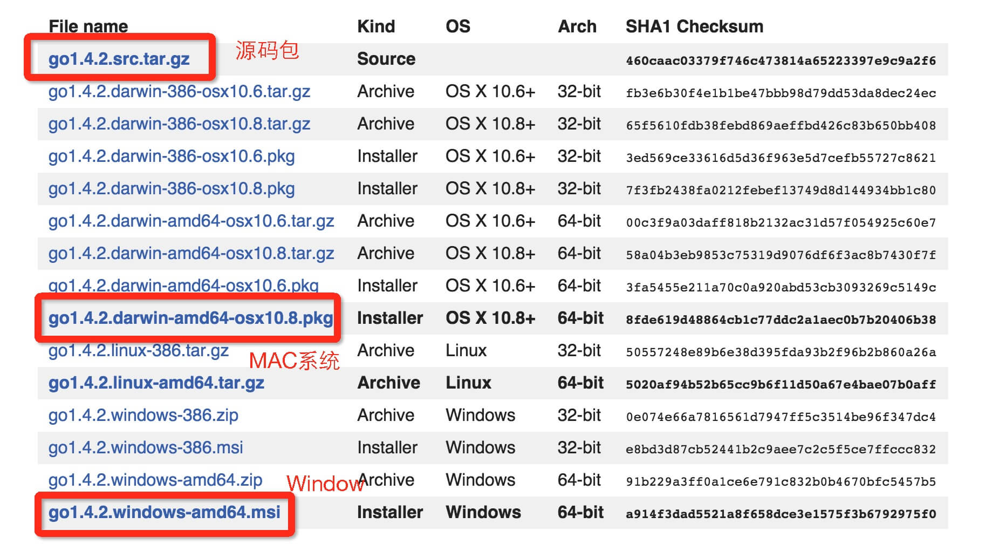


### Windows 系统下安装

&emsp;&emsp;Windows 下可以使用 `.msi` 后缀的安装包来安装。默认情况下 `.msi` 文件会安装在 `c:\Go` 目录下。你可以将 `c:\Go\bin` 目录添加到 `Path` 环境变量中。添加后你需要重启命令窗口才能生效。

### 安装测试

- **方法一：**

    ```shell
    go version
    ```

    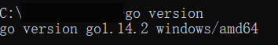

- **方法二：**

    创建工作目录 `C:\>Go_WorkSpace`

    ```shell
    package main
    
    import "fmt"
    
    func main() {
       fmt.Println("Hello, World!")
    }
    ```

    使用 go 命令执行以上代码输出结果如下：

    ```shell
    C:\Go_WorkSpace>go run test.go
    
    Hello, World!
    ```

    


### 编译程序

&emsp;&emsp;使用 `go run` 这个命令，会将编译、链接和运行3个步骤合并为一步，运行完后在当前目录下也看不到任何中间文件和最终的可执行文件。如果要只生成编译结果而不自动运行，我们也可以使用 Go 命令行工具的 `build` 命令：

```shell
go build hello.go
./hello 
# Hello, World!
```

&emsp;&emsp;从根本上说，Go 命令行工具只是一个源代码管理工具，或者说是一个前端。真正的 Go 编译器和链接器被 Go 命令行工具隐藏在后面，我们可以直接使用它们：

```shell
6g helloworld.go 
6l helloworld.6 
./6.out 
# Hello, World!
```

&emsp;&emsp;6g 和 6l 是 64 位版本的 Go 编译器和链接器，对应的 32 位版本工具为 8g 和 8l。Go 还有另外一个 GCC 版本的编译器，名为 gccgo。


### 环境配置

#### 创建一个任意目录

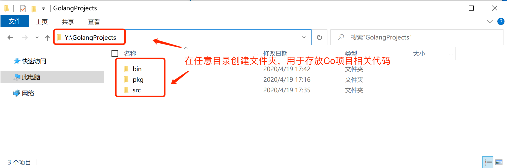

以后的 go 项目都要按照要求放在这个目录里：

```shell
E:\Project\go
----|bin	# 用于存放编译后的可执行文件
----|pkg	# 用于存放编译后的包文件
----|src	# 我们以后写的go项目代码都写到这里去，在内部为每个项目创建一个文件夹。
----|----|project_1
----|----|----|app.go
----|----|project_2
----|----|----|app.go
```

> Go 1.11 版本引入了 Module 包管理机制， 可以实现让项目放在任意目录，同时也解决了包依赖管理等问题，后续专门在 Module 专题中再进行讲解，目前先按照上图的方式进行创建项目。


#### 配置环境变量

```shell
# GOROOT，Go解释器安装路径，用于之后去调用go相关源码。
# GOPATH，Go项目代码相关目录，将你以后写的go代码及其编译生成的文件存放的目录。
# GOBIN，Go编译代码后自动生成可执行文件的路径，Go是个编译型语言，当使用go install命令对代码进行编译时，可执行文件会生成到这个目录。
```


#### GOPATH

&emsp;&emsp;`GOROOT` 和 `GOPATH` 都是环境变量，其中`GOROOT`是我们安装 go 开发包的路径，而从 Go 1.8 版本开始，Go 开发包在安装完成后会为`GOPATH`设置一个默认目录，参见下表。

##### GOPATH在不同操作系统平台上的默认值

|  平台   |   GOPATH默认值   |        举例        |
| :-----: | :--------------: | :----------------: |
| Windows | %USERPROFILE%/go | C:\Users\用户名\go |
|  Unix   |     $HOME/go     |  /home/用户名/go   |

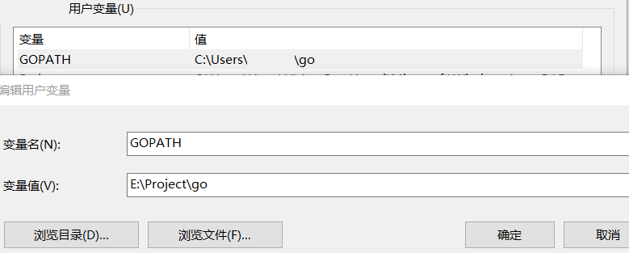

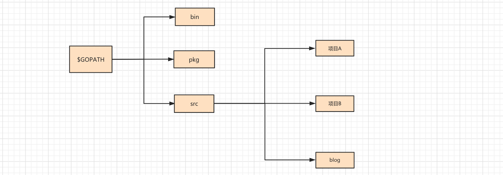


## 第一个Go程序

### Hello World!

#### 目录结构

&emsp;&emsp;在 `GOPATH` 下的 `src` 目录中创建一个 `文件夹（项目）`，进入文件夹并创建一个以 `.go` 为后缀名的文件（如 `first.go`），并在 `first.go` 文件中写入 go 代码。

```shell
E:\Project\go
----|bin
----|pkg
----|src
----|----|learn
----|----|----|day1
----|----|----|----|helloWorld.go
```


#### 代码示例

```go
package main

import "fmt"

func main() {		// 程序开始执行的函数。
   fmt.Println("Hello, World!")
}
```

- **package main**
    > 每个 Go 源代码文件的开头都是一个 package 声明，表示该 Go 代码所属的包。
    > 必须在源文件中非注释的第一行指明这个文件属于哪个包，包是Go 语言里最基本的分发单位，也是工程管理中依赖关系的体现。

- **import "fmt"**
    >  在包声明之后，是一系列的import语句，用于导入该程序所依赖的包。由于本示例程序用到了 `Println()` 函数，所以需要导入该函数所属的 fmt 包。 
    >  有一点需要注意，**不得包含在源代码文件中没有用到的包，否则Go编译器会报编译错误。**
    >  这与下面提到的强制左花括号 `{` 的放置位置以及之后会提到的函数名的大小写规则，均体现了Go 语言在语言层面解决软件工程问题的设计哲学。


- **func **

    > 所有 Go 函数( 包括在对象编程中会提到的类型成员函数 )以关键字 func 开头。一个常规的 函数定义包含以下部分：
    >
    > ```go
    > func 函数名(参数列表)(返回值列表) {
    >     // 函数体
    > }
    > 对应的一个实例如下：
    > func Compute(value1 int, value2 float64)(result float64, err error) {
    >     // 函数体
    > } 
    > ```
    >
    > Go支持多个返回值。以上的示例函数 `Compute()` 返回了两个值，一个叫 result，另一个是 err。并不是所有返回值都必须赋值。在函数返回时没有被明确赋值的返回值都会被设置为默认值，比如result会被设为0.0，err会被设为 nil。

- **main(){}**
  
    > main 函数是每一个可执行程序所必须包含的，一般来说都是在启动后第一个执行的函数（如果有 init() 函数则会先执行该函数）。main 函数是 Go 可执行程序的执行起点 )。
    > **Go语言的main()函数不能带参数，也不能定义返回值。**命令行传入的参数在` os.Args` 变量中保存。如果需要支持命令行开关，可使用 flag 包。


#### 运行代码

本质上是将 go 代码交给 go 编译器去执行


##### 方式一：`go run`

> compile and run Go program ，其内部会【先编译】代码文件【再运行】（二合一）。

注意：`go run` 内部创建可执行文件默认保存在系统的临时目录，可以使用 `go run -work main.go`查看。

```shell
go run learn\day1
# or
go run helloWorld.go
```


##### 方式二：`go build`

> compile packages and dependencies，其内部就是将 go 代码进行编译，然后手动执行。
>
> ```shell
> go build -n 
> # 进行编译时，会将底层编译不步骤展示出来。
> 
> go build -o 任意名称 
> # 进行编译，这样可自定义编译生成的可执行文件的名称。
> ```
>
> 注意：在win系统中 build 命令会生成的可执行文件默认以 .exe 为后缀。

&emsp;&emsp;执行完命令之后，就会在当前项目目录下自动生成一个可执行文件（默认文件名为项目），然后在执行此可执行文件即可。

```shell
go build
day1.exe
# or
go build -o helloWorld.exe
helloWorld.exe
```

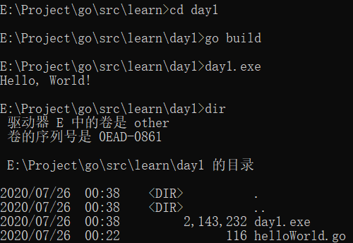


##### 方式三：`go install`

> compile and install packages and dependencies，其内部就是编译 go 代码，并将可执行文件/包文件分别放到 bin 和 pkg 目录。包文件的生成必须用 `go install`


&emsp;&emsp;如果项目没有main包（只是一个类库），则 install 生成的包文件会放在 `$GOPATH/pkg` 目录；有 main 包则生成的可执行文件放在 `$GOPATH/src` 目录。
&emsp;&emsp;对于生成的 可执行文件 直接运行即可，而对于 包文件 可以当做是一个类库来供其他程序使用，

```shell
go install learn\day1
..\..\bin\day1.exe
```

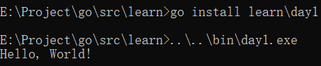


## 集成开发环境

&emsp;&emsp;常用的有 vscode 和 Goland，此处用 Goland

### Goland

去[官方网站](https://www.jetbrains.com/go/)去下载 Goland 并 安装到自己的电脑中。

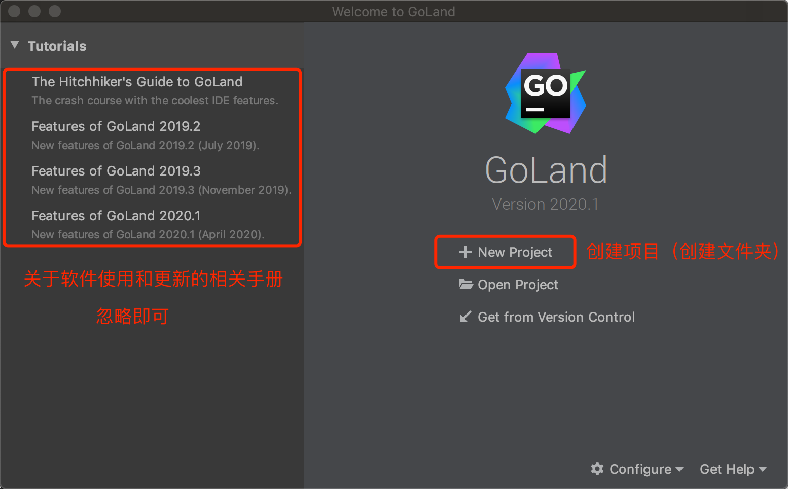

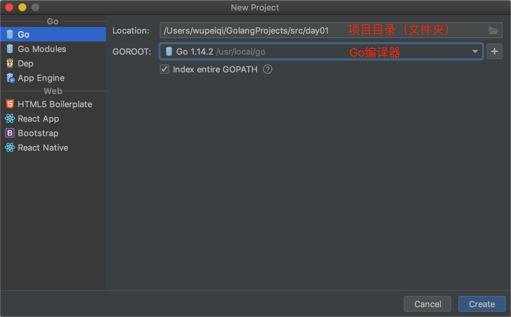


#### 常见配置

##### 关闭参数建议

&emsp;&emsp;你的 Goland 在编写代码时，可能会在代码发现一些 `a...:` 等标记，这其实是Goland为你提供的参数的注解，如果不想展示，则可以修改Goland的配置实现。


##### 字体调节

&emsp;&emsp;你的 Goland 字体大小不合适时，可以通过修改 Goland 的配置之后，通过 `Ctrl + 鼠标滚轮` 实现字体大小调节。

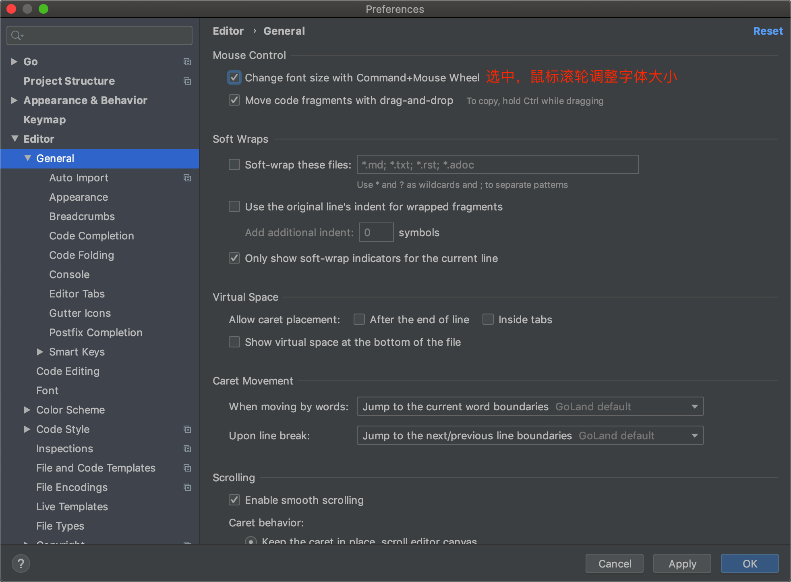


# Go 语言基础语法

## 注释与分隔符

### 注释

Go 程序的代码注释与 C++ 保持一致，即同时支持以下两种用法：

```go
/*
块注释
*/

// 行注释 
```

&emsp;&emsp;Go程序并不要求开发者在每个语句后面加上分号表示语句结束，这是与C和C++的一个明显不同之处。需要注意的是 `{` 不能单独放在一行，所以以下代码在运行时会产生错误，这样做的结果是 Go 编译器报告编译错误，这点需要特别注意：

```go
package main

import "fmt"

func main()  
{  // 错误，{ 不能在单独的行上
    fmt.Println("Hello, World!")
}
```

> syntax error: unexpected semicolon or newline before { 


### 分隔符

&emsp;&emsp;在 Go 程序中，一行代表一个语句结束。每个语句不需要像 C 家族中的其它语言一样以分号 `;` 结尾，因为这些工作都将由 Go 编译器自动完成。如果你打算将多个语句写在同一行，它们则必须使用 `;` 人为区分，但在实际开发中我们并不鼓励这种做法。

```go
// 以下为两个语句：
fmt.Println("Hello, World!")
fmt.Println("Hello, World!")
```


## 初识包管理

&emsp;&emsp;`包（package）`是多个 Go 源码的集合，是一种高级的代码复用方案，Go 语言为我们提供了很多内置包，如`fmt`、`os`、`io`等。

一个文件夹就可以成为一个包

在文件夹( 包 )中可以创建对讴歌文件

在同一个包下的每个文件必须指定包名且相同


### 包的分类

-  **`main` 包**

    > 如果是 main 包，则必须写一个 main 函数，此函数位项目的入口( main 主函数 )
    >
    > 编译生成的是一个可执行文件

- **非 `main` 包**

    > 用来将


### 示例

- **api 包**

    - **baidu.go**

        ```go
        package api
        
        import "fmt"
        
        func BaiDu() {
        	fmt.Println("api 包下的 baidu")
        }
        ```

    - **google.go**

        ```go
        package api
        
        import "fmt"
        
        func Google() {
        	fmt.Println("api 包下的 google")
        }
        ```

- **buff.go**

    ```go
    package main
    
    import "fmt"
    
    // 在包中编写功能时，函数首字母要大写
    // 		首字母大写说明是个公有的功能，属于外部函数
    // 		首字母小写说明时包私有功能，属于内部函数
    func Buff() {
    	fmt.Println("同一个 package 下 的Buff")
    }
    ```

- **app.go**

    ```go
    package main
    
    import (
    	"fmt"
    	"learn/api"
    )
    
    func main() {
    	fmt.Println("Hello World!")
        // 同一个包下，不需要再导入
    	Buff()
        // 不同包下，需要再导入
    	api.Google()
    	api.BaiDu()
    }
    ```


## 输出

在终端将数据显示出来

### 扩展：

进程里有 `stdin/stdout/stderr` ==> `标准输入/标准输出/标准错误`


### 法一：内置函数

> 官方不保证以后一直有这个功能
>
> 这两个函数取的值不是标准输出，而是标准错误

- **print**

    ```go
    print("hello world!")
    print("hello world!")
    ```

- **println**

    ```go
    println("hello world!")			// ==> 相当于 print("hello world!\n")
    println("hello world!")
    ```


### 法二：fmt 包( 推荐 )

- **fmt.Print**

    ```go
    fmt.Print("hello world!")
    fmt.Print("hello world!")
    ```

- **fmt.Println**

    ```go
    fmt.Println("hello world!")
    fmt.Println("hello world!")
    
    fmt.Println("hello", "world", "!")
    ```

- **fmt.Printf**

    > 格式化输出
    > %s 			占位符，文本
    > %d			占位符，整数
    > %f		 	占位符，小数( 浮点数 )
    > 百分比		%
    
    ```go
    fmt.Printf("你好， 我是%s, 今年%d, %.2f, 百分比100%%", "lin", 18, 3.1415926)
    ```


## 基本数据类型

### 整型

Go语言的数值类型包含不同大小的整数型、浮点数和负数，每种数值类型都有大小范围以及正负符号。

```go
fmt.Println(666)
fmt.Println(6 + 6)
fmt.Println(6 - 6)
fmt.Println(6 * 6)
fmt.Println(6 / 6)		// 商
fmt.Println(6 % 6)		// 余数
```


### 字符串

> 字符串默认值为 ""

```go
fmt.Println("字符串")
// fmt.Println("字符串" + 666)			// 不同数据类型不能混搭
fmt.Println("字符串" + "666")
```


#### 字符串格式化

```go
name := "lin"
age := 18
addr := "---"
result := fmt.Sprintf("我叫%s, 今年%d, 家在%s", name, age, addr)
fmt.Println(result)
```


#### 字符串的存储形式

英文字符占一位，中文字符占三位

```go
// 字符串以什么形式存在存在于 Go 编译器中
name := "abc"
fmt.Println(name[0], name[1], name[2])
// 结果： 97 98 99

fmt.Println(strconv.FormatInt(int64(name[0]), 2))		// 获取二进制
// 1100001

name2 := "一二三"
// 表示 一
fmt.Println(name2[0], name2[1], name2[2])
// 表示 二
fmt.Println(name2[3], name2[4], name2[5])
// 表示 三
fmt.Println(name2[6], name2[7], name2[8])
//fmt.Println(name2[9])								// 会报错
```


### 布尔类型

```go
fmt.Println(1 > 2)		// false	假
fmt.Println(1 < 2)		// ture		真
```


## 变量
### 变量声明
> Go 语言中的变量需要声明后才能使用，同一作用域内不支持重复声明。
>  **Go语言的变量声明后必须使用**。


#### 标准声明
&emsp;&emsp;Go语言的变量声明格式为 `var 变量名 变量类型`。变量声明以关键字`var`开头，变量类型放在变量的后面，行尾无需分号：

```go
// 声明加赋值
var str string = "字符串"
fmt.Println(str)

var age int = 18
fmt.Println(age)

var  flag bool = true
fmt.Println(flag)

// 先声明后赋值
var str2 string
str2 = "字符串2"		// 赋值不算使用
fmt.Println(str2)
```


#### 批量声明

&emsp;&emsp;每声明一个变量就需要写`var`关键字会比较繁琐，go语言中还支持批量变量声明：

- **先声明再赋值**

    ```go
    var (
        a string		// 只声明不赋值，有一个默认值 ""
        b int			// 只声明不赋值，有一个默认值 0
        c bool			// 只声明不赋值，有一个默认值 false
        d float32
    )
    a = "string"
    ```

    

- **声明并赋值**

    ```go
    // 法一：
    var string1, string2, string3 string = "1", "2", "3"
    fmt.Println(string1, string2,string3)
    
    // 法二：
    var (
        a string = "1"
        b int = 2
        c bool = true
        d float32 = 3.1415926
    )
    fmt.Println(a, b, c, d)
    ```

    


### 变量简写

- **先声明再赋值**

    ```go
    var string1 string
    var string2 string
    var string3 string
    
    // 相当于下面一行
    
    var string1, string2,string3 string
    ```

- **声明并赋值**

    ```go
    var name1 string = "字符串1"			// 最全写法
    var name2 = "字符串2"					// 自动推断出是什么类型
    name3 := "字符串3"						// 海象运算符连 var 都能省略
    
    fmt.Println(name1, name2, name3)
    ```


### 作用域
> 如果我们定义了一个大括号，大括号内定义的变量：
> - 不能被括号外的使用。
> - 可以在同级和子级中使用。

```go
name := "global"
if true{
    fmt.Println(name)
    age := 18
    name := "local"
    fmt.Println(age, name)
}
fmt.Println(name)
//fmt.Println(age)			// 报错
```


### 全局变量与局部变量

```go
//全局变量( 不能以省略的方式 )
var name1 string = "字符串1"				// 支持
var name2 = "字符串2"					// 支持
name3 := "字符串3"						// 不支持

// 批量声明方式
var (
	var1 = "str"
	var2 = 123
	var3 string
)

func main() {
    // 局部变量
}
```


### 赋值与内存相关

使用值类型 int、string、bool 这三种数据类型时，如果遇到变量的赋值会拷贝一份

- **赋值给另一个变量的时候，会重新开辟一块内存用来存放数据，而不是建立指针引用**

    ```GO
    name1 := "str1"
    name2 := name1
    
    // 生成两块地址，而不是引用
    fmt.Println(name1, &name1)
    fmt.Println(name2, &name2)
    ```

    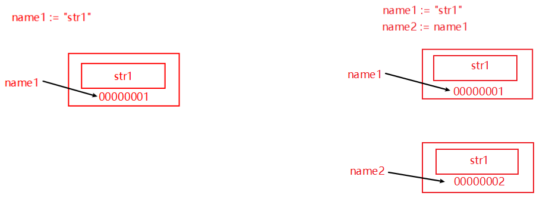

- **修改变量的值不会重新开辟内存，而是直接覆盖原数据**

    ```go
    name1 := "str1"
    fmt.Println(name1, &name1)
    name1 = "str2"
    fmt.Println(name1, &name1)
    ```

    


## 常量

&emsp;&emsp;相对于变量，常量是恒定不变的值，多用于定义程序运行期间不会改变的那些值，一般情况下，常量都会定义在全局。 常量的声明和变量声明非常类似，只是把`var`换成了`const`，**常量在定义的时候必须赋值, 常量可以不被使用**。

```go
// 声明了 pi 和 e 这两个常量之后，在整个程序运行期间它们的值都不能再发生变化了。
const pi = 3.1415926
const e float64 = 2.7182		// 常量可以不被使用
// age := 18					// 这是定义一个变量

// pi = 3.14					// 试图修改会报错
fmt.Println(pi)
```

多个常量也可以一起声明：

```go
const (
    pi = 3.1415
    e = 2.7182
)
```

const 同时声明多个常量时，如果省略了值则表示和上面一行的值相同:

```go
const (
    n1 = 100
    n2
    n3
)
// 常量 n1、n2、n3 的值都是 100。
```


#### iota （常量计数器）

&emsp;&emsp;`iota`是go语言的常量计数器，只能在常量的表达式中使用。
&emsp;&emsp;`iota`在const关键字出现时将被重置为0。const中每新增一行常量声明将使`iota`计数一次(iota可理解为const语句块中的行索引)。 使用iota能简化定义，在定义枚举时很有用。

```go
const (
    n1 = iota //0
    n2        //1
    n3        //2
    n4        //3
)
```


##### 几个常见的`iota`示例:

###### 使用`_`跳过某些值

```go
const (
    n1 = iota //0
    n2        //1
    _
    n4        //3
)
```

###### `iota`声明中间插队

```go
const (
    n1 = iota //0
    n2 = 100  //100
    n3 = iota //2
    n4        //3
)
const n5 = iota //0
```

###### 多个`iota`定义在一行

```go
const (
    a, b = iota + 1, iota + 2 //1,2
    c, d                      //2,3
    e, f                      //3,4
)
```

###### 定义数量级

> &emsp;&emsp;这里的 `<<` 表示左移操作，`1<<10` 表示将 1 的二进制表示向左移 10 位，也就是由 `1` 变成了`10000000000`，也就是十进制的 1024。同理 `2<<2` 表示将 2 的二进制表示向左移 2 位，也就是由 `10` 变成了 `1000`，也就是十进制的 8。

```go
const (
    _  = iota
    KB = 1 << (10 * iota)	// 1024 
    MB = 1 << (10 * iota)	// 1048576
    GB = 1 << (10 * iota)	// 1073741824
    TB = 1 << (10 * iota)	// 1099511627776
    PB = 1 << (10 * iota)	// 1125899906842624
)
```


## 标识符、关键字

### 标识符

> 标识符用来命名变量、类型等程序实体。

&emsp;&emsp;一个标识符实际上就是一个或是多个字母( A-Z 和 a-z )数字(0-9)、下划线 `_` 组成的序列，但是第一个字符必须是字母或下划线而不能是数字。以下是有效的标识符：

```go
mahesh   kumar   abc   move_name   a_123
myname50   _temp   j   a23b9   retVal
```

以下是无效的标识符：

```go
1ab				// 以数字开头
case			// Go 语言的关键字
a+b				// 运算符是不允许的
```


当标识符（包括常量、变量、类型、函数名、结构字段等等）以一个大写字母开头，如：Group1，那么使用这种形式的标识符的对象就可以被外部包的代码所使用（客户端程序需要先导入这个包），这被称为导出（像面向对象语言中的 public）；标识符如果以小写字母开头，则对包外是不可见的，但是他们在整个包的内部是可见并且可用的（像面向对象语言中的 protected ）


### 关键字

- 下面列举了 Go 代码中会使用到的 25 个关键字或保留字：

    > ```go
    > break  default  func  interface  select  
    > case  defer  go  map  struct  
    > chan  else  goto  package  switch  
    > const  fallthrough  if  range  type  
    > continue  for  import  return  var
    > ```

- 除了以上介绍的这些关键字，Go 语言还有 36 个预定义标识符：

    > ```go
    > int  int8  int16 int32  int64 float32 float64
    > uint uint8  uint16  uint32  uint64  uintptr
    > string  byte  complex64  complex128 bool  true  false
    > make  new  close  append  copy  len  print  println
    > cap  imag iota  complex  nil  panic  real  recover
    > ```

- 程序一般由关键字、常量、变量、运算符、类型和函数组成。

- 程序中可能会使用到这些分隔符：括号 `()`，中括号 `[]` 和大括号 `{}`。

- 程序中可能会使用到这些标点符号：`.`、`,`、`;`、`:` 和 `…`。


## 输入

### `fmt` 包获取

&emsp;&emsp;Go 语言`fmt`包下有`fmt.Scan`、`fmt.Scanf`、`fmt.Scanln`三个函数，可以在程序运行过程中从标准输入获取用户的输入。
- **fmt.Scan**
  
    ```go
    func Scan(a ...interface{}) (n int, err error)
    ```
```
    
    `fmt.Scan` <u>要求输入两个值， 就必须输入两个值，否则会一直等待。</u>用户输入成功后，会得到两个值：
    
    > **count**: 用户输入了几个值
    > **err**： 用户输入错误时的错误信息，没有错误返回 <nil>
    
    ```go
    var name string
    var age int
    
    count, err := fmt.Scan(&name, &age)
    fmt.Println(count, err)
    if err == nil{
        fmt.Println(name, age)
    }
    fmt.Println("用户输入错误：", err)
```


​    
- **fmt.Scanln**

    ```go
    func Scanln(a ...interface{}) (n int, err error)
    ```

    `fmt.Scanln` <u>等待回车，输入回车，输入结束</u>。用户输入成功后，会得到两个值：

    >**count**: 用户输入了几个值
    >**err**： 用户输入错误时的错误信息，没有错误返回 <nil>

    ```GO
    var name string
    var age int
    
    count, err := fmt.Scanln(&name, &age)
    fmt.Println(count, err)
    if err == nil{
        fmt.Println(name, age)
    }
    fmt.Println("用户输入错误：", err)
    ```


- **fmt.Scanf**

    ```go
    func Scanf(format string, a ...interface{}) (n int, err error)
    ```

    > 占位符后面要有空格，否则切分不准确

    ```go
    var name string
    var age int
    
    count, err := fmt.Scanf("我叫%s 今年%d 岁", &name, &age)
    fmt.Println(count, err)
    if err == nil{
        fmt.Println(name, age)
    }
    fmt.Println("用户输入错误：", err)
    ```


### `bufio`包获取

&emsp;&emsp;有时候我们想完整获取输入的内容，而输入的内容可能包含空格，这种情况下可以使用 `bufio` 包来实现。示例代码如下：

```go
reader := bufio.NewReader(os.Stdin) // 从标准输入生成读对象
fmt.Println("请输入内容：")
// line：	 从 stdin 中读取一行的数据( 字节集合 -> 转化为字符串)
// isPrefix：默认一次能读 4096 个字节：
//		一次读完，isPrefix = false
//		一次读不完，isPrefix = true
// err:
line, isPrefix, err := reader.ReadLine()
data := string(line)
fmt.Println(data, isPrefix, err)

//text, _ := reader.ReadString('\n') 			// 读到换行
//text = strings.TrimSpace(text)
//fmt.Printf("%#v\n", text)
```


## 控制语句

### 条件语句

####  if else 语句

&emsp;&emsp;Go语言中`if`条件判断的格式如下：

```go
if 表达式1 {
    分支1
} else if 表达式2 {
    分支2
} else{
    分支3
}
```

> **注意：**
> &emsp;&emsp;Go 语言规定与 `if` 匹配的左括号 `{` 必须与 `if和表达式` 放在同一行，`{` 放在其他位置会触发编译错误。 同理，与 `else` 匹配的 `{` 也必须与 `else` 写在同一行，`else` 也必须与上一个 `if` 或 `else if` 右边的大括号在同一行。


##### 特殊写法

```go
func ifDemo2() {
	if score := 65; score >= 90 {
		fmt.Println("A")
	} else if score > 75 {
		fmt.Println("B")
	} else {
		fmt.Println("C")
	}
}
```


#### switch case

&emsp;&emsp;使用`switch`语句可方便地对大量的值进行条件判断。注意数据类型要一致。

```go
finger := 3
switch finger {
    case 1:
    fmt.Println("大拇指")
    case 2:
    fmt.Println("食指")
    case 3:
    fmt.Println("中指")
    case 4:
    fmt.Println("无名指")
    case 5:
    fmt.Println("小拇指")
    default:
    fmt.Println("无效的输入！")
}
```

Go语言规定每个`switch`只能有一个`default`分支。

一个分支可以有多个值，多个case值中间使用英文逗号分隔。

```go
switch n := 7; n {
    case 1, 3, 5, 7, 9:
    fmt.Println("奇数")
    case 2, 4, 6, 8:
    fmt.Println("偶数")
    default:
    fmt.Println(n)
}
```


### 循环语句

#### for 循环

Go 语言中的所有循环类型均可以使用`for`关键字来完成。for循环的基本格式如下：

```go
for 初始语句;条件表达式;结束语句{
    循环体语句
}
```

- for 循环的初始语句或结束语句可以被忽略，但是语句的分号必须要写

    ```go
    // 忽略循环的初始语句
    i := 0
    for ; i < 10; i++ {
        fmt.Println(i)
    }
    
    // 忽略循环的结束语句
    for i := 0; i < 10;{
        fmt.Println(i)
        i++
    }
    ```

- for循环的初始语句和结束语句可以一起省略

    ```go
    i := 0
    for i < 10 {
        fmt.Println(i)
        i++
    }
    ```


##### 无限循环

```go
for {
    循环体语句
}
```


#### continue and break

> 可以对 break 和 continue 进行打标签，就可以实现多层循环的跳出和终止


##### continue

> `continue`语句可以结束当前循环，开始下一次的循环迭代过程，仅限在`for`循环内使用。

- 在循环语句中，当循环遇到 `continue` 关键字的时候，会停止当前的循环，开始下一次的循环。

    ```go
    for i := 0; i < 10;i++{
        if i == 2{
            continue
        }
        fmt.Println(i)
    }
    ```

- 在 `continue`语句后添加标签时，表示开始标签对应的循环。例如：

    ```go
    forloop1:
    	for i := 0; i < 5; i++ {
    		// forloop2:
    		for j := 0; j < 5; j++ {
    			if i == 2 && j == 2 {
    				continue forloop1
    			}
    			fmt.Printf("%v-%v\n", i, j)
    		}
    	}
    ```


##### break

> `break`语句可以结束`for`、`switch`和`select`的代码块。

```go
for i := 0; i < 10;i++{
    if i == 2{
        break
    }
    fmt.Println(i)
}
```

&emsp;&emsp;`break`语句还可以在语句后面添加标签，表示退出某个标签对应的代码块，标签要求必须定义在对应的`for`、`switch`和 `select`的代码块上。 举个例子：

```go
BREAKDEMO1:
	for i := 0; i < 10; i++ {
		for j := 0; j < 10; j++ {
			if j == 2 {
				break BREAKDEMO1
			}
			fmt.Printf("%v-%v\n", i, j)
		}
	}
	fmt.Println("...")
```


### goto 语句

跳跃到指定的行，然后向下执行代码：

```go
	var name string
	fmt.Println(&name)
	if name == "svip"{
		goto SVIP
	}else if name == "vip"{
		goto VIP
	}
	fmt.Println("预约...")
VIP:
	fmt.Println("等号...")
SVIP:
	fmt.Println("进入...")
```


## 运算符与进制

### 运算符

> 运算符用于在程序运行时执行数学或逻辑运算。

#### 算数运算符

| 运算符 | 描述 |
| :----: | :--: |
|   +    | 相加 |
|   -    | 相减 |
|   *    | 相乘 |
|   /    | 相除 |
|   %    | 求余 |

**注意：** `++`（自增）和`--`（自减）在Go语言中是单独的语句，并不是运算符。

#### 关系运算符

| 运算符 |                             描述                             |
| :----: | :----------------------------------------------------------: |
|   ==   |    检查两个值是否相等，如果相等返回 True 否则返回 False。    |
|   !=   |  检查两个值是否不相等，如果不相等返回 True 否则返回 False。  |
|   >    |  检查左边值是否大于右边值，如果是返回 True 否则返回 False。  |
|   >=   | 检查左边值是否大于等于右边值，如果是返回 True 否则返回 False。 |
|   <    |  检查左边值是否小于右边值，如果是返回 True 否则返回 False。  |
|   <=   | 检查左边值是否小于等于右边值，如果是返回 True 否则返回 False。 |

#### 逻辑运算符

| 运算符 |                             描述                             |
| :----: | :----------------------------------------------------------: |
|   &&   | 逻辑 AND 运算符。 如果两边的操作数都是 True，则为 True，否则为 False。 |
|  \|\|  | 逻辑 OR 运算符。 如果两边的操作数有一个 True，则为 True，否则为 False。 |
|   !    | 逻辑 NOT 运算符。 如果条件为 True，则为 False，否则为 True。 |

#### 位运算符

位运算符对整数在内存中的二进制位进行操作。

| 运算符 |                             描述                             |
| :----: | :----------------------------------------------------------: |
|   &    |    参与运算的两数各对应的二进位相与。 （两位均为1才为1）     |
|   \|   |  参与运算的两数各对应的二进位相或。 （两位有一个为1就为1）   |
|   ^    | 参与运算的两数各对应的二进位相异或，当两对应的二进位相异时，结果为1。 （两位不一样则为1） |
|   <<   | 左移n位就是乘以2的n次方。 “a<<b”是把a的各二进位全部左移b位，高位丢弃，低位补0。 |
|   >>   | 右移n位就是除以2的n次方。 “a>>b”是把a的各二进位全部右移b位。 |

#### 赋值运算符

| 运算符 |                      描述                      |
| :----: | :--------------------------------------------: |
|   =    | 简单的赋值运算符，将一个表达式的值赋给一个左值 |
|   +=   |                  相加后再赋值                  |
|   -=   |                  相减后再赋值                  |
|   *=   |                  相乘后再赋值                  |
|   /=   |                  相除后再赋值                  |
|   %=   |                  求余后再赋值                  |
|  <<=   |                   左移后赋值                   |
|  >>=   |                   右移后赋值                   |
|   &=   |                  按位与后赋值                  |
|  \|=   |                  按位或后赋值                  |
|   ^=   |                 按位异或后赋值                 |


### 进制


### 单位

&emsp;&emsp;由于计算机中本质上所有的东西以为二进制存储和操作的，为了方便对于二进制值大小的表示，所以就搞了一些单位，例如：流量还有多少M、硬盘容量有1T、计算机8G内存等、宽带是200M、千兆网络等。计算机中表示对于二进制大小的常见单位有：

- **b（bit），位**

    > 表示二进制有多少位，例如：

    ```shell
    01101     		# 就是 5位 = 5b      
    011011010 		# 就是 9位 = 9b
    ```

- **B（byte），字节**

    > 8 位就是 1 个字节，例如:

    ```shell
    10100101                # 就是 8位 = 8b = 1B= 1个字节  
    1010010110100101        # 就是 16位 = 16b = 2B= 2个字节
    ```

- **KB（Kilobyte），千字节**

    > 1024个字节就是1千字节（1KB），即： 

    ```shell
    1 KB = 1024 B = 1024*8 b
    ```

- **M（Megabyte），兆**

    > 1024个千字节就是1兆（1M)，即：

    ```shell
    1M = 1024 KB = 1024 * 1024 B = 1024 * 1024 * 8 b
    ```

- **G（Gigabyte），千兆**

    > 1024个兆就是1千兆（1G)  ,即：

    ```shell
    1G = 1024 M = 1024 * 1024 KB = 1024 * 1024 * 1024 B = 1024 * 1024 * 1024 * 8 b
    ```

- **T（Terabyte），万亿字节**

    ```shell
    1024个G就是1T
    ```

…其他更大单位 PB/EB/ZB/YB/BB/NB/DB 不再赘述。


## 数据类型
在 Go 编程语言中，数据类型用于声明函数和变量。
数据类型的出现是为了把数据分成所需内存大小不同的数据，编程的时候需要用大数据的时候才需要申请大内存，就可以充分利用内存。
Go 语言按类别有以下几种数据类型：

- **数字类型**：

    > 整型 int 和浮点型 float32、float64，Go 语言支持整型和浮点型数字，并且支持复数，其中位的运算采用补码。

- **字符串类型**：
    > 字符串就是一串固定长度的字符连接起来的字符序列。Go 的字符串是由单个字节连接起来的。
    > Go 语言的字符串的字节使用 UTF-8 编码标识 Unicode 文本。

- **布尔类型**：
    > 布尔型的值只可以是常量 true 或者 false。一个简单的例子：`var b bool = true`
    > 在 Go 中，布尔值的类型为 bool，值是 true 或 false，默认为 false。
    > ```go
    > //示例代码
    > var isActive bool  // 全局变量声明
    > var enabled, disabled = true, false  // 忽略类型的声明
    > func test() {
    >     var available bool  // 一般声明
    >     valid := false      // 简短声明
    >     available = true    // 赋值操作
    > }
    > ```

- **派生类型**：
    ```go
    指针类型（Pointer）
    数组类型
    结构化类型(struct)
    Channel 类型
    函数类型
    切片类型
    接口类型(interface)
    Map 类型
    ```


### 数字类型

> Go 也有基于架构的类型，例如：int、uint 和 uintptr。

|  类型  |                             描述                             |
| :----: | :----------------------------------------------------------: |
| uint8  |                  无符号 8 位整型 (0 到 255)                  |
| uint16 |                无符号 16 位整型 (0 到 65535)                 |
| uint32 |              无符号 32 位整型 (0 到 4294967295)              |
| uint64 |         无符号 64 位整型 (0 到 18446744073709551615)         |
|  int8  |                有符号 8 位整型 (-128 到 127)                 |
| int16  |              有符号 16 位整型 (-32768 到 32767)              |
| int32  |         有符号 32 位整型 (-2147483648 到 2147483647)         |
| int64  | 有符号 64 位整型 (-9223372036854775808 到 9223372036854775807) |


### 浮点类型

|   类型    |         描述          |
| :-------: | :-------------------: |
|  float32  | IEEE-754 32位浮点型数 |
|  float64  | IEEE-754 64位浮点型数 |
| complex64 |    32 位实数和虚数    |
| complex64 |    64 位实数和虚数    |


### 其他数字类型
|  类型   |             描述             |
| :-----: | :--------------------------: |
|  byte   |          类似 uint8          |
|  rune   |          类似 int32          |
|  uint   |         32 或 64 位          |
|   int   |       与 uint 一样大小       |
| uintptr | 无符号整型，用于存放一个指针 |


### 注意：

- go 1.9版本对于数字类型，无需定义 int 及 float32、float64，系统会自动识别。
    ```go
    package main
    import "fmt"
    
    func main() {
       var a = 1.5
       var b =2
       fmt.Println(a,b)
    }
    // 1.5 2
    ```


## 变量与常量

### 变量

Go 语言变量名由字母、数字、下划线组成，其中首个字符不能为数字。声明变量的一般形式是使用 var 关键字：

```go
var identifier type
// 可以一次声明多个变量：
var identifier1, identifier2 type
```

\

#### 变量声明

第一种，指定变量类型，如果没有初始化，则变量默认为零值。


## 字符串连接

Go 语言的字符串可以通过 **+** 实现：

```go
package main
import "fmt"
func main() {
    fmt.Println("Google" + "Runoob")
}
// GoogleRunoob
```


字符串去除空格和换行符

```go
package main  
  
import (  
    "fmt"  
    "strings"  
)  
  
func main() {  
    str := "这里是 www\n.runoob\n.com"  
    fmt.Println("-------- 原字符串 ----------")  
    fmt.Println(str)  
    // 去除空格  
    str = strings.Replace(str, " ", "", -1)  
    // 去除换行符  
    str = strings.Replace(str, "\n", "", -1)  
    fmt.Println("-------- 去除空格与换行后 ----------")  
    fmt.Println(str)  
}

// -------- 原字符串 ----------
// 这里是 www
// .runoob
// .com
// -------- 去除空格与换行后 ----------
// 这里是www.runoob.com
```


