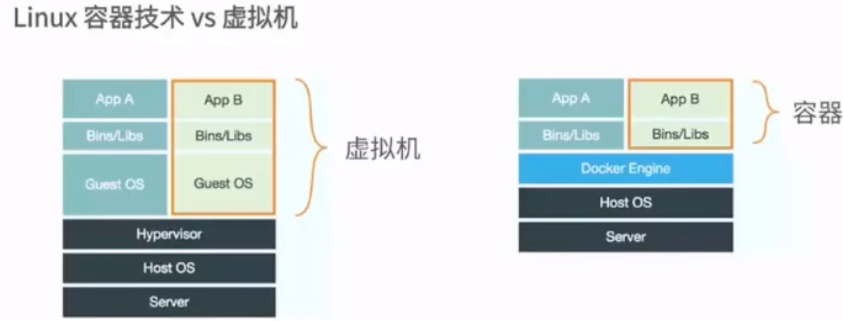
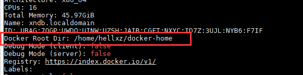

----------------------------------------------
> *Made By Herolh*
----------------------------------------------

# Docker 从小白到入门 {#index}

[TOC]


> [docker 入门 ](https://blog.csdn.net/xiaozecheng/article/details/106145593)

--------------------------------------------

## Docker 介绍


### 什么是容器


### 容器的前世

> &emsp;&emsp;容器技术最早出现在 FreeBSD 上叫 jali(监狱)，将一个进程放入 jali 中运行，不管这个进程在其中发生怎样的错误都不会影响到系统上其他进程的运行
>
> &emsp;&emsp;
>
> FreeBASE jail    ---->    Linux Vserver


### 主机虚拟化与容器的区别



**虚拟机技术缺点**：

资源占用十分多、冗余步骤多、启动很慢！

**容器化技术**

容器化技术不是模拟一个完整的操作系统


#### 比较Docker和虚拟机技术的不同：

- 传统虚拟机，虚拟出一条硬件，运行一个完整的操作系统，然后在这个系统上安装和运行软件
- 容器内的应用直接运行在宿主机的内容，容器是没有自己的内核的，也没有虚拟我们的硬件，所以就轻便了
- 每个容器间是互相隔离，每个容器内都有一个属于自己的文件系统，互不影响


#### 为什么Docker比Vm快

- docker有着比虚拟机更少的抽象层。由于docker不需要Hypervisor实现**硬件资源虚拟化**,运行在docker容器上的程序直接使用的都是实际物理机的硬件资源。因此在CPU、内存利用率上docker将会在效率上有明显优势。
- docker利用的是宿主机的内核,而不需要 Guest OS。

因此,当新建一个 容器时,docker 不需要和虚拟机一样重新加载一个操作系统内核。仍而避免引导、加载操作系统内核返个比较费时费资源的过程,当新建一个虚拟机时,虚拟机软件需要加载GuestOS,返个新建过程是**分钟级别**的。而docker由于直接利用宿主机的操作系统,则省略了这个复杂的过程,因此新建一个docker容器只需要**几秒钟**。


###　容器的今生

Namespaces  命名空间

- PID( Process ID ) 进程隔离
- NET( Networtk ) 管理网络接口
- IPC( interProcess Communication ) 管理跨进程通信的访问
- MNT( Mount ) 管理挂载点
- UTS( Unix Timesharing System ) 隔离内核和版本标识


### Docker 的基本组成


#### 镜像（image)
&emsp;&emsp;docker 镜像就好比是一个目标，可以通过这个目标来创建容器服务，`tomcat镜像 ==> run ==>容器（提供服务器）`，通过这个镜像可以创建多个容器（最终服务运行或者项目运行就是在容器中的）。

#### 容器(container)：
Docker利用容器技术，独立运行一个或者一组应用，通过镜像来创建的.
启动，停止，删除，基本命令
目前就可以把这个容器理解为就是一个简易的 Linux系统。

#### 仓库(repository)：
仓库就是存放镜像的地方！
仓库分为公有仓库和私有仓库。(很类似git)
Docker Hub是国外的。
阿里云…都有容器服务器(配置镜像加速!)


### hello world

```shell
$ docker run hello-world

# 本地找不到镜像
Unable to find image 'hello-world:latest' locally
latest: Pulling from library/hello-world
0e03bdcc26d7: Pulling fs layer						#分层下载： docker image 的核心 联合文件系统
latest: Pulling from library/hello-world
0e03bdcc26d7: Pull complete
Digest: sha256:1a523af650137b8accdaed439c17d684df61ee4d74feac151b5b337bd29e7eec		# 签名 防伪
Status: Downloaded newer image for hello-world:latest

Hello from Docker!
This message shows that your installation appears to be working correctly.

To generate this message, Docker took the following steps:
 1. The Docker client contacted the Docker daemon.
 2. The Docker daemon pulled the "hello-world" image from the Docker Hub.
    (amd64)
 3. The Docker daemon created a new container from that image which runs the
    executable that produces the output you are currently reading.
 4. The Docker daemon streamed that output to the Docker client, which sent it
    to your terminal.

To try something more ambitious, you can run an Ubuntu container with:
 $ docker run -it ubuntu bash

Share images, automate workflows, an
```

```shell
" 查看一下下载的镜像
$ docker images    

REPOSITORY            TAG                 IMAGE ID            CREATED             SIZE
hello-world           latest              bf756fb1ae65        4 months ago        13.3kB
```


#### docker run 流程图


### 简单的底层原理

Docker**是怎么工作的**？

>  Docke r是一个 Client-Server 结构的系统，Docker 的守护进程运行在主机上。通过Socket从客户端访问！Docker-Server 接收到Docker-Client 的指令，就会执行这个命令！


## Docker 安装

> 帮助文档：https://docs.docker.com/engine/install/

单独文章介绍


### 修改Docker数据目录位置，包含镜像位置

[修改Docker数据目录位置，包含镜像位置](https://www.cnblogs.com/hellxz/p/docker-change-data-root.html)


#### 为啥要改？

Docker 安装后默认下载的位置在 `/var/lib/docker` ，如果 `/var` 分区没有独立分出来，Linux下默认是与 `/` 根分区在一起。一般我们装 Linux 系统的时候，除了做邮件服务器外，都不会把 /var分区独立分出来，而且 `/` 分区一般不会太大，比如我现在用的这台根分区30G的，在拉镜像的时候提示硬盘空间不足的问题，而其它分区还有很大空间。基于此情此景，我们都要把这个目录改一下。


#### 查看当前Docker目录位置

```shell
#展示当前docker的配置信息
docker info
-------------------------------------------------------------------
#在信息找到Docker Root Dir，对应的就是了，默认为：
Docker Root Dir: /var/lib/docker
```


#### 修改 `/etc/docker/daemon.json`

```shell
{
  "registry-mirrors": ["http://hub-mirror.c.163.com"],
  "data-root": "/home/hellxz/docker-home"
}
```

保存退出，重启 docker 服务

```shell
sudo systemctl restart docker
```


#### 验证

查看 `docker info`




## Docker 的常用命令

|         命令         |                           说明                           |
| :------------------: | :------------------------------------------------------: |
|    docker version    |                  显示 docker 的版本信息                  |
|     docker info      |       显示 docker 的系统信息，包括镜像和容器的数量       |
|  docker 命令 --help  |                         帮助命令                         |
|    docker images     | 查看所有本地主机上的镜像 可以使用 `docker image ls` 代替 |
| docker search 镜像名 |                         搜索镜像                         |
|     docker pull      |                         下载镜像                         |
|      docker rmi      |                         删除镜像                         |
|                      |                                                          |
|                      |                                                          |


### 容器命令

```shell
docker run 镜像id 新建容器并启动
docker ps 列出所有运行的容器 docker container list
docker rm 容器id 删除指定容器

docker start 容器id #启动容器
docker restart 容器id #重启容器
docker stop 容器id #停止当前正在运行的容器
docker kill 容器id #强制停止当前容器
```


#### 新建容器并启动--

```shell
docker run [可选参数] image | docker container run [可选参数] image 

" 参数说明
--name="Name"		容器名字 tomcat01 tomcat02 用来区分容器
-d					后台方式运行
-it 				使用交互方式运行，进入容器查看内容
-p					指定容器的端口 -p 8080(宿主机):8080(容器)
		-p ip:主机端口:容器端口
		-p 主机端口:容器端口(常用)
		-p 容器端口
		容器端口
-P(大写) 				随机指定端口
```

