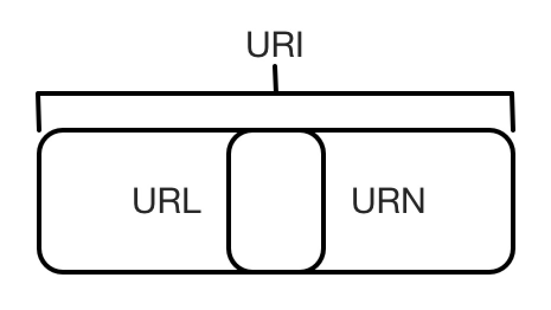
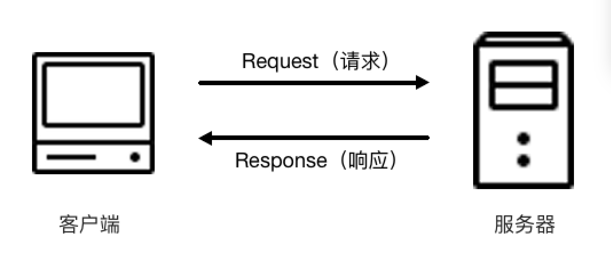
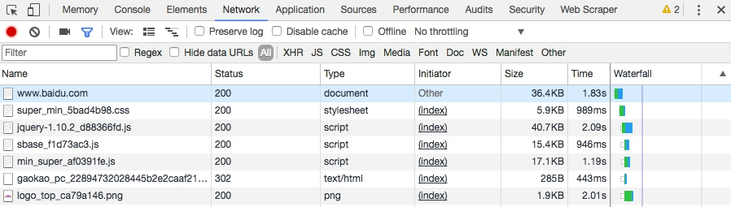
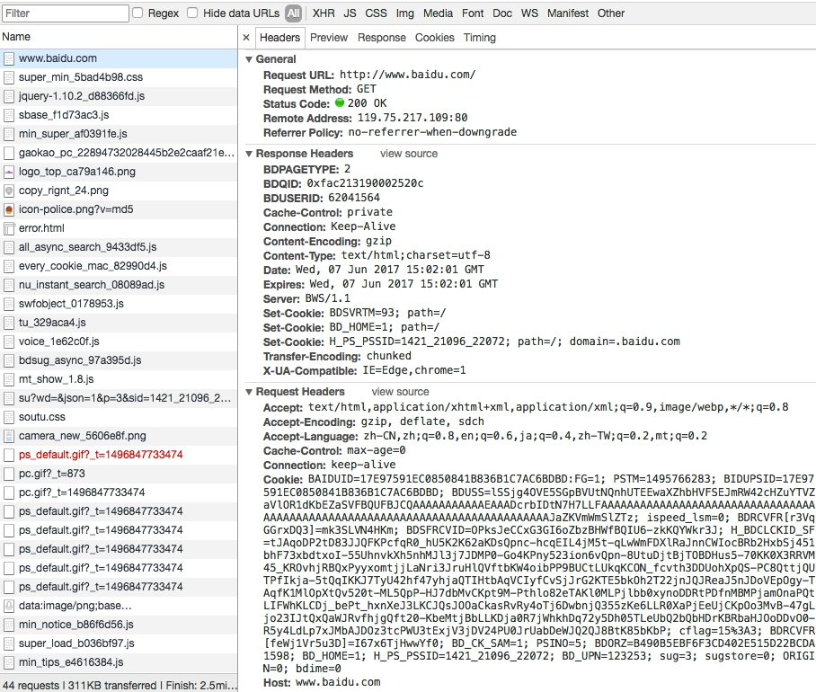
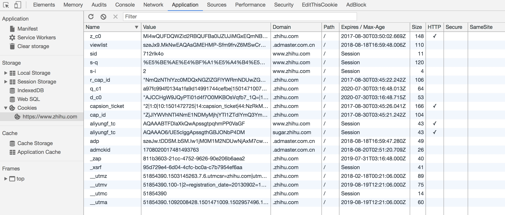

----------------------------------------------
> *Made By Herolh*
----------------------------------------------

# 目录 {#index}
[TOC]


--------------------------------------------
# 爬虫基础
> &emsp;&emsp;在写爬虫之前，我们还需要了解一些基础知识，如HTTP原理、网页的基础知识、爬虫的基本原理、Cookies的基本原理等。本章中，我们就对这些基础知识做一个简单的总结。


## HTTP 基本原理
### URI和URL
> **URI** 的全称为Uniform Resource Identifier，即统一资源标志符。
> **URL **的全称为Universal Resource Locator，即统一资源定位符。

&emsp;&emsp;举例来说，<https://github.com/favicon.ico>是 GitHub 的网站图标链接，它是一个URL，也是一个URI。即有这样的一个图标资源，我们用URL/URI来唯一指定了它的访问方式，这其中包括了访问协议https、访问路径（/即根目录）和资源名称favicon.ico。通过这样一个链接，我们便可以从互联网上找到这个资源，这就是 URL/URI。

&emsp;&emsp;URL 是 URI 的子集，也就是说每个 URL 都是 URI，但不是每个 URI 都是 URL。那么，怎样的 URI 不是 URL呢？URI还包括一个子类叫作 URN，它的全称为 Universal Resource Name，即统一资源名称。URN 只命名资源而不指定如何定位资源，比如 urn:isbn:0451450523 指定了一本书的ISBN，可以唯一标识这本书，但是没有指定到哪里定位这本书，这就是URN。URL、URN和URI的关系可以用下图表示。



&emsp;&emsp;但是在目前的互联网中，URN用得非常少，所以几乎所有的URI都是URL，一般的网页链接我们既可以称为URL，也可以称为URI，我个人习惯称为URL。


### 超文本
&emsp;&emsp;超文本，其英文名称叫作 hypertext，我们在浏览器里看到的网页就是超文本解析而成的，其网页源代码是一系列 HTML 代码，里面包含了一系列标签，比如 `img` 显示图片，`p` 指定显示段落等。浏览器解析这些标签后，便形成了我们平常看到的网页，而网页的源代码 HTML 就可以称作超文本。


### HTTP和HTTPS
&emsp;&emsp;在淘宝的首页 <https://www.taobao.com/> 中，URL 的开头会有 http 或 https，这就是访问资源需要的协议类型。有时，我们还会看到 ftp、sftp、smb 开头的 URL，它们都是协议类型。在爬虫中，我们抓取的页面通常就是 http 或 https 协议的，这里首先了解一下这两个协议的含义。

&emsp;&emsp;HTTP 的全称是 Hyper Text Transfer Protocol，中文名叫作超文本传输协议。HTTP 协议是用于从网络传输超文本数据到本地浏览器的传送协议，它能保证高效而准确地传送超文本文档。HTTP 由万维网协会（World Wide Web Consortium）和 Internet 工作小组IETF（Internet Engineering Task Force）共同合作制定的规范，目前广泛使用的是 HTTP 1.1 版本。

&emsp;&emsp;HTTPS的全称是Hyper Text Transfer Protocol over Secure Socket Layer，是以安全为目标的HTTP通道，简单讲是HTTP的安全版，即HTTP下加入SSL层，简称为HTTPS。HTTPS的安全基础是SSL，因此通过它传输的内容都是经过SSL加密的，它的主要作用可以分为两种:
- 建立一个信息安全通道来保证数据传输的安全。
- 确认网站的真实性，凡是使用了HTTPS的网站，都可以通过点击浏览器地址栏的锁头标志来查看网站认证之后的真实信息，也可以通过CA机构颁发的安全签章来查询。

&emsp;&emsp;而某些网站虽然使用了 HTTPS 协议，但还是会被浏览器提示不安全，例如我们在 Chrome 浏览器里面打开12306，链接为：<https://www.12306.cn/>，这时浏览器就会提示“您的连接不是私密连接”这样的话，如下图所示。


&emsp;&emsp;这是因为 12306 的 CA 证书是中国铁道部自行签发的，而这个证书是不被 CA 机构信任的，所以这里证书验证就不会通过而提示这样的话，但是实际上它的数据传输依然是经过SSL加密的。**如果要爬取这样的站点，就需要设置忽略证书的选项，否则会提示SSL链接错误。**


### HTTP请求过程
&emsp;&emsp;我们在浏览器中输入一个 URL，回车之后便会在浏览器中观察到页面内容。实际上，这个过程是浏览器向网站所在的服务器发送了一个请求，网站服务器接收到这个请求后进行处理和解析，然后返回对应的响应，接着传回给浏览器。响应里包含了页面的源代码等内容，浏览器再对其进行解析，便将网页呈现了出来，模型如图2-4所示。



&emsp;&emsp;为了更直观地地说明这个过程，这里用 Chrome 浏览器的开发者模式下的 Network 监听组件来做下演示，它可以显示访问当前请求网页时发生的所有网络请求和响应。打开 Chrome 浏览器，右击并选择“检查”项，即可打开浏览器的开发者工具。这里访问百度 <http://www.baidu.com/>，输入该 URL 后回车，观察这个过程中发生了怎样的网络请求。可以看到，在 Network 页面下方出现了一个个的条目，其中一个条目就代表一次发送请求和接收响应的过程。



其中各列的含义如下:
- **第一列Name**：请求的名称，一般会将URL的最后一部分内容当作名称。
- **第二列Status**：响应的状态码，这里显示为200，代表响应是正常的。通过状态码，我们可以判断发送了请求之后是否得到了正常的响应。
- **第三列Type**：请求的文档类型。这里为document，代表我们这次请求的是一个HTML文档，内容就是一些HTML代码。
- **第四列Initiator**：请求源。用来标记请求是由哪个对象或进程发起的。
- **第五列Size**：从服务器下载的文件和请求的资源大小。如果是从缓存中取得的资源，则该列会显示from cache。
- **第六列Time**：发起请求到获取响应所用的总时间。
- **第七列Waterfall**：网络请求的可视化瀑布流。


### 请求

&emsp;&emsp; 请求，由客户端向服务端发出，可以分为4部分内容：请求方法（Request Method）、请求的网址（Request URL）、请求头（Request Headers）、请求体（Request Body）。


#### (1)请求方法
&emsp; &emsp; 常见的请求方法有两种：GET和POST。GET和POST请求方法有如下区别:
- GET请求中的参数包含在URL里面，数据可以在URL中看到，而POST请求的URL不会包含这些数据，数据都是通过表单形式传输的，会包含在请求体中。
- GET请求提交的数据最多只有1024字节，而POST方式没有限制。

&emsp; &emsp; 一般来说，登录时，需要提交用户名和密码，其中包含了敏感信息，使用 GET 方式请求的话，密码就会暴露在 URL 里面，造成密码泄露，所以这里最好以 POST 方式发送。上传文件时，由于文件内容比较大，也会选用POST 方式。
&emsp; &emsp;我们平常遇到的绝大部分请求都是GET或POST请求，另外还有一些请求方法，如GET、HEAD、POST、PUT、DELETE、OPTIONS、CONNECT、TRACE等:

|  方法   |                             描述                             |
| :-----: | :----------------------------------------------------------: |
|   GET   |                   请求页面，并返回页面内容                   |
|  HEAD   | 类似于GET请求，只不过返回的响应中没有具体的内容，用于获取报头 |
|  POST   |        大多用于提交表单或上传文件，数据包含在请求体中        |
|   PUT   |        从客户端向服务器传送的数据取代指定文档中的内容        |
| DELETE  |                   请求服务器删除指定的页面                   |
| CONNECT |       把服务器当作跳板，让服务器代替客户端访问其他网页       |
| OPTIONS |                  允许客户端查看服务器的性能                  |
|  TRACE  |           回显服务器收到的请求，主要用于测试或诊断           |


#### (2) 请求的网址
&emsp; &emsp;请求的网址，即统一资源定位符URL，它可以唯一确定我们想请求的资源。


#### (3) 请求头
&emsp; &emsp;请求头，用来说明服务器要使用的附加信息，比较重要的信息有 Cookie、Referer、User-Agent 等。下面简要说明一些常用的头信息。

- **Accept**：请求报头域，用于指定客户端可接受哪些类型的信息。
- **Accept-Language**：指定客户端可接受的语言类型。
- **Accept-Encoding**：指定客户端可接受的内容编码。
- **Host**：用于指定请求资源的主机IP和端口号，其内容为请求URL的原始服务器或网关的位置。从HTTP 1.1版本开始，请求必须包含此内容。
- **Cookie**：也常用复数形式 Cookies，这是网站为了辨别用户进行会话跟踪而存储在用户本地的数据。它的主要功能是维持当前访问会话。例如，我们输入用户名和密码成功登录某个网站后，服务器会用会话保存登录状态信息，后面我们每次刷新或请求该站点的其他页面时，会发现都是登录状态，这就是Cookies的功劳。Cookies里有信息标识了我们所对应的服务器的会话，每次浏览器在请求该站点的页面时，都会在请求头中加上Cookies并将其发送给服务器，服务器通过Cookies识别出是我们自己，并且查出当前状态是登录状态，所以返回结果就是登录之后才能看到的网页内容。
- **Referer**：此内容用来标识这个请求是从哪个页面发过来的，服务器可以拿到这一信息并做相应的处理，如作来源统计、防盗链处理等。
- **User-Agent**：简称UA，它是一个特殊的字符串头，可以使服务器识别客户使用的操作系统及版本、浏览器及版本等信息。在做爬虫时加上此信息，可以伪装为浏览器；如果不加，很可能会被识别出为爬虫。
- **Content-Type**：也叫互联网媒体类型（Internet Media Type）或者MIME类型，在HTTP协议消息头中，它用来表示具体请求中的媒体类型信息。例如，text/html代表HTML格式，image/gif代表GIF图片，application/json代表JSON类型，更多对应关系可以查看此对照表：<http://tool.oschina.net/commons>。

&emsp; &emsp;因此，请求头是请求的重要组成部分，在写爬虫时，大部分情况下都需要设定请求头。


#### (4) 请求体
&emsp; &emsp;请求体一般承载的内容是POST请求中的表单数据，而对于GET请求，请求体则为空。


&emsp; &emsp;登录之前，我们填写了用户名和密码信息，提交时这些内容就会以表单数据的形式提交给服务器，此时需要注意 Request Headers 中指定 Content-Type 为 application/x-www-form-urlencoded。只有设置 Content-Type 为 application/x-www-form-urlencoded，才会以表单数据的形式提交。另外，我们也可以将 Content-Type 设置为 application/json 来提交JSON数据，或者设置为 multipart/form-data 来上传文件。

|           Content-Type            | 提交数据的方式 |
| :-------------------------------: | :------------: |
| application/x-www-form-urlencoded |    表单数据    |
|        multipart/form-data        |  表单文件上传  |
|         application/json          | 序列化JSON数据 |
|             text/xml              |    XML数据     |

&emsp;&emsp;在爬虫中，如果要构造 POST 请求，需要使用正确的 Content-Type，并了解各种请求库的各个参数设置时使用的是哪种 Content-Type，不然可能会导致POST提交后无法正常响应。


### 响应
&emsp;&emsp;响应，由服务端返回给客户端，可以分为三部分：**响应状态码**（Response Status Code）、**响应头**（Response Headers）和**响应体**（Response Body）。


#### (1) 响应状态码
&emsp;&emsp;响应状态码表示服务器的响应状态，如 200 代表服务器正常响应，404 代表页面未找到，500 代表服务器内部发生错误。在爬虫中，我们可以根据状态码来判断服务器响应状态，如状态码为200，则证明成功返回数据，再进行进一步的处理，否则直接忽略。

| 状态码 |      说明      |                             详情                             |
| :----: | :------------: | :----------------------------------------------------------: |
|  100   |      继续      | 请求者应当继续提出请求。服务器已收到请求的一部分，正在等待其余部分 |
|  101   |    切换协议    |      请求者已要求服务器切换协议，服务器已确认并准备切换      |
|  200   |      成功      |                    服务器已成功处理了请求                    |
|  201   |     已创建     |               请求成功并且服务器创建了新的资源               |
|  202   |     已接受     |                 服务器已接受请求，但尚未处理                 |
|  203   |   非授权信息   |     服务器已成功处理了请求，但返回的信息可能来自另一个源     |
|  204   |     无内容     |           服务器成功处理了请求，但没有返回任何内容           |
|  205   |    重置内容    |               服务器成功处理了请求，内容被重置               |
|  206   |    部分内容    |                   服务器成功处理了部分请求                   |
|  300   |    多种选择    |                针对请求，服务器可执行多种操作                |
|  301   |    永久移动    |          请求的网页已永久移动到新位置，即永久重定向          |
|  302   |    临时移动    |          请求的网页暂时跳转到其他页面，即暂时重定向          |
|  303   |  查看其他位置  |     如果原来的请求是POST，重定向目标文档应该通过GET提取      |
|  304   |     未修改     |         此次请求返回的网页未修改，继续使用上次的资源         |
|  305   |    使用代理    |                 请求者应该使用代理访问该网页                 |
|  307   |   临时重定向   |                 请求的资源临时从其他位置响应                 |
|  400   |    错误请求    |                     服务器无法解析该请求                     |
|  401   |     未授权     |               请求没有进行身份验证或验证未通过               |
|  403   |    禁止访问    |                       服务器拒绝此请求                       |
|  404   |     未找到     |                    服务器找不到请求的网页                    |
|  405   |    方法禁用    |                 服务器禁用了请求中指定的方法                 |
|  406   |     不接受     |               无法使用请求的内容响应请求的网页               |
|  407   |  需要代理授权  |                    请求者需要使用代理授权                    |
|  408   |    请求超时    |                        服务器请求超时                        |
|  409   |      冲突      |                  服务器在完成请求时发生冲突                  |
|  410   |     已删除     |                     请求的资源已永久删除                     |
|  411   |  需要有效长度  |          服务器不接受不含有效内容长度标头字段的请求          |
|  412   | 未满足前提条件 |       服务器未满足请求者在请求中设置的其中一个前提条件       |
|  413   |  请求实体过大  |              请求实体过大，超出服务器的处理能力              |
|  414   |  请求URI过长   |                 请求网址过长，服务器无法处理                 |
|  415   |   不支持类型   |                   请求格式不被请求页面支持                   |
|  416   |  请求范围不符  |                    页面无法提供请求的范围                    |
|  417   |  未满足期望值  |              服务器未满足期望请求标头字段的要求              |
|  500   | 服务器内部错误 |                 服务器遇到错误，无法完成请求                 |
|  501   |     未实现     |                  服务器不具备完成请求的功能                  |
|  502   |    错误网关    |        服务器作为网关或代理，从上游服务器收到无效响应        |
|  503   |   服务不可用   |                      服务器目前无法使用                      |
|  504   |    网关超时    |    服务器作为网关或代理，但是没有及时从上游服务器收到请求    |
|  505   | HTTP版本不支持 |             服务器不支持请求中所用的HTTP协议版本             |


#### (2) 响应头
> 响应头包含了服务器对请求的应答信息，如 Content-Type、Server、Set-Cookie 等。下面简要说明一些常用的头信息。

- **Date**：标识响应产生的时间。
- **Last-Modified**：指定资源的最后修改时间。
- **Content-Encoding**：指定响应内容的编码。
- **Server**：包含服务器的信息，比如名称、版本号等。
- **Content-Type**：文档类型，指定返回的数据类型是什么，如text/html代表返回HTML文档，application/x-javascript则代表返回JavaScript文件，image/jpeg则代表返回图片。
- **Set-Cookie**：设置Cookies。响应头中的Set-Cookie告诉浏览器需要将此内容放在Cookies中，下次请求携带Cookies请求。
- **Expires**：指定响应的过期时间，可以使代理服务器或浏览器将加载的内容更新到缓存中。如果再次访问时，就可以直接从缓存中加载，降低服务器负载，缩短加载时间。


#### (3) 响应体
> 响应的正文数据都在响应体中，比如请求网页时，它的响应体就是网页的HTML代码；请求一张图片时，它的响应体就是图片的二进制数据。我们做爬虫请求网页后，要解析的内容就是响应体

&emsp;&emsp;在浏览器开发者工具中点击 Preview，就可以看到网页的源代码，也就是响应体的内容，它是解析的目标。
在做爬虫时，我们主要通过响应体得到网页的源代码、JSON 数据等，然后从中做相应内容的提取。


## 爬虫的基本原理
### 1. 爬虫概述
> 简单来说，爬虫就是获取网页并提取和保存信息的自动化程序

#### (1) 获取网页
&emsp;&emsp;爬虫首先要做的工作就是获取网页，这里就是获取网页的源代码。源代码里包含了网页的部分有用信息，所以只要把源代码获取下来，就可以从中提取想要的信息了。

&emsp;&emsp;前面讲了请求和响应的概念，向网站的服务器发送一个请求，返回的响应体便是网页源代码。所以，最关键的部分就是构造一个请求并发送给服务器，然后接收到响应并将其解析出来。Python 提供了许多库来帮助我们实现这个操作，如 urllib、requests 等。我们可以用这些库来帮助我们实现 HTTP 请求操作，请求和响应都可以用类库提供的数据结构来表示，得到响应之后只需要解析数据结构中的 Body 部分即可，即得到网页的源代码，这样我们可以用程序来实现获取网页的过程了。


#### (2) 提取信息
&emsp;&emsp;获取网页源代码后，接下来就是分析网页源代码，从中提取我们想要的数据。首先，最通用的方法便是采用正则表达式提取，这是一个万能的方法，但是在构造正则表达式时比较复杂且容易出错。]
&emsp;&emsp;另外，由于网页的结构有一定的规则，所以还有一些根据网页节点属性、CSS选择器或XPath来提取网页信息的库，如Beautiful Soup、pyquery、lxml等。使用这些库，我们可以高效快速地从中提取网页信息，如节点的属性、文本值等。
&emsp;&emsp;提取信息是爬虫非常重要的部分，它可以使杂乱的数据变得条理清晰，以便我们后续处理和分析数据。


#### (3) 保存数据
&emsp;&emsp;提取信息后，我们一般会将提取到的数据保存到某处以便后续使用。这里保存形式有多种多样，如可以简单保存为 TXT 文本或 JSON 文本，也可以保存到数据库，如 MySQL 和 MongoDB 等，也可保存至远程服务器，如借助 SFTP 进行操作等。


#### (4) 自动化程序
&emsp;&emsp;说到自动化程序，意思是说爬虫可以代替人来完成这些操作。首先，我们手工当然可以提取这些信息，但是当量特别大或者想快速获取大量数据的话，肯定还是要借助程序。爬虫就是代替我们来完成这份爬取工作的自动化程序，它可以在抓取过程中进行各种异常处理、错误重试等操作，确保爬取持续高效地运行。


### 2. 能抓怎样的数据
&emsp;&emsp;在网页中我们能看到各种各样的信息，最常见的便是常规网页，它们对应着HTML代码，而最常抓取的便是HTML源代码。
&emsp;&emsp;另外，可能有些网页返回的不是HTML代码，而是一个JSON字符串（其中API接口大多采用这样的形式），这种格式的数据方便传输和解析，它们同样可以抓取，而且数据提取更加方便。
&emsp;&emsp;此外，我们还可以看到各种二进制数据，如图片、视频和音频等。利用爬虫，我们可以将这些二进制数据抓取下来，然后保存成对应的文件名。
&emsp;&emsp;另外，还可以看到各种扩展名的文件，如CSS、JavaScript和配置文件等，这些其实也是最普通的文件，只要在浏览器里面可以访问到，就可以将其抓取下来。
&emsp;&emsp;上述内容其实都对应各自的URL，是基于HTTP或HTTPS协议的，只要是这种数据，爬虫都可以抓取。


### 3. JavaScript渲染页面
&emsp;&emsp;有时候，我们在用urllib或requests抓取网页时，得到的源代码实际和浏览器中看到的不一样。这是一个非常常见的问题。现在网页越来越多地采用Ajax、前端模块化工具来构建，整个网页可能都是由JavaScript渲染出来的，也就是说原始的HTML代码就是一个空壳，例如：

```html
<!DOCTYPE html>
<html>
    <head>
        <meta charset="UTF-8">
        <title>This is a Demo</title>
    </head>
    <body>
        <div id="container">
        </div>
    </body>
    <script src="app.js"></script>
</html>
```

&emsp;&emsp;`body`节点里面只有一个`id`为`container`的节点，但是需要注意在`body`节点后引入了a pp.js，它便负责整个网站的渲染。
&emsp;&emsp;在浏览器中打开这个页面时，首先会加载这个HTML内容，接着浏览器会发现其中引入了一个 app.js 文件，然后便会接着去请求这个文件，获取到该文件后，便会执行其中的 JavaScript 代码，而 JavaScript 则会改变HTML中的节点，向其添加内容，最后得到完整的页面。
&emsp;&emsp;但是在用 urllib 或 requests 等库请求当前页面时，我们得到的只是这个 HTML 代码，它不会帮助我们去继续加载这个 JavaScript 文件，这样也就看不到浏览器中的内容了。

&emsp;&emsp;这也解释了为什么有时我们得到的源代码和浏览器中看到的不一样。因此，使用基本HTTP请求库得到的源代码可能跟浏览器中的页面源代码不太一样。对于这样的情况，我们可以分析其后台Ajax接口，也可使用 Selenium 、 Splash这样的库来实现模拟 JavaScrip t渲染。后面，我们会详细介绍如何采集JavaScript渲染的网页。


## 会话和 Cookies

&emsp;&emsp;在浏览网站的过程中，我们经常会遇到需要登录的情况，有些页面只有登录之后才可以访问，而且登录之后可以连续访问很多次网站，但是有时候过一段时间就需要重新登录。还有一些网站，在打开浏览器时就自动登录了，而且很长时间都不会失效，这种情况又是为什么？其实这里面涉及会话和 Cookies 的相关知识。


### 1. 静态网页和动态网页

&emsp;&emsp;在开始之前，我们需要先了解一下静态网页和动态网页的概念。

```html
<!DOCTYPE html>
<html>
    <head>
        <meta charset="UTF-8">
        <title>This is a Demo</title>
    </head>
    <body>
        <div id="container">
            <div class="wrapper">
                <h2 class="title">Hello World</h2>
                <p class="text">Hello, this is a paragraph.</p>
            </div>
        </div>
    </body>
</html>
```

&emsp;&emsp;这是最基本的 HTML 代码，我们将其保存为一个 .html 文件，然后把它放在某台具有固定公网IP的主机上，主机上装上 Apache 或 Nginx 等服务器，这样这台主机就可以作为服务器了，其他人便可以通过访问服务器看到这个页面，这就搭建了一个最简单的网站。
&emsp;&emsp;这种网页的内容是HTML代码编写的，文字、图片等内容均通过写好的HTML代码来指定，这种页面叫作静态网页。它加载速度快，编写简单，但是存在很大的缺陷，如可维护性差，不能根据URL灵活多变地显示内容等。例如，我们想要给这个网页的URL传入一个`name`参数，让其在网页中显示出来，是无法做到的。

&emsp;&emsp;因此，动态网页应运而生，它可以动态解析 URL  中参数的变化，关联数据库并动态呈现不同的页面内容，非常灵活多变。我们现在遇到的大多数网站都是动态网站，它们不再是一个简单的 HTML，而是可能由 JSP、PHP、Python等语言编写的，其功能比静态网页强大和丰富太多了。
&emsp;&emsp;此外，动态网站还可以实现用户登录和注册的功能。再回到开头提到的问题，很多页面是需要登录之后才可以查看的。按照一般的逻辑来说，输入用户名和密码登录之后，肯定是拿到了一种类似凭证的东西，有了它，我们才能保持登录状态，才能访问登录之后才能看到的页面, 其实它就是会话和Cookies共同产生的结果。


### 2. 无状态HTTP
&emsp;&emsp;在了解会话和 Cookies 之前，我们还需要了解 HTTP 的一个特点，叫作**无状态**。

&emsp;&emsp;**HTTP 的无状态是指 HTTP 协议对事务处理是没有记忆能力的，也就是说服务器不知道客户端是什么状态。**当我们向服务器发送请求后，服务器解析此请求，然后返回对应的响应，服务器负责完成这个过程，而且这个过程是完全独立的，服务器不会记录前后状态的变化，也就是缺少状态记录。这意味着如果后续需要处理前面的信息，则必须重传，这导致需要额外传递一些前面的重复请求，才能获取后续响应，然而这种效果显然不是我们想要的。为了保持前后状态，我们肯定不能将前面的请求全部重传一次，这太浪费资源了，对于这种需要用户登录的页面来说，更是棘手。
&emsp;&emsp;这时两个用于保持 HTTP 连接状态的技术就出现了，它们分别是会话和 Cookies。会话在服务端，也就是网站的服务器，用来保存用户的会话信息；Cookies 在客户端，也可以理解为浏览器端，有了Cookies，浏览器在下次访问网页时会自动附带上它发送给服务器，服务器通过识别 Cookies 并鉴定出是哪个用户，然后再判断用户是否是登录状态，然后返回对应的响应。
&emsp;&emsp;我们可以理解为 Cookies 里面保存了登录的凭证，有了它，只需要在下次请求携带 Cookies 发送请求而不必重新输入用户名、密码等信息重新登录了。

&emsp;&emsp;因此在爬虫中，有时候处理需要登录才能访问的页面时，我们一般会直接将登录成功后获取的 Cookies 放在请求头里面直接请求，而不必重新模拟登录。


#### (1) 会话 Session
&emsp;&emsp;会话，其本来的含义是指有始有终的一系列动作/消息。比如，打电话时，从拿起电话拨号到挂断电话这中间的一系列过程可以称为一个会话。
&emsp;&emsp;而在 Web 中，会话对象用来存储特定用户会话所需的属性及配置信息。这样，当用户在应用程序的Web页之间跳转时，存储在会话对象中的变量将不会丢失，而是在整个用户会话中一直存在下去。当用户请求来自应用程序的 Web 页时，如果该用户还没有会话，则 Web 服务器将自动创建一个会话对象。当会话过期或被放弃后，服务器将终止该会话。


#### (2) Cookies
&emsp;&emsp;Cookies指某些网站为了辨别用户身份、进行会话跟踪而存储在用户本地终端上的数据。

##### 会话维持
&emsp;&emsp;那么，我们怎样利用 Cookies 保持状态呢？当客户端第一次请求服务器时，服务器会返回一个请求头中带有 `Set-Cookie` 字段的响应给客户端，用来标记是哪一个用户，客户端浏览器会把 Cookies 保存起来。当浏览器下一次再请求该网站时，浏览器会把此 Cookies 放到请求头一起提交给服务器，Cookies 携带了会话 ID 信息，服务器检查该Cookies即可找到对应的会话是什么，然后再判断会话来以此来辨认用户状态。
&emsp;&emsp;在成功登录某个网站时，服务器会告诉客户端设置哪些 Cookies 信息，在后续访问页面时客户端会把Cookies发送给服务器，服务器再找到对应的会话加以判断。如果会话中的某些设置登录状态的变量是有效的，那就证明用户处于登录状态，此时返回登录之后才可以查看的网页内容，浏览器再进行解析便可以看到了。
&emsp;&emsp;反之，如果传给服务器的Cookies是无效的，或者会话已经过期了，我们将不能继续访问页面，此时可能会收到错误的响应或者跳转到登录页面重新登录。
&emsp;&emsp;所以，Cookies和会话需要配合，一个处于客户端，一个处于服务端，二者共同协作，就实现了登录会话控制。


##### 属性结构

&emsp;&emsp;接下来，我们来看看 Cookies 都有哪些内容。这里以知乎为例，在浏览器开发者工具中打开 Application 选项卡，然后在左侧会有一个 Storage 部分，最后一项即为 Cookies，将其点开，如下图所示，这些就是Cookies。



可以看到，这里有很多条目，其中每个条目可以称为 Cookie。它有如下几个属性。

- **Name**：该 Cookie 的名称。一旦创建，该名称便不可更改。
- **Value**：该 Cookie 的值。如果值为 Unicode 字符，需要为字符编码。如果值为二进制数据，则需要使用BASE64 编码。
- **Domain**：可以访问该 Cookie 的域名。例如，如果设置为 `.zhihu.com`，则所有以 zhihu.com，结尾的域名都可以访问该 Cookie。
- **Max Age**：该 Cookie 失效的时间，单位为秒，也常和 Expires 一起使用，通过它可以计算出其有效时间。Max Age 如果为正数，则该 Cookie 在 Max Age 秒之后失效。如果为负数，则关闭浏览器时 Cookie 即失效，浏览器也不会以任何形式保存该 Cookie。
- **Path**：该 Cookie 的使用路径。如果设置为 `/path/`，则只有路径为 /path/ 的页面可以访问该 Cookie。如果设置为`/`，则本域名下的所有页面都可以访问该 Cookie。
- **Size字段**：此 Cookie 的大小。
- **HTTP字段**：Cookie的 `httponly` 属性。若此属性为 `true`，则只有在 HTTP 头中会带有此 Cookie 的信息，而不能通过 `document.cookie` 来访问此 Cookie。
- **Secure**：该 Cookie 是否仅被使用安全协议传输。安全协议有 HTTPS 和 SSL 等，在网络上传输数据之前先将数据加密。默认为 `false`。


##### 会话 Cookie 和持久 Cookie
&emsp;&emsp;从表面意思来说，会话 Cookie 就是把 Cookie 放在浏览器内存里，浏览器在关闭之后该 Cookie 即失效；持久 Cookie 则会保存到客户端的硬盘中，下次还可以继续使用，用于长久保持用户登录状态。
&emsp;&emsp;其实严格来说，没有会话 Cookie 和持久 Cookie 之分，只是由 Cookie 的 Max Age 或 Expires 字段决定了过期的时间。
&emsp;&emsp;因此，一些持久化登录的网站其实就是把 Cookie 的有效时间和会话有效期设置得比较长，下次我们再访问页面时仍然携带之前的 Cookie，就可以直接保持登录状态。


## 代理的基本原理
&emsp;&emsp;我们在做爬虫的过程中经常会遇到这样的情况，最初爬虫正常运行，正常抓取数据，一切看起来都是那么美好，然而一杯茶的功夫可能就会出现错误，比如403 Forbidden，这时候打开网页一看，可能会看到“您的IP访问频率太高”这样的提示。出现这种现象的原因是网站采取了一些反爬虫措施。比如，服务器会检测某个IP在单位时间内的请求次数，如果超过了这个阈值，就会直接拒绝服务，返回一些错误信息，这种情况可以称为封 IP。
&emsp;&emsp;既然服务器检测的是某个 IP 单位时间的请求次数，那么借助某种方式来伪装我们的 IP，让服务器识别不出是由我们本机发起的请求，不就可以成功防止封IP了吗？
&emsp;&emsp;一种有效的方式就是使用代理，后面会详细说明代理的用法。在这之前，需要先了解下代理的基本原理，它是怎样实现IP伪装的呢？


### 1. 基本原理
&emsp;&emsp;代理实际上指的就是代理服务器，英文叫作 proxy server，它的功能是代理网络用户去取得网络信息。形象地说，它是网络信息的中转站。在我们正常请求一个网站时，是发送了请求给 Web 服务器，Web 服务器把响应传回给我们。如果设置了代理服务器，实际上就是在本机和服务器之间搭建了一个桥，此时本机不是直接向 Web服务器发起请求，而是向代理服务器发出请求，请求会发送给代理服务器，然后由代理服务器再发送给 Web 服务器，接着由代理服务器再把 Web 服务器返回的响应转发给本机。这样我们同样可以正常访问网页，但这个过程中Web服务器识别出的真实 IP 就不再是我们本机的 IP 了，就成功实现了 IP 伪装，这就是代理的基本原理。


### 2.代理的作用
- 突破自身IP访问限制，访问一些平时不能访问的站点。
- 访问一些单位或团体内部资源：比如使用教育网内地址段免费代理服务器，就可以用于对教育网开放的各类FTP下载上传，以及各类资料查询共享等服务。
- 提高访问速度：通常代理服务器都设置一个较大的硬盘缓冲区，当有外界的信息通过时，同时也将其保存到缓冲区中，当其他用户再访问相同的信息时，则直接由缓冲区中取出信息，传给用户，以提高访问速度。
- 隐藏真实IP：上网者也可以通过这种方法隐藏自己的IP，免受攻击。对于爬虫来说，我们用代理就是为了隐藏自身IP，防止自身的IP被封锁。


### 3. 爬虫代理
&emsp;&emsp;对于爬虫来说，由于爬虫爬取速度过快，在爬取过程中可能遇到同一个 IP 访问过于频繁的问题，此时网站就会让我们输入验证码登录或者直接封锁 IP，这样会给爬取带来极大的不便。
&emsp;&emsp;使用代理隐藏真实的 IP，让服务器误以为是代理服务器在请求自己。这样在爬取过程中通过不断更换代理，就不会被封锁，可以达到很好的爬取效果。


### 4. 代理分类

代理分类时，既可以根据协议区分，也可以根据其匿名程度区分。

#### (1) 根据协议区分

根据代理的协议，代理可以分为如下类别。

- **FTP 代理服务器**：主要用于访问 FTP 服务器，一般有上传、下载以及缓存功能，端口一般为21、2121等。

- **HTTP 代理服务器**：主要用于访问网页，一般有内容过滤和缓存功能，端口一般为80、8080、3128等。

- **SSL/TLS 代理**：主要用于访问加密网站，一般有 SSL 或 TLS 加密功能（最高支持 128 位加密强度），端口一般为 443。

- **RTSP 代理**：主要用于访问 Real 流媒体服务器，一般有缓存功能，端口一般为 554。

- **Telnet 代理**：主要用于 telnet 远程控制（黑客入侵计算机时常用于隐藏身份），端口一般为 23。

- **POP3/SMTP 代理**：主要用于 POP3/SMTP 方式收发邮件，一般有缓存功能，端口一般为 110/25。

- **SOCKS 代理**：只是单纯传递数据包，不关心具体协议和用法，所以速度快很多，一般有缓存功能，端口一般为 1080。SOCKS 代理协议又分为 SOCKS4 和 SOCKS5，前者只支持 TCP，而后者支持 TCP 和 UDP，还支持各种身份验证机制、服务器端域名解析等。简单来说，SOCK4 能做到的 SOCKS5 都可以做到，但 SOCKS5 能做到的 SOCK4 不一定能做到。

    

#### (2) 根据匿名程度区分

根据代理的匿名程度，代理可以分为如下类别。

- **高度匿名代理**：会将数据包原封不动地转发，在服务端看来就好像真的是一个普通客户端在访问，而记录的 IP 是代理服务器的 IP。
- **普通匿名代理**：会在数据包上做一些改动，服务端上有可能发现这是个代理服务器，也有一定几率追查到客户端的真实IP。代理服务器通常会加入的 HTTP 头有 `HTTP_VIA` 和 `HTTP_X_FORWARDED_FOR`。
- **透明代理**：不但改动了数据包，还会告诉服务器客户端的真实 IP。这种代理除了能用缓存技术提高浏览速度，能用内容过滤提高安全性之外，并无其他显著作用，最常见的例子是内网中的硬件防火墙。
- **间谍代理**：指组织或个人创建的用于记录用户传输的数据，然后进行研究、监控等目的的代理服务器。


### 5. 常见代理设置

- 使用网上的免费代理：最好使用高匿代理，另外可用的代理不多，需要在使用前筛选一下可用代理，也可以进一步维护一个代理池。
- 使用付费代理服务：互联网上存在许多代理商，可以付费使用，质量比免费代理好很多。
- ADSL拨号：拨一次号换一次IP，稳定性高，也是一种比较有效的解决方案。

在后文我们会详细介绍这几种代理的使用方式。


# 基本库的使用

## urllib库

&emsp;&emsp;在 Python 2 中，有 urllib 和 urllib2 两个库来实现请求的发送。而在 Python 3 中，已经不存在 urllib2 这个库了，统一为 urllib，其官方文档链接为：<https://docs.python.org/3/library/urllib.html>。
&emsp;&emsp;首先，了解一下urllib库，它是Python内置的HTTP请求库，也就是说不需要额外安装即可使用。它包含如下4个模块。

- **request**：它是最基本的HTTP请求模块，可以用来模拟发送请求。就像在浏览器里输入网址然后回车一样，只需要给库方法传入URL以及额外的参数，就可以模拟实现这个过程了。
- **error**：异常处理模块，如果出现请求错误，我们可以捕获这些异常，然后进行重试或其他操作以保证程序不会意外终止。
- **parse**：一个工具模块，提供了许多URL处理方法，比如拆分、解析、合并等。
- **robotparser**：主要是用来识别网站的robots.txt文件，然后判断哪些网站可以爬，哪些网站不可以爬，它其实用得比较少。


### 发送请求

&emsp;&emsp;使用 urllib 的 `request` 模块，我们可以方便地实现请求的发送并得到响应，本节就来看下它的具体用法。

#### 1. urlopen()

```python
urllib.request.urlopen(url, data=None, [timeout, ]*, cafile=None, capath=None, cadefault=False, context=None)
```

&emsp;&emsp;`urllib.request` 模块提供了最基本的构造 HTTP 请求的方法，利用它可以模拟浏览器的一个请求发起过程，同时它还带有处理授权验证（authenticaton）、重定向（redirection)、浏览器 Cookies 以及其他内容。
下面我们来看一下它的强大之处。这里以Python官网为例，我们来把这个网页抓下来：

```python
import urllib.request
response = urllib.request.urlopen('https://www.python.org')
print(response.read().decode('utf-8'))
```

&emsp;&emsp;这里我们只用了两行代码，便完成了 Python 官网的抓取，输出了网页的源代码。得到源代码之后呢？我们想要的链接、图片地址、文本信息不就都可以提取出来了吗？接下来，看看它返回的到底是什么。利用 `type()` 方法输出响应的类型：

```python
import urllib.request
 
response = urllib.request.urlopen('https://www.python.org')
print(type(response))

# 输出结果为 :
# <class 'http.client.HTTPResponse'>
```

&emsp;&emsp;可以发现，它是一个 HTTPResposne 类型的对象。它主要包含 `read()`、 `readinto()`、 `getheader(name)`、 `getheaders()`、 `fileno()` 等方法，以及 `msg`、 `version`、 `status`、 `reason`、 `debuglevel`、 `closed` 等属性。

&emsp;&emsp;得到这个对象之后，我们把它赋值为 response 变量，然后就可以调用这些方法和属性，得到返回结果的一系列信息了。例如，调用 `read()` 方法可以得到返回的网页内容，调用 `status` 属性可以得到返回结果的状态码，如 200 代表请求成功，404 代表网页未找到等。

```python
import urllib.request
response = urllib.request.urlopen('https://www.python.org')
print(response.status)					# 响应的状态码
print(response.getheaders())			# 响应的头信息
print(response.getheader('Server'))		# 传递一个参数Server获取了响应头中的Server值

# 输出结果如下:
# 200
# [('Server', 'nginx'), ('Content-Type', 'text/html; charset=utf-8'), ('X-Frame-Options', 'SAMEORIGIN'), ('X-Clacks-Overhead', 'GNU Terry Pratchett'), ('Content-Length', '47397'), ('Accept-Ranges', 'bytes'), ('Date', 'Mon, 01 Aug 2016 09:57:31 GMT'), ('Via', '1.1 varnish'), ('Age', '2473'), ('Connection', 'close'), ('X-Served-By', 'cache-lcy1125-LCY'), ('X-Cache', 'HIT'), ('X-Cache-Hits', '23'), ('Vary', 'Cookie'), ('Strict-Transport-Security', 'max-age=63072000; includeSubDomains')]
# nginx
# 意思是服务器是用Nginx搭建的。
```


##### data 参数

&emsp;&emsp;`data`参数是可选的。如果要添加该参数，并且如果它是字节流编码格式的内容，即`bytes`类型，则需要通过`bytes()`方法转化。另外，如果传递了这个参数，则它的请求方式就不再是GET方式，而是POST方式。

```python
import urllib.parse
import urllib.request
data = bytes(urllib.parse.urlencode({'word': 'hello'}), encoding='utf8')
response = urllib.request.urlopen('http://httpbin.org/post', data=data)
print(response.read())
```

&emsp;&emsp;输出结果:

```json
{
     "args": {},
     "data": "",
     "files": {},
     "form": {
         "word": "hello"
     },
     "headers": {
         "Accept-Encoding": "identity",
         "Content-Length": "10",
         "Content-Type": "application/x-www-form-urlencoded",
         "Host": "httpbin.org",
         "User-Agent": "Python-urllib/3.6"
     },
     "json": null,
     "origin": "140.243.24.191, 140.243.24.191",
     "url": "http://httpbin.org/post"
}
# 我们传递的参数出现在了form字段中，这表明是模拟了表单提交的方式，以POST方式传输数据。
```

&emsp;&emsp;这里我们传递了一个参数 `word`，值是 `hello`。它需要被转码成 bytes 类型。其中转字节流采用了 `bytes()` 方法，该方法的第一个参数需要是 str 类型，需要用 `urllib.parse` 模块里的`urlencode()`  方法来将参数字典转化为字符串；第二个参数指定编码格式，这里指定为 utf8。

&emsp;&emsp;这里请求的站点是 http://httpbin.org，它可以提供HTTP请求测试。本次我们请求的URL为<http://httpbin.org/post>，这个链接可以用来测试POST请求，它可以输出请求的一些信息，其中包含我们传递的`data`参数。


##### timeout 参数

> `timeout` 参数用于设置超时时间，单位为秒，意思就是如果请求超出了设置的这个时间，还没有得到响应，就会抛出异常。如果不指定该参数，就会使用全局默认时间。它支持HTTP、HTTPS、FTP请求。

```python
import urllib.request
response = urllib.request.urlopen('http://httpbin.org/get', timeout=1)
print(response.read())

# 运行结果如下:
# During handling of the above exception, another exception occurred:
# Traceback (most recent call last): File "/var/py/python/urllibtest.py", line 4, in <module> response = urllib.request.urlopen('http://httpbin.org/get', timeout=1)
# ...
# urllib.error.URLError: <urlopen error timed out>
```

&emsp;&emsp;这里我们设置超时时间是1秒。程序1秒过后，服务器依然没有响应，于是抛出了`URLError`异常。该异常属于`urllib.error`模块，错误原因是超时。因此，可以通过设置这个超时时间来控制一个网页如果长时间未响应，就跳过它的抓取。这可以利用`try except`语句来实现，相关代码如下：

```python
import socket
import urllib.request
import urllib.error
 
try:
    response = urllib.request.urlopen('http://httpbin.org/get', timeout=0.1)
except urllib.error.URLError as e:
    if isinstance(e.reason, socket.timeout):
        print('TIME OUT')
```


##### 其他参数
&emsp;&emsp;除了 `data` 参数和 `timeout` 参数外，还有 `context` 参数，它必须是 `ssl.SSLContext` 类型，用来指定 SSL 设置。
&emsp;&emsp;此外，`cafile` 和 `capath` 这两个参数分别指定 CA 证书和它的路径，这个在请求 HTTPS 链接时会有用。
&emsp;&emsp;`cadefault`参数现在已经弃用了，其默认值为`False`。


#### 2. Request()

&emsp;&emsp;我们知道利用 `urlopen()` 方法可以实现最基本请求的发起，但这几个简单的参数并不足以构建一个完整的请求。如果请求中需要加入 Headers 等信息，就可以利用更强大的 `Request` 类来构建。

```python
import urllib.request
 
request = urllib.request.Request('https://python.org')
response = urllib.request.urlopen(request)
print(response.read().decode('utf-8'))
```

&emsp;&emsp;可以发现，我们依然是用`urlopen()`方法来发送这个请求，只不过这次该方法的参数不再是URL，而是一个`Request`类型的对象。通过构造这个数据结构，一方面我们可以将请求独立成一个对象，另一方面可更加丰富和灵活地配置参数。


###### 用法简述

```python
class urllib.request.Request(url, data=None, headers={}, origin_req_host=None, unverifiable=False, method=None)
```

-  **url** :用于请求URL，这是必传参数，其他都是可选参数。

- **data** :如果要传，必须传 `bytes` 类型的。如果它是字典，可以先用 `urllib.parse` 模块里的 `urlencode()` 编码。

- **headers** :是一个字典，它就是请求头，我们可以在构造请求时通过`headers`参数直接构造，也可以通过调用请求实例的`add_header()`方法添加。添加请求头最常用的用法就是通过修改`User-Agent`来伪装浏览器，默认的`User-Agent`是Python-urllib，我们可以通过修改它来伪装浏览器。比如要伪装火狐浏览器，你可以把它设置为：

    ```python
    Mozilla/5.0 (X11; U; Linux i686) Gecko/20071127 Firefox/2.0.0.11
    ```

- **origin_req_host** :指的是请求方的host名称或者IP地址。
- **unverifiable** :表示这个请求是否是无法验证的，默认是 `False`，意思就是说用户没有足够权限来选择接收这个请求的结果。例如，我们请求一个 HTML 文档中的图片，但是我们没有自动抓取图像的权限，这时`unverifiable ` 的值就是 `True`。
- **method** :是一个字符串，用来指示请求使用的方法，比如 GET、POST 和 PUT 等。

下面我们传入多个参数构建请求来看一下：

```python
from urllib import request, parse
url = 'http://httpbin.org/post'										# 请求URL
headers = {													# 指定了User-Agent和Host
    'User-Agent': 'Mozilla/4.0 (compatible; MSIE 5.5; Windows NT)',	
    'Host': 'httpbin.org'
}
dict = {
    'name': 'Germey'
}
data = bytes(parse.urlencode(dict), encoding='utf8')
req = request.Request(url=url, data=data, headers=headers, method='POST')
response = request.urlopen(req)
print(response.read().decode('utf-8'))
```

```json
# 输出结果
{
  "args": {}, 
  "data": "", 
  "files": {}, 
  "form": {
    "name": "Germey"
  }, 
  "headers": {
    "Accept-Encoding": "identity", 
    "Content-Length": "11", 
    "Content-Type": "application/x-www-form-urlencoded", 
    "Host": "httpbin.org", 
    "User-Agent": "Mozilla/4.0 (compatible; MSIE 5.5; Windows NT)"
  }, 
  "json": null, 
  "origin": "140.243.24.191, 140.243.24.191", 
  "url": "https://httpbin.org/post"
}
# 观察结果可以发现，我们成功设置了data、headers和method。
```


另外，headers 也可以用 `add_header()` 方法来添加：

```python
req = request.Request(url=url, data=data, method='POST')
req.add_header('User-Agent', 'Mozilla/4.0 (compatible; MSIE 5.5; Windows NT)')
```


### 处理异常

&emsp;&emsp;前一节我们了解了请求的发送过程，但是在网络不好的情况下，如果出现了异常，该怎么办呢？这时如果不处理这些异常，程序很可能因报错而终止运行，所以异常处理还是十分有必要的。urllib的 `error` 模块定义了由 `request` 模块产生的异常。如果出现了问题，`request` 模块便会抛出 `error` 模块中定义的异常。

#### 1. URLError

> URLError 类来自 urllib 库的 error 模块，它继承自 OSError 类，是 error 异常模块的基类，由 request 模块生的异常都可以通过捕获这个类来处理。它具有一个属性 reason，即返回错误的原因。

```python
from urllib import request, error
try:
    response = request.urlopen('http://cuiqingcai.com/index.htm')
except error.URLError as e:
    print(e.reason)
```

&emsp;&emsp;我们打开一个不存在的页面，照理来说应该会报错，但是这时我们捕获了 URLError 这个异常，运行结果如下：

```python
Not Found
```


#### 2. HTTPError

>  它是 `URLError`的子类，专门用来处理 HTTP 请求错误，比如认证请求失败等。它有如下3个属性。

- **code**：返回 HTTP 状态码，比如 404 表示网页不存在，500 表示服务器内部错误等。
- **reason**：同父类一样，用于返回错误的原因。
- **headers**：返回请求头。

```python
from urllib import request,error
try:
    response = request.urlopen('http://cuiqingcai.com/index.htm')
except error.HTTPError as e:
    print(e.reason, e.code, e.headers, sep='\n---\n')
```

运行结果如下:

```python
Not Found
---
404
---
Server: nginx/1.10.3 (Ubuntu)
Date: Thu, 10 Oct 2019 04:24:17 GMT
Content-Type: text/html; charset=UTF-8
Transfer-Encoding: chunked
Connection: close
Set-Cookie: PHPSESSID=rrbfd9mus8m9qoh8ea6n86rge7; path=/
Pragma: no-cache
Vary: Cookie
Expires: Wed, 11 Jan 1984 05:00:00 GMT
Cache-Control: no-cache, must-revalidate, max-age=0
Link: <https://cuiqingcai.com/wp-json/>; rel="https://api.w.org/"
```

&emsp;&emsp;因为 `URLError` 是 `HTTPError` 的父类，所以可以先选择捕获子类的错误，再去捕获父类的错误，所以上述代码更好的写法如下：

```python
from urllib import request, error
 
try:
    response = request.urlopen('http://cuiqingcai.com/index.htm')
except error.HTTPError as e:
    print(e.reason, e.code, e.headers, sep='\n')
except error.URLError as e:
    print(e.reason)
else:
    print('Request Successfully')
```

&emsp;&emsp;这样就可以做到先捕获 `HTTPError`，获取它的错误状态码、原因、headers 等信息。如果不是 `HTTPError`异常，就会捕获`URLError`异常，输出错误原因。最后，用 `else` 来处理正常的逻辑。这是一个较好的异常处理写法。


###### 注意:

&emsp;&emsp;有时候，`reason` 属性返回的不一定是字符串，也可能是一个对象。

```python
import socket
import urllib.request
import urllib.error
 
try:
    response = urllib.request.urlopen('https://www.baidu.com', timeout=0.01)
except urllib.error.URLError as e:
    print(type(e.reason))
    if isinstance(e.reason, socket.timeout):
        print('TIME OUT')
        
# 输出结果
# <class 'socket.timeout'>
# TIME OUT
```

&emsp;&emsp;可以发现，`reason` 属性的结果是 `socket.timeout` 类。所以，这里我们可以用 `isinstance()` 方法来判断它的类型，作出更详细的异常判断。


### 解析链接

&emsp;&emsp;前面说过，urllib库里还提供了 `parse` 这个模块，它定义了处理 URL 的标准接口，例如实现 URL 各部分的抽取、合并以及链接转换。它支持如下协议的 URL 处理：file、ftp、gopher、hdl、http、https、imap、mailto、 mms、news、nntp、prospero、rsync、rtsp、rtspu、sftp、 sip、sips、snews、svn、svn+ssh、telnet和wais。


#### 序列化

##### 1. urlunparse()

&emsp;&emsp;有了 `urlparse()`，相应地就有了它的对立方法 `urlunparse()`。它接受的参数是一个可迭代对象，但是它的长度必须是 6，否则会抛出参数数量不足或者过多的问题。先用一个实例看一下：

```python
from urllib.parse import urlunparse

data = ['http', 'www.baidu.com', 'index.html', 'user', 'a=6', 'comment']
print(urlunparse(data))

# 运行结果如下
# http://www.baidu.com/index.html;user?a=6#comment
```


##### 2. urlunsplit()

&emsp;&emsp;与 `urlunparse()` 类似，它也是将链接各个部分组合成完整链接的方法，传入的参数也是一个可迭代对象，例如列表、元组等，唯一的区别是长度必须为5。

```python
from urllib.parse import urlunsplit

data = ['http', 'www.baidu.com', 'index.html', 'a=6', 'comment']
print(urlunsplit(data))

# 运行结果如下：
# http://www.baidu.com/index.html?a=6#comment
```


##### 3. urljoin()

&emsp;&emsp;有了 `urlunparse()` 和 `urlunsplit()` 方法，我们可以完成链接的合并，不过前提必须要有特定长度的对象，链接的每一部分都要清晰分开。
&emsp;&emsp;此外，生成链接还有另一个方法，那就是 `urljoin()` 方法。我们可以提供一个`base_url`（基础链接）作为第一个参数，将新的链接作为第二个参数，该方法会分析`base_url`的`scheme`、`netloc`和`path`这3个内容并对新链接缺失的部分进行补充，最后返回结果。

```python
# 以后一个参数为主
from urllib.parse import urljoin
print(urljoin('http://www.baidu.com', 'FAQ.html'))
print(urljoin('http://www.baidu.com', 'https://cuiqingcai.com/FAQ.html'))
print(urljoin('http://www.baidu.com/about.html', 'https://cuiqingcai.com/FAQ.html'))
print(urljoin('http://www.baidu.com/about.html', 'https://cuiqingcai.com/FAQ.html?question=2'))
print(urljoin('http://www.baidu.com?wd=abc', 'https://cuiqingcai.com/index.php'))
print(urljoin('http://www.baidu.com', '?category=2#comment'))
print(urljoin('www.baidu.com', '?category=2#comment'))
print(urljoin('www.baidu.com#comment', '?category=2'))

# 输出结果:
# http://www.baidu.com/FAQ.html
# https://cuiqingcai.com/FAQ.html
# https://cuiqingcai.com/FAQ.html
# https://cuiqingcai.com/FAQ.html?question=2
# https://cuiqingcai.com/index.php
# http://www.baidu.com?category=2#comment
# www.baidu.com?category=2#comment
# www.baidu.com?category=2
```

&emsp;&emsp;可以发现，`base_url` 提供了三项内容`scheme`、`netloc`和`path`。如果这3项在新的链接里不存在，就予以补充；如果新的链接存在，就使用新的链接的部分。而`base_url`中的`params`、`query`和`fragment`是不起作用的。


##### 4. urlencode()

> 在构造GET请求参数的时候非常有用， 

```python
from urllib.parse import urlencode
 
params = {
    'name': 'germey',
    'age': 22
}
base_url = 'http://www.baidu.com?'
url = base_url + urlencode(params)
print(url)

# 运行结果
# http://www.baidu.com?name=germey&age=22
```

&emsp;&emsp;这里首先声明了一个字典来将参数表示出来，然后调用`urlencode()`方法将其序列化为GET请求参数。可以看到，参数就成功地由字典类型转化为GET请求参数了。这个方法非常常用。有时为了更加方便地构造参数，我们会事先用字典来表示。要转化为URL的参数时，只需要调用该方法即可。


#### 反序列化:

##### 1. urlparse()

> 该方法可以实现URL的识别和分段


```python
# 这里我们利用urlparse()方法进行了一个URL的解析。

from urllib.parse import urlparse
result = urlparse('http://www.baidu.com/index.html;user?id=5#comment')
print(type(result), result)
```

运行结果如下

```python
<class 'urllib.parse.ParseResult'>
ParseResult(scheme='http', netloc='www.baidu.com', path='/index.html', params='user', query='id=5', fragment='comment')
```

&emsp;&emsp;可以看到，返回结果是一个`ParseResult`类型的对象，它包含6部分，分别是`scheme`、`netloc`、`path`、`params`、`query`和`fragment`。观察一下该实例的 URL, 可以发现，`urlparse()` 方法将其拆分成了6部分。大体观察可以发现，解析时有特定的分隔符。比如，://前面的就是`scheme`，代表协议；第一个/前面便是 `netloc`，即域名；分号;前面是`params`，代表参数。


###### 方法参数

```python
urllib.parse.urlparse(urlstring, scheme='', allow_fragments=True)
```

- **urlstring**：这是必填项，即待解析的URL。
- **scheme**：它是默认的协议（比如`http`或`https`等）。假如这个链接没有带协议信息，会将这个作为默认的协议。`scheme` 参数只有在URL中不包含 `scheme` 信息时才生效。如果URL中有 `scheme` 信息，就会返回解析出的 `scheme`。
- **allow_fragments**：即是否忽略`fragment`。如果它被设置为`False`，`fragment`部分就会被忽略，它会被解析为`path`、`parameters`或者`query`的一部分，而`fragment`部分为空。


##### 2. urlsplit()

&emsp;&emsp;这个方法和 `urlparse()` 方法非常相似，只不过它不再单独解析 `params` 这一部分，只返回5个结果。上面例子中的 `params` 会合并到 `path` 中。示例如下：

```python
from urllib.parse import urlsplit
result = urlsplit('http://www.baidu.com/index.html;user?id=5#comment')
print(result)
print(result.scheme, result[0])

# 输出结果:
# SplitResult(scheme='http', netloc='www.baidu.com', path='/index.html;user', query='id=5', fragment='comment')
# http http
```

&emsp;&emsp;可以发现，返回结果是`SplitResult`，它其实也是一个元组类型，既可以用属性获取值，也可以用索引来获取。


##### 3. parse_qs()

&emsp;&emsp;有了序列化，必然就有反序列化。如果我们有一串GET请求参数，利用`parse_qs()`方法，就可以将它**转回字典**，示例如下：

```python
from urllib.parse import parse_qs
query = 'name=germey&age=22'
print(parse_qs(query))

# 输出结果:
# {'name': ['germey'], 'age': ['22']}
```


##### 4. parse_qsl()

&emsp;&emsp;另外，还有一个 `parse_qsl()` 方法，它用于将参数**转化为元组组成的列表**，示例如下：

```python
from urllib.parse import parse_qsl
query = 'name=germey&age=22'
print(parse_qsl(query))

# 输出结果:
# [('name', 'germey'), ('age', '22')]
```


#### URL编码格式

##### 1. quote() 

&emsp;&emsp;该方法可以将内容转化为URL编码的格式。URL中带有中文参数时，有时可能会导致乱码的问题，此时用这个方法可以将中文字符转化为URL编码，示例如下：

```python
from urllib.parse import quote
keyword = '壁纸'
url = 'https://www.baidu.com/s?wd=' + quote(keyword)
print(url)

# 运行结果
# https://www.baidu.com/s?wd=%E5%A3%81%E7%BA%B8
```


##### 2. unquote()

有了`quote()`方法，当然还有`unquote()`方法，它可以进行URL解码

```python
from urllib.parse import unquote
url = 'https://www.baidu.com/s?wd=%E5%A3%81%E7%BA%B8'
print(unquote(url))

# 输出结果:
# https://www.baidu.com/s?wd=壁纸
```


### 分析 Robots 协议

#### 1.什么是Robots 协议

&emsp;&emsp;Robots 协议也称作爬虫协议、机器人协议，它的全名叫作 **网络爬虫排除标准**（Robots Exclusion Protocol），用来告诉爬虫和搜索引擎哪些页面可以抓取，哪些不可以抓取。它通常是一个叫作 `robots.txt` 的文本文件，一般放在网站的根目录下。
&emsp;&emsp;当搜索爬虫访问一个站点时，它首先会检查这个站点根目录下是否存在robots.txt文件，如果存在，搜索爬虫会根据其中定义的爬取范围来爬取。如果没有找到这个文件，搜索爬虫便会访问所有可直接访问的页面。下面我们看一个robots.txt的样例：

```python
User-agent: *
Disallow: /
Allow: /public/
```

&emsp;&emsp;这实现了对所有搜索爬虫只允许爬取public目录的功能，将上述内容保存成 `robots.txt` 文件，放在网站的根目录下，和网站的入口文件（比如 index.php、index.html 和 index.jsp 等）放在一起。

- **User-agent**: 描述了搜索爬虫的名称，这里将其设置为*则代表该协议对任何爬取爬虫有效。比如，我们可以设置：`User-agent: Baiduspider`, 这就代表我们设置的规则对百度爬虫是有效的。如果有多条`User-agent` 记录，则就会有多个爬虫会受到爬取限制，但至少需要指定一条。
- **Disallow**: 指定了不允许抓取的目录，比如上例子中设置为/则代表不允许抓取所有页面。
- **Allow**: `Allow`一般和`Disallow`一起使用，一般不会单独使用，用来排除某些限制。现在我们设置为`/public/`，则表示所有页面不允许抓取，但可以抓取public目录。


下面我们再来看几个例子。如下：

```python
# 禁止所有爬虫访问任何目录的代码
User-agent: * 
Disallow: /
```

```python
# 允许所有爬虫访问任何目录的代码
User-agent: *
Disallow:
```

```python
# 禁止所有爬虫访问网站某些目录的代码
User-agent: *
Disallow: /private/
Disallow: /tmp/
```

```python
# 只允许某一个爬虫访问的代码
User-agent: WebCrawler
Disallow:
User-agent: *
Disallow: /
```


#### 2. 爬虫名称

&emsp;&emsp;大家可能会疑惑，爬虫名是哪儿来的？为什么就叫这个名？其实它是有固定名字的了，比如百度的就叫作BaiduSpider。下表列出了一些常见的搜索爬虫的名称及对应的网站。

|  爬虫名称   |   名称    |       网站        |
| :---------: | :-------: | :---------------: |
| BaiduSpider |   百度    |   www.baidu.com   |
|  Googlebot  |   谷歌    |  www.google.com   |
|  360Spider  |  360搜索  |    www.so.com     |
|  YodaoBot   |   有道    |  www.youdao.com   |
| ia_archiver |   Alexa   |   www.alexa.cn    |
|   Scooter   | altavista | www.altavista.com |


#### 3. robotparser 模块

&emsp;&emsp;了解Robots协议之后，我们就可以使用 `robotparser` 模块来解析 robots.txt 了。该模块提供了一个类`RobotFileParser`，它可以根据某网站的 robots.txt 文件来判断一个爬取爬虫是否有权限来爬取这个网页。该类用起来非常简单，只需要在构造方法里传入 robots.txt 的链接即可。

```python
urllib.robotparser.RobotFileParser(url='')
# 当然，也可以在声明时不传入，默认为空，最后再使用set_url()方法设置一下也可。
```


##### RobotFileParser 类常用方法:

- **set_url()**：用来设置 robots.txt 文件的链接。如果在创建 `RobotFileParser` 对象时传入了链接，那么就不需要再使用这个方法设置了。
- **read()**：读取 robots.txt 文件并进行分析。注意，这个方法执行一个读取和分析操作，如果不调用这个方法，接下来的判断都会为 `False`，所以一定记得调用这个方法。**这个方法不会返回任何内容，但是执行了读取操作。**
- **parse()**：用来解析 robots.txt 文件，传入的参数是 robots.txt 某些行的内容，它会按照 robots.txt 的语法规则来分析这些内容。
- **can_fetch()**：该方法传入两个参数，第一个是 `User-agent`，第二个是要抓取的 URL。返回的内容是该搜索引擎是否可以抓取这个URL，返回结果是`True`或`False`。
- **mtime()**：返回的是上次抓取和分析 robots.txt 的时间，这对于长时间分析和抓取的搜索爬虫是很有必要的，你可能需要定期检查来抓取最新的robots.txt。
- **modified()**：它同样对长时间分析和抓取的搜索爬虫很有帮助，将当前时间设置为上次抓取和分析 robots.txt 的时间。

```python
from urllib.robotparser import RobotFileParser

rp = RobotFileParser()										# 创建实例
rp.set_url('http://www.jianshu.com/robots.txt')				# 设置 robots.txt 文件的链接
rp.read() # 读取 robots.txt 文件并进行分析, 不会返回任何内容
print(rp.can_fetch('*', 'http://www.jianshu.com/p/b67554025d7d'))
print(rp.can_fetch('*', "http://www.jianshu.com/search?q=python&page=1&type=collections"))
```


